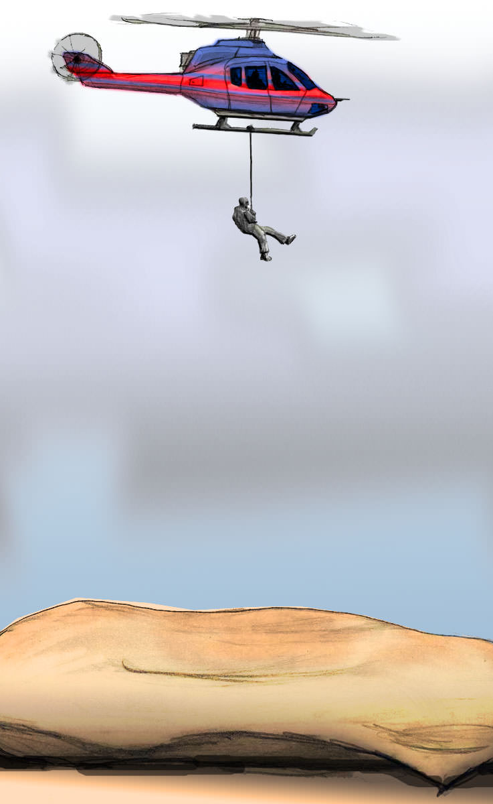
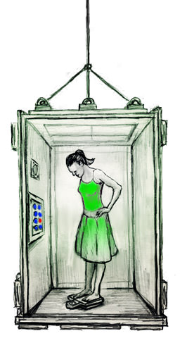
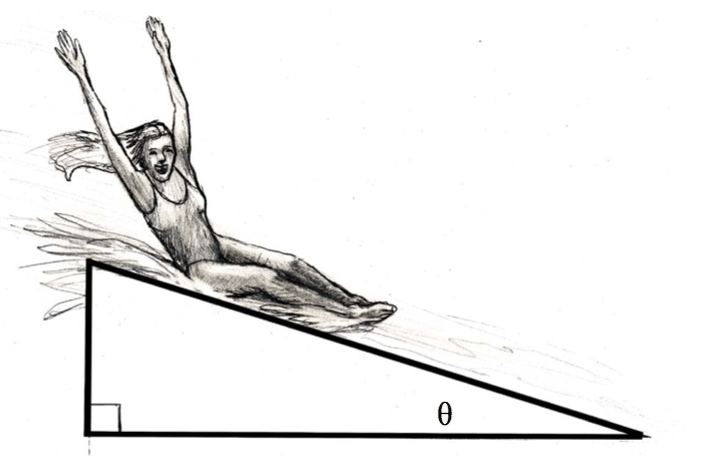
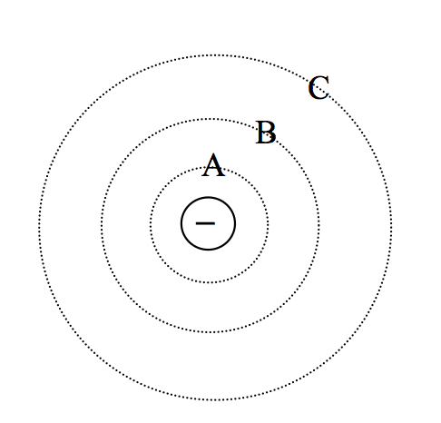
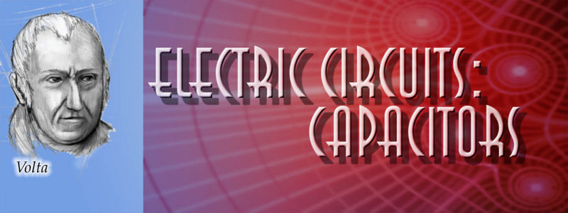

<!--
author:   James H. Dann, PhD

email:    LiaScript@web.de

version:  0.0.1

language: en

narrator: US English Female

comment:  The People's Physics Book v3 is intended to be used as one small part of a multifaceted strategy to teach physics conceptually and mathematically.

logo:     ../cover.jpg

tags:      Physics, conservation, electricity, energy, fluids, forces, light, magnetism, momentum, motion, Newton, physics, thermodynamics, waves

-->

# People's Physics Book Version 3 (with Videos)

> This document was automatically translated to LiaScript from
>
> https://www.ck12.org/book/peoples-physics-book-version-3-with-videos/

## 1.0 Units and Problem Solving

<article>

The Big Idea
------------

Units identify what a specific number refers to. For instance, the number 42 can be used to represent 42 miles, 42 pounds, or 42 elephants! Numbers are _mathematical_ objects, but units give them _physical_ meaning. Keeping track of units can help you avoid mistakes when you work out problems.

</article>

### 1.1 Units and Problem Solving

<article>

Key Concepts
------------

* Every answer to a physics problem must include units. Even if a problem explicitly asks for a speed in meters per second (m/s), the answer is 5 m/s, not 5.
* When you’re not sure how to approach a problem, you can often get insight by considering how to obtain the units of the desired result by combining the units of the given variables. For instance, if you are given a distance (in meters) and a time (in hours), the only way to obtain units of speed (meters/hour) is to divide the distance by the time. This is a simple example of a method called _dimensional analysis_, which can be used to find equations that govern various physical situations without any knowledge of the phenomena themselves.
* This textbook uses _SI units_ (La Système International d’Unités), the most modern form of the metric system.
* When converting speeds from metric to American units, remember the following rule of thumb: a speed measured in mi/hr is about double the value measured in m/s (_i.e.,_ 10 {m/s} is equal to about 20 MPH). Remember that the speed itself hasn’t changed, just our representation of the speed in a certain set of units.
* If a unit is named after a person, it is capitalized. So you write “10 Newtons,” or “10 N,” but “10 meters,” or “10 m.”
* Vectors are arrows that represent quantities with direction. In this textbook, vectors will be written in bold. For instance, the force vector will be written as $F$ in this textbook. Your teacher will likely use$\textstyle{\vec{\textstyle{F}}}$  to represent vectors. Don’t let this confuse you: $\vec{F}$  represents the same concept as $F$.

!?[0](https://www.youtube.com/watch?v=-DWXF9FgxF8)

* Vectors can be added together in a simple way. Two vectors can be moved (without changing their directions) to become two legs of a parallelogram. The sum of two vectors is simply the diagonal of the parallelogram:

Key Equations
-------------

$$
\begin{align*}
1\ \text{meter} & = 3.28\ \text{feet} && \\
1\ \text{mile} & = 1.61 \text{~kilometers} && \\
1\ \text{lb. (1\ pound)} & = 4.45\ \text{Newtons}
\end{align*}
$$

Key Applications
----------------

The late great physicist Enrico Fermi used to solve problems by making educated guesses. Say you want to _guess_timate the number of cans of soda drunk in San Francisco in one year. You’ll come pretty close if you guess that there are about 800,000 people in S.F. and that one person drinks on average about 100 cans per year. So, around 80,000,000 cans are consumed every year. Sure, this answer is not exactly right, but it is likely not off by more than a factor of 10 (i.e., an “order of magnitude”). That is, even though we guessed, we’re going to be in the _ballpark_ of the right answer. This is often the first step in working out a physics problem.

| Type of measurement | Commonly used symbols | Fundamental units |
| --- | --- | --- |
| length or position | $d, x, L$ | meters $(m)$ |
| time | $t$ | seconds $(s)$ |
| velocity or speed | $v, u$ | meters per second $(m/s)$ |
| mass | $m$ | kilograms ${(kg)}$ |
| force | $F$ | Newtons ${(N)}$ |
| energy | $E, K, U, Q$ | Joules $(J)$ |
| power | $P$ | Watts $(W)$ |
| electric charge | $q, e$ | Coulombs $(C)$ |
| temperature | $T$ | Kelvin $(K)$ |
| electric current | $I$ | Amperes $(A)$ |
| electric field | $E$ | Newtons per Coulomb $(N/C)$ |
| magnetic field | $B$ | Tesla $(T)$ |
| magnetic flux | $\Phi$ | Webers ${(Wb)}$ |

Pronunciation table for commonly used Greek letters

$$
\begin{align*}
&\mu~~\text{mu} & & \tau~~\text{tau} & & \Phi~~\text{Phi}^*  & & \omega~~\text{omega}  & & \rho~~\text{rho}\\
&\theta~~\text{theta}  & & \pi~~\text{pi}  & & \Omega~~\text{Omega}^*  & & \lambda~~\text{lambda}  & & \Sigma~~\text{Sigma}^*\\
&\alpha~~\text{alpha}  & & \beta~~\text{beta}  & & \gamma~~\text{gamma}  & & \Delta~~\text{Delta}^*  & & \epsilon~~\text{epsilon}
\end{align*}
$$

$^*\text{upper case (a subscript zero, such as that found in}\ x_0 \ \text{is often pronounced ``naught'' or ``not'')}$

Units and Problem Solving Problem Set
-------------------------------------

1.  Estimate or measure your height.
    1.  Convert your height from feet and inches to meters.
    2.  Convert your height from feet and inches to centimeters $(100 \;\mathrm{cm} = 1 \;\mathrm{m})$
2.  Estimate or measure the amount of time that passes between breaths when you are sitting at rest.
    1.  Convert the time from seconds into hours
    2.  Convert the time from seconds into milliseconds = (ms)
3.  Convert the French speed limit of 140 km/hr into mi/hr.
4.  Estimate or measure your weight.
    1.  Convert your weight in pounds into a mass in kg
    2.  Convert your mass from kg into $\mu g$
    3.  Convert your weight into Newtons
5.  Find the $SI$ unit for pressure.
6.  An English lord says he weighs 12 stone.
    1.  Convert his weight into pounds (you may have to do some research online)
    2.  Convert his weight in stones into a mass in kilograms
7.  If the speed of your car increases by 10 mi/hr every 2 seconds, how many mi/hr is the speed increasing every second? State your answer with the units mi/hr/s.
8.  A tortoise travels 15 meters (m) west, then another 13 centimeters (cm) west. How many meters total has she walked? 
9.  A tortoise, Bernard, starting at point A travels 12 m west and then 150 millimeters (mm) east. How far west of point $A$ is Bernard after completing these two motions?
10. $80 \;\mathrm{m} + 145 \;\mathrm{cm} + 7850 \;\mathrm{mm} =  X\ \;\mathrm{mm}$. What is$X$ ?
11. A square has sides of length 45 mm. What is the area of the square in $\;\mathrm{mm}^2$?
12. A square with area $49 \;\mathrm{cm}^2$ is stretched so that each side is now twice as long. What is the area of the square now? Include a sketch.
13. A rectangular solid has a square face with sides 5 cm in length, and a length of 10 cm. What is the volume of the solid in $\;\mathrm{cm}^3$? Sketch the object, including the dimensions in your sketch.
14. As you know, a cube with each side 4 m in length has a volume of 64 $\;\mathrm{m}^3$. Each side of the cube is now doubled in length. What is the _ratio_ of the new volume to the old volume? Why is this ratio **not** simply 2? Include a sketch with dimensions.
15. What is the ratio of the mass of the Earth to the mass of a single proton? (See equation sheet.)
16. A spacecraft can travel 20 km/s. How many km can this spacecraft travel in 1 hour (h)?
17. A dump truck unloads 30 kilograms (kg) of garbage in 40 s. How many kg/s are being unloaded?
18. The lengths of the sides of a cube are doubling each second. At what rate is the volume increasing?
19. Estimate the number of visitors to Golden Gate Park in San Francisco in one year. Do your best to get an answer that is correct within a factor of 10.
20. Estimate the number of water drops that fall on San Francisco during a typical rainstorm.
21. What does the formula $a = \frac{F} {m}$ tell you about the units of the quantity $a$ (whatever it is)?
22. Add the following vectors using the parallelogram method.
    1.  
    2.  
    3.  
    4.  
    5.  

</article>

## 2.0 Energy Conservation

<article>

The Big Idea
------------

Energy is a measure of the amount of, or potential for, dynamical activity in something. The total amount of energy in the universe is constant. This symmetry is called a conservation law. Physicists have identified five conservation laws that govern our universe.

A group of things (we’ll use the word _system_) has a certain amount of energy. Energy can be added to a system: when chemical bonds in a burning log break, they release heat. A system can also lose energy: when a spacecraft “burns up” its energy of motion during re-entry, it releases energy and the surrounding atmosphere absorbs it in the form of heat. A _closed_ system is one for which the energy is constant, or _conserved_. In this chapter, we will often consider closed systems; although the total amount of energy stays the same, it can transform from one kind to another. We will consider transfers of energy between systems –- known as _work_\-– in more detail in Chapter 8.

</article>

### 2.1 Energy Conservation

<article>

Key Definitions
---------------

**Kinetic energy**

$$
\begin{align*}
K = \frac{1}{2}mv^2 \begin{cases}
m & \text{mass~(in~kilograms,~kg)}\\
v & \text{speed~(in~meters~per~second,~}\text{m}/\text{s}\text{)}
\end{cases}
\end{align*}
$$

**Gravitational potential energy**

$$
\begin{align*}
U_g= m g h \begin{cases} 
h & \text{height above the ground in meters(m)}\\
g & \text{acceleration due to gravity,}\ 9.8\ \text{m/s}^{2}\\   
E & \text{energy (in Joules; 1 J}  = 1 \text{kg} \ \text{m}^{2}/\text{s}^{2}\text{)}
\end{cases}
\end{align*}
$$

Key Concepts
------------

* Any object in motion has kinetic energy. Kinetic energy increases as the square of the velocity, so faster objects have much more kinetic energy than slower ones.

* The energy associated with gravity is called gravitational potential energy. Near the surface of the earth, an object's gravitational potential energy increases linearly with its height.

* Molecules store chemical potential energy in the bonds between electrons; when these bonds are broken the released energy can be transferred into kinetic and/or potential energy. 1 KCal (1 food Calorie) is equal to 4180 Joules of stored chemical potential energy.

* Energy can be transformed from one kind into another and exchanged between systems; if there appears to be less total energy in a system at the end of a process then at the beginning, the “lost” energy has been transferred to another system, often by heat or sound waves.

Key Applications
----------------

* In “roller coaster” problems, a cart's gravitational potential energy at the top of one hill is transformed into kinetic energy at the next valley. It turns back into potential energy as cart climbs the next hill, and so on. In reality a fraction of the energy is lost to the tracks and air as heat, which is why the second rise is rarely as big as the first in amusement parks.

!?[0](https://www.youtube.com/watch?v=fnmjdOSKEhg)

* In “pole-vaulter” problems, the athlete’s body breaks down the food molecules to change some of the bonding energy into energy that is used to power the body. This energy is transformed into kinetic energy as the athlete gains speed. The kinetic energy can be changed into potential energy as the athlete gains height.
* In “pendulum” problems, the gravitational potential energy of the pendulum at its highest point changes to kinetic energy as it swings to the bottom and then back into potential energy as it swings up. At any in-between point there is a combination of kinetic energy and potential energy, but the total energy remains constant.

!?[0](https://www.youtube.com/watch?v=dk96zfYZQXo)

Energy Conservation Problem Set
-------------------------------

1.  A stationary bomb explodes into hundreds of pieces. Which of the following statements best describes the situation?
    1.  The kinetic energy of the bomb was converted into heat.
    2.  The chemical potential energy stored in the bomb was converted into heat and gravitational potential energy.
    3.  The chemical potential energy stored in the bomb was converted into heat and kinetic energy.
    4.  The chemical potential energy stored in the bomb was converted into heat, sound, kinetic energy, and gravitational potential energy.
    5.  The kinetic and chemical potential energy stored in the bomb was converted into heat, sound, kinetic energy, and gravitational potential energy.
2.  You hike up to the top of Granite Peak in the Trinity Alps to think about physics.
    1.  Do you have more potential or kinetic energy at the top of the mountain than you did at the bottom? Explain.
    2.  Do you have more, less, or the same amount of energy at the top of the mountain than when you started? (Let’s assume you did not eat anything on the way up.) Explain.
    3.  How has the total energy of the Solar System changed due to your hike up the mountain? Explain.
    4.  If you push a rock off the top, will it end up with more, less, or the same amount of energy at the bottom? Explain.
    5.  For each of the following types of energy, describe whether you _gained_ it, you _lost_ it, or it stayed the same during your hike:
        1.  Gravitational potential energy
        2.  Energy stored in the atomic nuclei in your body
        3.  Heat energy
        4.  Chemical potential energy stored in the fat cells in your body
        5.  Sound energy from your footsteps
        6.  Energy given to you by a wind blowing at your back
3.  Just before your mountain bike ride, you eat a 240 Calorie exercise bar. (You can find the conversion between food Calories and Joules in the chapter.) The carbon bonds in the food are broken down in your stomach, releasing energy. About half of this energy is lost due to inefficiencies in your digestive system.
    1.  Given the losses in your digestive system how much of the energy, in Joules, can you use from the exercise bar?
    2.  After eating, you climb a 500 m hill on your bike. The combined mass of you and your bike is 75 kg.
    3.  How much gravitational potential energy has been gained by you and your bike?
    4.  Where did this energy come from?
    5.  If you ride quickly down the mountain without braking but losing half the energy to air resistance, how fast are you going when you get to the bottom?
4.  You find yourself on your bike at the top of Twin Peaks in San Francisco. You are facing a 600m descent. The combined mass of you and your bicycle is 85 kg. 
    1.  How much gravitational potential energy do you have before your descent?
    2.  You descend. If all that potential energy is converted to kinetic energy, what will your speed be at the bottom?
    3.  Name two other places to which your potential energy of gravity was transferred besides kinetic energy. How will this manifest itself in your speed at the bottom of the hill? (No numerical answer is needed here.)
5.  Before a run, you eat an apple with 1,000,000 Joules of binding energy.
    1.  550,000 Joules of binding energy are wasted during digestion. How much remains?
    2.  Some 95% of the remaining energy is used for the basic processes in your body (which is why you can warm a bed at night!). How much is available for running?
    3.  Let’s say that, when you run, you lose 25% of your energy overcoming friction and air resistance. How much is available for conversion to kinetic energy?
    4.  Let’s say your mass is 75 kg. What could be your top speed under these idealized circumstances?
    5.  But only 10% of the available energy goes to KE, another 50% goes into heat exhaust from your body. Now you come upon a hill if the remaining energy is converted to gravitational potential energy. How high do you climb before running out of energy completely?
6.  A car goes from rest to a speed of v in a time t. Sketch a schematic graph of kinetic energy vs. time. You do not need to label the axes with numbers.
7.  A 1200 kg car traveling with a speed of 29 m/s drives horizontally off of a 90 m cliff.
    1.  Sketch the situation.
    2.  Calculate the potential energy, the kinetic energy, and the total energy of the car as it leaves the cliff.
    3.  Make a graph displaying the kinetic, gravitational potential, and total energy of the car at each 10 m increment of height as it drops
8.  A roller coaster begins at rest 120 m above the ground at point $A$, as shown above. Assume no energy is lost from the coaster to frictional heating, air resistance, sound, or any other process. The radius of the loop is 40 m.
    
    
    
    \[Figure 2\]
    
    Roller coaster for problem 8.
    
    1.  Find the speed of the roller coaster at points $B, C, D, E, F,$ and $H$.
    2.  At point $G$ the speed of the roller coaster is 22 m/s. How high off the ground is point $G$?
9.  A pendulum has a string with length 1.2 m. You hold it at an angle of 22 degrees to the vertical and release it. The pendulum bob has a mass of 2.0 kg.
    
    
    
    \[Figure 3\]
    
    Pendulum for problem 9.
    
    1.  What is the potential energy of the bob before it is released? (_Hint: use geometry to determine the height when released._)
    2.  What is its speed when it passes through the midpoint of its swing?
    3.  Now the pendulum is transported to Mars, where the acceleration of gravity g is $2.3 \;\mathrm{m/s}^2$. Answer parts (a) and (b) again, but this time using the acceleration on Mars.
10. On an unknown airless planet an astronaut drops a 4.0 kg ball from a 60 m ledge. The mass hits the bottom with a speed of 12 m/s.
    1.  What is the acceleration of gravity $g$ on this planet?
    2.  The planet has a twin moon with exactly the same acceleration of gravity. The difference is that this moon has an atmosphere. In this case, when dropped from a ledge with the same height, the 4.0 kg ball hits bottom at the speed of 9 m/s. How much energy is lost to air resistance during the fall?
11. A 1500 kg car starts at rest and speeds up to 3.0 m/s.
    1.  What is the gain in kinetic energy?
    2.  We define efficiency as the ratio of output energy (in this case kinetic energy) to input energy. If this car’s efficiency is 0.30, how much input energy was provided by the gasoline?
    3.  If 0.15 gallons were used up in the process, what is the energy content of the gasoline in Joules per gallon?
12. A pile driver’s motor expends 310,000 Joules of energy to lift a 5400 kg mass. The motor is rated at an efficiency of 0.13 (see 11b). How high is the mass lifted?

</article>

## 3.0 One-Dimensional Motion

<article>

The Big Idea
------------

One dimensional motion describes objects moving in straight lines. Speed is a scalar measure of how quickly an object is moving along this line. Velocity is speed with a direction, making it a vector. If an object’s velocity changes with time, the object is said to be accelerating. When restricted to one dimension, there are only two possible directions for the velocity and acceleration vectors to point in. As we’ll see in the next chapters, understanding an object's acceleration is the key to understanding its motion.

</article>

### 3.1 One Dimensional Motion

<article>

Key Definitions
---------------

$$
\begin{align*}
\text{Symbols}\begin{cases}
\Delta \text{(anything)} & \text{Final value - initial value}\\
\text{anything}_0 & \text{Value at time 0}
\end{cases}
\end{align*}
$$

$$
\begin{align*}
\text{Scalars}\begin{cases}
t & \text{Time in seconds, s}\\
d = |{\Delta x_1}| + |{\Delta x_2}| & \text{Distance (in meters, m}\text{)}\\
v = |{v}| & \text{Speed (in meters per second,}\ \text{m}/\text{s}\text{)}
\end{cases}
\end{align*}
$$

$$
\begin{align*}
\text{Vectors}\begin{cases}
x = x(t) & \text{Position} \\
\Delta x = x_f-x_i  & \text{Displacement}\\
v_i & \text{Initial velocity}\\
v_f & \text{Final velocity}\\
\Delta v = v_f - v_i & \text{Change in velocity}\\
a & \text{Instantaneous acceleration} 
\end{cases}
\end{align*}
$$

Key Equations
-------------

**Averages**

$$
\begin{align*}
v_{avg} & = \frac{\boldsymbol{\Delta} x}{\Delta t} \\
a_{avg} & = \frac{\boldsymbol{\Delta} v}{\Delta t}
\end{align*}
$$

**The Big Three**

$$
\begin{align*}
x(t) & = x_0 +v_0 t + \tfrac{1}{2} a t^2 \\
v(t) & = v_0 +at \\
{v_f}^2 & = {v_0}^2 + 2a \Delta x
\end{align*}
$$

Key Concepts
------------

* When beginning a one dimensional problem, define a positive direction. The other direction is then taken to be negative. Traditionally, “positive” is taken to mean “to the right”; however, any definition of direction used consistency throughout the problem will yield the right answer.

* Be sure you understand the difference between average velocity (measured over a period of time) and instantaneous velocity (measured at a single moment in time).

* Gravity near the Earth pulls an object toward the surface of the Earth with an acceleration of $9.8 \;\mathrm{m/s}^2$ $(\approx10 \;\mathrm{m/s}^2)$. In the absence of air resistance, all objects will fall with the same acceleration. Air resistance can cause low-mass, large area objects to accelerate more slowly.

* _Deceleration_ is the term used when an object’s _speed_ is decreasing due to an acceleration in the opposite direction of its velocity.

* The Big Three equations define the graphs of position and velocity as a function of time. When there is no acceleration (constant velocity), position increases linearly with time -- distance equals rate times time. Under constant acceleration, velocity increases linearly with time but distance does so at a quadratic rate. The slopes of the position and velocity graphs will give instantaneous velocity and acceleration, respectively.

!?[0](https://www.youtube.com/watch?v=2Nm_9Rh7ah8)

!?[0](https://www.youtube.com/watch?v=kFGfBCDr75Y)

!?[0](https://www.youtube.com/watch?v=b_p0ZG_9w0M)

!?[0](https://www.youtube.com/watch?v=TXeL9bPkRwI)

* At first, you might get frustrated trying to figure out which of the Big Three equations to use for a certain problem, but don’t worry, this comes with practice. Making a table that identifies the variables given in the problem and the variables you are looking for can sometimes help.

!?[0](https://www.youtube.com/watch?v=_3qyj9gR8R0)

!?[0](https://www.youtube.com/watch?v=KujTxuwJ0Pk)

One-Dimensional Motion Problem Set
----------------------------------

1.  Answer the following questions about one-dimensional motion.
    1.  What is the difference between distance $d$ and displacement $\triangle x$ Write a few sentences explaining this.
    2.  Does the odometer reading in a car measure distance or displacement?
    3.  Imagine a fox darting around in the woods for several hours. Can the displacement $\triangle x$ of the fox from his initial position ever be larger than the total distance d he traveled? Explain.
    4.  What is the difference between acceleration and velocity? Write a paragraph that would make sense to a $5^{th}$ grader.
    5.  Give an example of a situation where an object has an upward velocity, but a downward acceleration.
    6.  What is the difference between average and instantaneous velocity? Make up an example involving a trip in a car that demonstrates your point.
    7.  If the position of an object is increasing linearly with time (i.e., $\triangle x$ is proportional to $t$), what can we say about its acceleration? Explain your thinking.
    8.  If the position of an object is increasing non-linearly with time (i.e., $\triangle x$ is not proportional to $t$), what can we say about its velocity? Explain your thinking.
2.  A cop passes you on the highway. Which of the following statements must be true at the instant he is passing you? You may choose more than one answer.
    1.  Your speed and his speed are the same.
    2.  Your position $x$ along the highway is the same as his position $x$ along the highway.
    3.  Your acceleration and his acceleration are the same.
3.  If a car is slowing down from 50 MPH to 40 MPH, but the $x$ position is increasing, which of the following statements is true? You may choose more than one.
    1.  The velocity of the car is in the $+ x$ direction.
    2.  The acceleration of the car is in the same direction as the velocity.
    3.  The acceleration of the car is in the opposite direction of the velocity.
    4.  The acceleration of the car is in the $- x$ direction.
4.  A horse is galloping forward with an acceleration of $3 \;\mathrm{m/s}^2$. Which of the following statements is necessarily true? You may choose more than one.
    1.  The horse is increasing its speed by 3 m/s every second, from 0 m/s to 3 m/s to 6 m/s to 9 m/s.
    2.  The speed of the horse will triple every second, from 0 m/s to 3 m/s to 9 m/s to 27 m/s.
    3.  Starting from rest, the horse will cover 3 m of ground in the first second.
    4.  Starting from rest, the horse will cover 1.5 m of ground in the first second.
5.  Below are images from a race between Ashaan (above) and Zyan (below), two daring racecar drivers. High speed cameras took four pictures in rapid succession. The first picture shows the positions of the cars at $t = 0.0$. Each car image to the right represents times 0.1, 0.2, and 0.3 seconds later.
    
    
    
    1.  Who is ahead at $t = 0.2 \;\mathrm{s}$ ? Explain.
    2.  Who is accelerating? Explain.
    3.  Who is going fastest at $t = 0.3 \;\mathrm{s}$? Explain.
    4.  Which car has a constant velocity throughout? Explain.
    5.  Graph $x$ vs. $t$ and $v$ vs. $t$. Put both cars on same graph; label which line is which car.
    6.  Which car is going faster at $t = 0.2 \;\mathrm{s}$ (Hint: Assume they travel the same distance between 0.1 and 0.2 seconds)?
    
6.  In the picture below, a ball starting at rest rolls down a ramp, goes along at the bottom, and then back up a smaller ramp. Ignore friction and air resistance. Sketch the _vertical_ position vs. time and _vertical_ speed vs. time graphs that accurately describe this motion. Label your graphs with the times indicated in the picture.
    
    
    
7.  Draw the position vs. time graph that corresponds to the velocity vs. time graph below. You may assume a starting position $x_0 = 0$. Label both axes of your graph with appropriate values.
    
    
    
8.  Two cars are heading right towards each other, but are 12 km apart. One car is going 70 km/hr and the other is going 50 km/hr. How much time do they have before they collide head on?
9.  The following data represent the first 30 seconds of actor Crispin Glover’s drive to work.

| Time (s) | Position (m) | Distance (m) |
| --- | --- | --- |
| 0   | 0   | 0   |
| 5   | 10  | 10  |
| 10  | 30  | 30  |
| 15  | 30  | 30  |
| 20  | 20  | 40  |
| 25  | 50  | 70  |
| 30  | 80  | 120 |

a. Sketch the graphs of position vs. time and distance vs. time. Label your $x$ and $y$ axes appropriately.

b. Why is there a discrepancy between the distance covered and the change in position during the time period between $t = 25 \;\mathrm{s}$ and $t = 30 \;\mathrm{s}$?

c. What do you think is going on between $t = 10 \;\mathrm{s}$ and $t = 15 \;\mathrm{s}$?

d. What is the displacement between $t = 10 \;\mathrm{s}$ and $t = 25 \;\mathrm{s}$?

e. What is the distance covered between $t = 10 \;\mathrm{s}$ and $t = 25 \;\mathrm{s}$?

f. What is the average velocity during the first $30$ seconds of the trip?

g. What is the average velocity between the times $t = 20 \;\mathrm{s}$ and $t = 30 \;\mathrm{s}$?

h. During which time interval(s) was the velocity negative?

i. Sketch the velocity vs. time and speed vs. time graphs. Label your $x$ and $y$ axes appropriately.

10. Sketchy LeBaron, a used car salesman, claims his car is able to go from 0 to 60 mi/hr in 3.5 seconds.
    1.  What is the average acceleration of this car? Give your answer in $\;\mathrm{m/s}^2$. (Hint: you will have to perform a conversion.)
    2.  How much distance does this car cover in these 3.5 seconds? Express your answer twice: in meters and in feet.
    3.  What is the speed of the car in mi/hr after 2 seconds?
11. Michael Jordan had a vertical jump of about 48 inches.
    
    1.  Convert this height into meters.
    2.  Assuming no air resistance, at what speed did he leave the ground?
    3.  What is his speed 3/4 of the way up?
    4.  What is his speed just before he hits the ground on the way down?
    
    !?[0](https://www.youtube.com/watch?v=GVYkfgeP48U)
    
12. You are sitting on your bike at rest. Your brother comes running at you from behind at a speed of 2 m/s. At the exact moment he passes you, you start up on your bike with an acceleration of $2 \;\mathrm{m/s}^2$.
    
    1.  Draw a picture of the situation, defining the starting positions, speeds, etc.
    2.  At what time $t$ do you have the same speed as your brother?
    3.  At what time $t$ do you pass your brother?
    4.  Draw another picture of the exact moment you catch your brother. Label the drawing with the positions and speeds at that moment.
    5.  Sketch a position vs. time graph for both you and your brother, labeling the important points (_i.e.,_ starting point, when you catch him, etc.)
    6.  Sketch a speed vs. time graph for both you and your brother, labeling the important points (_i.e.,_ starting point, when you catch him, etc.)
    
    
    
13. You are standing at the foot of the Bank of America building in San Francisco, which is 52 floors (237 m) high. You launch a ball straight up in the air from the edge of the foot of the building. The initial vertical speed is 70 m/s. (For this problem, you may ignore your own height, which is very small compared to the height of the building.)
    1.  How high up does the ball go?
    2.  How fast is the ball going right before it hits the top of the building?
    3.  For how many seconds total is the ball in the air?
14. Measure how high you can jump vertically on Earth. Then, figure out how high you would be able to jump on the Moon, where acceleration due to gravity is $1/6^{th}$ that of Earth. Assume you launch upwards with the same speed on the Moon as you do on the Earth.
15. A car is smashed into a wall during Weaverville’s July $4^{th}$ Destruction Derby. The car is going 25 m/s just before it strikes the wall. It comes to a stop 0.8 seconds later. What is the average acceleration of the car during the collision?
    
    
    
16. A helicopter is traveling with a velocity of 12 m/s directly upward. Directly below the helicopter is a very large and very soft pillow. As it turns out, this is a good thing, because the helicopter is lifting a large man. When the man is 20 m above the pillow, he lets go of the rope.
    1.  What is the speed of the man just before he lands on the pillow?
    2.  How long is he in the air after he lets go?
    3.  What is the greatest height reached by the man above the ground? (Hint: this should be greater than 20 m. Why?)
    4.  What is the distance between the helicopter and the man three seconds after he lets go of the rope?
17. You are speeding towards a brick wall at a speed of 55 MPH. The brick wall is only 100 feet away.
    1.  What is your speed in m/s?
    2.  What is the distance to the wall in meters?
    3.  What is the minimum acceleration you should use to avoid hitting the wall?
18. What acceleration should you use to increase your speed from 10 m/s to 18 m/s over a distance of 55 m?
19. You drop a rock from the top of a cliff. The rock takes 3.5 seconds to reach the bottom.
    1.  What is the initial speed of the rock?
    2.  What is the magnitude (i.e., _numerical value_) of the acceleration of the rock at the moment it is dropped?
    3.  What is the magnitude of the acceleration of the rock when it is half-way down the cliff?
    4.  What is the height of the cliff?

**Use the following tables for use with the next problem.**

|     |     |     |
| --- | --- | --- |A
| $t$ | $x$ | $v$ |
| --- | --- | --- |
| 0.0 s | 5 m | .5 m/s |
| 1.0 s | 5.65 m | .8 m/s |
| 2.0 s | 6.6 m | 1.1 m/s |
| 3.0 s |     |     |
| 4.0 s |     |     |
| 5.0 s |     |     |
| 6.0 s |     |     |
| 7.0 s |     |     |
| 8.0 s |     |     |
| 9.0 s |     |     |
| 10.0 s |     |     |

|     |     |     |
| --- | --- | --- |B
| $t$ | $x$ | $v$ |
| --- | --- | --- |
|     |     | 2.6 m/s |
|     | 17.1 m |     |
|     |     | 3.14 m/s |
|     | 31.4 m |     |
|     |     | 5.41 m/s |

20. An owl is flying along above your farm with positions and velocities given by the tables above.

20. 1.  What is the acceleration of the owl?
    2.  What is the speed of the owl at $t = 0$?
    3.  Fill in the missing elements of **Table** ['''A'''](#x-ck12-dGFibGU6QQ..).
    4.  Plot the $x$ and $t$ points on the following graph. Then, connect your points with a smoothly curving line. Be careful and neat and use pencil.
        
        
        
    5.  Use the formula to calculate the speed of the owl in m/s at $t = 5$ seconds.
    6.  Lightly draw in a tangent to your curve at the $t = 5 \;\mathrm{s}$ point. Then, measure the slope of this tangent by measuring the _rise_ (in meters) and the _run_ (in seconds). What is the slope in m/s?
    7.  Were your answers to the last two parts the same? If so, why? If not, why not?
    8.  Fill in **Table** ['''B'''](#x-ck12-dGFibGU6Qg..). This is going to be harder to do, because you are given $x$ or $v$ and are expected to find $t$. You may have to use the quadratic formula!
21. For each of the following graphs, write a few sentences about what kind of motions were made. Try to use the words we have defined in class (speed, velocity, position, acceleration) in your description.
    1.  
        
    2.  
        
    3.  
        
    4.  

</article>

## 4.0 Two-Dimensional and Projectile Motion

<article>

The Big Idea
------------

In this chapter, we aim to understand and explain the parabolic motion of a thrown object, known as projectile motion. We can break down any initial velocity vector into its vertical and horizontal components. Motion in one direction is unrelated to motion in perpendicular directions, so we can treat the individual components as separate one-dimensional motion problems using all the equations from the last chapter. Once the object has been thrown, the only acceleration is from gravity, in the vertical direction. The horizontal component of velocity remains unchanged (ignoring air resistance) throughout the flight.

</article>

### 4.1 Two Dimensional and Projectile Motion

<article>

Key Equations
-------------

**Vertical Direction**

$$
\begin{align*}
\begin{cases}
+y & = \text{Upward}\\
y(t) & = y_0 +v_{0y} t - \frac{1}{2} g t^2\\
v_{y}(t) & = v_{0y} -gt \\
{v_y}^2 & = {v_{0y}}^2 - 2g (\Delta y)\\
a_y = -g &  = -9.8  \text{m/s}^{2}\end{cases}
\end{align*}
$$

**Horizontal Direction**

$$
\begin{align*}
\begin{cases}
x(t) & = x_{0} +v_{0x}t\\
v_{x}(t) & = v_{0x} \\
a_x & = 0\end{cases}
\end{align*}
$$

_Note:_ the initial velocity $v_0$ can be separated into $v_{0x} = v_0 \cos{\theta}$ and $v_{0y} = v_0 \sin{\theta}$, where $\theta$ is the angle between the velocity vector and the horizontal.

Key Concepts
------------

* In projectile motion, the horizontal displacement of an object from its starting point is called its _range._

* Vertical speed is zero only at the highest point of a thrown object's flight.

* To work these problems, separate the “Big Three” equations into two sets: one for the vertical direction, and one for the horizontal. Keep them separate.

* The only variable that can go into both sets of equations is time. You use time to communicate between the two directions.

* Since in the absence of air resistance there is no acceleration in the horizontal direction, this component of velocity does not change over time. This is a counter-intuitive notion for many. (Air resistance will cause velocity to decrease slightly or significantly depending on the object. But this factor is ignored for the time being.)

* Motion in the vertical direction must include the acceleration due to gravity, and therefore the velocity in the vertical direction changes over time.

* The shape of the path of an object undergoing projectile motion in two dimensions is a parabola.

* We will ignore air resistance in this chapter. Air resistance will tend to shorten the range of the projectile motion by virtue of producing an acceleration opposite to the direction of motion.

!?[0](https://www.youtube.com/watch?v=kicyfJ5Qb9U)

Two-Dimensional and Projectile Motion Problem Set
-------------------------------------------------

_Draw detailed pictures for each problem (putting in all the data, such as initial velocity, time, etc.), and write down your questions when you get stuck._

1.  Determine which of the following is in projectile motion. Remember that “projectile motion” means that gravity is the only means of acceleration for the object.
    1.  A jet airplane during takeoff.
    2.  A baseball during a Barry Bonds home run.
    3.  A spacecraft just after all the rockets turn off in Earth's orbit.
    4.  A basketball thrown towards a basket.
    5.  A bullet shot out of a gun.
    6.  An inter-continental ballistic missile.
    7.  A package dropped out of an airplane as it ascends upward with constant speed.
2.  Decide if each of the statements below is True or False. Then, explain your reasoning.
    1.  At a projectile’s highest point, its velocity is zero.
    2.  At a projectile’s highest point, its acceleration is zero.
    3.  The rate of change of the $x$ position is changing with time along the projectile path.
    4.  The rate of change of the $y$ position is changing with time along the projectile path.
    5.  Suppose that after $2 \;\mathrm{s}$, an object has traveled $2 \;\mathrm{m}$ in the horizontal direction. If the object is in projectile motion, it must travel $2 \;\mathrm{m}$ in the vertical direction as well.
    6.  Suppose a hunter fires his gun. Suppose as well that as the bullet flies out horizontally and undergoes projectile motion, the shell for the bullet falls directly downward. Then, the shell hits the ground before the bullet.
3.  Imagine the path of a soccer ball in projectile motion. Which of the following is true at the highest point in its flight?
    1.  $v_x = 0, v_y = 0, a_x =0, a_y = 0$.
    2.  $v_x > 0, v_y = 0, a_x =0, a_y = 0$.
    3.  $v_x = 0, v_y = 0, a_x =0, a_y = -9.8\;\mathrm{m/s}^2$.
    4.  $v_x > 0, v_y = 0, a_x =0, a_y = -9.8\;\mathrm{m/s}^2$.
    5.  $v_x = 0, v_y = 0, a_x =0, a_y = -9.8\;\mathrm{m/s}^2$.
4.  A hunter with an air blaster gun is preparing to shoot at a monkey hanging from a tree. He is pointing his gun directly at the monkey. The monkey’s got to think quickly! What is the monkey’s best chance to avoid being smacked by the rubber ball?
    1.  The monkey should stay right where he is: the bullet will pass beneath him due to gravity.
    2.  The monkey should let go when the hunter fires. Since the gun is pointing right at him, he can avoid getting hit by falling to the ground.
    3.  The monkey should stay right where he is: the bullet will sail above him since its vertical velocity increases by $9.8 \;\mathrm{m/s}$ every second of flight.
    4.  The monkey should let go when the hunter fires. He will fall faster than the bullet due to his greater mass, and it will fly over his head.
5.  You are riding your bike in a straight line with a speed of $10 \;\mathrm{m/s}$. You accidentally drop your calculator out of your backpack from a height of $2.0 \;\mathrm{m}$ above the ground. When it hits the ground, where is the calculator in relation to the position of your backpack? (Neglect air resistance.)
    1.  You and your backpack are $6.3\;\mathrm{m}$ ahead of the calculator.
    2.  You and your backpack are directly above the calculator.
    3.  You and your backpack are $6.3 \;\mathrm{m}$ behind the calculator.
    4.  None of the above.
6.  A ball of mass $m$ is moving horizontally with speed $v_0$ off a cliff of height $h$, as shown. How much time does it take the ball to travel from the edge of the cliff to the ground? 
    1.  $\sqrt{hv_0}$.
    2.  $\frac{h}{v_0}$.
    3.  $\frac{hv_0}{g}$.
    4.  $\frac{2h}{g}$.
    5.  $\sqrt{\frac{2h}{g}}$.
7.  Find the missing legs or angles of the triangles shown.
    1.  
    2.  
    3.  
    4.  
8.  Draw in the $x-$ and $y-$velocity components for each dot along the path of the cannonball. The first one is done for you. 
9.  A stone is thrown horizontally at a speed of $8.0 \;\mathrm{m/s}$ from the edge of a cliff $80 \;\mathrm{m}$ in height. How far from the base of the cliff will the stone strike the ground?
10. A toy truck moves off the edge of a table that is $1.25 \;\mathrm{m}$ high and lands $0.40 \;\mathrm{m}$ from the base of the table.
    1.  How much time passed between the moment the car left the table and the moment it hit the floor?
    2.  What was the horizontal velocity of the car when it hit the ground?
11. A hawk in level flight $135\;\mathrm{m}$ above the ground drops the fish it caught. If the hawk’s horizontal speed is $20.0 \;\mathrm{m/s}$, how far ahead of the drop point will the fish land?
12. A pistol is fired horizontally toward a target $120\;\mathrm{m}$ away, but at the same height. The bullet’s velocity is $200 \;\mathrm{m/s}$. How long does it take the bullet to get to the target? How far below the target does the bullet hit?
13. A bird, traveling at $20 \;\mathrm{m/s}$, wants to hit a waiter $10 \;\mathrm{m}$ below with his dropping (see image). In order to hit the waiter, the bird must release his dropping some distance before he is directly overhead. What is this distance? 
14. Phil Dawson of the _San Francisco 49ers_ kicked a field goal with an initial velocity of $20 \;\mathrm{m/s}$ at an angle of $60^\circ$.
    1.  How long is the ball in the air? _Hint:_ you may assume that the ball lands at same height as it starts at.
    2.  What are the range and maximum height of the ball?
15. A racquetball thrown from the ground at an angle of $45^\circ$ and with a speed of $22.5 \;\mathrm{m/s}$ lands exactly $2.5 \;\mathrm{s}$ later on the top of a nearby building. Calculate the horizontal distance it traveled and the height of the building.
16. Donovan McNabb throws a football with an initial velocity of $30 \;\mathrm{m/s}$ at an angle of $25^\circ$. How much time passes until the ball travels $35\;\mathrm{m}$ horizontally? What is the height of the ball after $0.5$ seconds? (Assume that, when thrown, the ball is $2 \;\mathrm{m}$ above the ground.)
17. Pablo Sandoval throws a baseball with a horizontal component of velocity of $25 \;\mathrm{m/s}$. After $2$ seconds, the ball is $40 \;\mathrm{m}$ above the release point. Calculate the horizontal distance it has traveled by this time, its initial vertical component of velocity, and its initial angle of projection. Also, is the ball on the way up or the way down at this moment in time?
18. Barry Bonds hits a $125\;\mathrm{m}(450')$ home run that lands in the stands at an altitude $30 \;\mathrm{m}$ above its starting altitude. Assuming that the ball left the bat at an angle of $45^\circ$ from the horizontal, calculate how long the ball was in the air.
19. A golfer can drive a ball with an initial speed of $40.0 \;\mathrm{m/s}$. If the tee and the green are separated by $100\;\mathrm{m}$, but are on the same level, at what angle should the ball be driven? (_Hint:_ you should use $2\cos{(x)}\sin{(x)} = \sin{(2x)}$ at some point.)
20. How long will it take a bullet fired from a cliff at an initial velocity of $700 \;\mathrm{m/s}$, at an angle $30^\circ$ below the horizontal, to reach the ground $200 \;\mathrm{m}$ below?
21. A diver in Hawaii is jumping off a cliff $45 \;\mathrm{m}$ high, but she notices that there is an outcropping of rocks $7 \;\mathrm{m}$ out at the base. So, she must clear a horizontal distance of $7 \;\mathrm{m}$ during the dive in order to survive. Assuming the diver jumps horizontally, what is his/her minimum push-off speed?
22. If Steph Curry can jump $1.0 \;\mathrm{m}$ high on Earth, how high can he jump on the moon assuming same initial velocity that he had on Earth (where gravity is $1/6$ that of Earth’s gravity)?
23. James Bond is trying to jump from a helicopter into a speeding Corvette to capture the bad guy. The car is going $30.0 \;\mathrm{m/s}$ and the helicopter is flying completely horizontally at $100 \;\mathrm{m/s}$. The helicopter is $120\;\mathrm{m}$ above the car and $440 \;\mathrm{m}$ behind the car. How long must James Bond wait to jump in order to safely make it into the car?  
24. A field goal kicker lines up to kick a $44$ yard $(40 \;\mathrm{m})$ field goal. He kicks it with an initial velocity of $22 \;\mathrm{m/s}$ at an angle of $55^\circ$. The field goal posts are $3$ meters high.
    1.  Does he make the field goal?
    2.  What is the ball’s velocity and direction of motion just as it reaches the field goal post (_i.e.,_ after it has traveled $40\;\mathrm{m}$ in the horizontal direction)?
25. In a football game a punter kicks the ball a horizontal distance of $43$ yards $(39 \;\mathrm{m})$. On TV, they track the hang time, which reads $3.9$ seconds. From this information, calculate the angle and speed at which the ball was kicked. _(Note for non-football watchers: the projectile starts and lands at the same height. It goes $43$ yards horizontally in a time of $3.9$ seconds)_

</article>

## 5.0 Newton's Laws

<article>

The Big Idea
------------

Applied forces may cause objects to accelerate. All forces come in pairs because they arise in the interaction of two objects — you can’t push without being pushed back! The more force applied, the greater the acceleration that is produced. Objects with high masses are difficult to accelerate without a large force. In the absence of applied forces, objects move in a straight line at a constant speed (or remain at rest). In formal language:

**Newton's First Law**

_Anybody continues in its state of rest, or of uniform motion in a right_ (straight) _line, unless it is compelled to change that state by forces impressed upon it._

**Newton's Second Law**

_The change of motion is proportional to the motive force impressed; and is made in the direction of the right_ (straight) _line in which that force is impressed._

**Newton's Third Law**

_To every action there is always opposed an equal reaction: or, the mutual actions of two bodies upon each other are always equal, and directed to contrary parts._

(Taken from the Principia in modern English, Isaac Newton, University of California Press, 1934).

Understanding motion comes in two stages. The first stage you’ve already seen: you can figure out where something will go, and how fast it will get there, if you know its acceleration. The second stage is much more interesting: where did the acceleration come from? How can you predict the amount of acceleration? Mastering both stages is the key to understanding motion.

</article>

### 5.1 Newton's Laws Explained

<article>

The **First Law is about inertia; objects at rest stay at rest unless acted upon and objects in motion continue that motion in a straight line unless acted upon**. Prior to Newton and Galileo, the prevailing view on motion was still Aristotle's. According to his theory the natural state of things is at rest; force is required to keep something moving at a constant rate. This made sense to people throughout history because on earth, friction and air resistance slow moving objects. When there is no air resistance (or other sources of friction), a situation approximated in space, Newton's first law is much more evident.

The “motion” Newton mentions in the Second Law is, in his language, the product of the mass and velocity of an object --- we call this quantity momentum --- so **the Second Law is actually the** famous equation**:**

$$
\begin{align*}
\vec{F} = \frac{\Delta(m\vec{v})}{\Delta t} = \frac{m\Delta \vec{v}}{\Delta t} =m\vec{a} && \text{[1]}
\end{align*}
$$

That is, the acceleration experienced by an object will be proportional to the applied force and inversely proportional to its mass. If there are multiple forces, they can be added as vectors and it is the _net_ force that matters:

$$
\begin{align*}
m\vec{a} = \vec{F_{\mathrm{net}}} = \sum_{i} \vec{F_i} && \mathrm{Net~force~is~the~vector~sum~of~all~the~forces}\\
m{a}_{x} = F_{\mathrm{net,~}x} = \sum_{i} {F_{ix}} && \mathrm{Horizontal~components~add}\\
m{a}_{y} = F_{\mathrm{net,~}y} = \sum_{i} {F_{iy}}  && \mathrm{As~do~vertical~ones}
\end{align*}
$$

When the net force on an object is zero, it is said to be in **translational equilibrium**:

$$
\begin{align*}
\sum_{i} \vec{F_i} = 0 && \text{Translational Equilibrium Condition [2]}
\end{align*}
$$

Finally, the **Third Law states that you can't push someone or something without being pushed back**. This law is somewhat confusing: if to each applied force there is an equal and opposite force, why does anything ever accelerate? The key is that the ‘equal and opposite’ forces act on different objects. If I push a cart, the cart is in turn pushing on me. However, I'm also pushing (and being pushed by) _the earth_, through my feet. Therefore, in the end, the cart and I move in the same direction and the earth moves opposite us. The cart-person system experienced a net force in one direction, while the earth experienced an equal and opposite force. According to Newton's _second_ law, the acceleration objects experience due to applied forces is inversely proportional to their mass; clearly, the earth --- with its gigantic mass --- doesn't move very far compared to the cart and person.

Newton's Laws Example
---------------------

**Question**: Tom and Mary are standing on identical skateboards. Tom and Mary push off of each other and travel in opposite directions.

a) If Tom $(M)$ and Mary $(m)$ have identical masses, who travels farther?

b) If Tom has a bigger mass than Mary, who goes farther?

c) If Tom and Mary have identical masses and Tom pushes twice as hard as Mary, who goes farther?

**Solution**

a) Neither. Both Tom and Mary will travel the same distance. The forced applied to each person is the same (Newton's Third Law). So

$$
\cancel{M}a=\cancel{m}{a}
$$

which cancels to

$$
a=a
$$

Therefore both people will travel the same distance because the acceleration controls how far someone will travel and Tom and Mary have equal acceleration.

b) Mary will go farther. Again, the same force is applied to both Mary and Tom so

$$
Ma=ma
$$

Since Tom has the larger mass, his acceleration must be smaller (acceleration and mass are inversely proportional). Finally, because Mary's acceleration is greater, she will travel farther.

c) Neither. Newton's Third Law states that for every action there is an equal and opposite reaction. Therefore if Tom pushes twice as hard as Mary, Mary will essentially be pushing back with the same strength. They will therefore travel the same distance if they have the same mass.

Key Concepts
------------

* An object will not change its state of motion (i.e., accelerate) unless an unbalanced force acts on it. Equal and oppositely directed forces do not produce acceleration.

* If no unbalanced force acts on an object the object remains at constant velocity or at rest.

* The force of gravity is called weight and equals $mg$, where $g$ is the acceleration due to gravity of the planet ($g = 9.8 \;\mathrm{m/s}^2$, downward, on Earth).

* Your mass does not change when you move to other planets, because mass is a measure of how much _matter_ your body contains, and not how much gravitational force you feel.

* A free body diagram (FBD) is a diagram that shows all the forces acting on an object. It is essential to draw this diagram before attempting to answer a question or solve a problem. If the FBD is drawn correctly then solving the problem is made easy.

* For incline planes, it is often convenient to rotate the axis such that the x-direction points down the incline and the y-direction points perpendicular to the surface. This will make the math easier to work with as there will be less vectors to break into components.

* To calculate the net force on an object, you need to calculate all the individual forces acting on the object and then add them as vectors. This requires some mathematical skill.

!?[0](https://www.youtube.com/watch?v=8HQEs6lkDmM)

* Air resistance is generally not considered in this chapter, however it is important when an object is moving at high speeds through an atmosphere and is generally proportional to the velocity or the velocity squared for slow or fast speeds, respectively.

!?[0](https://www.youtube.com/watch?v=PYUnoYDbWVU)

* Newton’s $3^{rd}$ Law states for every force there is an equal but opposite reaction force. To distinguish a third law pair from merely oppositely directed pairs is difficult, but very important. Third law pairs must obey three rules: (1) Third law force pairs must be of the same type of force. (2) Third law force pairs are exerted on two different objects. (3) Third law force pairs are equal in magnitude and oppositely directed. _Example:_ A block sits on a table. The Earth’s gravity on the block and the force of the table on the block are equal and opposite. **But these are not third law pairs,** because they are both on the same object and the forces are of different types. The proper third law pairs are: (1) earth’s gravity on block/block’s gravity on earth and (2) table pushes on block/ block pushes on table.

* If you’re asked to evaluate a vector, you may state the $x$ and $y$ components of the vector, or a magnitude and an angle with respect to the horizontal.

Key Equations
-------------

**Acceleration depends on force and mass:**

$$
a =  \frac{F_{net}}{m}
$$

$$
\begin{align*}
\mathrm{Common~Forces}
\begin{cases}
F_g  = m g &  \text{Gravity}\\
F_N  & \text{Normal force: acts perpendicular to surfaces}\\
F_T & \text{Force of tension in strings and wires}\\
F_{sp}= -k \Delta x = & \text{Force of spring} \ \Delta x \ \text{from equilibrium}\end{cases}
\end{align*}
$$

$$
\begin{align*}
\text{Force Sums} \begin{cases}
F_{\text{net}} = \sum_{i} F_i = m a & \text{Net force is the vector sum of all the forces}\\
F_{\text{net,}x} = \sum_{i} {F_{ix}} = m{a}_{x} & \text{Horizontal components add also}\\
F_{\text{net,}y} = \sum_{i} {F_{iy}} = m{a}_{y} & \text{As do vertical ones}
\end{cases}
\end{align*}
$$

$$
\begin{align*}
\text{Static and Kinetic Friction'}
\begin{cases}
f_s \le \mu_s | F_N| & \text{Opposes potential motion of surfaces in contact}\\
f_k = \mu_k | F_N| & \text{Opposes motion of surfaces in contact}
\end{cases}
\end{align*}
$$

Ultimately, many of these “contact” forces are due to attractive and repulsive electromagnetic forces between atoms in materials.

!?[0](https://www.youtube.com/watch?v=uSfAut5GMq4)

Problem Solving for Newton’s Laws, Step-By-Step
-----------------------------------------------

1.  _Figure out which object is “of interest.”_
    1.  If you're looking for the motion of a rolling cart, the cart is the object of interest.
    2.  If the object of interest is not moving, that's OK, don't panic yet.
    3.  Draw a sketch! This may help you sort out which object is which in your problem.
2.  _Identify all the forces acting on the object and draw them on object. (This is a free-body diagram --FBD)_
    1.  If the object has mass and is near the Earth, the easiest (and therefore, first) force to write down is the force of gravity, pointing downward, with value _mg_.
    2.  If the object is in contact with a flat surface, it means there is a normal force acting on the object. This normal force points away from and is perpendicular to the surface.
    3.  There may be more than one normal force acting on an object. For instance, if you have a bologna sandwich, remember that the slice of bologna feels normal forces from both the slices of bread!
    4.  If a rope, wire, or cord is pulling on the object in question, you've found yourself a tension force. The direction of this force is in the same direction that the rope is pulling.
    5.  Don't worry about any forces acting on other objects. For instance, if you have a bologna sandwich as your object of interest, and you're thinking about the forces acting on the slice of bologna, don't worry about the force of gravity acting on either piece of bread.
    6.  Remember that Newton's $3^{rd}$ Law, calling for “equal and opposite forces,” does not apply to a single object. None of your forces should be “equal and opposite” on the same object in the sense of Newton's $3^{rd}$ Law. Third law pairs act on two different objects.
    7.  Recall that scales (like a bathroom scale you weigh yourself on) read out the normal force acting on you, not your weight. If you are at rest on the scale, the normal force equals your weight. If you are accelerating up or down, the normal force had better be higher or lower than your weight, or you won’t have an unbalanced force to accelerate you.
    8.  Never include “m**a**” as a force acting on an object. “m**a**” is the _result_ for which the net force $F_{net}$ is the _cause_.
3.  _Identify which forces are in the_ $x-$ _direction, which are in the_ $y-$ _direction, and which are at an angle._
    1.  If a force is upward, make it in the $y-$direction and give it a positive sign. If it is downward, make it in the $y-$direction and give it a negative sign.
    2.  Same thing applies for right vs. left in the $x-$direction. Make rightward forces positive.
    3.  If forces are at an angle, draw them at an angle. A great example is that when a dog on a leash runs ahead, pulling you along, it’s pulling both forward _and_ down on your hand.
    4.  Draw the free body diagram (FBD).
    5.  Remember that the FBD is supposed to be helping you with your problem. For instance, if you forget a force, it'll be really obvious on your FBD.
4.  Break the forces that are at angles into their $x$ and $y$ components
    1.  Use right triangle trigonometry
    2.  Remember that these components aren't _new_ forces, but are just what makes up the forces you've already identified.
    3.  Consider making a second FBD to do this component work, so that your first FBD doesn't get too messy.
5.  _Add up all the_ $x-$_forces and_ $x-$_components._
    1.  Remember that all the rightward forces add with a plus $(+)$ sign, and that all the leftward forces add with a minus $(-)$ sign.
    2.  Don't forget about the $x-$components of any forces that are at an angle!
    3.  When you've added them all up, call this “the sum of all $x$ forces” or “the net force in the $x-$direction.”
6.  _Add up all the_ $y-$_forces and_ $y-$_components._
    1.  Remember that all the upward forces add with a $(+)$ sign, all the downward forces add with a $(-)$ sign.
    2.  Don't forget about the $y-$components of any forces that are at an angle!
    3.  When you've added them all up, call this “the sum of all $y$ forces” or “net force in the $y-$direction.”
7.  _Use Newton's Laws twice._
    1.  The sum of all $x-$forces, divided by the mass, is the object's acceleration in the $x-$direction.
    2.  The sum of all $y-$forces, divided by the mass, is the object's acceleration in the $y-$direction.
    3.  If you happen to know that the acceleration in the $x-$direction or $y-$direction is zero (say the object is just sitting on a table), then you can plug this in to Newton’s $2^{nd}$ Law directly.
    4.  If you happen to know the acceleration, you can plug this in directly too.
8.  _Each body should have a FBD._
    1.  Draw a separate FBD for each body.
    2.  Set up a sum of forces equation based on the FBD for each body.
    3.  Newton’s Third Law will tell you which forces on different bodies are the same in magnitude.
    4.  Your equations should equal your unknown variables at this point.

Newton’s Laws Problem Set
-------------------------

1.  A VW Bug hits a huge truck head-on. Each vehicle was initially going $50 \;\mathrm{MPH}$.
    1.  Which vehicle experiences the greater force?
    2.  Which experiences the greater acceleration?
2.  Is it possible for me to wave my hand and keep the rest of my body perfectly still? Why or why not?
3.  How does a rocket accelerate in space, where there is nothing to ‘push off’ against?
4.  Is there a net force on a hammer when you hold it steady above the ground? If you let the hammer drop, what’s the net force on the hammer while it is falling to the ground?
5.  If an object is moving at constant velocity or at rest, what is the minimum number of forces acting on it (other than zero)?
6.  If an object is accelerating, what is the minimum number of forces acting on it?
7.  You are standing on a bathroom scale. Can you reduce your weight by pulling up on your shoes? (Try it.)
8.  When pulling a paper towel from a paper towel roll, why is a quick jerk more effective than a slow pull?
9.  You and your friend are standing on identical skateboards with an industrial-strength compressed spring in between you. After the spring is released, it falls straight to the ground and the two of you fly apart.
    1.  If you have identical masses, who travels farther?
    2.  If your friend has a bigger mass who goes farther?
    3.  If your friend has a bigger mass who feels the larger force?
    4.  If you guys have identical masses, even if you push on the spring, why isn’t it possible to go further than your friend?
10. Explain the normal force in terms of the microscopic forces between molecules in a surface.
11. A stone with a mass of $10\;\mathrm{kg}$ is sitting on the ground, not moving.
    1.  What is the weight of the stone?
    2.  What is the normal force acting on the stone?
12. The stone from the last question is now being pulled horizontally along the ground at constant speed in the positive $x$ direction. Is there a net force on the stone?
13. A spring with spring constant $k = 400 \;\mathrm{N/m}$ has an uncompressed length of $0.23 \;\mathrm{m}$. When fully compressed, it has a length of $0.15 \;\mathrm{m}$. What force is required to fully compress the spring?
14. Measuring velocity is hard: for instance, can you tell how fast you’re going around the Sun right now? Measuring acceleration is comparatively easy — you can _feel_ accelerations. Here’s a clever way to determine your acceleration. As you accelerate your car on a flat stretch, you notice that the fuzzy dice hanging from your rearview mirror are no longer hanging straight up and down. In fact, they are making a $30^\circ$ angle with respect to the vertical. What is your acceleration? (Hint: Draw a FBD. Consider both $x$ and $y$ equations.)
15. Draw free body diagrams (FBDs) for all of the following objects involved (in **bold**) and label all the forces appropriately. Make sure the lengths of the vectors in your FBDs are proportional to the strength of the force: smaller forces get shorter arrows!
    
    1.  A **man** stands in an elevator that is accelerating upward at $2 \;\mathrm{m/s}^2$.
    2.  A boy is dragging a **sled** at a constant speed. The boy is pulling the sled with a rope at a $30^\circ$ angle.
    3.  Your **foot** presses against the ground as you walk.
    4.  The **picture** shown here is attached to the ceiling by three wires.
    
    
    
16. Analyze the situation shown here with a big kid pulling a little kid in a wagon. You’ll notice that there are a lot of different forces acting on the system. Let’s think about what happens the moment the sled begins to move. 
    1.  First, draw the free body diagram of the big kid. Include all the forces you can think of, including friction. Then do the same for the little kid.
    2.  Identify all third law pairs. Decide which forces act on the two body system and which are extraneous.
    3.  Explain what conditions would make it possible for the two-body system to move forward.
17. Break the force vector $F$ on the right into its $x$ and $y$ components, $F_x$ and $F_y$. 
18. For both figures below, find the net force and its direction (_i.e.,_ the magnitude of $F = F _1 + F_2$ and the angle it makes with the $x-$axis). Draw in $F.$ 
19. Andreas and Kaya are pulling a wagon. Andreas is pulling with a force of $50 \;\mathrm{N}$ towards the northeast. Kaya is pulling with a force of $50 \;\mathrm{N}$ towards the southeast. The wagon has a mass of $23 \;\mathrm{kg}$. What is the acceleration and direction of motion of the wagon?
20. Laura and Alan are pulling a wagon. Laura is pulling with a force of $50 \;\mathrm{N}$ towards the northeast. Alan is pulling with a force of $50 \;\mathrm{N}$ directly east. The wagon has a mass of $23 \;\mathrm{kg}$. What is the acceleration and direction of motion of the wagon?
21. When the $20 \;\mathrm{kg}$ box to the right is pulled with a force of $100 \;\mathrm{N}$, it just starts to move (i.e., the maximum value of static friction is overcome with a force of $100 \;\mathrm{N}$). What is the value of the coefficient of static friction, $\mu_S$? 
22. A different box, this time $5 \;\mathrm{kg}$ in mass, is being pulled with a force of $20 \;\mathrm{N}$ and is sliding with an acceleration of $2 \;\mathrm{m/s}^2$. Find the coefficient of kinetic friction, $\mu_K$. 
23. The man is hanging from a rope wrapped around a pulley and attached to both of his shoulders. The pulley is fixed to the wall. The rope is designed to hold $500 \;\mathrm{N}$ of weight; at higher tension, it will break. Let’s say he has a mass of $80 \;\mathrm{kg}$. Draw a free body diagram and explain (using Newton’s Laws) whether or not the rope will break. 
24. Now the man ties one end of the rope to the ground and is held up by the other. Does the rope break in this situation? What precisely is the difference between this problem and the one before?
25. For a boy who weighs $500 \;\mathrm{N}$ on Earth what are his mass and weight on the moon (where $g = 1.6 \;\mathrm{m/s}^2)$?
26. A woman of mass $70.0 \;\mathrm{kg}$ weighs herself in an elevator. 
    1.  If she wants to weigh less, should she weigh herself when accelerating upward or downward?
    2.  When the elevator is not accelerating, what does the scale read (i.e., what is the normal force that the scale exerts on the woman)?
    3.  When the elevator is accelerating upward at $2.00 \;\mathrm{m/s}^2$, what does the scale read?
27. A crane is lowering a box of mass $50 \;\mathrm{kg}$ with an acceleration of $2.0 \;\mathrm{m/s}^2$.
    1.  Find the tension $F_T$ in the cable.
    2.  If the crane lowers the box at a constant speed, what is the tension $F_T$ in the cable?
28. The large box on the table is $30 \;\mathrm{kg}$ and is connected via a rope and pulley to a smaller $10 \;\mathrm{kg}$ box, which is hanging. The $10 \;\mathrm{kg}$ mass is the highest mass you can hang without moving the box on the table. Find the coefficient of static friction $\mu_S$. 
29. Find the mass of the painting. The tension in the leftmost rope is $7.2\;\mathrm{N}$, in the middle rope it is $16 \;\mathrm{N}$, and in the rightmost rope it is $16 \;\mathrm{N}$. 
30. Find Brittany’s acceleration down the frictionless waterslide in terms of her mass $m$, the angle $\theta$ of the incline, and the acceleration of gravity $g$. 
31. The physics professor holds an eraser up against a wall by pushing it directly against the wall with a completely horizontal force of $20 \;\mathrm{N}$. The eraser has a mass of $0.5 \;\mathrm{kg}$. The wall has coefficients of friction $\mu_S = 0.8$ and $\mu_K = 0.6.$ 
    1.  Draw a free body diagram for the eraser.
    2.  What is the normal force $F_N$ acting on the eraser?
    3.  What is the frictional force $F_S$ equal to?
    4.  What is the maximum mass m the eraser could have and still not fall down?
    5.  What would happen if the wall and eraser were both frictionless?
32. A tractor of mass $580 \;\mathrm{kg}$ accelerates up a $10^\circ$ incline from rest to a speed of $10 \;\mathrm{m/s}$ in $4 \;\mathrm{s}$. For all of answers below, provide a magnitude and a direction. 
    1.  What net force $F_{net}$ has been applied to the tractor?
    2.  What is the normal force, $F_N$ on the tractor?
    3.  What is the force of gravity $F_g$ on the tractor?
    4.  What force has been applied to the tractor so that it moves uphill?
    5.  What is the source of this force?
33. A heavy box (mass $25 \;\mathrm{kg}$) is dragged along the floor by a kid at a $30^\circ$ angle to the horizontal with a force of $80 \;\mathrm{N}$ (which is the maximum force the kid can apply). 
    1.  Draw the free body diagram.
    2.  What is the normal force $F_N$?
    3.  Does the normal force decrease or increase as the angle of pull increases? Explain.
    4.  Assuming no friction, what is the acceleration of the box?
    5.  Assuming it begins at rest, what is its speed after ten seconds?
    6.  Is it possible for the kid to lift the box by pulling straight up on the rope?
    7.  In the absence of friction, what is the net force in the $x-$direction if the kid pulls at a $30^\circ\circ$ angle?
    8.  In the absence of friction, what is the net force in the $x-$direction if the kid pulls at a $45^\circ$ angle?
    9.  In the absence of friction, what is the net force in the $x-$direction if the kid pulls at a$60^\circ$ angle?
    10. The kid pulls the box at constant velocity at an angle of $30^\circ$. What is the coefficient of kinetic friction $\mu_K$ between the box and the floor?
    11. The kid pulls the box at an angle of $30^\circ\circ$, producing an acceleration of $2 \;\mathrm{m/s}^2$. What is the coefficient of kinetic friction $\mu_{K}$ between the box and the floor?
34. For the following situation, identify the $3^{rd}$ law force pairs on the associated free body diagrams. Label each member of one pair $``A,''$ each member of the next pair $``B,''$ and so on. The spring is stretched so that it is pulling the block of wood to the right.  Draw free body diagrams for the situation below. Notice that we are pulling the bottom block _out from beneath_ the top block. There is friction between the blocks! After you have drawn your FBDs, identify the $3^{rd}$ law force pairs, as above. 
35. Spinal implant problem — this is a real life bio-med engineering problem!  Here’s the situation: both springs are compressed by an amount $x_o$. The rod of length $L$ is fixed to both the top plate and the bottom plate. The two springs, each with spring constant $k$, are wrapped around the rod on both sides of the middle plate, but are free to move because they are not attached to the rod or the plates. The middle plate has negligible mass, and is constrained in its motion by the compression forces of the top and bottom springs. The medical implementation of this device is to screw the top plate to one vertebrae and the middle plate to the vertebrae directly below. The bottom plate is suspended in space. Instead of fusing broken vertebrates together, this implant allows movement somewhat analogous to the natural movement of functioning vertebrae. Below you will do the exact calculations that an engineer did to get this device patented and available for use at hospitals.
    1.  Find the force, $F$, on the middle plate for the region of its movement $\triangle x \le x_o$. Give your answer in terms of the constants given. (_Hint: In this region both springs are providing opposite compression forces_.)
    2.  Find the force, $F$, on the middle plate for the region of its movement $\triangle x \ge x_o$. Give your answer in terms of the constants given. (_Hint: In this region, only one spring is in contact with the middle plate._)
    3.  Graph $F$ vs. $x$. Label the values for force for the transition region in terms of the constants given.
36. You design a mechanism for lifting boxes up an inclined plane by using a vertically hanging mass to pull them, as shown in the figure below.  The pulley at the top of the incline is massless and frictionless. The larger mass, $M$, is accelerating downward with a measured acceleration a. The smaller masses are $m_A$ and $m_B$ ; the angle of the incline is $\theta$, and the coefficient of kinetic friction between each of the masses and the incline has been measured and determined to be $\mu_K$.
    1.  Draw free body diagrams for each of the three masses.
    2.  Calculate the magnitude of the frictional force on each of the smaller masses in terms of the given quantities.
    3.  Calculate the net force on the hanging mass in terms of the given quantities.
    4.  Calculate the magnitudes of the two tension forces $T_A$ and $T_B$ in terms of the given quantities.
    5.  Design and state a strategy for solving for how long it will take the larger mass to hit the ground, assuming at this moment it is at a height $h$ above the ground. Do not attempt to solve this: simply state the strategy for solving it.
37. You build a device for lifting objects, as shown below. A rope is attached to the ceiling and two masses are allowed to hang from it. The end of the rope passes around a pulley (right) where you can pull it downward to lift the two objects upward. The angles of the ropes, measured with respect to the vertical, are shown. Assume the bodies are at rest initially. 
    
    1.  Suppose you are able to measure the masses $m_1$ and $m_2$ of the two hanging objects as well as the tension $T_C$. Do you then have enough information to determine the other two tensions, $T_A$ and $T_B$? Explain your reasoning.
    2.  If you only knew the tensions $T_A$ and $T_C$, would you have enough information to determine the masses $m_1$ and $m_2$? If so, write $m_1$ and $m_2$ in terms of $T_A$ and $T_C$. If not, what further information would you require?
    
    
    
38. A stunt driver is approaching a cliff at very high speed. Sensors in his car have measured the acceleration and velocity of the car, as well as all forces acting on it, for various times. The driver’s motion can be broken down into the following steps: Step 1: The driver, beginning at rest, accelerates his car on a horizontal road for ten seconds. Sensors show that there is a force in the direction of motion of $6000\;\mathrm{N}$, but additional forces acting in the opposite direction with magnitude $1000 \;\mathrm{N}$. The mass of the car is $1250 \;\mathrm{kg}$. Step 2: Approaching the cliff, the driver takes his foot off of the gas pedal (There is no further force in the direction of motion.) and brakes, increasing the force opposing motion from $1000 \;\mathrm{N}$ to $2500 \;\mathrm{N}$. This continues for five seconds until he reaches the cliff. Step 3: The driver flies off the cliff, which is $44.1 \;\mathrm{m}$ high and begins projectile motion.
    1.  Ignoring air resistance, how long is the stunt driver in the air?
    2.  For Step 1:
        1.  Draw a free body diagram, naming all the forces on the car.
        2.  Calculate the magnitude of the net force.
        3.  Find the change in velocity over the stated time period.
        4.  Make a graph of velocity in the $x-$direction vs. time over the stated time period.
        5.  Calculate the distance the driver covered in the stated time period. Do this by finding the area under the curve in your graph of (iv). Then, check your result by using the equations for kinematics.
    3.  Repeat (b) for Step 2.
    4.  Calculate the distance that the stunt driver should land from the bottom of the cliff.
39. You are pulling open a stuck drawer, but since you’re a physics geek you’re pulling it open with an electronic device that measures force! You measure the following behavior. The drawer has a weight of $7\;\mathrm{N}$.  Draw a graph of friction force vs. time.
40. Draw arrows representing the **forces** acting on the cannonball as it flies through the air. Assume that air resistance is small compared to gravity, but not negligible. 
41. A tug of war erupts between you and your sweetie. Assume your mass is 60 kg and the coefficient of friction between your feet and the ground is $0.5$ (good shoes). Your sweetie’s mass is $85 \;\mathrm{kg}$ and the coefficient of friction between his/her feet and the ground is $0.35$ (socks). Who is going to win? Explain, making use of a calculation.
42. A block has a little block hanging out to its side, as shown:  As you know, if the situation is left like this, the little block will just fall. But if we accelerate the leftmost block to the right, this will create a normal force between the little block and the big block, and if there is a coefficient of friction between them, then the little block won’t slide down! Clever, eh?
    1.  The mass of the little block is $0.15 \;\mathrm{kg}$. What frictional force is required to keep it from falling? (State a magnitude and direction.)
    2.  If both blocks are accelerating to the right with an acceleration $a = 14.0 \;\mathrm{m/s}^2$, what is the normal force on the little block provided by the big block?
    3.  What is the minimum coefficient of static friction required?

</article>

## 6.0 Centripetal Forces

<article>

The Big Idea
------------

In the absence of a net force, objects move in a straight line. If they turn — that is, if their velocity changes, _even only in direction_ — there must be an applied force. Forces which cause objects to turn around continuously in a circle are known as _centripetal_ forces. When an object moves in a circle its velocity at any particular instant points in a direction _tangent_ to the circle. The acceleration points towards the center of the circle, and so does the force acting on it. This is only natural, when you think about it — if you feel a force pushing you towards your left as you walk forward, you will walk in a circle, always turning left.

The reason the Earth orbits the sun is due to the Universal Law of Gravity and centripetal motion. The Universal Law of Gravity was a great achievement in the history of mankind. It unified the 'heavenly bodies' and the 'Earthly bodies'. Isaac Newton showed that an apple falling to the ground and the moon orbiting Earth are both explained by the same laws of physics.

</article>

### 6.1 Centripetal Forces

<article>

 

Key Equations
-------------

**Centripetal Force**

$$
\begin{align*}
F_C = \frac{mv^2}{r} \begin{cases}
m & \text{mass (in kilograms, kg)}\\
v & \text{speed (in meters per second, m/s}\text{)}\\
r & \text{radius of circle}
\end{cases}
\end{align*}
$$

**Gravitational Force**

$$
\begin{align*}
F_G = \frac{Gm_1 m_2}{r^2} \begin{cases} 
m_1, m_2 & \text{Masses of objects}\\
G & \text{Gravitational Constant}, 6.67300 \times 10^{-11} \text{m}^3 \text{kg}^{-1} \text{s}^{-2}\\   
r & \text{Distance between objects} \end{cases}
\end{align*}
$$

Key Concepts
------------

* An orbital period, $T$, is the time it takes to make one complete rotation.

* If a particle travels a distance $2\pi r$ in an amount of time _$T$, then its speed is distance over time or $2 \pi r /T$._

* An object moving in a circle has an instantaneous velocity vector _tangential_ to the circle of its path. The force and acceleration vectors point to the center of the circle.

* Net force and acceleration _always_ have the same direction.

* Centripetal acceleration is just the acceleration provided by centripetal forces.

* Any force can be a centripetal force. Centripetal force is the umbrella term given to any force that is acting perpendicular to the motion of an object and thus causing it to go in a circle.

* When undergoing centripetal motion you might 'feels' an outward pull, however this is not a true force, but merely the objects inertia. Remember, Newton's first law maintains that the natural state of an object is to go in a straight line at constant speed. Thus, when you make a right turn in your car and the basketball in the back seat flies to the left, that is because the car is moving right and the basketball is maintaining it's position and thus from your point of view moves to the left. Your point of view in this case is different from reality because you are in a rotating reference frame.

* The Geosynchronous orbit is the orbit where a satellite completes one orbit of the Earth every 24 hours, staying above the same spot (longitude) on Earth. This is a very important orbit for spy satellites and TV satellites among others. You force the speed of the satellite to be a value such that the satellite makes one rotation every 24 hours.

Universal Law of Gravity
------------------------

In previous chapters we learned that gravity --- near the surface of planets, at least --- is a force that accelerates objects at a constant rate. At this point we can extend this description using the framework of Newton's Laws.

Newton's Laws apply to all forces; but when he developed them only one was known: gravity. Newton's major insight --- and one of the greatest in the history of science --- was that the same force that causes objects to fall when released is also responsible for keeping the planets in orbit. According to some sources, he realized this while taking a stroll through some gardens and witnessing a falling apple.

After considering the implications of this unification, Newton formulated the **Law of Universal Gravitation**: Any two objects in the universe, with masses $m_1$ and $m_2$ with their centers of mass at a distance $r$ apart will experience a force of mutual attraction along the line joining their centers of mass equal to:

$$
\begin{align*}
\vec{F_G}=\frac{Gm_1m_2}{r^2} && \text{Universal Law of Gravity, }\\
\text{where G is the Gravitational constant:}\\
G = 6.67300\times10^{-11} \mathrm{m^3 kg^{-1} s^{-2}}
\end{align*}
$$

 

Here is an illustration of this law for two objects, for instance the earth and the sun:

Gravity on the Earth's Surface
------------------------------

In the chapter on force, we saw that the gravitational force or weight formula for objects near earth, $F_g =  mg$, is a special case of a more general result.

On the surface of a planet --- such as earth --- the $r$ in the Universal Law of Gravity is very close to the radius of the planet. A planet's center of mass is approximately at its center (for a spherical planet with azimuthal symmetry of density this is exactly true). In addition, we can safely ignore the increase in height off the surface of Earth. For instance, the earth's radius is about 6,000 km, while the heights we consider for this book are on the order of at most a few kilometers --- so we can say to very good accuracy that for objects near the surface of the earth, the $r$ in the formula is constant and equal to the earth's radius. This allows us to say that gravity is constant on the surface of the earth. Here's an illustration:

For any object a height $h$ above the surface of the earth, the force of gravity may be expressed as:

$$
\begin{align*}
\vec{F_G} = \frac{Gm_{earth}m_{obj}}{(r_{earth}+h)^2}\\
\text{Now we make the approximation that}\\
r_{earth}+h \approx r_{earth}\\
\text{then, we can rewrite the above as}\\
\vec{F_G} = \underbrace{\frac{Gm_{earth}}{r_{earth}^2}}_{\vec{g_{earth}}}\times m_{obj} = m_{obj}\times{\vec{g}}&&\text{Gravity on Earth}
\end{align*}
$$

We can do this because the quantity in braces only has constants; we can combine them and call their product $g$. Remember, this is an approximation that holds **only** when objects are near (think in our atmosphere) the surface of Earth.

We call the quantity $mg$ an object's **weight**. Weight is different from mass --- which is identical everywhere --- since it depends on the gravitational force an object experiences. In fact, weight is the magnitude of that force. To find the weight of an object on another planet, star, or moon, use the appropriate values in the Law of Gravity formula and solve for $F_G$

Key Applications
----------------

* To find the maximum speed that a car can take a corner on a flat road without skidding out, set the force of friction equal to the centripetal force.

* To find the tension in the rope of a swinging pendulum, remember that it is the _sum_ of the tension and gravity that produces a net upward centripetal force. A common mistake is just setting the centripetal force equal to the tension.

* To find the speed of a planet or satellite in an orbit, set the force of gravity equal to the centripetal force.

Centripetal Forces and Gravity Problem Set
------------------------------------------

1.  When you make a right turn at constant speed in your car what is the force that causes _you_ (not the car) to change the direction of _your_ velocity? Choose the best possible answer.
    1.  Friction between your butt and the seat
    2.  Inertia
    3.  Air resistance
    4.  Tension
    5.  All of the above
    6.  None of the above
2.  You buy new tires for your car in order to take turns a little faster (uh, not advised — always drive slowly). The new tires double your coefficient of friction with the road. With the old tires you could take a particular turn at a speed $v_o$. What is the maximum speed you can now take the turn without skidding out?
    
    1.  $4v_o$
    2.  $2v_o$
    3.  $v_o$
    4.  $\sqrt{2v}_o$
    5.  Not enough information given
    
    
    
3.  A pendulum consisting of a rope with a ball attached at the end is swinging back and forth. As it swings downward to the right the ball is released at its lowest point. Decide which way the ball attached at the end of the string will go at the moment it is released.
    
    1.  Straight upwards
    2.  Straight downwards
    3.  Directly right
    4.  Directly left
    5.  It will stop
    
    
    
4.  A ball is spiraling outward in the tube shown to the right. Which way will the ball go after it leaves the tube?
    1.  Towards the top of the page
    2.  Towards the bottom of the page
    3.  Continue spiraling outward in the clockwise direction
    4.  Continue in a circle with the radius equal to that of the spiral as it leaves the tube
    5.  None of the above
5.  An object of mass $10 \;\mathrm{kg}$ is in a circular orbit of radius $10 \;\mathrm{m}$ at a velocity of $10 \;\mathrm{m/s}$.
    1.  Calculate the centripetal force (in $N$) required to maintain this orbit.
    2.  What is the acceleration of this object?
6.  Suppose you are spinning a child around in a circle by her arms. The radius of her orbit around you is $1$ meter. Her speed is $1 \;\mathrm{m/s}$. Her mass is $25 \;\mathrm{kg}$.
    1.  What is the tension in your arms?
    2.  In her arms?
7.  A racecar is traveling at a speed of $80.0 \;\mathrm{m/s}$ on a circular racetrack of radius $450 \;\mathrm{m}$.
    1.  What is its centripetal acceleration in $\;\mathrm{m/s}^2$?
    2.  What is the centripetal force on the racecar if its mass is $500 \;\mathrm{kg}$?
    3.  What provides the necessary centripetal force in this case?
8.  The radius of the Earth is $6380 \;\mathrm{km}$. Calculate the velocity of a person standing at the equator due to the Earth’s 24 hour rotation. Calculate the centripetal acceleration of this person and express it as a fraction of the acceleration g due to gravity. Is there any danger of “flying off”?
9.  Neutron stars are the corpses of stars left over after supernova explosions. They are the size of a small city, but can spin several times per second. (Try to imagine this in your head.) Consider a neutron star of radius $10\;\mathrm{km}$ that spins with a period of $0.8$ seconds. Imagine a person is standing at the equator of this neutron star.
    1.  Calculate the centripetal acceleration of this person and express it as a multiple of the acceleration $g$ due to gravity (on Earth).
    2.  Now, find the minimum acceleration due to gravity that the neutron star must have in order to keep the person from flying off.
10. Calculate the force of gravity between the Sun and the Earth. (The relevant data are included in Appendix $B$.)
11. Calculate the force of gravity between two human beings, assuming that each has a mass of $80 \;\mathrm{kg}$ and that they are standing $1 \;\mathrm{m}$ apart. Is this a large force?
12. Prove g is _approximately_ $10 \;\mathrm{m/s}^2$ on Earth by following these steps:
    1.  Calculate the force of gravity between a falling object (for example an apple) and that of Earth. Use the symbol $m_o$ to represent the mass of the falling object.
    2.  Now divide that force by the object’s mass to find the acceleration $g$ of the object.
13. Our Milky Way galaxy is orbited by a few hundred “globular” clusters of stars, some of the most ancient objects in the universe. Globular cluster $\;\mathrm{M}13$ is orbiting at a distance of $26,000$ light-years (one light-year is $9.46\times 10^{15} \;\mathrm{m}$) and has an orbital period of $220$ million years. The mass of the cluster is $10^6$ times the mass of the Sun.
    1.  What is the amount of centripetal force required to keep this cluster in orbit?
    2.  What is the source of this force?
    3.  Based on this information, what is the mass of our galaxy? If you assume that the galaxy contains nothing, but Solar-mass stars (each with an approximate mass of $2\times 10^{30} \;\mathrm{kg}$), how many stars are in our galaxy?
14. Calculate the centripetal acceleration of the Earth around the Sun.
15. You are speeding around a turn of radius $30.0 \;\mathrm{m}$ at a constant speed of $15.0\;\mathrm{ m/s}.$
    
    
    
    1.  What is the minimum coefficient of friction µ between your car tires and the road necessary for you to retain control?
    2.  Even if the road is terribly icy, you will still move in a circle because you are slamming into the walls. What centripetal forces must the walls exert on you if you do not lose speed? Assume $m = 650 \;\mathrm{kg}$.
16. Calculate the gravitational force that your pencil or pen pulls on you. Use the center of your chest as the center of mass (and thus the mark for the distance measurement) and estimate all masses and distances.
    1.  If there were no other forces present, what would your acceleration be towards your pencil? Is this a large or small acceleration?
    2.  Why, in fact, doesn’t your pencil accelerate towards you?
17. A digital TV satellite is placed in geosynchronous orbit around Earth, so it is always in the same spot in the sky.
    1.  Using the fact that the satellite will have the same period of revolution as Earth, calculate the radius of its orbit.
    2.  What is the ratio of the radius of this orbit to the radius of the Earth?
    3.  Draw a sketch, to scale, of the Earth and the orbit of this digital TV satellite.
    4.  If the mass of the satellite were to double, would the radius of the satellite’s orbit be larger, smaller, or the same? Why?
18. A top secret spy satellite is designed to orbit the Earth twice each day (_i.e.,_ twice as fast as the Earth’s rotation). What is the height of this orbit above the Earth’s surface?
19. Two stars with masses $3.00\times10^{31} \;\mathrm{kg}$ and $7.00\times10^{30} \;\mathrm{kg}$ are orbiting each other under the influence of each other’s gravity. We want to send a satellite in between them to study their behavior. However, the satellite needs to be at a point where the gravitational forces from the two stars are equal. The distance between the two stars is $2.0\times10^{10} \;\mathrm{m}$. Find the distance from the more massive star to where the satellite should be placed. (_Hint:_ Distance from the satellite to one of the stars is the variable.)
20. Calculate the mass of the Earth using _only: (i)_ Newton’s Universal Law of Gravity; _(ii)_ the Moon-Earth distance (Appendix $B$); and _(iii)_ the fact that it takes the Moon 27 days to orbit the Earth.
21. A student comes up to you and says, “I can visualize the force of tension, the force of friction, and the other forces, but I can’t visualize _centripetal_ force.” As you know, a centripetal force must be _provided_ by tension, friction, or some other “familiar” force. Write a two or three sentence explanation, in your own words, to help the confused student.
    
    
    
22. A space station was established far from the gravitational field of Earth. Extended stays in zero gravity are not healthy for human beings. Thus, for the comfort of the astronauts, the station is rotated so that the astronauts _feel_ there is an internal gravity. The rotation speed is such that the _apparent_ acceleration of gravity is $9.8 \;\mathrm{m/s}^2$. The direction of rotation is counter-clockwise.
    
    1.  If the radius of the station is $80 \;\mathrm{m}$, what is its rotational speed, $v$?
    2.  Draw vectors representing the astronaut’s velocity and acceleration.
    3.  Draw a free body diagram for the astronaut.
    4.  Is the astronaut exerting a force on the space station? If so, calculate its magnitude. Her mass $m=65\;\mathrm{kg}$.
    5.  The astronaut drops a ball, which _appears_ to accelerate to the ‘floor,’ (see picture) at $9.8 \;\mathrm{m/s}^2.$
        1.  Draw the velocity and acceleration vectors for the ball while it is in the air.
        2.  What force(s) are acting on the ball while it is in the air?
        3.  Draw the acceleration and velocity vectors after the ball hits the floor and comes to rest.
        4.  What force(s) act on the ball after it hits the ground?
    
    
    
    \[Figure 8\]

</article>

## 7.0 Momentum Conservation

<article>

The Big Idea
------------

The universe has many remarkable qualities, among them a rather beautiful symmetry: the total amount of motion in the universe is constant. This law only makes sense if we measure “motion” in a specific way: as the product of mass and velocity. This product, called _momentum,_ can be transferred from one object to another in a collision. The rapidity with which momentum is exchanged over time is determined by the forces involved in the collision. This is the second of the five fundamental conservation laws in physics. The other four are conservation of energy, angular momentum, charge and CPT. (See Feynman's Diagrams for an explanation of CPT.)

</article>

### 7.1 Momentum Conservation

<article>

Key Equations and Definitions
-----------------------------

$$
\begin{align*}
\text{Uses of Momentum}
\begin{cases}
p = m v & \text{Momentum vector}\\
F = m a  & \text{Newton's Second Law}\\
m a= \frac{m \Delta v}{ \Delta t}=\frac{\Delta p}{\Delta t} & \text{Newton's Second Law in terms of momentum}\\
\sum p_{\text{initial}} = \sum p_{\text{final}} & \text{Momentum is constant in closed systems}\end{cases}
\end{align*}
$$

Key Concepts
------------

* Momentum is a vector that points in the direction of the velocity vector. The magnitude of this vector is the product of mass and speed.
* The total momentum of the universe is always the same and is equal to zero. The total momentum of an isolated system never changes.
* Momentum can be transferred from one body to another. In an isolated system in which momentum is transferred internally, the total initial momentum is the same as the total final momentum.
* Momentum conservation is especially important in collisions, where the total momentum just before the collision is the same as the total momentum after the collision.
* The force imparted on an object is equal to the change in momentum divided by the time interval over which the objects are in contact.
* Impulse is the change in momentum on one of the objects in a collision. Impulse force is the force imparted on one of the objects as defined above.
* Impulse is how momentum is transferred from one system to another. You can always determine the impulse by finding the changes in momentum, which are done by forces acting over a period of time. If you graph force vs. time of impact the area under the curve is the impulse.
* When calculating impulse the time to use is when the force is in contact with the body.

!?[0](https://www.youtube.com/watch?v=seoPklidAio)

* Center-of-mass is the 'balancing point' of an object. For uniform density ball, the center of mass is at the exact center. All collisions in this chapter are treated as center of mass collisions.

!?[0](https://www.youtube.com/watch?v=RQzm1tJvKgs)

* _Internal forces_ are forces for which both Newton’s $3^{rd}$ Law force pairs are contained within the system. For example, consider a two-car head-on collision. Define the _system_ as just the two cars. In this case, internal forces include that of the fenders pushing on each other, the contact forces between the bolts, washers, and nuts in the engines, etc.
* _External forces_ are forces that act on the system from outside. In our previous example, external forces include the force of gravity acting on both cars (because the other part of the force pair, the pull of gravity the Earth experiences coming from the cars, is not included in the system) and the forces of friction between the tires and the road.
* If there are no external forces acting on a system of objects, the initial momentum of the system will be the same as the final momentum of the system. Otherwise, the final momentum will change by $\triangle p= F \triangle \mathrm{t}$. We call a change in momentum, $\triangle p$, an _impulse._

Key Applications
----------------

* Two cars collide head-on...two subatomic particles collide in an accelerator...a bird slams into a glass office building: all of these are examples of one-dimensional (straight line) collisions. For these, pay extra attention to direction: define one direction as positive and the other as negative, and be sure everybody gets the right sign.

* A firecracker in mid-air explodes...two children push off each other on roller skates...an atomic nucleus breaks apart during a radioactive decay: all of these are examples of _disintegration_ problems. The initial momentum beforehand is zero, so the final momentum afterwards must also be zero.
* A spacecraft burns off momentum by colliding with air molecules as it descends...hail stones pummel the top of your car...a wet rag is thrown at and sticks to the wall: all of these are examples of _impulse_ problems, where the change in momentum of one object and the reaction to the applied force are considered. What is important here is the rate: you need to come up with an average time Dt that the collision(s) last so that you can figure out the force $F = \triangle p / \triangle \mathrm{t}$. Remember as well that if a particle has momentum $p$, and it experiences an impulse that turns it around completely, with new momentum $-p$, then the total change in momentum has magnitude $2\mathrm{p}$. It is harder to turn something totally around than just to stop it!
* A car going south collides with a second car going east … an inflatable ball is thrown into the flow of a waterfall … a billiard ball strikes two others, sending all three off in new directions: these are all examples of two-dimensional (planar) collisions. For these, you get a break: the sum of all the momenta in the $x$ direction have to remain unchanged before and after the collision — _independent_ of any $y$ momenta, and vice-versa. This is a similar concept to the one we used in projectile motion. Motions in different directions are independent of each other.
* Momenta vectors add just like any other vectors. Refer to the addition of vectors material in Chapter 1.

!?[0](https://www.youtube.com/watch?v=Dria9CuEHds)

Examples
--------

### Example 1

**Question**: Two blocks collide on a frictionless surface. Afterwards, they have a combined mass of 10kg and a speed of $2.5\mathrm{m/s}$. Before the collision, block A, which has a mass of 8.0kg, was at rest. What was the mass and initial speed of block B?

**Solution**: To find mass of block B we have a simple subtraction problem. We know that the combined mass is 10kg and the mass of block A is 8.0kg.

$$
10\mathrm{kg}-8.0\mathrm{kg}=2.0\mathrm{kg}
$$

Now that we know the mass of both blocks we can find the speed of block B. We will use conservation of momentum. This was a completely inelastic collision. We know this because the blocks stuck together after the collision. This problem is one dimensional, because all motion happens along the same line. Thus we will use the equation

$$
(m_A+m_B)v_f=m_A\times v_A+m_B\times v_B
$$

and solve for the velocity of block B.

$$
(m_A+m_B)v_f=m_A\times v_A+m_Bv_B \Rightarrow \frac{(m_A+m_B)(v_f)-(m_A)(v_A)}{m_B}=v_B
$$

Now we simply plug in what we know to solve for the velocity.

$$
\frac{(2.0\mathrm{kg}+8.0\mathrm{kg})(2.5\mathrm{m/s})-(8.0\mathrm{kg})(0\mathrm{m/s})}{2.0\mathrm{kg}}=12.5\mathrm{m/s}
$$

### Example 2

**Question**: Chris and Ashley are playing pool on a frictionless table. Ashley hits the cue ball into the $8$ ball with a velocity of $1.2\mathrm{m/s}$. The cue ball $(c)$ and the $8$ ball ($e$) react as shown in the diagram. The $8$ ball and the cue ball both have a mass of $.17\mathrm{kg}$. What is the velocity of the cue ball? What is the direction (the angle) of the cue ball?

**Answer**: We know the equation for conservation of momentum, along with the masses of the objects in question as well two of the three velocities. Therefore all we need to do is manipulate the conservation of momentum equation so that it is solved for the velocity of the cue ball after the collision and then plug in the known values to get the velocity of the cue ball.

$$
m_{c}v_{ic}+m_{e}v_{ie}=m_{c}v_{fc}+m_{e}v_{fe}
$$

$$
v_{fc}=\frac{m_{c}v_{ic}+m_{e}v_{ie}-m_{e}v_{fe}}{m_{c}}=\frac{.17\mathrm{kg}\times 2.0\mathrm{m/s}+.17\mathrm{kg}\times 0\mathrm{m/s}-.17\mathrm{kg}\times 1.2\mathrm{m/s}}{.17\mathrm{kg}}=.80\mathrm{m/s}
$$

Now we want to find the direction of the cue ball. To do this we will use the diagram below.

We know that the momentum in the $y$ direction of the two balls is equal. Therefore we can say that the velocity in the $y$ direction is also equal because the masses of the two balls are equal.

$$
m_cv_cy=m_ev_ey \rightarrow v_cy=v_ey
$$

Given this and the diagram, we can find the direction of the cue ball. After 1 second, the $8$ ball will have traveled $1.2\mathrm{m}$. Therefore we can find the distance it has traveled in the $y$ direction.

$$
\sin 25^o=\frac{\text{opposite}}{\text{hypotenuse}}=\frac{x}{1.2\mathrm{m}} \rightarrow x=\sin 25\times 1.2\mathrm{m}=.51\mathrm{m}
$$

Therefore, in one second the cue ball will have traveled $.51\mathrm{m}$ in the $y$ direction as well. We also know how far in total the cue ball travels in one second $(.80\mathrm{m})$. Thus we can find the direction of the cue ball.

$$
sin^{-1}\frac{\text{opposite}}{\text{hypotenuse}}=sin^{-1}\frac{.51\mathrm{m}}{.80\mathrm{m}}=40^o
$$

Momentum Conservation Problem Set
---------------------------------

1.  You find yourself in the middle of a frozen lake. There is no friction between your feet and the ice of the lake. You need to get home for dinner. Which strategy will work best?
    1.  Press down harder with your shoes as you walk to shore.
    2.  Take off your jacket. Then, throw it in the direction opposite to the shore.
    3.  Wiggle your butt until you start to move in the direction of the shore.
    4.  Call for help from the great Greek god Poseidon.
2.  You jump off of the top of your house and hope to land on a wooden deck below. Consider the following possible outcomes:
    
    1.  You hit the deck, but it isn’t wood! A camouflaged trampoline slows you down over a time period of $0.2$ seconds and sends you flying back up into the air.
    2.  You hit the deck with your knees locked in a straight-legged position. The collision time is $0.01$ seconds.
    3.  You hit the deck and bend your legs, lengthening the collision time to $0.2$ seconds.
    4.  You hit the deck, but it isn’t wood! It is simply a piece of paper painted to look like a deck. Below is an infinite void and you continue to fall, forever.
        1.  Which method will involve the greatest force acting on you?
        2.  Which method will involve the least force acting on you?
        3.  Which method will land you on the deck in the least pain?
        4.  Which method involves the least impulse delivered to you?
        5.  Which method involves the greatest impulse delivered to you?
    
    
    
3.  You and your sister are riding skateboards side by side at the same speed. You are holding one end of a rope and she is holding the other. Assume there is no friction between the wheels and the ground. If your sister lets go of the rope, how does your speed change?
    
    1.  It stays the same.
    2.  It doubles.
    3.  It reduces by half.
    
    
    
4.  You and your sister are riding skateboards (see Problem 3), but now she is riding behind you. You are holding one end of a meter stick and she is holding the other. At an agreed time, you push back on the stick hard enough to get her to stop. What happens to your speed? Choose one. (For the purposes of this problem pretend you and your sister weigh the same amount.)
    1.  It stays the same.
    2.  It doubles.
    3.  It reduces by half.
5.  You punch the wall with your fist. Clearly your fist has momentum before it hits the wall. It is equally clear that after hitting the wall, your fist has no momentum. But momentum is always conserved! Explain.
6.  An astronaut is using a drill to fix the gyroscopes on the Hubble telescope. Suddenly, she loses her footing and floats away from the telescope. What should she do to save herself?
7.  You look up one morning and see that a $30 \;\mathrm{kg}$ chunk of asbestos from your ceiling is falling on you! Would you be better off if the chunk hit you and stuck to your forehead, or if it hit you and bounced upward? Explain your answer.
8.  A $5.00\;\mathrm{kg}$ firecracker explodes into two parts: one part has a mass of $3.00 \;\mathrm{kg}$ and moves at a velocity of $25.0 \;\mathrm{m/s}$ towards the west. The other part has a mass of $2.00 \;\mathrm{kg}$. What is the velocity of the second piece as a result of the explosion?
9.  A firecracker lying on the ground explodes, breaking into two pieces. One piece has twice the mass of the other. What is the ratio of their speeds?
10. You throw your $6.0\;\mathrm{kg}$ skateboard down the street, giving it a speed of $4.0 \;\mathrm{m/s}$. Your friend, the Frog, jumps on your skateboard from rest as it passes by. Frog has a mass of $60 \;\mathrm{kg}$.
    
    1.  What is the momentum of the skateboard before Frog jumps on it?
    2.  Find Frog’s speed after he jumps on the skateboard.
    3.  What impulse did Frog deliver to the skateboard?
    4.  If the impulse was delivered over $0.2$ seconds, what was the average force imparted to the skateboard?
    5.  What was the average force imparted to the Frog? Explain.
    
    
    
11. Two blocks collide on a frictionless surface, as shown. Afterwards, they have a combined mass of $10 \;\mathrm{kg}$ and a speed of $2.5 \;\mathrm{m/s}$. Before the collision, one of the blocks was at rest. This block had a mass of $8.0 \;\mathrm{kg}$. What was the mass and initial speed of the second block?
12. While driving in your pickup truck down Highway $280$ between San Francisco and Palo Alto, an asteroid lands in your truck bed! Despite its $220 \;\mathrm{kg}$ mass, the asteroid does not destroy your $1200\;\mathrm{kg}$ truck. In fact, it landed perfectly vertically. Before the asteroid hit, you were going $25 \;\mathrm{m/s}$. After it hit, how fast were you going?
13. A baseball player faces a $80.0 \;\mathrm{m/s}$ pitch. In a matter of $.020$ seconds he swings the bat, hitting a $50.0\;\mathrm{m/s}$ line drive back at the pitcher. Calculate the force on the bat while in contact with the ball.
14. An astronaut is $100\;\mathrm{m}$ away from her spaceship doing repairs with a $10.0 \;\mathrm{kg}$ wrench. The astronaut’s total mass is $90.0 \;\mathrm{kg}$ and the ship has a mass of $1.00 \times10^4\;\mathrm{kg}$. If she throws the wrench in the opposite direction of the spaceship at $10.0 \;\mathrm{m/s}$ how long would it take for her to reach the ship?
15. A place kicker applies an average force of $2400 \;\mathrm{N}$ to a football of $.040 \;\mathrm{kg}$. The force is applied at an angle of $20.0$ degrees from the horizontal. Contact time is .$010$ sec.
    
    1.  Find the velocity of the ball upon leaving the foot.
    2.  Assuming no air resistance find the time to reach the goal posts $40.0 \;\mathrm{m}$ away.
    3.  The posts are $4.00 \;\mathrm{m}$ high. Is the kick good? By how much?
    
    
    
16. In the above picture, the carts are moving on a level, frictionless track. After the collision all three carts stick together. Determine the direction and speed of the combined carts after the collision.

17. Your author’s Italian cousin crashed into a tree. He was originally going $36 \;\mathrm{km/hr}$. Assume it took $0.40$ seconds for the tree to bring him to a stop. The mass of the cousin and the car is $450\;\mathrm{kg}$.
    1.  What average force did he experience? Include a direction in your answer.
    2.  What average force did the tree experience? Include a direction in your answer.
    3.  Express this force in pounds.
    4.  How many g’s of acceleration did he experience?
18. The train engine and its four boxcars are coasting at $40 \;\mathrm{m/s}$. The engine train has mass of $5,500 \;\mathrm{kg}$ and the boxcars have masses, from left to right, of $1,000 \;\mathrm{kg}$, $1,500 \;\mathrm{kg}$, $2,000 \;\mathrm{kg},$ and $3,000 \;\mathrm{kg}$. (For this problem, you may neglect the small external forces of friction and air resistance.) 
    1.  What happens to the speed of the train when it releases the last boxcar? (_Hint: Think before you blindly calculate._)
    2.  If the train can shoot boxcars backwards at $30 \;\mathrm{m/s}$ _relative to the train’s speed,_ how many boxcars does the train need to shoot out in order to obtain a speed of $58.75 \;\mathrm{m/s}$?
19. Serena Williams volleys a tennis ball hit to her at $30\;\mathrm{m/s}$. She blasts it back to the other court at $50 \;\mathrm{m/s}$. A standard tennis ball has mass of $0.057 \;\mathrm{kg}$. If Serena applied an average force of $500\;\mathrm{N}$ to the ball while it was in contact with the racket, how long did the contact last? 
20. Zoran’s spacecraft, with mass $12,000 \;\mathrm{kg}$, is traveling to space. The structure and capsule of the craft have a mass of $2,000 \;\mathrm{kg}$; the rest is fuel. The rocket shoots out $0.10 \;\mathrm{kg/s}$ of fuel particles with a velocity of $700 \;\mathrm{m/s}$ with respect to the craft.
    
    1.  What is the acceleration of the rocket in the first second?
    2.  What is the average acceleration of the rocket after the first ten minutes have passed?
    
    
    
21. In Sacramento a $4000 \;\mathrm{kg}$ SUV is traveling $30 \;\mathrm{m/s}$ south on Truxel crashes into an empty school bus, $7000 \;\mathrm{kg}$ traveling east on San Juan at $25 \;\mathrm{m/s}$. The collision is perfectly inelastic.
    1.  Find the velocity of the wreck just after collision
    2.  Find the direction in which the wreck initially moves
22. A $3 \;\mathrm{kg}$ ball is moving $2 \;\mathrm{m/s}$ in the positive $x-$direction when it is struck dead center by a $2 \;\mathrm{kg}$ ball moving in the positive $y-$direction at $4 \;\mathrm{m/s}$. After collision the $3\;\mathrm{kg}$ ball moves at $1 \;\mathrm{m/s}$ $30$ degrees from the positive $x-$axis.  Once you have filled out the **Table** [below](#x-ck12-dGFibGU6a2luZXRpYw..), solve the following problems:
    1.  Find the velocity and direction of the $2 \;\mathrm{kg}$ ball.
    2.  Use the table to prove momentum is conserved.
    3.  Prove that kinetic energy is not conserved.

|     |     |     |     |     |
| --- | --- | --- | --- | --- |To 2-significant digit accuracy fill out the table.
|     | $3 \;\mathrm{kg}$ ball $p_x$ | $3 \;\mathrm{kg}$ ball $p_y$ | $2 \;\mathrm{kg}$ ball $p_x$ | $2\;\mathrm{kg}$ ball $p_y$ |
| --- | --- | --- | --- | --- |
| Momentum before |     |     |     |     |
| Momentum after collision |     |     |     |     |

23. Students are doing an experiment on the lab table. A steel ball is rolled down a small ramp and allowed to hit the floor. Its impact point is carefully marked. Next a second ball of the same mass is put upon a set screw and a collision takes place such that both balls go off at an angle and hit the floor. All measurements are taken with a meter stick on the floor with a co-ordinate system such that just below the impact point is the origin. The following data is collected:
    1.  no collision: $41.2 \;\mathrm{cm}$
    2.  target ball: $37.3 \;\mathrm{cm}$ in the direction of motion and $14.1 \;\mathrm{cm}$ perpendicular to the direction of motion 
        1.  From this data predict the impact position of the other ball.
        2.  One of the lab groups declares that the data on the floor alone demonstrate to a $2$% accuracy that the collision was elastic. Show their reasoning.
        3.  Another lab group says they can’t make that determination without knowing the velocity the balls have on impact. They ask for a timer. The instructor says you don’t need one; use your meter stick. Explain.
        4.  Design an experiment to prove momentum conservation with balls of different masses, giving apparatus, procedure and design. Give some sample numbers.

| 3kg Ball Px | 3kg Ball Py | 2kg Ball Px | 2kg Ball Py |
| --- | --- | --- | --- |
| 6   | 0   | 0   | 8   |
| 2.6 | 1.5 | 3.4 | 6.5 |

</article>

## 8.0 Energy and Force

<article>

The Big Idea
------------

The law of _conservation of momentum_ states that in any closed system (including the universe) the total quantity of momentum is constant. Momentum can be transferred from one body to another, but none is lost or gained. If a system has its momentum changed from the outside it is caused by an _impulse,_ which transfers momentum from one body to another.

When any two bodies in the universe interact, they can exchange energy, momentum, or both. The law of _conservation of energy_ states that in any closed system (including the universe) the total quantity of energy remains fixed. Energy is transferred from one form to another, but not lost or gained. If energy is put into a system from the outside or vice versa it is often in the form of _work,_ which is a transfer of energy between bodies.

</article>

### 8.1 Energy and Force

<article>

Key Equations and Definitions
-----------------------------

$$
\begin{align*}
\text{Energy}\begin{cases}
K = \tfrac{1}{2}mv^2 & \text{Kinetic energy (in Joules, kg m}^2 \text{s}^2 \text{)}\\
U_g = mgh & \text{Gravitational potential energy, J}\\
U_{\text{spring}} = \tfrac{1}{2} k({\Delta x})^2 & \text{Spring potential energy, J}
\end{cases}
\end{align*}
$$

$$
\begin{align*}
\text{Transfers}
\begin{cases}
W = F \cdot d & \text{Work is the dot product of force and displacement}\\
P = \frac{\Delta E}{\Delta t} & \text{Power is the rate of change of energy of a system, in Watts \ (J/s)}\\
J= \Delta p = F \Delta t & \text{Impulse is the change in a system's momentum}
\end{cases}
\end{align*}
$$

$$
\begin{align*}
\text{Conservation Laws}
\begin{cases}
\sum p_{\text{initial}} = \sum p_{\text{final}} & \text{Total momentum is constant in closed systems}\\
\sum E_{\text{initial}} = \sum E_{\text{final}} & \text{Total energy is constant in closed systems}\\
\sum K_{\text{initial}} = \sum K_{\text{final}} & \text{Kinetic energy conserved}\ \text{only}\ \text{in elastic collisions}\\
\end{cases}
\end{align*}
$$

Key Concepts
------------

* Work is simply how much energy was transferred from one system to another system. You can always find the work done _on_ an object (or done _by_ an object) by determining how much energy has been transferred into or out of the object through forces. If you graph force vs. distance, the area under the curve is work. (The semantics take some getting used to: if _you_ do work on _me,_ then you have lost energy, and I have gained energy.)
* Work can be computed by multiplying the distance traveled with the component of force that is parallel to that distance
* Energy can be transformed from one kind into the other; if the total energy at the end of the process appears to be less than at the beginning, the “lost” energy has been transferred to another system, often by heat or sound waves.
* Work can be computed by multiplying the distance with the component of force that is parallel to the distance
* Efficiency is equal to the output energy divided by the input energy.

Math of Force, Energy, and Work
-------------------------------

When an object moves in the direction of an applied force, we say that the force does **work** on the object. Note that the force may be slowing the object down, speeding it up, maintaining its velocity --- any number of things. In all cases, the net work done is given by this formula:

$$
\begin{align*}
W = \vec{F}\cdot \vec{d} = \vec{F}\cdot \Delta \vec{x} && \text{[1]Work is the dot product of force and displacement.}
\end{align*}
$$

In other words, if an object has traveled a distance $d$ under force $\vec{F}$ , the work done on it will equal to $d$ multiplied by the component of $\vec{F}$  along the object's path. Consider the following example of a block moving horizontally with a force applied at some angle:

Here the net work done on the object by the force will be $F d \cos \theta$.

Work-Energy Principle
---------------------

The reason the concept of work is so useful is because of a theorem, called the **work-energy principle**, which states that _the change in an object's kinetic energy is equal to the net work done on it_:

$$
\Delta K_e =W_{net} \text{ [2]}
$$

Although we cannot derive this principle in general, we can do it for the case that interests us most: constant acceleration. In the following derivation, we assume that the force is along motion. This doesn't reduce the generality of the result, but makes the derivation more tractable because we don't need to worry about vectors or angles.

Recall that an object's kinetic energy is given by the formula:

$$
K_e = \tfrac{1}{2}mv^2 \text{ [3] }
$$

 

Consider an object of mass $m$ accelerated from a velocity $v_i$ to $v_f$ under a constant force. The change in kinetic energy, according to \[2\], is equal to:

$$
\Delta K_e = K_{ei}- K_{ef} = \tfrac{1}{2}mv_f^2-\tfrac{1}{2}mv_i^2 = \tfrac{1}{2}m(v_f^2-v_i^2) \text{ [4] }
$$

 

Now let's see how much work this took. To find this, we need to find the distance such an object will travel under these conditions. We can do this by using the third of our 'Big three' equations, namely:

$$
{v_f}^2  =   {v_i}^2 + 2a\Delta x \text{ [5]}
\intertext{alternatively,}
\Delta x = \frac{{v_f}^2-{v_i}^2}{2a} \text{ [6] }
$$

Plugging in \[6. and Newton's Third Law, ${F} = ma$, into \[2\], we find:

$$
W = F \Delta x = ma\times \frac{{v_f}^2-{v_i}^2}{2a} =  \tfrac{1}{2}m(v_f^2-v_i^2)\text{ [7],}
$$

which was our result in \[4\].

### Using the Work-Energy Principle

The Work-Energy Principle can be used to derive a variety of useful results. Consider, for instance, an object dropped a height $\Delta h$ under the influence of gravity. This object will experience constant acceleration. Therefore, we can again use equation \[6\], substituting gravity for acceleration and $\Delta h$ for distance:

$$
\begin{align*}
\Delta h &= \frac{{v_f}^2-{v_i}^2}{2g}
\intertext{multiplying both sides by \$mg\$, we find:}
mg \Delta h &= m \cancel{g} \frac{{v_f}^2-{v_i}^2}{2\cancel{g}} = \Delta K_e \text{ [8]}
\end{align*}
$$

In other words, the work performed on the object by gravity in this case is $mg \Delta h$. We refer to this quantity as gravitational potential energy; here, we have derived it as a function of height. For most forces (exceptions are friction, air resistance, and other forces that convert energy into heat), potential energy can be understood as the ability to perform work.

Spring Force
------------

A spring with spring constant $k$ a distance $\Delta x$ from equilibrium experiences a restorative force equal to:

$$
F_s = -k\Delta x \text{ [9]}
$$

This is a force that can change an object's kinetic energy, and therefore do work. So, it has a potential energy associated with it as well. This quantity is given by:

$$
\begin{align*}
E_{sp} = \tfrac{1}{2}k{\Delta x}^2 && \text{[10] Spring Potential Energy}
\end{align*}
$$

The derivation of \[10. is left to the reader. Hint: find the average force an object experiences while moving from $x = 0$ to $x = \Delta x$ while attached to a spring. The net work is then this force times the displacement. Since this quantity (work) must equal to the change in the object's kinetic energy, it is also equal to the potential energy of the spring. This derivation is very similar to the derivation of the kinematics equations --- look those up.

Key Applications
----------------

* When working a problem that asks for _height_ or _speed,_ energy conservation is almost always the easiest approach.
* Potential energy of gravity, $U_g$, is always measured with respect to some arbitrary ‘zero’ height defined to be where the gravitational potential energy is zero. You can set this height equal to zero at any altitude you like. Be consistent with your choice throughout the problem. Often it is easiest to set it to zero at the lowest point in the problem.
* When using the equation $E_{tot,initial} = E_{tot,final}$ to solve a problem, it is important to know which side of the equation the kinetic and potential energy, work, heat, etc., go on. To figure this out, think about what kind of energy the person or object had in the beginning (_initial_) and what kind it had in the end (_final_).
* Some problems require you to use both energy conservation _and_ momentum conservation. Remember, in every collision, momentum is conserved. Kinetic energy, on the other hand, is not always conserved, since some kinetic energy may be lost to heat.

!?[0](https://www.youtube.com/watch?v=7sIE03Ac3t0)

* If a system involves no energy losses due to heat or sound, no change in potential energy and no work is done by anybody to anybody else, then kinetic energy is conserved. Collisions where this occurs are called _elastic._ In elastic collisions, both kinetic energy and momentum are conserved. In _inelastic_ collisions kinetic energy is not conserved; only momentum is conserved.
* Sometimes energy is “lost” when crushing an object. For instance, if you throw silly putty against a wall, much of the energy goes into flattening the silly putty (changing intermolecular bonds). Treat this as lost energy, similar to sound, chemical changes, or heat. In an inelastic collision, things stick, energy is lost, and so kinetic energy is not conserved.
* When calculating work, use the component of the force that is in the same direction as the motion. Components of force perpendicular to the direction of the motion don’t do work. (Note that centripetal forces never do work, since they are always perpendicular to the direction of motion.)
* Mechanical Advantage is the ability to lift or move objects with great force while utilizing only a little force. The trade-off is that you must operate the smaller input force for a large distance. This is all seen through the work Equation. Work equals force times distance. Energy is conserved. Thus one can get a large force for a small distance equal to a small force for a large distance.
* Mechanical advantage equals the distance of effort divided by the distance the object moves. It is also equal to the output force divided by the input force.

* In some problems you will need to consider centripetal forces when finding the minimum energy to complete a loop or when driving over a hill.

!?[0](https://www.youtube.com/watch?v=fnmjdOSKEhg)

Energy and Force Problem Set
----------------------------

1.  At 8:00 AM, a bomb exploded in mid-air. Which of the following is true of the pieces of the bomb after explosion? (Select all that apply.)
    1.  The vector sum of the momenta of all the pieces is zero.
    2.  The total kinetic energy of all the pieces is zero.
    3.  The chemical potential energy of the bomb has been converted entirely to the kinetic energy of the pieces.
    4.  Energy is lost from the system to sound, heat, and a pressure wave.
2.  A rock with mass $m$ is dropped from a cliff of height $h$. What is its speed when it gets to the bottom of the cliff?
    1.  $\sqrt{mg}$
    2.  $\sqrt{\frac{2g}{h}}$
    3.  $\sqrt{2gh}$
    4.  $gh$
    5.  None of the above
3.  Two cats, Felix and Meekwad, collide. Felix has a mass of $2 \;\mathrm{kg}$ and an initial velocity of $10\;\mathrm{m/s}$ to the west. Meekwad has a mass of $1 \;\mathrm{kg}$ and is initially at rest. After the collision, Felix has a velocity of $4\;\mathrm{m/s}$ to the west and Meekwad has a velocity of $12 \;\mathrm{m/s}$ to the west. Verify that momentum was conserved. Then, determine the kinetic energies of the system before and after the collision. What happened?! (All numbers are exact.)
4.  You are at rest on your bicycle at the top of a hill that is $20 \;\mathrm{m}$ tall. You start rolling down the hill. At the bottom of the hill you have a speed of $22 \;\mathrm{m/s}$. Your mass is $80 \;\mathrm{kg}$. Assuming no energy is gained by or lost to any other source, which of the following must be true?
    1.  The wind must be doing work on you.
    2.  You must be doing work on the wind.
    3.  No work has been done on either you or the wind.
    4.  Not enough information to choose from the first three.
5.  A snowboarder, starting at rest at the top of a mountain, flies down the slope, goes off a jump and crashes through a second-story window at the ski lodge. Retell this story, but describe it using the language of energy. Be sure to describe both how and when the skier gained and lost energy during her journey.
6.  An airplane with mass $200,000 \;\mathrm{kg}$ is traveling with a speed of $268 \;\mathrm{m/s}$. a. What is the kinetic energy of the plane at this speed? A wind picks up, which causes the plane to lose $1.20 \times 10^8 \;\mathrm{J}$ per second. b. How fast is the plane going after $25.0$ seconds?
7.  A roller coaster begins at rest $120 \;\mathrm{m}$ above the ground, as shown. Assume no friction from the wheels and air, and that no energy is lost to heat, sound, and so on. The radius of the loop is $40 \;\mathrm{m}$. 
    1.  Find the speed of the roller coaster at points $B, C, D, E, F$, and $H$.
    2.  Assume that $25$% of the initial potential energy of the coaster is lost due to heat, sound, and air resistance along its route. How far short of point $H$ will the coaster stop?
    3.  Does the coaster actually make it through the loop without falling? (Hint: You might review the material from Chapter 6 to answer this part.)

8.  In the picture above, a $9.0 \;\mathrm{kg}$ baby on a skateboard is about to be launched horizontally. The spring constant is $300 \;\mathrm{N/m}$ and the spring is compressed $0.4 \;\mathrm{m}$. For the following questions, ignore the small energy loss due to the friction in the wheels of the skateboard and the rotational energy used up to make the wheels spin.
    
    1.  What is the speed of the baby after the spring has reached its uncompressed length?
    2.  After being launched, the baby encounters a hill $7 \;\mathrm{m}$ high. Will the baby make it to the top? If so, what is his speed at the top? If not, how high does he make it?
    3.  Are you finally convinced that your authors have lost their minds? Look at that picture!
    
    
    
9.  When the biker is at the top of the ramp shown above, he has a speed of $10 \;\mathrm{m/s}$ and is at a height of $25\;\mathrm{m}$. The bike and person have a total mass of $100 \;\mathrm{kg}$. He speeds into the contraption at the end of the ramp, which slows him to a stop.
    1.  What is his initial total energy? (Hint: Set $U_g = 0$ at the very bottom of the ramp.)
    2.  What is the length of the spring when it is maximally compressed by the biker? (Hint: The spring does _not_ compress all the way to the ground so there is still some gravitational potential energy. It will help to draw some triangles.)
10. An elevator in an old apartment building in Switzerland has four huge springs at the bottom of the shaft to cushion its fall in case the cable breaks. The springs have an uncompressed height of about $1$ meter. Estimate the spring constant necessary to stop this elevator, following these steps:
    1.  First, guesstimate the mass of the elevator with a few passengers inside.
    2.  Now, estimate the height of a five-story building.
    3.  Lastly, use conservation of energy to estimate the spring constant.
11. You are driving your buddy to class in a car of mass $900 \;\mathrm{kg}$ at a speed of $50 \;\mathrm{m/s}$. You and your passenger each have $80 \;\mathrm{kg}$ of mass. Suddenly, a deer runs out in front of your car. The coefficient of friction between the tires and the freeway cement is $\mu_k = 0.9$. In addition there is an average force of friction of $6,000 \;\mathrm{N}$ exerted by air resistance, friction of the wheels and axles, etc. in the time it takes the car to stop.
    1.  What is your stopping distance if you skid to a stop?
    2.  What is your stopping distance if you roll to a stop (_i.e._, if the brakes don’t lock)?
12. You are skiing down a hill. You start at rest at a height $120 \;\mathrm{m}$ above the bottom. The slope has a $10.0^\circ$ grade. Assume the total mass of skier and equipment is $75.0 \;\mathrm{kg}$. 
    1.  Ignore all energy losses due to friction. What is your speed at the bottom?
    2.  If, however, you just make it to the bottom with zero speed what would be the average force of friction, including air resistance?
13. Two horrific contraptions on frictionless wheels are compressing a spring $(k = 400 \;\mathrm{N/m})$ by $0.5 \;\mathrm{m}$ compared to its uncompressed (equilibrium) length. Each of the $500 \;\mathrm{kg}$ vehicles is stationary and they are connected by a string. The string is cut! Find the speeds of the masses once they lose contact with the spring. 
14. You slide down a hill on top of a big ice block as shown in the diagram. Your speed at the top of the hill is zero. The coefficient of kinetic friction on the slide down the hill is zero $(\mu_k = 0)$. The coefficient of kinetic friction on the level part just beneath the hill is $0.1 (\mu_k = 0.1)$. 
    1.  What is your speed just as you reach the bottom of the hill?
    2.  How far will you slide before you come to a stop?
15. A $70\;\mathrm{kg}$ woman falls from a height of $2.0\;\mathrm{m}$ and lands on a springy mattress.
    1.  If the springs compress by $0.5\;\mathrm{m}$, what is the spring constant of the mattress?
    2.  $f$ no energy is lost from the system, what height will she bounce back up to?
16. Marciel is at rest on his skateboard (total mass $50\;\mathrm{kg}$) until he catches a ball traveling with a speed of $50\;\mathrm{m/s}$. The baseball has a mass of $2\;\mathrm{kg}$. What percent of the original kinetic energy is transferred into heat, sound, deformation of the baseball, and other non-mechanical forms when the collision occurs? 
17. You throw a $0.5\;\mathrm{kg}$ lump of clay with a speed of $5\;\mathrm{m/s}$ at a $15\;\mathrm{kg}$ bowling ball hanging from a vertical rope. The bowling ball swings up to a height of $0.01\;\mathrm{m}$ compared to its initial height. Was this an elastic collision? Justify your answer. 
18. The $20\;\mathrm{g}$ bullet shown below is traveling to the right with a speed of $20\;\mathrm{m/s}$. A $1.0\;\mathrm{kg}$ block is hanging from the ceiling from a rope $2.0\;\mathrm{m}$ in length.
    1.  What is the maximum height that the bullet-block system will reach, if the bullet embeds itself in the block?
    2.  What is the maximum angle the rope makes with the vertical after the collision?
19. You are playing pool and you hit the cue ball with a speed of $2\;\mathrm{m/s}$ at the $8-$ball (which is stationary). Assume an elastic collision and that both balls are the same mass. Find the speed and direction of both balls after the collision, assuming neither flies off at any angle.
20. A $0.045\;\mathrm{kg}$ golf ball with a speed of $42.0\;\mathrm{m/s}$ collides elastically head-on with a $0.17\;\mathrm{kg}$ pool ball at rest. Find the speed and direction of both balls after the collision.
21. Ball $A$ is traveling along a flat table with a speed of $5.0\;\mathrm{m/s}$, as shown below. Ball $B$, which has the same mass, is initially at rest, but is knocked off the table in an elastic collision with Ball $A$. Find the horizontal distance that Ball $B$ travels before hitting the floor. 
22. Manrico $(80.0\;\mathrm{kg})$ and Leonora $(60.0\;\mathrm{kg})$ are figure skaters. They are moving toward each other. Manrico’s speed is $2.00\;\mathrm{m/s}$; Leonora’s speed is $4.00\;\mathrm{m/s}$. When they meet, Leonora flies into Manrico’s arms.
    1.  With what speed does the entwined couple move?
    2.  In which direction are they moving?
    3.  How much kinetic energy is lost in the collision?
23. Aida slides down a $20.0\;\mathrm{m}$ high hill on a frictionless sled (combined mass $40.0\;\mathrm{kg})$. At the bottom of the hill, she collides with Radames on his sled (combined mass $50.0\;\mathrm{kg})$. The two children cling together and move along a horizontal plane that has a coefficient of kinetic friction of $0.10$.
    1.  What was Aida’s speed before the collision?
    2.  What was the combined speed immediately after collision?
    3.  How far along the level plane do they move before stopping?
24. A pile driver lifts a $500\;\mathrm{kg}$ mass a vertical distance of $20\;\mathrm{m}$ in $1.1$ sec. It uses $225\;\mathrm{kW}$ of supplied power to do this.
    1.  How much power was used in actually lifting the mass?
    2.  What is the efficiency of the machine? (This is the ratio of power used to power supplied.)
    3.  The mass is dropped on a pile and falls $20\;\mathrm{m}$. If it loses $40,000\;\mathrm{J}$ on the way down to the ground due to air resistance, what is its speed when it hits the pile?
25. Investigating a traffic collision, you determine that a fast-moving car (mass $600\;\mathrm{kg}$) hit and stuck to a second car (mass $800\;\mathrm{kg}$), which was initially at rest. The two cars slid a distance of $30.0\;\mathrm{m}$ over rough pavement with a coefficient of friction of $0.60$ before coming to a halt. What was the speed of the first car? Was the driver above the posted $60\;\mathrm{MPH}$ speed limit?
26. Force is applied in the direction of motion to a $15.0\;\mathrm{kg}$ cart on a frictionless surface. The motion is along a straight line and when $t = 0$, then $x = 0$ and $v = 0$. (The displacement and velocity of the cart are initially zero.) Look at the following graph: 
    1.  What is the change in momentum during the first $5$ sec?
    2.  What is the change in velocity during the first $10$ sec?
    3.  What is the acceleration at $4$ sec?
    4.  What is the total work done on the cart by the force from $0 - 10$ sec?
    5.  What is the displacement after $5$ sec?
27. Force is applied in the direction of motion to a $4.00\;\mathrm{kg}$ cart on a frictionless surface. The motion is along a straight line and when $t = 0, v = 0$ and $x = 0$. look at the following graph: 
    1.  What is the acceleration of the cart when the displacement is $4\;\mathrm{m}$?
    2.  What work was done on the cart between $x = 3\;\mathrm{m}$ and $x = 8\;\mathrm{m}$?
    3.  What is the total work done on the cart between $0 -10\;\mathrm{m}$?
    4.  What is the speed of the cart at $x = 10\;\mathrm{m}$?
    5.  What is the impulse given the cart by the force from $1 - 10\;\mathrm{m}$?
    6.  What is the speed at $x = 8\;\mathrm{m}$?
    7.  How much time elapsed from when the cart was at $x = 8$ to when it got to $x = 10\;\mathrm{m}$?
28. You are to design an experiment to measure the average force an archer exerts on the bow as she pulls it back prior to releasing the arrow. The mass of the arrow is known. The only lab equipment you can use is a meter stick.
    1.  Give the procedure of the experiment and include a diagram with the quantities to be measured shown.
    2.  Give sample calculations using realistic numbers.
    3.  What is the single most important inherent error in the experiment?
    4.  Explain if this error would tend to make the force that it measured greater or lesser than the actual force and why.
29. Molly eats a $500\;\mathrm{kcal}$ $(2.09 \times 10^6\;\mathrm{J})$ power bar before the big pole vault. The bar’s energy content comes from changing chemical bonds from a high to a low state and expelling gases. However, $25.0$% of the bar’s energy is lost expelling gases and $60.0$% is needed by the body for various biological functions. 
    1.  How much energy is available to Molly for the run?
    2.  Energy losses due to air resistance and friction on the run are $200,000\;\mathrm{J}$, Molly’s increased heart rate and blood pressure use $55,000\;\mathrm{J}$ of the available energy during the run. What top speed can the $50.0\;\mathrm{kg}$ Molly expect to attain?
    3.  The kinetic energy is transferred to the pole, which is “compressed” like a spring of $k = 2720\;\mathrm{N/m}$; air resistance energy loss on the way up is $300\;\mathrm{J}$, and as she crosses the bar she has a horizontal speed of $2.00\;\mathrm{m/s}$. If Molly rises to a height equal to the expansion of the pole what is that height she reaches?
    4.  On the way down she encounters another $300\;\mathrm{J}$ of air resistance. How much heat in the end is given up when she hits the dirt and comes to a stop?
30. A new fun foam target on wheels for archery students has been invented. The arrow of mass, $m$, and speed, $v_0$, goes through the target and emerges at the other end with reduced speed, $v_0/2$. The mass of the target is $7\;\mathrm{m}$. Ignore friction and air resistance. 
    1.  What is the final speed of the target?
    2.  What is the kinetic energy of the arrow after it leaves the target?
    3.  What is the final kinetic energy of the target?
    4.  What percent of the initial energy of the arrow was lost in the shooting?

</article>

## 9.0 Rotational Motion

<article>

The Big Idea
------------

The third conservation law is _conservation of angular momentum._ This vector quantity is the product of rotational velocity and rotational inertia. In any closed system (including the universe) the quantity of angular momentum is fixed. Angular momentum can be transferred from one body to another, but cannot be lost or gained. If a system has its angular momentum changed from the outside it is caused by a torque. Torque is a force applied at a distance from the center of rotation.

</article>

### 9.1 Rotational Motion

<article>

Key Concepts
------------

* To determine the _rotation axis,_ wrap your right hand's fingers in the direction of rotation and your thumb will point along the axis (see figure).

* When something rotates in a circle, it moves through a _position angle_ $\theta$ that runs from $0$ to $2\pi$ radians and starts over again at $0$. The physical distance it moves is called the _path length._ If the radius of the circle is larger, the path length traveled is longer.

* The angular velocity $\omega$ tells you how quickly the angle $\theta$ changes. In more formal language, the rate of change of $\theta$, the angular position, is called the angular velocity $\omega$. The direction of angular velocity is either clockwise or counterclockwise. Analogously, the rate of change of $\omega$ is the angular acceleration $\alpha$.

* The linear velocity and linear acceleration of rotating object also depend on the radius of rotation, which is called the _moment arm_ (See figure below.) If something is rotating at a constant angular velocity, it moves more quickly if it is farther from the center of rotation. For instance, people at the Earth’s equator are moving faster than people at northern latitudes, even though their day is still 24 hours long – this is because they have a greater circumference to travel in the same amount of time.

* There are rotational analogs to the “Big Three” equations.

* Just as linear accelerations are caused by forces, angular accelerations are caused by _torques._

* **Torques** produce angular accelerations, but just as masses resist acceleration (due to inertia), there is an inertia that opposes angular acceleration. The measure of this inertial resistance depends on the mass, but more importantly on the distribution of the mass in a given object. **The** **_moment of inertia,_** $I,$ **is the rotational version of mass.** Values for the moment of inertia of common objects are given in problem 2. Torques have only two directions: those that produce clockwise (CW) and those that produce counterclockwise (CCW) rotations. The angular acceleration or change in $\omega$ would be in the direction of the torque.

!?[0](https://www.youtube.com/watch?v=8yMUn6RoHn4)

* Moment of inertia is the inertia to rotation. So the larger the moment of inertia the more difficult it is to rotate. And, thus, the more resistant it is to angular acceleration.

!?[0](https://www.youtube.com/watch?v=POHD6GRoZEI)

* Imagine spinning a fairly heavy disk. To make it spin, you don’t push _towards_ the disk center–that will just move it in a straight line. To spin it, you need to push along the side, much like when you spin a basketball. Thus, the _torque_ you exert on a disk to make it accelerate depends only on the component of the force perpendicular to the radius of rotation: $\tau= r \ F_\perp$.

* Many separate torques can be applied to an object. The angular acceleration produced is $\alpha = \tau_{net}/I$.

* When an object is rolling without slipping this means that $v = r \omega$ and $a = r \alpha$. This is also true in the situation of a rope on a pulley that is rotating the pulley without slipping. Using this correspondence between linear and angular speed and acceleration is very useful for solving problems, but is only true if there is no slipping.

* The _angular momentum_ of a spinning object is $L = I \omega$. Torques produce a change in angular momentum with time: $\tau = \triangle L/\triangle t$

!?[0](https://www.youtube.com/watch?v=OIoJ6mLdHnU)

* Spinning objects have a kinetic energy, given by $K = 1/2\ I \omega^2$.

Analogies Between Linear and Rotational Motion
----------------------------------------------

$$
\begin{align*}
\text{Linear}
\begin{cases}
\text{Quantity} & \text{Units}\\
x & \text{m}\\
v & \text{m}/\text{s}\\
m & \text{kg}\\
F = \frac{\Delta p}{\Delta t}& \text{N}\\
a = \frac{F_{Net}}{m} & \text{m/s}^2\\
p = m v  & \text{kg} \ \text{m/s}\\
K = \frac{1}{2} mv^2 & \text{J}
\end{cases}
\text{Rotational}
\begin{cases}
\text{Quantity} & \text{Units}\\
\theta & \text{Radians}\\
\boldsymbol{\omega} & \text{Radians}/\text{s}\\
I & \text{kg} \ \text{m}^2\\
\boldsymbol{\tau} = \frac{\Delta L}{\Delta t}& \text{N} \ \text{m} \\
\boldsymbol{\alpha} = \frac{\boldsymbol{\tau}_{Net}}{I} & \text{Radians}/\text{s}^2\\
L = I \boldsymbol{\omega}  & \text{kg} \ \text{m}^2/\text{s}\\	
K = \frac{1}{2}I{\omega}^2 & \text{J}
\end{cases}
\end{align*}
$$

!?[0](https://www.youtube.com/watch?v=QJ1ho3QM6ds)

Key Equations
-------------

$$
d = r \theta
$$

the path length along an arc is equal to the radius of the arc times the angle through which the arc passes

$$
v = r \omega
$$

the linear velocity of an object in rotational motion that is not sliding on surface or slipping with respect to a rope is the radius of rotation times the angular velocity

$$
a = r \alpha
$$

the linear acceleration of an object in rotational motion that is not sliding on surface or slipping with respect to a rope is the radius of rotation times the angular acceleration; this is _in_ the direction of motion

$$
a_c = -v^2 / r =-r\omega^2
$$

the centripetal acceleration of an object in rotational motion depends on the radius of rotation and the angular speed; the sign reminds us that it points inward towards the center of the circle; this is just $mv^2/r$ from centripetal motion.

$$
\omega = 2\pi / T = 2\pi f
$$

angular velocity and period are simply related

$$
\theta (t) = \theta_0 + \omega_0 t + 1/2 \alpha t^2
$$

$$
\omega (t) = \omega_0 + \alpha t
$$

$$
\omega^2 = \omega_0^2 + 2 \alpha (\triangle \theta)
$$

the ‘Big Three’ equations work for rotational motion too!

$$
\alpha = \tau_{net} / I
$$

angular accelerations are produced by net torques, with inertia opposing acceleration; this is the rotational analog of $a = F_{net} / m$

$$
\tau_{net} = \Sigma \tau_i = I \alpha
$$

the net torque is the vector sum of all the torques acting on the object. When adding torques it is necessary to subtract CW from CCW torques.

$$
\tau = r \times F = r _\perp F = rF _\perp
$$

individual torques are determined by multiplying the force applied by the _perpendicular_ component of the moment arm

$$
L = I\omega
$$

angular momentum is the product of moment of inertia and angular velocity.

$$
\tau = \triangle L / \triangle t
$$

!?[0](https://www.youtube.com/watch?v=LL74oDMFTc0)

torques produce changes in angular momentum; this is the rotational analog of $F = \triangle p / \triangle t$

$$
K =1/2I \omega^2
$$

angular motion counts for kinetic energy as well!

!?[0](https://www.youtube.com/watch?v=mYWvmRj-CSg)

Rotational Motion Problem Set
-----------------------------

1.  The wood plug, shown below, has a lower moment of inertia than the steel plug because it has a lower mass.  a. Which of these plugs would be easier to spin on its axis? Explain. Even though they have the same mass, the plug on the right has a higher moment of inertia (I), than the plug on the left, since the mass is distributed at greater radius.  b. Which of the plugs would have a greater angular momentum if they were spinning with the same angular velocity? Explain.
2.  Here is a table of some moments of inertia of commonly found objects: 
    1.  Calculate the moment of inertia of the Earth about its spin axis.
    2.  Calculate the moment of inertia of the Earth as it revolves around the Sun.
    3.  Calculate the moment of inertia of a hula hoop with mass $2 \;\mathrm{kg}$ and radius $0.5 \;\mathrm{m}$.
    4.  Calculate the moment of inertia of a rod $0.75 \;\mathrm{m}$ in length and mass $1.5 \;\mathrm{kg}$ rotating about one end.
    5.  Repeat d., but calculate the moment of inertia about the center of the rod.
3.  Imagine standing on the North Pole of the Earth as it spins. You would barely notice it, but you would turn all the way around over 24 hours, without covering any real distance. Compare this to people standing on the equator: they go all the way around the entire circumference of the Earth every 24 hours! Decide whether the following statements are TRUE or FALSE. Then, explain your thinking.
    1.  The person at the North Pole and the person at the equator rotate by $2\pi$ radians in $86,400$ seconds.
    2.  The angular velocity of the person at the equator is $2\pi/86400$ radians per second.
    3.  Our angular velocity in San Francisco is $2\pi/86400$ radians per second.
    4.  Every point on the Earth travels the same distance every day.
    5.  Every point on the Earth rotates through the same angle every day.
    6.  The angular momentum of the Earth is the same each day.
    7.  The angular momentum of the Earth is $2/5\mathrm{MR}^2 \omega$.
    8.  The rotational kinetic energy of the Earth is $1/5\mathrm{MR}^2 \omega^2$.
    9.  The _orbital_ kinetic energy of the Earth is $1/2\mathrm{MR}^2 \omega^2$, where $R$ refers to the distance from the Earth to the Sun.
4.  You spin up some pizza dough from rest with an angular acceleration of $5\;\mathrm{rad/s}^2$.
    1.  How many radians has the pizza dough spun through in the first $10$ seconds?
    2.  How many times has the pizza dough spun around in this time?
    3.  What is its angular velocity after $5$ seconds?
    4.  What is providing the torque that allows the angular acceleration to occur?
    5.  Calculate the moment of inertia of a flat disk of pizza dough with mass $1.5 \;\mathrm{kg}$ and radius $0.6 \;\mathrm{m}$.
    6.  Calculate the rotational kinetic energy of your pizza dough at $t = 5 \;\mathrm{s}$ and $t = 10 \;\mathrm{s}$.
5.  Your bike brakes went out! You put your feet on the wheel to slow it down. The rotational kinetic energy of the wheel begins to decrease. Where is this energy going?
6.  Consider hitting someone with a Wiffle ball bat. Will it hurt them more if you grab the end or the middle of the bat when you swing it? Explain your thinking, but do so using the vocabulary of _moment of inertia_ (treat the bat as a rod), _angular momentum_ (imagine the bat swings down in a semi-circle), and _torque_ (in this case, torques caused by the contact forces the other person’s head and the bat are exerting on each other).
7.  Why does the Earth keep going around the Sun? Shouldn’t we be spiraling farther and farther downward towards the Sun, eventually falling into it? Why do low-Earth satellites eventually spiral down and burn up in the atmosphere, while the Moon never will?
8.  If most of the mass of the Earth were concentrated at the core (say, in a ball of dense iron), would the moment of inertia of the Earth be higher or lower than it is now? (Assume the total mass stays the same.)
9.  Two spheres of the same mass are spinning in your garage. The first is $10 \;\mathrm{cm}$ in diameter and made of iron. The second is $20 \;\mathrm{cm}$ in diameter but is a thin plastic sphere filled with air. Which is harder to slow down? Why? (And why are two spheres spinning in your garage?)
10. A game of tug-o-war is played … but with a twist (ha!). Each team has its own rope attached to a merry-go-round. One team pulls clockwise, the other counterclockwise. Each pulls at a different point and with a different force, as shown. 
    1.  Who wins?
    2.  By how much? That is, what is the net torque?
    3.  Assume that the merry-go-round is weighted down with a large pile of steel plates. It is so massive that it has a moment of inertia of $2000 \;\mathrm{kg}\cdot m^2$. What is its angular acceleration?
    4.  How long will it take the merry-go-round to spin around once completely?
11. You have two coins; one is a standard U.S. quarter, and the other is a coin of equal mass and size, but with a hole cut out of the center.
    1.  Which coin has a higher moment of inertia?
    2.  Which coin would have the greater angular momentum if they are both spun at the same angular velocity?
12. A wooden plank is balanced on a pivot, as shown below. Weights are placed at various places on the plank.  Consider the torque on the plank caused by weight $A$.
    1.  What force, precisely, is responsible for this torque?
    2.  What is the magnitude (value) of this force, in Newtons?
    3.  What is the moment arm of the torque produced by weight $A$?
    4.  What is the magnitude of this torque, in $N \cdot m$?
    5.  Repeat parts (a – d) for weights $B$ and $C$.
    6.  Calculate the net torque. Is the plank balanced? Explain.
13. A star is rotating with a period of 10.0 days. It collapses with no loss in mass to a white dwarf with a radius of $.001$ of its original radius.
    1.  What is its initial angular velocity?
    2.  What is its angular velocity after collapse?
14. For a ball rolling without slipping with a radius of $0.10 \;\mathrm{m}$, a moment of inertia of $25.0 \;\mathrm{kg}-m^2$, and a linear velocity of $10.0 \;\mathrm{m/s}$ calculate the following:
    1.  The angular velocity.
    2.  The rotational kinetic energy.
    3.  The angular momentum.
    4.  The torque needed to double its linear velocity in $0.2$ sec.
15. A merry-go-round consists of a uniform solid disc of $225 \;\mathrm{kg}$ and a radius of $6.0 \;\mathrm{m}$. A single $80 \;\mathrm{kg}$ person stands on the edge when it is coasting at $0.20$ revolutions /sec. How fast would the device be rotating after the person has walked $3.5 \;\mathrm{m}$ toward the center. (The moments of inertia of compound objects add.) 
16. In the figure we have a horizontal beam of length, $L$, pivoted on one end and supporting $2000 \;\mathrm{N}$ on the other. Find the tension in the supporting cable, which is at the same point at the weight and is at an angle of $30$ degrees to the vertical. Ignore the weight of the beam.
17. Two painters are on the fourth floor of a Victorian house on a scaffold, which weighs $400 \;\mathrm{N}$. The scaffold is $3.00 \;\mathrm{m}$ long, supported by two ropes, each located $0.20 \;\mathrm{m}$ from the end of the scaffold. The first painter of mass $75\;\mathrm{kg}$ is standing at the center; the second of mass, $65.0 \;\mathrm{kg}$, is standing $1.00 \;\mathrm{m}$ from one end. 
    1.  Draw a free body diagram, showing all forces and all torques. (Pick one of the ropes as a pivot point.)
    2.  Calculate the tension in the two ropes.
    3.  Calculate the moment of inertia for rotation around the pivot point, which is supported by the rope with the least tension. (This will be a compound moment of inertia made of three components.)
    4.  Calculate the instantaneous angular acceleration assuming the rope of greatest tension breaks.
18. A horizontal $60 \;\mathrm{N}$ beam. $1.4 \;\mathrm{m}$ in length has a $100 \;\mathrm{N}$ weight on the end. It is supported by a cable, which is connected to the horizontal beam at an angle of $37$ degrees at $1.0 \;\mathrm{m}$ from the wall. Further support is provided by the wall hinge, which exerts a force of unknown direction, but which has a vertical (friction) component and a horizontal (normal) component.
    
    1.  Find the tension in the cable.
    2.  Find the two components of the force on the hinge (magnitude and direction).
    3.  Find the coefficient of friction of wall and hinge.
    
    
    
19. On a busy intersection a $3.00 \;\mathrm{m}$ beam of $150 \;\mathrm{N}$ is connected to a post at an angle upwards of $20.0$ degrees to the horizontal. From the beam straight down hang a $200 N$ sign $1.00 \;\mathrm{m}$ from the post and a $500\;\mathrm{N}$ signal light at the end of the beam. The beam is supported by a cable, which connects to the beam $2.00 \;\mathrm{m}$ from the post at an angle of $45.0$ degrees measured from the beam; also by the hinge to the post, which has horizontal and vertical components of unknown direction.
    1.  Find the tension in the cable.
    2.  Find the magnitude and direction of the horizontal and vertical forces on the hinge.
    3.  Find the total moment of inertia around the hinge as the axis.
    4.  Find the instantaneous angular acceleration of the beam if the cable were to break.
20. There is a uniform rod of mass $2.0 \;\mathrm{kg}$ of length $2.0 \;\mathrm{m}$. It has a mass of $2.6 \;\mathrm{kg}$ at one end. It is attached to the ceiling $.40 \;\mathrm{m}$ from the end with the mass. The string comes in at a $53$ degree angle to the rod.
    
    1.  Calculate the total torque on the rod.
    2.  Determine its direction of rotation.
    3.  Explain, but don’t calculate, what happens to the angular acceleration as it rotates toward a vertical position.
    
    
    
21. The medieval catapult consists of a $200 \;\mathrm{kg}$ beam with a heavy ballast at one end and a projectile of $75.0 \;\mathrm{kg}$ at the other end. The pivot is located $0.5 \;\mathrm{m}$ from the ballast and a force with a downward component of $550 \;\mathrm{N}$ is applied by prisoners to keep it steady until the commander gives the word to release it. The beam is $4.00 \;\mathrm{m}$ long and the force is applied $0.900 \;\mathrm{m}$ from the projectile end. Consider the situation when the beam is perfectly horizontal.
    1.  Draw a free-body diagram labeling all torques.
    2.  Find the mass of the ballast.
    3.  Find the force on the horizontal support.
    4.  How would the angular acceleration change as the beam moves from the horizontal to the vertical position? (Give a qualitative explanation.)
    5.  In order to maximize range at what angle should the projectile be released?
    6.  What additional information and/or calculation would have to be done to determine the range of the projectile?

</article>

## 10.0 Simple Harmonic Motion

<article>

The Big Idea
------------

The development of devices to measure time, like the pendulum, led to the analysis of _periodic motion_. Such motion repeats itself in equal intervals of time (called periods) and is also referred to as _harmonic motion._ When an object moves back and forth over the _same path_ in harmonic motion it is said to be _oscillating._ If the distance such an object travels in one oscillation remains constant, it is called _simple_ harmonic motion (SHM). A grandfather clock’s pendulum and the quartz crystal in a modern watch are examples of SHM.

</article>

### 10.1 Simple Harmonic Motion

<article>

 

Key Concepts
------------

* The oscillating object does not lose any energy in SHM. Friction is assumed to be zero.

* In harmonic motion there is always a _restorative force,_ which attempts to _restore_ the oscillating object to its equilibrium position. The restorative force changes during an oscillation and depends on the position of the object. In a spring the force is given by Hooke’s Law: $F = -kx$; in a pendulum it is the component of gravity along the path.

* Objects in simple harmonic motion do not obey the “Big Three” equations of motion because the acceleration is not constant. As a spring compresses, the force (and hence the acceleration) increases. Similarly, as a pendulum swings, the tangential component of the force of gravity changes. The equations of motion for SHM are given in the Key Equations section.

* The period, $T$, is the amount of time needed for the harmonic motion to repeat itself, or for the object to go one full cycle. In SHM, $T$ is the time it takes the object to return to its exact starting point and starting direction.

* The frequency, $f,$ is the number of cycles an object goes through in $1$ second. Frequency is measured in Hertz $(Hz)$. $1\ Hz = 1$ cycle per sec.

* The amplitude, $A$, is the distance from the _equilibrium_ (or center) _point_ of motion to either its lowest or highest point (_end points_). The amplitude, therefore, is half of the total distance covered by the oscillating object. The amplitude can vary in harmonic motion, but is constant in SHM.

* The kinetic energy and the speed are at a maximum at the equilibrium point, but the potential energy and restorative force is zero there.

* At the _end points_ the potential energy is at a maximum, while the kinetic energy and speed are zero. However at the end points the restorative force and acceleration are at a maximum.

* In SHM since energy is conserved, often, the most fruitful method of calculating position and velocity is to set the total energy equal to the sum of kinetic and potential energies. Similarly force and acceleration are best calculated by using $\sum F = ma$.

Key Equations and Definitions
-----------------------------

$$
\begin{align*}
\text{Period~Equations}
\begin{cases}
T = \frac{1}{f} & \text{Period is the inverse of frequency}\\
T_{\text{spring}} = 2\pi\sqrt{\frac{m}{k}} & \text{Period of mass m} \text{on a spring with constant k}\\
T_{\text{pendulum}} = 2\pi\sqrt{\frac{L}{g}} & \text{Period of a pendulum of length L}
\end{cases}
\end{align*}
$$

$$
\begin{align*}
\text{Kinematics of SHM}
\begin{cases}
x(t) = x_0 +  A\cos{2\pi f(t-t_0)} & \text{Position of an object in SHM of Amplitude A}\\
v(t) =  -2\pi f A\sin{2\pi f(t-t_0)} & \text{Velocity of an object in SHM of Amplitude A}
\end{cases}
\end{align*}
$$

Simple Harmonic Motion Problem Set
----------------------------------

1.  While treading water, you notice a buoy way out towards the horizon. The buoy is bobbing up and down in simple harmonic motion. You only see the buoy at the most upward part of its cycle. You see the buoy appear 10 times over the course of one minute.
    1.  What is the force that is leading to simple harmonic motion?
    2.  What is the period $(T)$ and frequency $(f)$ of its cycle? Use the proper units.
2.  A rope can be considered as a spring with a very high spring constant $k,$ so high, in fact, that you don’t notice the rope stretch at all before it “pulls back.”
    1.  What is the $k$ of a rope that stretches by $1\;\mathrm{mm}$ when a $100\;\mathrm{kg}$ weight hangs from it?
    2.  If a boy of $50\;\mathrm{kg}$ hangs from the rope, how far will it stretch?
    3.  If the boy kicks himself up a bit, and then is bouncing up and down ever so slightly, what is his frequency of oscillation? Would he notice this oscillation? If so, how? If not, why not?
3.  If a $5.0\;\mathrm{kg}$ mass attached to a spring oscillates 4.0 times every second, what is the spring constant $k$ of the spring?
4.  A horizontal spring attached to the wall is attached to a block of wood on the other end. All this is sitting on a frictionless surface. The spring is compressed $0.3\;\mathrm{m}$. Due to the compression there is $5.0\;\mathrm{J}$ of energy stored in the spring. The spring is then released. The block of wood experiences a maximum speed of $25\;\mathrm{m/s}$.
    1.  Find the value of the spring constant.
    2.  Find the mass of the block of wood.
    3.  What is the equation that describes the position of the mass?
    4.  What is the equation that describes the speed of the mass?
    5.  Draw three complete cycles of the block’s oscillatory motion on a $x$ vs. $t$ graph.
5.  Give some everyday examples of simple harmonic motion.
6.  Why doesn’t the period of a pendulum depend on the mass of the pendulum weight? Shouldn’t a heavier weight feel a stronger force of gravity?
7.  The pitch of a Middle $C$ note on a piano is $263\;\mathrm{Hz}$. This means when you hear this note, the hairs in your ears wiggle back and forth at this frequency.
    1.  What is the period of oscillation for your ear hairs?
    2.  What is the period of oscillation of the struck wire within the piano?
8.  The effective $k$ of the diving board shown here is $800\;\mathrm{N/m}$. (We say effective because it bends in the direction of motion instead of stretching like a spring, but otherwise behaves the same.) A pudgy diver is bouncing up and down at the end of the diving board, as shown. The $y$ vs $t$ graph is shown below.
    
    
    
    
    
    1.  What is the distance between the lowest and highest points of oscillation?
    2.  What is the $y-$position of the diver at times $t = 0\;\mathrm{s}, t = 2\;\mathrm{s},$ and $t = 4.6\;\mathrm{s}$?
    3.  Estimate the man’s period of oscillation.
    4.  What is the diver’s mass?
    5.  Write the sinusoidal equation of motion for the diver.
    
    
    
9.  The Sun tends to have dark, Earth-sized spots on its surface due to kinks in its magnetic field. The number of visible spots varies over the course of years. Use the graph of the sunspot cycle above to answer the following questions. (Note that this is real data from our sun, so it doesn’t look like a _perfect_ sine wave. What you need to do is estimate the _best_ sine wave that fits this data.)
    1.  Estimate the period $T$ in years.
    2.  When do we expect the next “solar maximum?”
10. The pendulum of a small clock is $1.553\;\mathrm{cm}$ long. How many times does it go back and forth before the second hand goes forward one second?
11. On the moon, how long must a pendulum be if the period of one cycle is one second? The acceleration of gravity on the moon is one sixth that of Earth.
12. A spider of $0.5\;\mathrm{g}$ walks to the middle of her web. The web sinks by $1.0\;\mathrm{mm}$ due to her weight. You may assume the mass of the web is negligible.
    1.  If a small burst of wind sets her in motion, with what frequency will she oscillate?
    2.  How many times will she go up and down in one s? In $20\;\mathrm{s}$?
    3.  How long is each cycle?
    4.  Draw the $x$ vs $t$ graph of three cycles, assuming the spider is at its highest point in the cycle at $t=0\;\mathrm{s}$.
13. A mass on a spring on a frictionless horizontal surface undergoes SHM. The spring constant is $550\;\mathrm{N/m}$ and the mass is $0.400\;\mathrm{kg}$. The initial amplitude is $0.300\;\mathrm{m}$.
    1.  At the point of release find:
        1.  the potential energy
        2.  the horizontal force on the mass
        3.  the acceleration as it is released
    2.  As the mass reaches the equilibrium point find:
        1.  the speed of the mass
        2.  the horizontal force on the mass
        3.  the acceleration of the mass
    3.  At a point $.150\;\mathrm{m}$ from the equilibrium point find:
        1.  the potential and kinetic energy
        2.  the speed of the mass
        3.  the force on the mass
        4.  the acceleration of the mass
    4.  Find the period and frequency of the harmonic motion.
14. A pendulum with a string of $0.750\;\mathrm{m}$ and a mass of $0.250\;\mathrm{kg}$ is given an initial amplitude by pulling it upward until it is at a height of $0.100\;\mathrm{m}$ more than when it hung vertically. This is point $P$. When it is allowed to swing it passes through point $Q$ at a height of $.050\;\mathrm{m}$ above the equilibrium position, the latter of which is called point $R$.
    1.  Draw a diagram of this pendulum motion and at points $P, Q,$ and $R$ draw velocity and acceleration vectors. If they are zero, state that also.
    2.  At point $P$ calculate the potential energy.
    3.  At point $R$ calculate the speed of the mass.
    4.  At point $Q$ calculate the speed of the mass.
    5.  If the string were to break at points $P, Q,$ and $R$ draw the path the mass would take until it hits ground for each point.
    6.  Find the tension in the string at point $P$.
    7.  Find the tension in the string at point $R$.
    8.  Find the period of harmonic motion.

</article>

## 11.0 Wave Motion and Sound

<article>

The Big Idea
------------

Objects in motion that return to the same position after a fixed period of time are said to be in _harmonic motion._ Objects in harmonic motion have the ability to transfer some of their energy over large distances. They do so by creating waves in a medium. Imagine pushing up and down on the surface of a bathtub filled with water. Water acts as the medium that carries energy from your hand to the edges of the bathtub. Waves transfer energy over a distance without direct contact with the initial source. Since waves are disturbances in an existing medium, they are considered phenomena and not actual objects.

</article>

### 11.1 Wave Motion and Sound

<article>

Key Concepts
------------

* A _medium_ is the substance through which the wave travels. For example, water acts as the medium for ocean waves, while air molecules act as the medium for sound waves.

* When a wave passes through a medium, the medium is only temporarily disturbed. When an ocean wave travels from one side of the Mediterranean Sea to the other, no actual water molecules move this great distance. Only the _disturbance_ propagates (moves) through the medium.

* An object oscillating with frequency $f$ will create waves which oscillate with the same frequency $f.$

* The speed $v$ and wavelength $\lambda$ of a wave depend on the nature of the medium through which the wave travels.

* There are two main types of waves we will consider: longitudinal waves and transverse waves.

* In longitudinal waves, the vibrations of the medium are in the _same direction_ as the wave motion. A classic example is a wave traveling down a line of standing dominoes: each domino will fall in the same direction as the motion of the wave. A more physical example is a sound wave. For sound waves, high and low pressure zones move both forward and backward as the wave moves through them.

!?[0](https://www.youtube.com/watch?v=Zdaqrcel-pM)

* In transverse waves, the vibrations of the medium are _perpendicular_ to the direction of motion. A classic example is a wave created in a long rope: the wave travels from one end of the rope to the other, but the actual rope moves up and down, and not from left to right as the wave does.

* Water waves act as a mix of longitudinal and transverse waves. A typical water molecule pretty much moves in a circle when a wave passes through it.

* Most wave media act like a series of connected oscillators. For instance, a rope can be thought of as a large number of masses (molecules) connected by springs (intermolecular forces). The speed of a wave through connected harmonic oscillators depends on the distance between them, the spring constant, and the mass. In this way, we can model wave media using the principles of simple harmonic motion.

* The speed of a wave on a string depends on the material the string is made of, as well as the tension in the string. This fact is why tightening a string on your violin or guitar will change the sound it produces.

* The speed of a sound wave in air depends subtly on pressure, density, and temperature, but is about $343\;\mathrm{m/s}$ at room temperature.

* Resonance is a phenomenon that occurs when something that has a natural frequency of vibration (pendulum, guitar, glass, etc.) is shaken or pushed at a frequency that is equal to its natural frequency of vibration. The most dramatic example is the collapse of the Tacoma Narrows bridge due to wind causing vibrations at the bridge's natural frequency. The result is the dramatic collapse of a very large suspension bridge.

!?[0](https://www.youtube.com/watch?v=XwTwTc9yQY8)

Key Equations
-------------

**Basics**

$$
\begin{align*}
\begin{cases}
T = \frac{1}{f} & \text{Wave period}\\
v = \lambda f  & \text{Wave velocity}
\end{cases}
\end{align*}
$$

!?[0](https://www.youtube.com/watch?v=mfoEwsLT9IQ)

**Common Frequencies**

$$
\begin{align*}
\begin{cases}
f_{\text{beat}} = |f_1-f_2| & \text{Beat frequency}\\
f_n = \frac{n v}{2L} \ | \ \text{integer n}   & \text{Standing waves restricted or unrestricted at both ends}\\
f_n = \frac{n v}{4L} \ | \ \text{odd integer n}  & \text{Standing waves restricted at one end}
\end{cases}
\end{align*}
$$

**Doppler Shifts**

$$
\begin{align*}
f_o = f \frac{v+v_o}{v-v_s} & f_o\ \text{(observed frequency) is shifted up when source and observer moving closer}\\
f_o = f \frac{v-v_o}{v+v_s} & f_o\ \text{observed frequency) is shifted down when source and observer moving apart, where}\\
& v\ \text{is the speed of sound, } v_s\ \text{is the speed of the source, and } v_o\ \text{is the speed of the observer}
\end{align*}
$$

Key Applications
----------------

* _Constructive interference_ occurs when two waves combine to create a larger wave. This occurs when the peaks of two waves line up.

* _Destructive interference_ occurs when two waves combine and cancel each other out. This occurs when a peak in one wave lines up with a trough in the other wave.

* When waves of two different frequencies interfere, phenomena known as _beats_ occur. The frequency of a beat is the difference of the two frequencies.

* When a wave meets a barrier, it is reflected and travels back the way it came. The reflected wave may interfere with the original wave. If this occurs in precisely the right way, a _standing wave_ can be created. The types of standing waves that can form depend strongly on the speed of the wave and the size of the region in which it is traveling.

* A typical standing wave is shown below. This is the motion of a simple jump-rope. _Nodes_ are the places where the rope doesn’t move at all; _antinodes_ occur where the motion is greatest.

* _Higher harmonics_ can also form. Note that each end, where the rope is attached, must always be a node. Below is an example of a rope in a $5^{th}$ harmonic standing wave.

In general, the frequency of oscillation is $f = nv / 2L$, where n is the number of antinodes. The thick and dotted lines represent the wave _envelope:_ these are the upper and lower limits to the motion of the string.

!?[0](https://www.youtube.com/watch?v=-gr7KmTOrx0)

!?[0](https://www.youtube.com/watch?v=QcoQvzNQp6Q)

* Importantly, each of the above standing wave examples can also apply to sound waves in a closed tube, electromagnetic waves in a wire or fiber optic cable, and so on. In other words,the standing wave examples can apply to _any_ kind of wave, as long as nodes are forced at both ends by whatever is containing/reflecting the wave back on itself.

* If a node is forced at one end, but an antinode is forced at the other end, then a different spectrum of standing waves is produced. For instance, the fundamental standing sound wave produced in a tube closed at one end is shown below. In this case, the amplitude of the standing wave is referring to the magnitude of the air pressure variations.

For this standing wave, the wavelength is $\lambda = 4L$. Since $v = \lambda f$, the frequency of oscillation is $f = v/4L$. In general, the frequency of oscillation is $f =nv /4L$, where $n$ is always odd.

!?[0](https://www.youtube.com/watch?v=2j87HxHNMdg)

* When a source of a wave is moving towards you, the apparent frequency of the wave you detect is higher than that emitted. For instance, if an ambulance approaches you while playing a note at $500\;\mathrm{Hz}$, the sound you hear will have slightly higher frequency. This familiar phenomenon is known as the _Doppler Effect._ The opposite occurs for a receding wave or if the observer moves or both move. There is a difference in the quantitative effect, depending on who is moving. (See the formulas under key equations above.) Note that these equations are for sound waves only. While the effect is similar for light and electromagnetic waves the formulas are not exactly the same as for sound.

!?[0](https://www.youtube.com/watch?v=vIqSYmjlhC8)

!?[0](https://www.youtube.com/watch?v=Py5uM4V6uWM)

Wave Motion and Sound Problem Set
---------------------------------

1.  A violin string vibrates, when struck, as a standing wave with a frequency of $260\;\mathrm{Hz}$. When you place your finger on the same string so that its length is reduced to $2/3$ of its original length, what is its new vibration frequency?
2.  The simple bridge shown here oscillated up and down pretty violently four times every second as a result of an earthquake. 
    1.  What was the frequency of the shaking in $Hz$?
    2.  Why was the bridge oscillating so violently?
    3.  Calculate two other frequencies that would be considered “dangerous” for the bridge.
    4.  What could you do to make the bridge safer?
3.  The speed of water waves in deep oceans is proportional to the wavelength, which is why tsunamis, with their huge wavelengths, move at incredible speeds. The speed of water waves in shallow water is proportional to depth, which is why the waves “break” at shore. Draw a sketch which accurately portrays these concepts.
4.  Below you will find actual measurements of acceleration as observed by a seismometer during a relatively small earthquake. An earthquake can be thought of as a whole bunch of different waves all piled up on top of each other. 
    1.  Estimate (using a ruler) the approximate period of oscillation $T$ of the minor aftershock which occurs around $t = 40$ sec.
    2.  Convert your estimated period from part (a) into a frequency $f$ in $Hz$.
    3.  Suppose a wave with frequency $f$ from part $(b)$ is traveling through concrete as a result of the earthquake. What is the wavelength $\lambda$ of that wave in meters? (The speed of sound in concrete is approximately $v = 3200\;\mathrm{m/s}$.)
5.  The length of the western section of the Bay Bridge is $2.7\;\mathrm{km}$. 
    1.  Draw a side-view of the western section of the Bay Bridge and identify all the ‘nodes’ in the bridge.
    2.  Assume that the bridge is concrete (the speed of sound in concrete is $3200\;\mathrm{m/s}$). What is the lowest frequency of vibration for the bridge? (You can assume that the towers are equally spaced, and that the central support is equidistant from both middle towers. The best way to approach this problem is by drawing in a wave that “works.”)
    3.  What might happen if an earthquake occurs that shakes the bridge at precisely this frequency?
6.  The speed of sound $v$ in air is approximately $331.4\;\mathrm{m/s} + 0.6T$, where $T$ is the temperature of the air in Celsius. The speed of light $c$ is $300,000\;\mathrm{km/sec}$, which means it travels from one place to another on Earth more or less instantaneously. Let’s say on a cool night (air temperature $10^\circ$ Celsius) you see lightning flash and then hear the thunder rumble five seconds later. How far away (in $km$) did the lightning strike?
7.  Human beings can hear sound waves in the frequency range $20\;\mathrm{Hz} - 20\;\mathrm{kHz}$. Assuming a speed of sound of $343\;\mathrm{m/s}$, answer the following questions.
    1.  What is the shortest wavelength the human ear can hear?
    2.  What is the longest wavelength the human ear can hear?
8.  The speed of light $c$ is $300,000\;\mathrm{km/sec}$.
    1.  What is the frequency in $Hz$ of a wave of red light ($\lambda = 0.7$ ? $10^{-6}\;\mathrm{m}$)?
    2.  What is the period $T$ of oscillation (in seconds) of an electron that is bouncing up and down in response to the passage of a packet of red light? Is the electron moving rapidly or slowly?
9.  Radio signals are carried by electromagnetic waves (i.e. light waves). The radio waves from San Francisco radio station KMEL $(106.1\;\mathrm{FM})$ have a frequency of $106.1\;\mathrm{MHz}$. When these waves reach your antenna, your radio converts the motions of the electrons in the antenna back into sound.
    1.  What is the wavelength of the signal from KMEL?
    2.  What is the wavelength of a signal from KPOO $(89.5\;\mathrm{FM})$?
    3.  If your antenna were broken off so that it was only $2\;\mathrm{cm}$ long, how would this affect your reception?
10. Add together the two sound waves shown below and sketch the resultant wave. Be as exact as possible – using a ruler to line up the waves will help. The two waves have different frequencies, but the same amplitude. What is the frequency of the resultant wave? How will the resultant wave sound different?  
11. Aborigines, the native people of Australia, play an instrument called the didgeridoo like the one shown above. The didgeridoo produces a low pitch sound and is possibly the world’s oldest instrument. The one shown above is about $1.3\;\mathrm{m}$ long and open at both ends.
    1.  Knowing that when a tube is open at both ends there must be an antinode at both ends, draw the first $3$ harmonics for this instrument.
    2.  Derive a generic formula for the frequency of the $n$th standing wave mode for the didgeridoo, as was done for the string tied at both ends and for the tube open at one end.
12. Reread the difference between _transverse_ and _longitudinal_ waves. For each of the following types of waves, tell what type it is and why. (Include a sketch for each.)
    * sound waves
    * water waves in the wake of a boat
    * a vibrating string on a guitar
    * a swinging jump rope
    * the vibrating surface of a drum
    * the “wave” done by spectators at a sports event
    * slowly moving traffic jams
13. At the Sunday drum circle in Golden Gate Park, an Indian princess is striking her drum at a frequency of $2\;\mathrm{Hz}$. You would like to hit your drum at another frequency, so that the sound of your drum and the sound of her drum “beat” together at a frequency of $0.1\;\mathrm{Hz}$. What frequencies could you choose?
14. A guitar string is $0.70\;\mathrm{m}$ long and is tuned to play an $E$ note $(f = 330\;\mathrm{Hz})$. How far from the end of this string must your finger be placed to play an A note $(f = 440\;\mathrm{Hz})$?
15. Piano strings are struck by a hammer and vibrate at frequencies that depend on the length of the string. A certain piano string is $1.10\;\mathrm{m}$ long and has a wave speed of $80\;\mathrm{m/s}$. Draw sketches of each of the four lowest frequency nodes. Then, calculate their wavelengths and frequencies of vibration.
16. Suppose you are blowing into a soda bottle that is $20\;\mathrm{cm}$ in length and closed at one end.
    1.  Draw the wave pattern in the tube for the lowest four notes you can produce.
    2.  What are the frequencies of these notes?
17. You are inspecting two long metal pipes. Each is the same length; however, the first pipe is open at one end, while the other pipe is closed at both ends.
    1.  Compare the wavelengths and frequencies for the fundamental tones of the standing sound waves in each of the two pipes.
    2.  The temperature in the room rises. What happens to the frequency and wavelength for the open-on-one-end pipe?
18. A train, moving at some speed lower than the speed of sound, is equipped with a gun. The gun shoots a bullet forward at precisely the speed of sound, relative to the train. An observer watches some distance down the tracks, with the bullet headed towards him. Will the observer hear the sound of the bullet being fired before being struck by the bullet? Explain.
19. A $120\;\mathrm{cm}$ long string vibrates as a standing wave with four antinodes. The wave speed on the string is $48\;\mathrm{m/s}$. Find the wavelength and frequency of the standing wave.
20. A tuning fork that produces a frequency of $375\;\mathrm{Hz}$ is held over pipe open on both ends. The bottom end of the pipe is adjustable so that the length of the tube can be set to whatever you please.
    1.  What is the shortest length the tube can be and still produce a standing wave at that frequency?
    2.  The second shortest length?
    3.  The one after that?
21. The speed of sound in hydrogen gas at room temperature is $1270\;\mathrm{m/s}$. Your flute plays notes of $600, 750,$ and $800\;\mathrm{Hz}$ when played in a room filled with normal air. What notes would the flute play in a room filled with hydrogen gas?
22. A friend plays an A note $(440\;\mathrm{Hz})$ on her flute while hurtling toward you in her imaginary space craft at a speed of $40\;\mathrm{m/s}$. What frequency do you hear just before she rams into you?
23. How fast would a student playing an A note $(440\;\mathrm{Hz})$ have to move towards you in order for you to hear a $G$ note $(784\;\mathrm{Hz})$?
24. Students are doing an experiment to determine the speed of sound in air. They hold a tuning fork above a large empty graduated cylinder and try to create resonance. The air column in the graduated cylinder can be adjusted by putting water in it. At a certain point for each tuning fork a clear resonance point is heard. The students adjust the water finely to get the peak resonance then carefully measure the air column from water to top of air column. (The assumption is that the tuning fork itself creates an anti-node and the water creates a node.) Use the **Table** ([below](#x-ck12-dGFibGU6cmVzb25hbmNl)) to complete the following:
    1.  Fill out the last two columns in the data table.
    2.  Explain major inconsistencies in the data or results.
    3.  The graduated cylinder is $50\;\mathrm{cm}$ high. Were there other resonance points that could have been heard? If so what would be the length of the wavelength?
    4.  What are the inherent errors in this experiment?

| Frequency OF tuning fork $(Hz)$ | Length of air column $(cm)$ | Wavelength $(m)$ | Speed of sound $(m/s)$ |
| --- | --- | --- | --- |
| $184$ | $46$ |     |     |
| $328$ | $26$ |     |     |
| $384$ | $22$ |     |     |
| $512$ | $16$ |     |     |
| $1024$ | $24$ |     |     |

!?[0](https://www.youtube.com/watch?v=ElwKydsd0e8)

| Frequency of tuning fork $(Hz)$ | Length of air column $(cm)$ | Wavelength $(m)$ | Speed of sound $(m/s)$ |
| --- | --- | --- | --- |
| $184$ | $46$ | $1.84$ | $339$ |
| $328$ | $26$ | $1.04$ | $341$ |
| $384$ | $22$ | $.88$ | $338$ |
| $512$ | $16$ | $.64$ | $328$ |
| $1024$ | $24$ | $.96$ | $983$ |

</article>

## 12.0 Electricity

<article>

The Big Idea
------------

_Conservation of charge_ is the fourth of the five conservation laws in physics. There are two types of charge: positive and negative; the law of conservation of electric charge states that the net charge of the universe remains constant. As with momentum and energy, in any closed system charge can be transferred from one body to another and can move within the system but cannot leave the system.

**Electromagnetism** is associated with charge and is a fundamental force of nature, like gravity (which for us is associated with mass). If charges are static, the only manifestation of electromagnetism is the _Coulomb electric force._ In the same way the gravitational force that an object exerts upon other objects, and that other objects exert on it, depends on the amount of mass it possesses, **_the Coulomb electric force_** _that an object experiences depends on the amount of_ **_electric charge_** the object possesses. Like gravity, the Coulomb electric force decreases with the square of the distance. The Coulomb electric force is responsible for many of the forces we discussed previously: the normal force, contact forces such as friction, and so on --- _all_ of these forces arise in the mutual attraction and repulsion of charged particles.

Although the law determining the magnitude of the Coulomb electric force has the same form as the law of gravity, the electric constant is 20 orders of magnitude greater than the gravitational constant. That is why electricity normally dominates gravity at the atomic and molecular level. Since there is only one type of mass but two opposite types of electric charge, gravity will dominate in large bodies _unless there is a separation of charge._

</article>

### 12.1 Electricity

<article>

The Coulomb Force Law
---------------------

The Coulomb Force Law states that any two charged particles $(q_1,q_2)$ --- with charge measured in units of Coulombs --- at a distance $r$ from each other will experience a force of repulsion or attraction along the line joining them equal to:

$$
\begin{align*}
\vec{F_e} = \frac{kq_1q_2}{r^2}&& \text{The Coulomb Force [1]}\\
\intertext{Where}\\
k = 8.987 \times 10^9 \ \mathrm{N  \cdot m^2 \cdot C^{-2}}. &&\text{The Electric Constant}
\end{align*}
$$

This looks a lot like the Law of Universal Gravitation, which deals with attraction between objects with mass. The big difference is that while any two masses experience mutual _attraction_, two charges can either attract or repel each other, depending on whether the signs of their charges are alike:

Like gravitational (and all other) forces, Coulomb forces add as vectors. Thus to find the force on a charge from an arrangement of charges, one needs to find the vector sum of the force from each charge in the arrangement.

### Example 1

**Question**: Two negatively charged spheres (one with $-12\mu\mathrm{C}$; the other with $-3\mu\mathrm{C}$) are $3\mathrm{m}$ apart. Where could you place an electron so that it will be suspended in space between them with a net force of zero (for this problem we will ignore the force of repulsion between the two charges because they are held in place)?

**Answer**: Consider the diagram above; here $r_{s\rightarrow e}$ is the distance between the electron and the small charge, while $\vec{F}_{s\rightarrow e}$ is the force the electron feels due to it. For the electron to be balanced in between the two charges, the forces of repulsion caused by the two charges on the electron would have to be balanced. To do this, we will set the equation for the force exerted by two charges on each other equal and solve for a distance ratio. We will denote the difference between the charges through the subscripts “s” for the smaller charge, “$e$” for the electron, and “$l$” for the larger charge.

$$
\frac{kq_sq_e}{r_{s\rightarrow e}^2}=\frac{kq_lq_e}{r_{e\rightarrow l}^2}
$$

Now we can cancel. The charge of the electron cancels. The constant $k$ also cancels. We can then replace the large and small charges with the numbers. This leaves us with the distances. We can then manipulate the equation to produce a ratio of the distances.

$$
\frac{-3\mu\mathrm{C}}{r_{s\rightarrow e}^2}=\frac{-3\mu\mathrm{C}}{r_{e\rightarrow l}^2} \Rightarrow \frac{r_{s\rightarrow e}^2}{r_{e\rightarrow l}^2}=\frac{-12\mu\mathrm{C}}{-12\mu\mathrm{C}} \Rightarrow 
\frac{r_{s\rightarrow e}}{r_{e\rightarrow l}}=\sqrt{\frac{1\mu\mathrm{C}}{4\mu\mathrm{C}}}=\frac{1}{2}
$$

Given this ratio, we know that the electron is twice as far from the large charge ($-12\mu\mathrm{C}$) as from the small charge ($-12\mu\mathrm{C}$). Given that the distance between the small and large charges is $3\mathrm{m}$, we can determine that the electron must be located $2\mathrm{m}$ away from the large charge and $1\mathrm{m}$ away from the smaller charge.

### Example 2

!?[0](https://www.youtube.com/watch?v=LKaS7jLwLno)

!?[0](https://www.youtube.com/watch?v=w6TPj7v6-Kk)

Electric Fields and Electric Forces
-----------------------------------

Gravity and the Coulomb force have a nice property in common: they can be represented by **fields**. Fields are a kind of bookkeeping tool used to keep track of forces. Take the electromagnetic force between two charges given above:

$$
\vec{F_e} = \frac{kq_1q_2}{r^2}
$$

If we are interested in the acceleration of the first charge only --- due to the force from the second charge --- we can rewrite this force as the product of ${q_1}$ and $\frac{kq_2}{r^2}$. The first part of this product only depends on properties of the object we're interested in (the first charge), and the second part can be thought of as a property of the point in space where that object is.

In fact, the quantity $\frac{kq_2}{r^2}$ captures everything about the electromagnetic force on any object possible at a distance **r** from $q_2$. If we had replaced $q_1$ with a different charge, $q_3$, we would simply multiply $q_3$ by $\frac{kq_2}{r^2}$ to find the new force on the new charge. Such a quantity, $\frac{kq_2}{r^2}$ here, is referred to as the electric field from charge $q_2$ at that point: in this case, it is the electric field due to a single charge:

$$
\begin{align*}
\vec{E_f} = \frac{kq}{r^2} &&\text{[2] Electric field due to point charge } q ,\text{ distance } r \text{ away}
\end{align*}
$$

The electric field is a vector quantity, and points in the direction that a force felt by a positive charge at that point would. If we are given the electric field at some point, it is just a matter of multiplication --- as illustrated above --- to find the force any charge $q_0$ would feel at that point:

$$
\begin{align*}
\underbrace{\vec{F_e}}_{\text{Force on charge }q_0} = \underbrace{\vec{E_f}}_{\text{Field}} \underbrace{\times q_0}_{\text{Charge}} &&\text{Force on charge }q_0\text{ in an electric field}
\end{align*}
$$

Note that this is true for _all_ electric fields, not just those from point charges. In general, the **electric field** at a point _is the force a_ **_positive test charge of magnitude 1_** _would feel at that point_. Any other charge will feel a force along the same line (but possibly in the other direction) in proportion to its magnitude. In other words, the electric field can be thought of as “force per unit charge”.

In the case given above, the field was due to a single charge. Such a field is shown in the figure below. Notice that this a field due to a positive charge, since the field arrows are pointing outward. The field produced by a point charge will be radially symmetric i.e., the strength of the field only depends on the distance, $r$, from the charge, not the direction; the lengths of the arrows represent the strength of the field.

### Example 3

**Question**: Calculate the electric field a distance of $4.0\mathrm{mm}$ away from a $-2.0\mu \mathrm{C}$ charge. Then, calculate the force on a $-8.0\mu \mathrm{C}$ charge placed at this point.

**Answer**: To calculate the electric field we will use the equation

$$
E=\frac{kq}{r^2}
$$

Before we solve for the electric field by plugging in the values, we convert all of the values to the same units.

$$
\begin{align*}
& 4.0\mathrm{mm}\times \frac{1\mathrm{m}}{1000\mathrm{mm}}=.004\mathrm{m}\\
& -2.0\mu \mathrm{C}\times \frac{1\mathrm{C}}{1000000\mu \mathrm{C}}=-2.0\times 10^{-6}\mathrm{C}
\end{align*}
$$

Now that we have consistent units we can solve the problem.

$$
E=\frac{kq}{r^2}=\frac{9\times 10^9\mathrm{Nm^2/C^2}\times -2.0\times 10^{-6}\mathrm{C}}{(.004\mathrm{m})^2}=-1.1\times 10^9\mathrm{N/C}
$$

To solve for the force at the point we will use the equation

$$
F=Eq
$$

We already know all of the values so all we have to do is convert all of the values to the same units and then plug in the values.

$$
\begin{align*}
& -8.0\mu \mathrm{C}\times \frac{1\mathrm{C}}{1000000\mu \mathrm{C}}=-8.0\times 10^{-6}\mathrm{C}\\
& F=Eq=-8.0\times 10^{-6}\mathrm{C} \times -1.1 \times 10^9 \mathrm{N/C}=9000\mathrm{N}
\end{align*}
$$

Fields Due to Several Charges
-----------------------------

To find the field at a point due to an arrangement of charges --- in fact, all electric fields arise due to _some_ arrangement of charges --- we find the vector sum of the individual fields:

$$
\begin{align*}
\vec{E_{net}} = \sum_i {\vec{E_i}} &&\text{[3] Net Electric Field}
\end{align*}
$$

Electric fields are used more frequently than gravitational ones because there are two types of charge, which makes electric force and potential energy harder to keep track of than their gravitational counterparts. To apply this approach to gravitational forces --- that is, to find a net gravitational field --- one needs to repeat the steps above, with mass in place of charge (left for the reader).

### Example 4

**Question**: For the diagram above, draw (qualitatively) the electric field vectors at the points shown using the test charge method.

**Answer**: We will start with Test Charge 1. Test charges are always positive and have magnitude 1. Therefore we know that the test charge will want to go toward the negative charge and away from the positive charge (like charges repel and opposite charges attract). The strength of the electric field felt by the test charge is dependent on the inverse square of the distance of the charges as shown by the equation

$$
E=\frac{kq}{r^2}
$$

The farther away from the source of the field, the weaker the field becomes. Therefore Test Charge 1 will experience a stronger field from the 1C charge. Because the distance from Test Charge 1 to the $-1\mathrm{C}$ is only slightly longer than the distance from Test Charge 1 to the 1C charge, the vectors will be similar in length. Once we have determined the relative scale of each vector, we can add them using the parallelogram method. The resultant vector is the electric field at that point.

Finding the electric field at Test Charge 2 will involve all of the same steps. First we must determine which charge Test Charge 2 is closer to. Like Test Charge 1, Test Charge 2 is closer to the 1C charge. However, Test Charge 2 is drastically closer whereas Test Charge 1 was only slightly closer. Therefore, the electric field that Test Charge 2 experiences as a result of the 1C charge will be strong, thus resulting in a longer arrow. The distance between the $-1C$ and Test Charge 2 is large and therefore the electric field experienced by Test Charge 2 as a result of the $-1C$ charge will be small. The resultant vectors will look something like this.

Electric Potential
------------------

Like gravity, the electric force can do work and has a potential energy associated with it. But like we use fields to keep track of electromagnetic forces, we use **electric potential**, or **voltage** to keep track of electric potential energy. So instead of looking for the potential energy of specific objects, we define it in terms of properties of the space where the objects are.

The **_electric potential difference_**_, or_ **_voltage difference_** _(often just called voltage) between two points (A and B) in the presence of an electric field is defined as the work it would take to move a_ **_positive test charge of magnitude 1_** _from the first point to the second against the electric force provided by the field_. For any other charge $q$, then, the relationship between potential difference and work will be:

$$
\begin{align*}
\Delta V_{AB} &= \frac{W_{AB}}{q} \ \ \ \ \text{[4] Electric Potential}
\intertext{Rearranging, we obtain:}
\underbrace{W}_{\text{Work}} &= \underbrace{\Delta V_{AB}}_{\text{Potential Difference}}  \times \underbrace{q}_{\text{Charge}}
\intertext{The potential of electric forces to do work corresponds to electric potential energy:}
\Delta U_{E,AB} &= q\Delta V_{AB} \ \ \text{[5] Potential energy change due to voltage change}
\end{align*}
$$

The energy that the object gains or losses when traveling through a potential difference is supplied (or absorbed) by the electric field --- there is nothing else there. Therefore, it follows that _electric fields contain energy_.

To summarize: just as an electric field denotes force per unit charge, so electric potential differences represent potential energy differences _per unit charge_. A useful mnemonic is to consider a cell phone: the battery has the potential to do work for you, but it needs a charge! Actually, the analogy there is much more rigorous than it at first seems; we'll see why in the chapter on current. Since voltage is a quantity proportional to work it is a scalar, and can be positive or negative.

Electric Field of a Parallel Plate Capacitor
--------------------------------------------

Suppose we have two parallel metal plates set a distance $d$ from one another. We place a positive charge on one of the plates and a negative charge on the other. In this configuration, there will be a uniform electric field between the plates pointing from, and normal to, the plate carrying the positive charge. The magnitude of this field is given by

$$
E = \frac{V}{d}
$$

where $V$ is the potential difference (voltage) between the two plates.

The amount of charge, $Q$, held by each plate is given by

$$
Q = CV
$$

where again $V$ is the voltage difference between the plates and $C$ is the capacitance of the plate configuration. Capacitance can be thought of as the capacity a device has for storing charge . In the parallel plate case the capacitance is given by

$$
C = \frac{\epsilon_0 A}{d}
$$

where $A$ is the area of the plates, $d$ is the distance between the plates, and $\epsilon_0$ is the permittivity of free space whose value is $8.84 \times 10^{-12} C/V \cdot m$.

The electric field between the capacitor plates stores energy. The electric potential energy, $U_{\text{C}}$, stored in the capacitor is given by

$$
U_{\text{C}} = \frac{1}{2}CV^2
$$

Where does this energy come from? Recall, that in our preliminary discussion of electric forces we assert that “like charges repel one another”. To build our initial configuration we had to place an excess of positive and negative charges, respectively, on each of the metal plates. Forcing these charges together on the plate had to overcome the mutual repulsion that the charges experience; this takes work. The energy used in moving the charges onto the plates gets stored in the field between the plates. It is in this way that the capacitor can be thought of as an energy storage device. This property will become more important when we study capacitors in the context of electric circuits in the next chapter.

Note: Many home-electronic circuits include capacitors; for this reason, it can be dangerous to mess around with old electronic components, as the capacitors may be charged even if the unit is unplugged. For example, old computer monitors (not flat screens) and TVs have capacitors that hold dangerous amounts of charge hours after the power is turned off.

More on Electric and Gravitational Potential
--------------------------------------------

There are several differences between our approach to gravity and electricity that could cause confusion. First, with gravity we usually used the concept of “energy”, rather than “energy difference”. Second, we spoke about it in absolute terms, rather than “per unit mass”.

To address the first issue: when we dealt with gravitational potential energy we had to set some reference height $h = 0$ where it is equal to $mg \times 0 = 0$. In this sense, we were really talking about potential energy differences rather than absolute levels then also: at any point, we compared the gravitational potential energy of an object to the energy it would have had at the reference level $h = 0$. When we used the formula

$$
U_g = mg\Delta h
$$

we implicitly set the initial point as the zero: no free lunch! For the same reason, we use the concept of electric potential difference between two points --- or we need to set the potential at some point to 0, and use it as a reference. This is not as easy in this case though; usually a point very far away (“infinitely” far) is considered to have 0 electric potential.

Regarding the second issue: in the chapter on potential energy, we could have gravitational potential difference between two points at different heights as $g\Delta h$. This, of course, is the work required to move an object of mass one a height $\Delta h$ against gravity. To find the work required for any other mass, we would multiply this by its magnitude. In other words,

$$
\underbrace{W}_{\text{Work}} =\underbrace{m}_{\text{Mass}} \times \underbrace{g\Delta h}_{\text{Potential Difference}}
$$

Which is exactly analogous to the equation above.

Summary of Relationships
------------------------

The following table recaps the relationships discussed in this chapter.

|     |     |     |
| --- | --- | --- |Relationship between “per Coulomb” and absolute quantities.
| Property of Object. | Property of Space. | Combine Into: |
| --- | --- | --- |
| Charge (Coulombs) | Field\* (Newtons/Coulomb) | Force (Newtons) |
| Charge (Coulombs) | Potential\* (Joules/C) | Potential Energy (Joules) |

* An advanced note: for a certain class of forces called _conservative_ forces e.g., gravity and the electromagnetic force, a specific potential distribution corresponds to a unique field. Conversely, a field corresponds to a unique potential distribution up to an additive constant. Remember though, it's relative potential between points not absolute potential that is physically relevant. In effect the field corresponds to a unique potential. In particular, we see that in the case of conservative forces the scalar potential (one degree of freedom per point) carries all information needed to determine the vector electric field (three degrees of freedom per point. The potential formulation is even more useful than it at first seems.

Key Concepts
------------

* Electrons have negative charge and protons have positive charge. The magnitude of the charge is the same for both: $e= 1.6 \times 10^{-19} \text{C}$.

* In any closed system, electric charge is conserved. The total electric charge of the universe does not change. Therefore, electric charge can only be transferred not lost from one body to another.

* Normally, electric charge is transferred when electrons leave the outer orbits of the atoms of one body (leaving it positively charged) and move to the surface of another body (causing the new surface to gain a negative net charge). _In a_ **_plasma_**_, the fourth state of matter, all electrons are stripped from the atoms, leaving positively charged ions and free electrons_.

* Similarly-charged objects have a repulsive force between them. Oppositely charged objects have an attractive force between them.

* The value of the electric field tells you the force that a charged object would feel _if_ it entered this field. Electric field lines tell you the direction a positive charge would go if it were placed in the field.

* Electric potential is measured in units of Volts (V) thus electric potential is often referred to as voltage. Electric potential is the source of the electric potential energy.

* Positive charges move towards lower electric potential; negative charges move toward higher electric potential. If you are familiar with a contour map then positive charges go 'downhill' and negative charges go 'uphill'.

* Faraday cages consist of a metal box. All of your sensitive electronics are encased in a metal box called a Faraday cage. The Faraday cage protects everything inside from external electric fields. Basically the electrons in the metal box move around to cancel out the electric field, thus preventing it from coming inside the box and thus preventing movement of charge and possible blown out electronic chips. Cars and airplanes, being enclosed in metal, are also Faraday cages and thus the safest place to be in a lightning storm.

!?[0](https://www.youtube.com/watch?v=PssuoBBCZt4)

Key Applications
----------------

* In problems that ask for excess negative or positive charge, remember that each electron has one unit of the fundamental charge $e = 1.6 \times 10^{-19} \text{C}$.

* To find the speed of a particle after it traverses a voltage difference, use the equation for the conservation of energy: $q \Delta V = \tfrac{1}{2} m v^2$

* Force and electric field are vectors. Use your vector math skills (i.e. keep the _x_ and _y_ directions separate) when solving two-dimensional problems.

Electricity Problem Set
-----------------------

1.  After sliding your feet across the rug, you touch the sink faucet and get shocked. Explain what is happening.
2.  What is the net charge of the universe? Of your toaster?
3.  As you slide your feet along the carpet, you pick up a net charge of $+4 \;\mathrm{mC}$. Which of the following is true?
    1.  You have an excess of $2.5 \times 10^{16}$ electrons
    2.  You have an excess of $2.5 \times 10^{19}$ electrons
    3.  You have an excess of $2.5 \times 10^{16}$ protons
    4.  You have an excess of $2.5 \times 10^{19}$ protons
4.  You rub a glass rod with a piece of fur. If the rod now has a charge of $-0.6\ \mu C$, how many electrons have been added to the rod?
    1.  $3.75 \times 10^{18}$
    2.  $3.75 \times 10^{12}$
    3.  $6000$
    4.  $6.00 \times 10^{12}$
    5.  Not enough information
5.  What is the direction of the electric field if an electron initially at rest begins to move in the North direction as a result of the field?
    
    1.  North
    2.  East
    3.  West
    4.  South
    5.  Not enough information
    
    
    
6.  Two metal plates have gained excess electrons in differing amounts through the application of rabbit fur. The arrows indicate the direction of the electric field which has resulted. Three electric potential lines, labeled $A, B,$ and $C$ are shown. Order them from the greatest electric potential to the least.
    
    1.  $A, B, C$
    2.  $C, B, A$
    3.  $B, A, C$
    4.  $B, C, A$
    5.  $A = B = C \ldots$ they are all at the same potential
    
    
    
7.  The diagram to the right shows a negatively charged electron. Order the electric potential lines from greatest to least.
    1.  $A, B, C$
    2.  $C, B, A$
    3.  $B, A, C$
    4.  $B, C, A$
    5.  $A = B = C \ldots$ they are all at the same electric potential
8.  The three arrows shown here represent the magnitudes of the electric field and the directions at the tail end of each arrow. Consider the distribution of charges which would lead to this arrangement of electric fields. Which of the following is most likely to be the case here? 
    1.  A positive charge is located at point $A$
    2.  A negative charge is located at point $B$
    3.  A positive charge is located at point $B$ and a negative charge is located at point $C$
    4.  A positive charge is located at point $A$ and a negative charge is located at point $C$
    5.  Both answers a) and b) are possible
9.  Particles $A$ and $B$ are both positively charged. The arrows shown indicate the direction of the _forces_ acting on them due to an applied electric field (not shown in the picture). For each, draw in the electric field lines that would best match the observed force. 
10. To the right are the electric potential lines for a certain arrangement of charges. Draw the direction of the electric field for all the black dots. 
11. A suspended pith ball possessing $+10 \ \mu \mathrm{C}$ of charge is placed $0.02 \;\mathrm{m}$ away from a metal plate possessing $-6 \ \mu \mathrm{C}$ of charge.
    1.  Are these objects attracted or repulsed?
    2.  What is the force on the negatively charged object?
    3.  What is the force on the positively charged object?
12. Calculate the electric field a distance of $4.0 \;\mathrm{mm}$ away from a $-2.0 \ \mu \mathrm{C}$ charge. Then, calculate the force on a $-8.0 \ \mu \mathrm{C}$ charge placed at this point.
13. Consider the hydrogen atom. Does the electron orbit the proton due to the force of gravity or the electric force? Calculate both forces and compare them. (You may need to look up the properties of the hydrogen atom to complete this problem.)
14. As a great magic trick, you will float your little sister in the air using the force of opposing electric charges. If your sister has $40 \;\mathrm{kg}$ of mass and you wish to float her $0.5 \;\mathrm{m}$ in the air, how much charge do you need to deposit both on her and on a metal plate directly below her? Assume an equal amount of charge on both the plate and your sister.
15. Copy the arrangement of charges below. Draw the electric field from the $-2 \;\mathrm{C}$ charge in one color and the electric field from the $+2 \;\mathrm{C}$ charge in a different color. Be sure to indicate the directions with arrows. Now take the individual electric field vectors, add them together, and draw the resultant vector. This is the electric field created by the two charges together. 
16. A proton traveling to the right moves in between the two large plates. A vertical electric field, pointing downwards with magnitude $3.0 \;\mathrm{N/C}$, is produced by the plates. 
    1.  What is the direction of the force on the proton?
    2.  Draw the electric field lines on the diagram.
    3.  If the electric field is $3.0 \;\mathrm{N/C}$, what is the acceleration of the proton in the region of the plates?
    4.  Pretend the force of gravity doesnot exist; then sketch the path of the proton.
    5.  We take this whole setup to another planet. If the proton travels straight through the apparatus without deflecting, what is the acceleration of gravity on this planet?
17. A molecule shown by the square object shown below contains an excess of $100$ electrons. (a) What is the direction of the electric field at point A, $2.0 \times 10^{-9} \;\mathrm{m}$ away?  (b) What is the value of the electric field at point $A$? (c) A molecule of charge $8.0 \ \mu \mathrm{C}$ is placed at point $A$. What are the magnitude and direction of the force acting on this molecule?
18. Two negatively charged spheres (one with $-12 \ \mu \mathrm{C}$; the other with $-3 \ \mu \mathrm{C}$) are $3 \;\mathrm{m}$ apart. Where could you place an electron so that it will be suspended in space between them with zero net force?

_For problems 19, 20, and 21 assume $3-$significant digit accuracy in all numbers and coordinates. All charges are positive._

19. Find the direction and magnitude of the force on the charge at the origin (see picture). The object at the origin has a charge of $8 \ \mu \mathrm{C}$, the object at coordinates $(-2 \;\mathrm{m}, \ 0)$ has a charge of $12 \ \mu \mathrm{C}$, and the object at coordinates $(0, -4 \;\mathrm{m})$ has a charge of $44 \ \mu \mathrm{C}$. All distance units are in meters. 
20. A $2 \;\mathrm{C}$ charge is located at the origin and a $7 \;\mathrm{C}$ charge is located at $(0, 6 \;\mathrm{m})$. Find the electric field at the coordinate $(10 \;\mathrm{m}, 0)$. It may help to draw a sketch.
21. A metal sphere with a net charge of $+5\ \mu \mathrm{C}$ and a mass of $400 \;\mathrm{g}$ is placed at the origin and held fixed there.
    
    1.  Find the electric potential at the coordinate $(6 \;\mathrm{m}, 0)$.
    2.  If another metal sphere of $-3 \ \mu \mathrm{C}$ charge and mass of $20 \;\mathrm{g}$ is placed at the coordinate $(6 \;\mathrm{m}, 0)$ and left free to move, what will its speed be just before it collides with the metal sphere at the origin?
    
    
    
22. Collisions of electrons with the surface of your television set give rise to the images you see. How are the electrons accelerated to high speed? Consider the following: two metal plates (The right hand one has small holes allow electrons to pass through to the surface of the screen.), separated by $30 \;\mathrm{cm}$, have a uniform electric field between them of $400 \;\mathrm{N/C}$. 
    
    1.  Find the force on an electron located at a point midway between the plates
    2.  Find the voltage difference between the two plates
    3.  Find the change in electric potential energy of the electron when it travels from the back plate to the front plate
    4.  Find the speed of the electron just before striking the front plate (the screen of your TV)
    
    
    
23. Two pith balls of equal and like charges are repulsed from each other as shown in the figure below. They both have a mass of $2 \;\mathrm{g}$ and are separated by $30^\circ$. One is hanging freely from a $0.5 \;\mathrm{m}$ string, while the other, also hanging from a $0.5\;\mathrm{m}$ string, is stuck like putty to the wall.
    1.  Draw the free body diagram for the hanging pith ball
    2.  Find the distance between the leftmost pith ball and the wall (this will involve working a geometry problem)
    3.  Find the tension in the string (Hint: use $y-$direction force balance)
    4.  Find the amount of charge on the pith balls (Hint: use $x-$direction force balance)

</article>

## 13.0 Electric Circuits: Batteries and Resistors

<article>

The Big Ideas
-------------

The name _electric current_ is given to the phenomenon that occurs when an electric field moves down a wire at close to the speed of light. _Voltage_ is the electrical energy density (energy divided by charge) and differences in this density (voltage) cause electric current. _Resistance_ is the amount a device in the wire resists the flow of current by converting electrical energy into other forms of energy. The device, called the resistor, could be a light bulb transferring electrical energy into heat and light, or an electric motor that converts electric energy into mechanical energy. The difference in energy density across a resistor or other electrical device is called _voltage drop._

In electric _circuits_ (closed loops of wire with resistors and constant voltage sources) energy must be conserved. It follows that changes in energy density, the algebraic sum of voltage drops and voltage sources, around any closed loop will equal zero.

In an electric _junction_ there is more than one possible path for current to flow. For charge to be conserved at a junction the current into the junction must equal the current out of the junction.

</article>

### 13.1 Electric Circuits:Batteries and Resistors

<article>

!?[0](https://www.youtube.com/watch?v=nUZt1E8GjRU)

!?[0](https://www.youtube.com/watch?v=d_ucRhLfU2M)

Key Concepts
------------

* **Ohm’s Law** $V=IR$ (Voltage drop equals current times resistance.)

____This is the main equation for electric circuits but it is often misused. In order to calculate the voltage drop across a light bulb use the formula: $V_{lightbulb} = I_{lightbulb}R_{lightbulb}$. For the _total_ current flowing out of the power source, you need the _total_ resistance of the circuit and the _total_ voltage: $V_{total} = I_{total}R_{total}$.__

This is the main equation for electric circuits but it is often misused. In order to calculate the voltage drop across a light bulb use the formula: $V_{lightbulb} = I_{lightbulb}R_{lightbulb}$. For the _total_ current flowing out of the power source, you need the _total_ resistance of the circuit and the _total_ voltage: $V_{total} = I_{total}R_{total}$.__

__This is the main equation for electric circuits but it is often misused. In order to calculate the voltage drop across a light bulb use the formula: $V_{lightbulb} = I_{lightbulb}R_{lightbulb}$. For the _total_ current flowing out of the power source, you need the _total_ resistance of the circuit and the _total_ voltage: $V_{total} = I_{total}R_{total}$.__

This is the main equation for electric circuits but it is often misused. In order to calculate the voltage drop across a light bulb use the formula: $V_{lightbulb} = I_{lightbulb}R_{lightbulb}$. For the _total_ current flowing out of the power source, you need the _total_ resistance of the circuit and the _total_ voltage: $V_{total} = I_{total}R_{total}$.

* **Power** is the rate that energy is released. The unit for power is Watts $(W)$, which equals Joules per second $[W] = [J]/[s]$. Therefore, a $60\;\mathrm{W}$ light bulb releases $60$ Joules of energy every second.

The equations used to calculate the **power** dissipated in a circuit is $P=IV$. As with Ohm’s Law, one must be careful not to mix apples and oranges. If you want the power of the entire circuit, then you multiply the _total_ voltage of the power source by the _total_ current coming out of the power source. If you want the power dissipated (i.e. released) by a light bulb, then you multiply the _voltage drop_ across the light bulb by the _current going through that light bulb._

|     |     |     |     |
| --- | --- | --- | --- |Table of electrical symbols and units
| Name | Electrical Symbol | Units | Analogy |
| --- | --- | --- | --- |
| Voltage $(V)$ |  | Volts $(V)$ | A water dam with pipes coming out at different heights. The lower the pipe along the dam wall, the larger the water pressure, thus the higher the voltage.  **Examples**: Battery, the plugs in your house, etc. |
| Current ($I$) |  | Amps $(A)$  $A = \mathrm{C/s}$ | A river of water. Objects connected in series are all on the same river, thus receive the same current. Objects connected in parallel make the main river branch into smaller rivers. These guys all have different currents.  **Examples**: Whatever you plug into your wall sockets draws current |
| Resistance ($R$) |  | Ohm $(\Omega)$ | If current is analogous to a river, then resistance is the amount of rocks in the river. The bigger the resistance the less current that flows  **Examples**: Light bulb, Toaster, etc. |

* **Resistors in Series:** All resistors are connected end to end. There is only one river, so they all receive the same current. But since there is a voltage drop across each resistor, they may all have different voltages across them. The more resistors in series the more rocks in the river, so the less current that flows.

$$
R_{total} = R_1 + R_2 + R_3 + \ldots
$$

* **Resistors in Parallel:** All resistors are connected together at both ends. There are many rivers (i.e. The main river branches off into many other rivers), so all resistors receive different amounts of current. But since they are all connected to the same point at both ends they all receive the same voltage.

$$
\frac{1} {R_{total}} = \frac{1} {R_1} + \frac{1}{R_2} + \frac{1} {R_3} + \ldots
$$

* **DC Power:** Voltage and current flow in one direction. Examples are batteries and the power supplies we use in class.

* **AC Power:** Voltage and current flow in alternate directions. In the US they reverse direction 60 times a second. (This is a more efficient way to transport electricity and electrical devices do not care which way it flows as long as current is flowing. Note: your TV and computer screen are actually flickering 60 times a second due to the alternating current that comes out of household plugs. Our eyesight does not work this fast, so we never notice it. However, if you film a TV or computer screen the effect is observable due to the mismatched frame rates of the camera and TV screen.) Electrical current coming out of your wall plug is an example.

* **Ammeter:** A device that measures electric current. You must break the circuit to measure the current. Ammeters have very low resistance; therefore you must wire them in series.

* **Voltmeter:** A device that measures voltage. In order to measure a voltage difference between two points, place the probes down on the wires for the two points. Do not break the circuit. Volt meters have very high resistance; therefore you must wire them in parallel.

* **Voltage source:** A power source that produces fixed voltage regardless of what is hooked up to it. A battery is a real-life voltage source. A battery can be thought of as a perfect voltage source with a small resistor (called internal resistance) in series. The electric energy density produced by the chemistry of the battery is called **emf,** but the amount of voltage available from the battery is called **terminal voltage.** The terminal voltage equals the emf minus the voltage drop across the internal resistance (current of the external circuit times the internal resistance.)

Key Equations
-------------

$$
I = \triangle q/ \triangle t
$$

Current is the rate at which charge passes by; the units of current are Amperes $(1\;\mathrm{A} = 1\;\mathrm{C/s})$.

$$
\triangle V = I \cdot R
$$

The current flow through a resistor depends on the applied electric potential difference across it; the units of resistance are Ohms $(1\;\Omega = 1\;\mathrm{V/A})$.

$$
P = I \cdot \triangle V
$$

The power dissipated by a resistor is the product of the current through the resistor and the applied electric potential difference across it; the units of power are Watts $(1\;\mathrm{W} = 1\;\mathrm{J/s})$.

Electric Circuits Problem Set
-----------------------------

1.  The current in a wire is 4.5 A.
    1.  How many coulombs per second are going through the wire?
    2.  How many electrons per second are going through the wire?
2.  A light bulb with a resistance of $80\ \Omega$ is connected to a $9\;\mathrm{V}$ battery.
    1.  What is the electric current going through it?
    2.  What is the power (i.e. wattage) dissipated in this light bulb with the $9\;\mathrm{V}$ battery?
    3.  How many electrons leave the battery every hour?
    4.  How many Joules of energy leave the battery every hour?
3.  A $120\;\mathrm{V}, 75\;\mathrm{W}$ light bulb is shining in your room and you ask yourself…
    
    1.  What is the resistance of the light bulb?
    2.  How bright would it shine with a $9\;\mathrm{V}$ battery (i.e. what would be its power output)?
    
    
    
4.  A bird is standing on an electric transmission line carrying $3000\;\mathrm{A}$ of current. A wire like this has about $3.0 \times 10^{-5}\ \Omega$ of resistance per meter. The bird’s feet are $6\;\mathrm{cm}$ apart. The bird, itself, has a resistance of about $4 \times 10^5\ \Omega.$
    
    1.  What voltage does the bird feel?
    2.  What current goes through the bird?
    3.  What is the power dissipated by the bird?
    4.  By how many Joules of energy does the bird heat up every hour?
    
5.  Which light bulb will shine brighter? Which light bulb will shine for a longer amount of time? Draw the schematic diagram for both situations. Note that the objects on the right are batteries, not resistors.  
6.  Regarding the circuit to the right.
    1.  If the ammeter reads $2\;\mathrm{A}$, what is the voltage?
    2.  How many watts is the power supply supplying?
    3.  How many watts are dissipated in each resistor?
7.  Three $82\ \Omega$ resistors and one $12\ \Omega$ resistor are wired in parallel with a $9\;\mathrm{V}$ battery.
    1.  Draw the schematic diagram.
    2.  What is the total resistance of the circuit?
8.  What will the ammeter read for the circuit shown to the right? 
9.  Draw the schematic of the following circuit. 
10. What does the ammeter read and which resistor is dissipating the most power? 
11. Analyze the circuit below. 
    
    1.  Find the current going out of the power supply
    2.  How many Joules per second of energy is the power supply giving out?
    3.  Find the current going through the $75\ \Omega$ light bulb.
    4.  Find the current going through the $50\ \Omega$ light bulbs (hint: it’s the same, why?).
    5.  Order the light bulbs in terms of brightness
    6.  If they were all wired in parallel, order them in terms of brightness.
    
12. Find the total current output by the power supply and the power dissipated by the $20\ \Omega$ resistor. 
13. You have a $600\;\mathrm{V}$ power source, two $10\ \Omega$ toasters that both run on $100\;\mathrm{V}$, and a $25\ \Omega$ resistor.
    
    1.  How would you wire them up so the toasters run properly?
    2.  What is the power dissipated by the toasters?
    3.  Where would you put 15 A fuses to make sure the toasters don’t draw more than 15 Amps?
    4.  Where would you put a $25$ Amp fuse to prevent a fire (if too much current flows through the wires they will heat up and possibly cause a fire)?
    
    
    
14. Look at the following scheme of four identical light bulbs connected as shown. Answer the questions below giving a justification for your answer:
    1.  Which of the four light bulbs is the brightest?
    2.  Which light bulbs are the dimmest?
    3.  Tell in the following cases which other light bulbs go out if:
        1.  bulb $A$ goes out
        2.  bulb $B$ goes out
        3.  bulb $D$ goes out
    4.  Tell in the following cases which other light bulbs get dimmer, and which get brighter if:
        1.  bulb $B$ goes out
        2.  bulb $D$ goes out
15. Refer to the circuit diagram below and answer the following questions.
    
    1.  What is the resistance between $A$ and $B$?
    2.  What is the resistance between $C$ and $B$?
    3.  What is the resistance between $D$ and $E$?
    4.  What is the total equivalent resistance of the circuit?
    5.  What is the current leaving the battery?
    6.  What is the voltage drop across the $12\ \Omega$ resistor?
    7.  What is the voltage drop between $D$ and $E$?
    8.  What is the voltage drop between $A$ and $B$?
    9.  What is the current through the $25\ \Omega$ resistor?
    10. What is the total energy dissipated in the $25\ \Omega$ if it is in use for 11 hours?
    
    
    
16. In the circuit shown here, the battery produces an _emf_ of $1.5\;\mathrm{V}$ and has an internal resistance of $0.5\ \Omega$. 
    1.  Find the total resistance of the external circuit.
    2.  Find the current drawn from the battery.
    3.  Determine the terminal voltage of the battery
    4.  Show the proper connection of an ammeter and a voltmeter that could measure voltage across and current through the $2\ \Omega$ resistor. What measurements would these instruments read?
17. Students measure an unknown resistor and list their results in the **Table** ([below](#x-ck12-dGFibGU6cmVzaXN0b3I.)); based on their results, complete the following:
    1.  Show a circuit diagram with the connections to the power supply, ammeter and voltmeter.
    2.  Graph voltage vs. current; find the best-fit straight line.
    3.  Use this line to determine the resistance.
    4.  How confident can you be of the results?
    5.  Use the graph to determine the current if the voltage were $13\;\mathrm{V}$.

| Voltage $(V)$ | Current $(A)$ |
| --- | --- |
| $15$ | $.11$ |
| $12$ | $.08$ |
| $10$ | $.068$ |
| $8$ | $.052$ |
| $6$ | $.04$ |
| $4$ | $.025$ |
| $2$ | $.01$ |

18. Students are now measuring the terminal voltage of a battery hooked up to an external circuit. They change the external circuit four times and develop the **Table** ([below](#x-ck12-dGFibGU6ZXh0ZXJuYWxfY2lyY3VpdA..)); using this data, complete the following:
    1.  Graph this data, with the voltage on the vertical axis.
    2.  Use the graph to determine the emf of the battery.
    3.  Use the graph to determine the internal resistance of the battery.
    4.  What voltage would the battery read if it were not hooked up to an external circuit?

| Terminal Voltage $(V)$ | Current $(A)$ |
| --- | --- |
| $14.63$ | $.15$ |
| $14.13$ | $.35$ |
| $13.62$ | $.55$ |
| $12.88$ | $.85$ |

19. Students are using a variable power supply to quickly increase the voltage across a resistor. They measure the current and the time the power supply is on. Use the **Table** ([below](#x-ck12-dGFibGU6dmFyaWFibGVfcG93ZXI.)) that they developed to complete the following:
    1.  Graph voltage vs. current
    2.  Explain the probable cause of the anomalous data after $8$ seconds
    3.  Determine the likely value of the resistor and explain how you used the data to support this determination.
    4.  Graph power vs. time
    5.  Determine the total energy dissipation during the $18$ seconds.

| Time(sec) | Voltage $(V)$ | Current $(A)$ |
| --- | --- | --- |
| $0$ | $0$ | $0$ |
| $2$ | $10$ | $1.0$ |
| $4$ | $20$ | $2.0$ |
| $6$ | $30$ | $3.0$ |
| $8$ | $40$ | $3.6$ |
| $10$ | $50$ | $3.8$ |
| $12$ | $60$ | $3.5$ |
| $14$ | $70$ | $3.1$ |
| $16$ | $80$ | $2.7$ |
| $18$ | $90$ | $2.0$ |

20. You are given the following three devices and a power supply of exactly $120\;\mathrm{V}$.
    
    * $\text{Device}\ X$ is rated at $60\;\mathrm{V}$ and $0.5\;\mathrm{A}$
    * $\text{Device}\ Y$ is rated at $15\;\mathrm{W}$ and $0.5\;\mathrm{A}$
    * $\text{Device}\ Z$ is rated at $120\;\mathrm{V}$ and $1800\;\mathrm{W}$
    
    Design a circuit that obeys the following rules: you may only use the power supply given, one sample of each device, and an extra, single resistor of any value (you choose). Also, each device must be run at their rated values.
    
21. Given three resistors, $200\ \Omega, 300\ \Omega$ and $600\ \Omega$ and a $120\;\mathrm{V}$ power source connect them in a way to heat a container of water as rapidly as possible.
    1.  Show the circuit diagram
    2.  How many joules of heat are developed after 5 minutes?
22. Construct a circuit using the following devices: a $120\;\mathrm{V}$ power source. Two $9\ \Omega$ resistors, device A rated at $1\;\mathrm{A}$, $6\;\mathrm{V}$; device $B$ rated at $2\;\mathrm{A}$, $60\;\mathrm{V}$; device $C$ rated at $225\;\mathrm{w}$, $3\;\mathrm{A}$; device $D$ rated at $15\;\mathrm{w}$, $15\;\mathrm{V}$.
23. You have a battery with an emf of $12\;\mathrm{V}$ and an internal resistance of $1.00\ \Omega$. Some $2.00\;\mathrm{A}$ are drawn from the external circuit.
    1.  What is the terminal voltage?
    2.  The external circuit consists of device $X$, $0.5\;\mathrm{A}$ and $6\;\mathrm{V}$; device $Y$, $0.5\;\mathrm{A}$ and $10\;\mathrm{V}$, and two resistors. Show how this circuit is connected.
    3.  Determine the value of the two resistors.
24. Students use a variable power supply an ammeter and three voltmeters to measure the voltage drops across three unknown resistors. The power supply is slowly cranked up; use the data **Table** ([below](#x-ck12-dGFibGU6My12b2x0bWV0ZXJz)) to complete the following:
    1.  Draw a circuit diagram, showing the ammeter and voltmeter connections.
    2.  Graph the above data with voltage on the vertical axis.
    3.  Use the slope of the best-fit straight line to determine the values of the three resistors.
    4.  Quantitatively discuss the confidence you have in the results
    5.  What experimental errors are most likely to have contributed to any inaccuracies.

| Current $(mA)$ | Voltage $R_1\;\mathrm{(V)}$ | Voltage $R_2\;\mathrm{(V)}$ | Voltage $R_3\;\mathrm{(V)}$ |
| --- | --- | --- | --- |
| $100$ | $2.1$ | $3.6$ | $5.1$ |
| $150$ | $3.0$ | $5.0$ | $7.7$ |
| $200$ | $3.9$ | $7.1$ | $10.0$ |
| $250$ | $5.0$ | $8.9$ | $12.7$ |
| $300$ | $6.2$ | $10.8$ | $15.0$ |
| $350$ | $7.1$ | $12.7$ | $18.0$ |
| $400$ | $7.9$ | $14.3$ | $20.0$ |
| $450$ | $9.0$ | $16.0$ | $22.0$ |
| $500$ | $10.2$ | $18.0$ | $25.0$ |
| $600$ | $12.5$ | $21.0$ | $31.0$ |
| $700$ | $14.0$ | $25.0$ | $36.0$ |

!?[0](https://www.youtube.com/watch?v=7C0qSE9gwGQ)

</article>

## 14.0 Magnetism

<article>

The Big Idea
------------

For static electric charges, the electromagnetic force is manifested by the Coulomb electric force alone. If charges are moving, an additional force emerges, called magnetism. The 19_th_ century realization that electricity and magnetism are dual aspects of the same force completely changed our understanding of the world we live in. Insights due to Ampere, Gauss, and Maxwell led to the understanding that moving charges – electric currents – create magnetic fields. Varying magnetic fields create electric fields. Thus a loop of wire in a changing magnetic field will have current induced in it. This is called _electromagnetic induction._ Magnetic fields are usually denoted by the letter $B$ and are measured in Teslas, in honor of the Serbian physicist Nikola Tesla.

</article>

### 14.1 Magnetism

<article>

Key Concepts
------------

* Magnetic fields are generated by charged particles in motion.
* Magnetic fields exert magnetic forces on charged particles in motion.
* Permanent magnets (like refrigerator magnets) consist of atoms, such as iron, for which the magnetic moments (roughly spin) of the nuclei are “lined up” all across the atom. This means that their magnetic fields add up, rather than canceling each other out. The net effect is noticeable because so many atoms have lined up. This means that their magnetic fields add up, rather than canceling each other out. The net effect is noticeable because so many atoms have lined up. The magnetic field of such a magnet always points from the north pole to the south. The magnetic field of a bar magnet, for example, is illustrated below:

If we were to cut the magnet above in half, it would still have north and south poles; the resulting magnetic field would be qualitatively the same as the one above (but weaker).

* Changing magnetic fields passing through a loop of wire generate currents in that wire; this is how electric power generators work. Likewise, the changing amounts of current in a wire create a changing magnetic field; this is how speakers and electric motors work.

!?[0](https://www.youtube.com/watch?v=bGb2lJdJJRE)

!?[0](https://www.youtube.com/watch?v=2qy_f0QsSVY)

* Our world is 3 dimensional, and this includes magnetic fields. However, it is necessary to represent such three dimensional fields on a two dimensional sheet of paper. The following example illustrates how this is done.

In the example above, a current is running along a wire towards the top of your page. The magnetic field is circling the wire in loops that are pierced through the center by the current. Where these loops intersect this piece of paper, _we use the symbol $\bigodot$ to represent where the magnetic field is coming_ **_out of the page_** _and the symbol $\bigotimes$ to represent where the magnetic field is going_ **_into the page_**_._ This convention can be used for all vector quantities: fields, forces, velocities, etc.

* Magnetic fields have a “3-D” property, requiring you to use special vector rules (called right hand rules) to figure out the directions of forces, fields, and currents.

$\circ$ **Right Hand Rule #1** A wire with electric current going through it produces a magnetic field going in circles around it. To find the direction of the magnetic field, point your thumb in the direction of the current. Then, curl your fingers around the wire. The direction your fingers curl tells you the direction that the magnetic field is pointing. Be sure to use your right hand!

$\circ$ **Right Hand Rule #2**

Point your index finger along the direction of the particle’s velocity or the direction of the current. Your middle finger goes in the direction of the magnetic field and your thumb tells you the direction of the force. NOTE: For negative charge reverse the direction of the force (or use your left hand)

Key Equations and Applications
------------------------------

$$
F_B =  qvB\sin{\theta}
$$

The force due to a magnetic field on a moving particle depends on the charge and speed of the particle. The angle $\theta$ is the angle between the velocity vector and the magnetic field vector. The direction of the force is given by RHR #2.

_If a positively charged particle is moving to the right, and it enters a magnetic field pointing towards the top of your page, it feels a force going out of the page_.

_Use this figure to remember the geometry of the angle_ $\theta$.

_If a positively charged particle is moving to the left, and it enters a magnetic field pointing towards the top of your page, it feels a force going into the page_.

!?[0](https://www.youtube.com/watch?v=AKKpvVvvxkY)

$$
F_{\text{wire}}= LIB\sin(\theta)
$$

A current-carrying wire is made up of a whole bunch of individually moving charges. Thus this wire will feel a force. In this equation, $L$ refers to the length of the wire, $B$ to the magnetic field strength and the angle $\theta$ is the angle between the direction of the current and the direction of the magnetic field. The direction of the force is given by RHR #2 as explained above.

!?[0](https://www.youtube.com/watch?v=F1PWnu01IQg)

$$
\mu_0=4 \pi \times 10^{-7} \;\text{Tm/A}
$$

Permeability of Vacuum (also approximately the same for air)

$$
B_{\text{wire}} = \frac{\mu_0 I}{2 \pi r}
$$

The magnetic field generated by a current-carrying wire depends on the strength of the current and the distance from the wire.

_In the example to the left, a current is running along a wire towards the top of your page. The magnetic field is circling the wire in loops that are pierced through the center by the current. Where these loops intersect this piece of paper, we use the symbol_ $\bigodot$ _to represent where the magnetic field is coming “out of the page”and the symbol_ $\bigotimes$ _to represent where the magnetic field is going “into the page.” The distance r (for radius) is the distance from the wire_.

!?[0](https://www.youtube.com/watch?v=Kv0RzJ5NdQ0)

Two current-carrying wires next to each other each exert magnetic fields and thereby forces on each other.

$$
\Phi = N B\cdot A
$$

If you have a closed, looped wire of area $A$ (measured in $m^2$) and $N$ loops, and you pass a magnetic field $B$ through, the magnetic flux is $\Phi$. The units of magnetic flux are $T \cdot m^2$, also known as a _Weber_$(Wb)$.

_In the example to the left, there are four loops of wire $(N = 4)$ and each has area $\pi r^2$. The magnetic field is pointing toward the top of the page, at a right angle to the loops. Think of the magnetic flux as the “bundle” of magnetic field lines “held” by the loop. Why does it matter? See the next equation_

$$
emf = -\frac{\Delta \Phi}{\Delta t}
$$

The direction of the induced current is determined as follows: the current will flow so as to generate a magnetic field that _opposes_ the change in flux. This is called Lenz’s Law.

If you change the amount of magnetic flux that is passing through a loop of wire, electrons in the wire will feel a force (called the electromotive force), and this will generate a current. The equivalent _voltage_ (emf) that they feel is equal to the change in flux $\triangle \Phi$ divided by the amount of time $\triangle t$ it takes to change the flux by that amount. This is Faraday’s Law of Induction. The relative direction of the loops and the field matter; this relationship is preserved by creating an 'area vector': a vector whose magnitude is equal to the area of the loop and whose direction is perpendicular to the plane of the loop. The directions' influence can then be conveniently captured through a dot product:

$$
\begin{align*}
\Phi = N \vec{B} \cdot \vec{A} &&\text{ Electromagnetic Flux}
\end{align*}
$$

The units of magnetic flux are $\text{T} \times \mathrm{m^2}$, also known as **Webers**$\text{(Wb)}$.

In the example above, there are four loops of wire $(N = 4)$ and each has area $\pi r^2$ (horizontally hashed). The magnetic field is pointing at an angle $\theta$ to the area vector. If the magnetic field has magnitude $B$, the flux through the loops will equal $4 \cos (\theta) B \pi r^2$. Think of the magnetic flux as the part of the “bundle” of magnetic field lines “held” by the loop that points along the area vector.

_If the magnetic flux through a loop or loops changes, electrons in the wire will feel a force, and this will generate a current_. The _induced voltage_ (also called **electromotive force, or emf**) that they feel is equal to the change in flux $\triangle \Phi$ divided by the amount of time $\triangle t$ that change took. This relationship is called Faraday’s Law of Induction:

$$
\begin{align*}
emf = -\frac{\Delta \Phi}{\Delta t}&& \text{Faraday's Law of Induction}
\end{align*}
$$

The direction of the induced current is determined as follows: the current will flow so as to generate a magnetic field that _opposes_ the change in flux. This is called Lenz’s Law. Note that the electromotive force described above is not actually a force, since it is measured in Volts and acts like an induced potential difference. It was originally called that since it caused charged particles to move --- hence _electromotive_ --- and the name stuck (it's somewhat analogous to calling an increase in a particle's gravitational potential energy difference a gravitomotive force).

Since only a changing flux can produce an induced potential difference, one or more of the variables in equation \[5. must be changing if the ammeter in the picture above is to register any current. Specifically, the following can all induce a current in the loops of wire:

* Changing the direction or magnitude of the magnetic field.
* Changing the loops' orientation or area.
* Moving the loops out of the region with the magnetic field.

### Example 1: Find the Magnetic Field

**Question**: An electron is moving to the east at a speed of $1.8\times10^6 \ \mathrm{m/s}$. It feels a force in the upward direction with a magnitude of $2.2 \times 10^{-12} \ \mathrm{N}$. What is the magnitude and direction of the magnetic field this electron just passed through?

**Answer**: There are two parts to this question, the magnitude of the electric field and the direction. We will first focus on the magnitude.

To find the magnitude we will use the equation

$$
F_B=qvBsin\theta
$$

We were given the force of the magnetic field $(2.2 \times 10^{-12} \ \mathrm{N})$ and the velocity that the electron is traveling $(1.8\times10^6 \ \mathrm{m/s})$. We also know the charge of the electron $(1.6\times10^{-19} \ \mathrm{C})$. Also, because the electron's velocity is perpendicular to the field, we do not have to deal with $\sin\theta$ because $\sin\theta$ of $90$ degrees is $1$. Therefore all we have to do is solve for B and plug in the known values to get the answer.

$$
F_B=qvB\sin\theta\\
\intertext{Solving for B:}\\
 B = \frac{F_B}{qv\sin\theta}
$$

Now, plugging the known values we have

$$
B=\frac{F_B}{qv\sin\theta}=\frac{2.2 \times 10^{-12}\mathrm{N}}{1.6\times10^{-19} \ \mathrm{C} \times 1.8\times10^6 \ \mathrm{m/s}\times1}=7.6 \ \mathrm{T}
$$

Now we will find the direction of the field. We know the direction of the velocity (east) and the direction of the force due to the magnetic field (up, out of the page). Therefore we can use the second right hand rule (we will use the left hand, since an electron's charge is negative). Point the pointer finger to the right to represent the velocity and the thumb up to represent the force. This forces the middle finger, which represents the direction of the magnetic field, to point south. Alternatively, we could recognize that this situation is illustrated for a _positive_ particle in the right half of the drawing above; for a negative particle to experience the same force, the field has to point in the opposite direction: south.

### Example 2: Circular Motion in Magnetic Fields

Consider the following problem: a positively charged particle with an initial velocity of $\vec{v}_1$, charge $q$ and mass $m$ traveling in the plane of this page enters a region with a constant magnetic field $\vec{B}$  pointing into the page. We are interested in finding the trajectory of this particle.

Since the force on a charged particle in a magnetic field is always perpendicular to both its velocity vector and the field vector (check this using the second right hand rule above), a _constant_ magnetic field will provide a centripetal force --- that is, a constant force that is always directed perpendicular to the direction of motion. Two such force/velocity combinations are illustrated above. According to our study of rotational motion, this implies that as long as the particle does not leave the region of the magnetic field, it will travel in a circle. To find the radius of the circle, we set the magnitude of the centripetal force equal to the magnitude of the magnetic force and solve for $r$:

$$
F_c = \frac{mv^2}{r} = F_B = qvB\sin \theta = qvB
\intertext{Therefore,}
r = \frac{mv^2}{qvB}
$$

In the examples above, $\theta$ was conveniently 90 degrees, which made $\sin \theta = 1$. But that does not really matter; in a constant magnetic fields a different $\theta$ will simply decrease the force by a constant factor and will not change the qualitative behavior of the particle, since _$\theta$ cannot change due to such a magnetic force._ (Why? Hint: what is the force perpendicular to? Read the paragraph above.)

Magnetism Problem Set
---------------------

1.  Can you set a resting electron into motion with a stationary magnetic field? With an electric field? Explain.
2.  How is electrical energy produced in a dam using a hydroelectric generator? Explain in a short essay involving as many different ideas from physics as you need.
3.  A speaker consists of a diaphragm (a flat plate), which is attached to a magnet. A coil of wire surrounds the magnet. How can an electrical current be transformed into sound? Why is a coil better than a single loop? If you want to make music, what should you do to the current?
4.  For each of the arrangements of velocity $v$ and magnetic field $B$ below, determine the direction of the force. Assume the moving particle has a positive charge. 
5.  Sketch the magnetic field lines for the horseshoe magnet shown here. Then, show the direction in which the two compasses (shown as circles) should point considering their positions. In other words, draw an arrow in the compass that represents North in relation to the compass magnet. 
6.  As an electron that is traveling in the positive $x-$direction encounters a magnetic field, it begins to turn in the upward direction (positive $y-$direction). What is the direction of the magnetic field?
    1.  \-“$x$”-direction
    2.  +“$y$”-direction (towards the top of the page)
    3.  \-“$z$”-direction (i.e. into the page)
    4.  +“$z$”-direction (i.e. out of the page)
    5.  none of the above
7.  A positively charged hydrogen ion turns upward as it enters a magnetic field that points into the page. What direction was the ion going before it entered the field?
    1.  \-“$x$”-direction
    2.  +“$x$”-direction
    3.  \-“$y$”-direction (towards the bottom of the page)
    4.  +“$z$”-direction (i.e. out of the page)
    5.  none of the above
8.  An electron is moving to the east at a speed of $1.8 \times 10^6 \;\mathrm{m/s}$. It feels a force in the upward direction with a magnitude of $2.2 \times 10^{-12} \;\mathrm{N}$. What is the magnitude and direction of the magnetic field this electron just passed through?
9.  A vertical wire, with a current of $6.0 \;\mathrm{A}$ going towards the ground, is immersed in a magnetic field of $5.0 \;\mathrm{T}$ pointing east. What is the value and direction of the force on the wire? The length of the wire is $2.0 \;\mathrm{m}$. 
10. A futuristic magneto-car uses the interaction between current flowing across the magneto car and magnetic fields to propel itself forward. The device consists of two fixed metal tracks and a freely moving metal car (see illustration above). A magnetic field is pointing downward with respect to the car, and has the strength of $5.00 \;\mathrm{T}$. The car is $4.70 \;\mathrm{m}$ wide and has $800 \;\mathrm{A}$ of current flowing through it. The arrows indicate the direction of the current flow.
    1.  Find the direction and magnitude of the force on the car.
    2.  If the car has a mass of $2050 \;\mathrm{kg}$, what is its velocity after $10 \;\mathrm{s}$, assuming it starts at rest?
    3.  If you want double the force for the same magnetic field, how should the current change?
11. A horizontal wire carries a current of $48\;\mathrm{A}$ towards the east. A second wire with mass $0.05 \;\mathrm{kg}$ runs parallel to the first, but lies $15 \;\mathrm{cm}$ below it. This second wire is held in suspension by the magnetic field of the first wire above it. If each wire has a length of half a meter, what is the magnitude and direction of the current in the lower wire?
12. Protons with momentum $5.1 \times 10^{-20} \;\mathrm{kg} \cdot \;\mathrm{m/s}$ are magnetically steered clockwise in a circular path. The path is $2.0 \;\mathrm{km}$ in diameter. (This takes place at the Dann International Accelerator Laboratory, to be built in 2057 in San Francisco.) Find the magnitude and direction of the magnetic field acting on the protons. 
13. A bolt of lightning strikes the ground $200 \;\mathrm{m}$ away from a $100$\-turn coil (see above). If the current in the lightning bolt falls from $6.0 \times 10^6 \;\mathrm{A}$ to $0.0 \;\mathrm{A}$ in $10 \;\mathrm{ms}$, what is the average _voltage_, $\varepsilon$, induced in the coil? What is the _direction_ of the induced current in the coil? (Is it clockwise or counterclockwise?) Assume that the distance to the center of the coil determines the average magnetic induction at the coil’s position. Treat the lightning bolt as a vertical wire with the current flowing toward the ground.
14. A coil of wire with $10$ loops and a radius of $0.2 \;\mathrm{m}$ is sitting on the lab bench with an electromagnet facing into the loop. For the purposes of your sketch, assume the magnetic field from the electromagnet is pointing out of the page. In $0.035 \;\mathrm{s}$, the magnetic field drops from $0.42 \;\mathrm{T}$ to $0 \;\mathrm{T}$.
    
    1.  What is the voltage induced in the coil of wire?
    2.  Sketch the direction of the current flowing in the loop as the magnetic field is turned off. (Answer as if you are looking down at the loop).
    
    
    
15. A wire has $2 \;\mathrm{A}$ of current flowing in the upward direction.
    1.  What is the value of the magnetic field $2 \;\mathrm{cm}$ away from the wire?
    2.  Sketch the direction of the magnetic field lines in the picture to the right.
    3.  If we turn on a magnetic field of $1.4 \;\mathrm{T}$, pointing to the right, what is the value and direction of the force per meter acting on the wire of current?
    4.  Instead of turning on a magnetic field, we decide to add a loop of wire (with radius $1 \;\mathrm{cm}$) with its center $2 \;\mathrm{cm}$ from the original wire. If we then increase the current in the straight wire by $3 \;\mathrm{A}$ per second, what is the direction of the induced current flow in the loop of wire?
16. An electron is accelerated from rest through a potential difference of $1.67 \times 10^5$ volts. It then enters a region traveling perpendicular to a magnetic field of $0.25 \;\mathrm{T}$.
    1.  Calculate the velocity of the electron.
    2.  Calculate the magnitude of the magnetic force on the electron.
    3.  Calculate the radius of the circle of the electron’s path in the region of the magnetic field
17. A beam of charged particles travel in a straight line through mutually perpendicular electric and magnetic fields. One of the particles has a charge, $q$; the magnetic field is $B$ and the electric field is $E$. Find the velocity of the particle.
18. Two long thin wires are on the same plane but perpendicular to each other. The wire on the $y-$axis carries a current of $6.0 \;\mathrm{A}$ in the $-y$ direction. The wire on the $x-$axis carries a current of $2.0 \;\mathrm{A}$ in the $+ x$ direction. Point, $P$ has the co-ordinates of $(2.0, 2,0)$ in meters. A charged particle moves in a direction of $45^o$ away from the origin at point, $P$, with a velocity of $1.0 \times 10^7 \;\mathrm{m/s}.$
    1.  Find the magnitude and direction of the magnetic field at point, $P$.
    2.  If there is a magnetic force of $1.0 \times 10^{-6} \;\mathrm{N}$ on the particle determine its charge.
    3.  Determine the magnitude of an electric field that will cancel the magnetic force on the particle.
19. A rectangular loop of wire $8.0 \;\mathrm{m}$ long and $1.0 \;\mathrm{m}$ wide has a resistor of $5.0 \ \Omega$ on the $1.0$ side and moves out of a $0.40 \;\mathrm{T}$ magnetic field at a speed of $2.0 \;\mathrm{m/s}$ in the direction of the $8.0 \;\mathrm{m}$ side.
    1.  Determine the induced voltage in the loop.
    2.  Determine the direction of current.
    3.  What would be the net force needed to keep the loop at a steady velocity?
    4.  What is the electric field across the $.50 \;\mathrm{m}$ long resistor?
    5.  What is the power dissipated in the resistor?
20. A positron (same mass, opposite charge as an electron) is accelerated through $35,000$ volts and enters the center of a $1.00 \;\mathrm{cm}$ long and $1.00 \;\mathrm{mm}$ wide capacitor, which is charged to $400$ volts. A magnetic field is applied to keep the positron in a straight line in the capacitor. The same field is applied to the region (region II) the positron enters after the capacitor.
    1.  What is the speed of the positron as it enters the capacitor?
    2.  Show all forces on the positron.
    3.  Prove that the force of gravity can be safely ignored in this problem.
    4.  Calculate the magnitude and direction of the magnetic field necessary.
    5.  Show the path and calculate the radius of the positron in region II.
    6.  Now the magnetic field is removed; calculate the acceleration of the positron away from the center.
    7.  Calculate the angle away from the center with which it would enter region II if the magnetic field were to be removed.
21. A small rectangular loop of wire $2.00 \;\mathrm{m}$ by $3.00 \;\mathrm{m}$ moves with a velocity of $80.0 \;\mathrm{m/s}$ in a non-uniform field that diminishes in the direction of motion uniformly by $.0400 \;\mathrm{T/m}$. Calculate the induced emf in the loop. What would be the direction of current?
22. An electron is accelerated through $20,000 \;\mathrm{V}$ and moves along the positive $x-$axis through a plate $1.00\;\mathrm{cm}$ wide and $2.00 \;\mathrm{cm}$ long. A magnetic field of $0.020 \;\mathrm{T}$ is applied in the $-z$ direction.
    1.  Calculate the velocity with which the electron enters the plate.
    2.  Calculate the magnitude and direction of the magnetic force on the electron.
    3.  Calculate the acceleration of the electron.
    4.  Calculate the deviation in the $y$ direction of the electron form the center.
    5.  Calculate the electric field necessary to keep the electron on a straight path.
    6.  Calculate the necessary voltage that must be applied to the plate.
23. A long straight wire is on the $x-$axis and has a current of $12 \;\mathrm{A}$ in the $-x$ direction. A point $P$, is located $2.0 \;\mathrm{m}$ above the wire on the $y-$axis.
    1.  What is the magnitude and direction of the magnetic field at $P$?
    2.  If an electron moves through $P$ in the$-x$ direction at a speed of $8.0 \times 10^7 \;\mathrm{m/s}$ what is the magnitude and direction of the force on the electron?
    3.  What would be the magnitude and direction of an electric field to be applied at $P$ that would counteract the magnetic force on the electron?

!?[0](https://www.youtube.com/watch?v=34p7BMY6UEw)

</article>

## 15.0 Electric Circuits: Capacitors

<article>

The Big Idea
------------

When current flows through wires and resistors in a circuit as a result of a difference in electric potential, charge does not build up significantly anywhere on its path. Capacitors are devices placed in electric circuits where charge _can_ build up. The amount of charge a capacitor can store before it “fills up” depends on its geometry and how much electric potential is applied. The ratio of charge stored in a capacitor to the voltage applied is called its _capacitance_, measured in Farads $(F)$. The larger the electric potential in volts, the stronger the electric field that is used to “cram” the charge into the device. Any capacitor will fill up with enough charge and voltage. Capacitors store energy when charged, and release it when they discharge.

</article>

### 15.1 Electric Circuits:Capacitor

<article>

Key Equations and Definitions
-----------------------------

$$
\begin{align*}
\begin{cases}
\epsilon_0 = 8.85 \times 10^{-12} \text{F/m} & \text{Constant called the permittivity of free space}\\
Q = CV & \text{Charge stored in a capacitor}\\
U = \frac{1}{2}CV^2 & \text{Potential energy stored in a capacitor}\\
C = \frac{\kappa \epsilon_0 A}{d} & \text{For two parallel metal plates, area A} \text{,separation} \ d, \text{dielectric} \ \kappa\\
Q(t) = Q_0 e^{\frac{-t}{\tau}} & \text{ Discharge rate of a capacitor, where } \tau= RC \\
Q(t) = Q_0 (1-e^{\frac{-t}{\tau}}) & \text{ Charge rate of a capacitor, where } \tau= RC \; \text{and} \; Q_0 = V \dot C \\
I(t) = I_0 e^{\frac{-t}{\tau}} & \text{ Discharge and Charge rate for current, where } \tau= RC \; \text{and} \; I_0 = \frac{V}{R} \\
C_{\text{pNet}} = \sum_{i} C_{\text{p}i} & \text{Capacitors in parallel add like resistors in series}\\
\frac{1}{C_{\text{sNet}}} = \sum_{i} \frac{1}{C_{\text{s}i}} & \text{And vice versa}
\end{cases}
\end{align*}
$$

**Electric Circuit Symbol**

The symbol for a capacitor is two flat plates, mimicking the geometry of a capacitor, which typically consists of two flat plates separated by a small distance. The plates are normally wrapped around several times to form a cylindrical shape.

!?[0](https://www.youtube.com/watch?v=Pj9nDpsWpCA)

Key Concepts
------------

* Current can flow _into_ a capacitor from either side, but current doesn’t flow across the capacitor from one plate to another. The plates do not touch, and the substance in between is insulating, not conducting.

* One side of the capacitor fills up with negative charge, and the other fills up with positive charge. The reason for the thin, close plates is so that you can use the negative charge on one plate to attract and hold the positive charge on the other plate. The reason for the plates with large areas is so that you can spread out the charge on one plate so that its self-repulsion doesn’t stop you from filling it with more charge.

* Capacitors wired in series all contain the same amount of charge (they have to because the opposite plates of the different capacitors are directly connected. However, they have different voltages.

* Capacitors wired in parallel all have the same voltage (they have to because all the positive plates are directly connected together and all the negative plates are directly connected together. However, they do have different charge.

* Typical dielectric constants κ are roughly 5.6 for glass and 80 for water. What these “dielectric” substances do is align their electric polarity with the electric field in a capacitor (much like atoms in a magnetic material) and, in doing so, reduces the electric field for a given amount of charge. Thereby allowing for more charge to be stored for a given voltage.

* When a capacitor is initially uncharged, it is very easy to stuff charge in. As charge builds, it repels new charge with more and more force. Due to this effect, the charging of a capacitor follows a logarithmic curve. When you pass current through a resistor into a capacitor, the capacitor eventually “fills up” and no more current flows. A typical RC circuit is shown below; when the switch is closed, the capacitor discharges with an exponentially decreasing current.

* $Q$ refers to the amount of positive charge stored on the high voltage side of the capacitor; an equal and opposite amount, $-Q$, of negative charge is stored on the low voltage side of the capacitor.

* Many home-electronic circuits include capacitors; for this reason, it can be dangerous to mess around with old electronic components, as the capacitors may be charged even if the unit is unplugged. For example, old computer monitors (not flat screens) and TVs have capacitors that hold dangerous amounts of charge hours after the power is turned off.

* When solving capacitor circuits remember that connected points have the same potential. Also remember that charge must be conserved. So if the capacitor(s) are disconnected from a power supply, the total charge must remain the same.

Electric Circuits Problem Set
-----------------------------

1.  Design a parallel plate capacitor with a capacitance of $100\;\mathrm{mF}$. You can select any area, plate separation, and dielectric substance that you wish.
2.  You have two $42 \ \mu \mathrm{F}$ and one $39 \ \mu \mathrm{F}$ capacitors all wired in parallel. Draw the schematic and calculate the total capacitance of the system .
3.  You have two $42 \ \mu \mathrm{F}$ and one $39 \ \mu \mathrm{F}$ capacitors all wired in series. Draw the schematic and calculate the total capacitance of the system .
4.  You have a $5 \ \mu \mathrm{F}$ capacitor.
    1.  How much voltage would you have to apply to charge the capacitor with $200\;\mathrm{C}$ of charge?
    2.  Once you have finished, how much potential energy are you storing here?
    3.  If all this energy could be harnessed to lift you up into the air, how high would you be lifted?
5.  Show, by means of a sketch illustrating the charge distribution, that two identical parallel-plate capacitors wired in parallel act exactly the same as a single capacitor with twice the area.
6.  A certain capacitor can store $5\;\mathrm{C}$ of charge if you apply a voltage of $10\;\mathrm{V}$.
    1.  How many volts would you have to apply to store $50\;\mathrm{C}$ of charge in the same capacitor?
    2.  Why is it harder to store more charge?
7.  A certain capacitor can store $500\;\mathrm{J}$ of energy (by storing charge) if you apply a voltage of $15\;\mathrm{V}$. How many volts would you have to apply to store $1000\;\mathrm{J}$ of energy in the same capacitor? (Important: why isn’t the answer to this just $30\;\mathrm{V}$?)
8.  Marciel, a bicycling physicist, wishes to harvest some of the energy he puts into turning the pedals of his bike and store this energy in a capacitor. Then, when he stops at a stop light, the charge from this capacitor can flow out and run his bicycle headlight. He is able to generate $18\;\mathrm{V}$ of electric potential, on average, by pedaling (and using magnetic induction).
    1.  If Mars wants to provide $0.5$ A of current for 60 seconds at a stop light, how big a $18\;\mathrm{V}$ capacitor should he buy (i.e. how many farads)?
    2.  How big a resistor should he pass the current through so the RC time is three minutes?
9.  Given a capacitor with $1\;\mathrm{cm}$ between the plates a field of $20,000\;\mathrm{N/C}$ is established between the plates.
    1.  What is the voltage across the capacitor?
    2.  If the charge on the plates is $1 \ \mu \mathrm{C}$, what is the capacitance of the capacitor?
    3.  If two identical capacitors of this capacitance are connected in series what it the total capacitance?
    4.  Consider the capacitor connected in the following circuit at point $B$ with two switches $S$ and $T$, a $20 \ \Omega$ resistor and a $120\;\mathrm{V}$ power source:
    5.  
        1.  Calculate the current through and the voltage across the resistor if $S$ is open and $T$ is closed
        2.  Repeat if $S$ is closed and $T$ is open

Figure for Problems 10-12:

10. Consider the figure above with switch, $S$, initially open:
    1.  What is the voltage drop across the $20 \ \Omega$ resistor?
    2.  What current flows thru the $60 \ \Omega$ resistor?
    3.  What is the voltage drop across the $20$ microfarad capacitor?
    4.  What is the charge on the capacitor?
    5.  How much energy is stored in that capacitor?
    6.  Find the capacitance of capacitors $B$, $C$, and $D$ if compared to the $20 \mu \mathrm{F}$ capacitor where...
        1.  $B$ has twice the plate area and half the plate separation
        2.  $C$ has twice the plate area and the same plate separation
        3.  $D$ has three times the plate area and half the plate separation
11. Now the switch in the previous problem is closed.
    1.  What is the total capacitance of B and C?
    2.  What is the total capacitance of the circuit?
    3.  What is the voltage drop across capacitor $B$?
12. Reopen the switch in the previous problem and look at the $20 \ \mu \mathrm{F}$ capacitor. It has a plate separation of $2.0 \ mm$.
    1.  What is the magnitude of the electric field?
    2.  If an electron is shot through the capacitor at the speed of light parallel to the plates, what is the magnitude of the force on that electron?
    3.  What would be its acceleration in the direction perpendicular to its motion?
    4.  If the plates are $1.0\;\mathrm{cm}$ long, how much time would it take to traverse the plate?
    5.  What displacement toward the plates would the electron undergo?
    6.  With what angle with respect to the direction of motion does the electron leave the plate?
13. Design a circuit that uses capacitors, switches, voltage sources, and light bulbs that will allow the interior lights of your car to dim slowly once you get out.
14. Design a circuit that would allow you to determine the capacitance of an unknown capacitor. 
15. The voltage source in the circuit above provides $10\;\mathrm{V}$. The resistor is $200 \Omega$ and the capacitor has a value of $50 \mu \mathrm{F}$. What is the voltage across the capacitor after the circuit has been hooked up for a long time?
16. A simple circuit consisting of a $39 \mu \mathrm{F}$ and a $10 \text{k} \Omega$ resistor. A switch is flipped connecting the circuit to a 12 V battery.
    1.  How long until the capacitor has 2/3 of the total charge across it?
    2.  How long until the capacitor has 99% of the total charge across it?
    3.  What is the total charge possible on the capacitor?
    4.  Will it ever reach the full charge in part c.?
    5.  Derive the formula for V(t) across the capacitor.
    6.  Draw the graph of V vs. t for the capacitor.
    7.  Draw the graph of V vs. t for the resistor.
17. If you have a $39 \ \mu \mathrm{F}$ capacitor and want a time constant of 5 seconds, what resistor value is needed?

</article>

## 16.0 Electric Circuits: Advanced Topics

<article>

The Big Idea
------------

Modern circuitry depends on much more than just resistors and capacitors. The circuits in your computer, cell phone, and iPod depend on circuit elements called diodes, inductors, transistors, and operational amplifiers, as well as on other chips. In particular the invention of the transistor made the small size of modern devices possible. Transistors and op amps are known as _active_ circuit elements. An active circuit element needs an external source of power to operate. This differentiates them from diodes, capacitors, inductors and resistors, which are _passive_ elements.

</article>

### 16.1 Electric Circuits Advanced Topics

<article>

Key Concepts
------------

* _Inductors_ are made from coiled wires, normally wrapped around ferromagnetic material and operate according to the principles of magnetic induction presented in Magnetism. Inductors generate a _back-emf_. Back-emf is essentially an induced negative voltage which opposes changes in current. The amount of back-emf generated is proportional to how quickly the current changes. They can be thought of as automatic flow regulators that oppose any change in current. Thus electrical engineers call them _chokes_.

In a circuit diagram, an inductor looks like a coil. The resistance $R$ and capacitance $C$ of an inductor are very close to zero. When analyzing a circuit diagram, assume $R$ and $C$ are precisely zero.

* _Diodes_ are passive circuit elements that act like one-way gates. Diodes allow current to flow one way, but not the other. For example, a diode that “turns on” at $0.6\;\mathrm{V}$ acts as follows: if the voltage drop across the diode is less than $0.6\;\mathrm{V}$, no current will flow. Above $0.6\;\mathrm{V}$, current flows with essentially no resistance. If the voltage drop is negative (and not extremely large), no current will flow.

Diodes have an arrow showing the direction of the flow.

* _Transistors_ are active circuit elements that act like control gates for the flow of current. Although there are many types of transistors, let’s consider just one kind for now. This type of transistor has three electrical leads: the base, the emitter, and the collector.

The voltage applied to the base controls the amount of current which flows from the emitter to the collector.

* For example, if the base voltage is more than $0.8\;\mathrm{V}$ above the collector voltage, then current can freely flow from the emitter to the collector, as if it were just a wire. If the base voltage is less than $0.8\;\mathrm{V}$ above the collector voltage, then current does not flow from the emitter to the collector. Thus the transistor acts as a switch. (This $0.8\;\mathrm{V}$ is known as a “diode drop” and varies from transistor to transistor.)

* Transistors have an infinite _output resistance_. If you measure the resistance between the collector and the base (or between the emitter and the base), it will be extremely high. Essentially no current flows into the base from either the collector or the emitter; any current, if it flows, flows from the emitter to the collector.

* Transistors are used in _amplifier_ circuits, which take an input voltage and magnify it by a large factor. Amplifiers typically run on the principle of positive and negative _feedback_. Feedback occurs when a small portion of an output voltage is used to influence the input voltage.

| Circuit element | Electrical symbol | Unit | Everyday device |
| --- | --- | --- | --- |
| Voltage Source ($V$) |  | Volts $(V)$ | Batteries, electrical outlets, power stations |
| Resistor ($R$) |  | Ohm $(\Omega)$ | Light bulbs, toasters, hair dryers |
| Capacitor ($C$) |  | Farad $(F)$ | Computer keyboards, timers |
| Inductor ($L$) |  | Henry $(H)$ | Electronic chokes, AC transformers |
| Diode (varies by type) |  | none | Light-emitting diodes (LEDs) |
| Transistor (varies by type) |  | none | Computer chips, amplifiers |

* _An operational amplifier_ or op-amp is an active circuit element that performs a specific function. The most common op-amp has five leads: two input leads, one output lead, and two fixed-voltage leads.

The job of an op-amp is to use the voltage it is supplied to adjust its output voltage. The op-amp will adjust its output voltage until the two input voltages are brought closer together. In other words, the output voltage will change as it needs to until $V_A - V_B = 0$. This won’t happen unless the output voltage is somehow “fed back” into one of the inputs

* _Digital circuits_ only care about two voltages: for example, $+5\;\mathrm{V}$ (known as “on”) and $0\;\mathrm{V}$ (known as “off”).
* _Logic devices_, which are active circuit elements, interpret voltages according to a simple set of mathematical rules known as Boolean logic. The most basic logic devices are the AND, OR, and NOT gates:

For an AND gate, the output will always be at an electric potential of $0\;\mathrm{V}$ (off) unless _both_ the inputs are at $5\;\mathrm{V}$ (on), in which case the output will be at $5\;\mathrm{V}$ (on) as well.

For an OR gate, the output will always be at an electric potential of $0\;\mathrm{V}$ (off) unless _either_ of the inputs are at $5\;\mathrm{V}$ (on), in which case the output will be at $5\;\mathrm{V}$ (on) as well.

For a NOT gate, the output will always be the _opposite_ of the input. Thus, if the input is $5\;\mathrm{V}$ (on), the output will be $0\;\mathrm{V}$ (off) and vice-versa.

* _Alternating current_ changes direction of current flow. The frequency is the number of times the current reverses direction in a second. Household AC is $60\;\mathrm{Hz}$. In AC circuits the current is impeded but not stopped by elements like capacitors and inductors.

* _Capacitive Reactance_ is a measure of how a capacitor impedes the current flow from a given voltage in an AC circuit and is inversely proportional to capacitance. _Inductive Reactance_ is a measure of how an inductor in an AC circuit impedes the current flow from a given voltage and is directly proportional to inductance.

* _The total impedance of an AC circuit_ depends on resistance, capacitive reactance and inductive reactance.

* If the capacitive reactance and inductive reactance are both zero or unequal the voltage and current are _out of phase_. That is they peak at different times in the cycle. The _phase angle_ measures the lag or lead of current over voltage.

!?[0](https://www.youtube.com/watch?v=cUN1UHl8_u8)

Key Equations
-------------

$$
\begin{align*}
\begin{cases}
\text{E} = \frac{-L\Delta I}{\Delta t} & \text{Emf across an inductor with inductance L}\\
L = \frac{\mu_0 N^2 A}{l} & \text{Inductance of a solenoid with N}\ \text{turns, area A,}\ \text{Henrys (H), length l} \\
X_L = 2\pi f L & \text{Inductive reactance for AC of frequency f}\\
X_C = \frac{1}{2\pi f C} & \text{Capacitive reactance for AC of frequency f}\\
Z = \sqrt{R^2+(X_L-X_C)^2} & \text{Impedance of an RC circuit (Pythagorean Theorem)}\\
\tan{\phi} = \frac{X_L-X_C}{R} & \text{Phase angle between peak current and voltage}
\end{cases}
\end{align*}
$$

Advanced Topics Problem Set
---------------------------

1.  You purchase a circular solenoid with $100$ turns, a radius of $0.5\;\mathrm{cm}$, and a length of $2.0\;\mathrm{cm}$.
    1.  Calculate the inductance of your solenoid in Henrys.
    2.  A current of $0.5$ A is passing through your solenoid. The current is turned down to zero over the course of $0.25$ seconds. What voltage is induced in the solenoid?
2.  What is the voltage drop across an inductor if the current passing through it is not changing with time? Does your answer depend on the physical makeup of the inductor? Explain.
3.  
4.  Consider the transistor circuit diagram shown here. The resistor is a light bulb that shines when current passes through it.
    
    1.  If the base is raised to a voltage of $5\;\mathrm{V}$, will the light bulb shine?
    2.  If the base is lowered to a voltage of $0\;\mathrm{V}$, will the light bulb shine?
    3.  Why are transistors sometimes called electronic switches?
    
    
    
5.  Consider the logic circuit shown here.
    1.  If $A$, $B$, and $C$ are all off, what is the state of $D$?
    2.  If $A$, $B$, and $C$ are all on, what is the state of $D$?
    3.  Fill out the entire “logic table” for this circuit in the **Table** ([below](#x-ck12-dGFibGU6bG9naWNfY2lyY3VpdA..)).

|     |     |     |     |
| --- | --- | --- | --- |Fill out the entire “logic table” for the circuit
| _State of_ $A$ | _State of_ $B$ | _State of_ $C$ | _State of_ $D$ |
| --- | --- | --- | --- |
| on  | on  | on  |     |
| on  | on  | off |     |
| on  | off | on  |     |
| on  | off | off |     |
| off | on  | on  |     |
| off | off | on  |     |
| off | on  | off |     |
| off | off | off |     |

5.  A series circuit contains the following elements: a $125\ \Omega$ resistor, a $175\ \mathrm{mH}$ inductor, two $30.0\ \mu\mathrm{F}$ capacitors and a $40.0\ \mu\mathrm{F}$ capacitor. Voltage is provided by a $235\ V_m$ generator operating at $75.0\ \mathrm{Hz}$.
    1.  Draw a schematic diagram of the circuit.
    2.  Calculate the total capacitance of the circuit.
    3.  Calculate the capacitive reactance.
    4.  Calculate the impedance.
    5.  Calculate the peak current.
    6.  Calculate the phase angle.
    7.  Resonance occurs at the frequency when peak current is maximized. What is that frequency?

</article>

## 17.0 Light

<article>

The Big Idea
------------

Light is a _wave_ of changing electric and magnetic fields. Light waves are caused by disturbances in an electromagnetic field, like the acceleration of charged particles (such as electrons). Light has a dual nature; at times, it acts like waves, while at other times it acts like particles, called _photons_. Light travels through space at the maximum speed allowed by the laws of physics, called the speed of light. Light has no mass, but it carries energy and momentum. Fermat's principle states that _light will always take the path that takes the least amount of time_ (not distance).

Fermat’s Principle governs the paths light will take and explains the familiar phenomena of reflection, refraction, diffraction, scattering and color absorption and dispersion. Light rarely travels in a straight line path. When photons interact with electrons in matter, the time it takes for this interaction determines the path. For example, higher frequency blue light is refracted more than red because blue interacts more frequently with electrons. Also, the path of least time is achieved when blue light bends more than red light so that it gets out of the 'slow' region faster. Fermat’s Principle explains the many fascinating phenomena of light from rainbows to sunsets to the halos around the moon.

</article>

### 17.1 Light

<article>

Key Concepts
------------

* When charged particles _accelerate_, changing electric and magnetic fields radiate outward. The traveling electric and magnetic fields of an accelerating (often oscillating) charged particle are known as electromagnetic radiation or light.
* The color of light that we observe is a measure of the wavelength of the light: the _longer_ the wavelength, the _redder_ the light.
* The spectrum of electromagnetic radiation can be roughly broken into the following ranges:

| EM wave | Wavelength range | Comparison size |
| --- | --- | --- |
| gamma-ray $(\gamma-\;\mathrm{ray})$ | $10^{-11} \;\mathrm{m}$ and shorter | atomic nucleus |
| $x-$ray | $10^{-11} \;\mathrm{m} - 10^{-8} \;\mathrm{m}$ | hydrogen atom |
| ultraviolet (UV) | $10^{-8} \;\mathrm{m} - 10^{-7} \;\mathrm{m}$ | small molecule |
| violet (visible) | $\sim 4\times10^{-7} \;\mathrm{m} (400 \;\mathrm{nm})^*$ | typical molecule |
| blue (visible) | $\sim 450 \;\mathrm{nm}$ | typical molecule |
| green (visible) | $\sim 500 \;\mathrm{nm}$ | typical molecule |
| red (visible) | $\sim 650 \;\mathrm{nm}$ | typical molecule |
| infrared (IR) | $10^{-6} \;\mathrm{m} - 1 \;\mathrm{mm}$ | human hair |
| microwave | $1 \;\mathrm{mm} - 10 \;\mathrm{cm}$ | human finger |
| radio | Larger than $10 \;\mathrm{cm}$ | car antenna |

!?[0](https://www.youtube.com/watch?v=cZ3X3ppLKrM)

* Light can have any wavelength. Our _vision_ is restricted to a very narrow range of colors between red and violet.
* Fermat’s Principle makes the angle of incident light equal to the angle of reflected light. This is the _law of reflection_.

* When light travels from one type of material (like air) into another (like glass), its speed is reduced due to interactions between photons and electrons. If the ray enters the material at an angle, Fermat’s Principle dictates that the light will change the direction of its motion. This is called _refraction_. The figure to the right demonstrates the refraction a light ray experiences as it passes from air into a rectangular piece of glass and out again. Because light travels at slower than usual speed in transparent materials (due to constantly being absorbed and re-emitted), this means that light doesn’t always travel in a straight line.

!?[0](https://www.youtube.com/watch?v=ftvF-HAVtwY)

!?[0](https://www.youtube.com/watch?v=ZkkqUh_zaRY)

* White light consists of a mixture of all the visible colors: red, orange, yellow, green, blue, indigo, and violet (ROYGBIV). Our perception of the color black is tied to the _absence_ of light.
* Our eyes include color-sensitive and brightness-sensitive cells. The three different color-sensitive cells (cones) can have sensitivity in three colors: red, blue, and green. Our perception of other colors is made from the _relative amounts_ of each color that the cones register from light reflected from the object we are looking at. Our brightness-sensitive cells work well in low light. This is why things look ‘black and white’ at night.
* The chemical bonds in pigments and dyes – like those in a colorful shirt – absorb light at frequencies that correspond to certain colors. When you shine white light on these pigments and dyes, some colors are absorbed and some colors are reflected. We only see the colors objects _reflect_.

Color Addition
--------------

| Red | Green | Blue | Perceived color |
| --- | --- | --- | --- |
| $\surd$ | $\surd$ | $\surd$ | white |
|     |     |     | black |
| $\surd$ |     | $\surd$ | magenta |
| $\surd$ | $\surd$ |     | yellow |
|     | $\surd$ | $\surd$ | cyan |

!?[0](https://www.youtube.com/watch?v=yOX4xwm2Chk)

Key Applications
----------------

* _Total internal reflection_ occurs when light goes from a slow (high index of refraction) medium to a fast (low index of refraction) medium. With total internal reflection, light refracts so much it actually refracts back into the first medium. This is how fiber optic cables work: no light leaves the wire.

!?[0](https://www.youtube.com/watch?v=slclVetrjMU)

* _Rayleigh scattering_ occurs when light interacts with our atmosphere. The shorter the wavelength of light, the more strongly it is disturbed by collisions with atmospheric molecules. Accordingly, blue light from the Sun is preferentially _scattered_ by these collisions into our line of sight. This is why the sky appears blue.

* _Beautiful sunsets_ are another manifestation of Rayleigh scattering that occurs when light travels long distances through the atmosphere. The blue light and some green is scattered away, making the sun appear red.

* _Lenses_, made from curved pieces of glass, focus or de-focus light as it passes through. Lenses that focus light are called _converging_ lenses, and these are the ones used to make telescopes and cameras. Lenses that de-focus light are called _diverging_ lenses.

* Lenses can be used to make visual representations, called _images_.

* _Mirrors_ are made from highly reflective metal that is applied to a curved or flat piece of glass. Converging mirrors can be used to focus light – headlights, telescopes, satellite TV receivers, and solar cookers all rely on this principle. Like lenses, mirrors can create images.

* The _focal length_, $f$, of a lens or mirror is the distance from the surface of the lens or mirror to the place where the light is focused. This is called the _focal point_ or _focus_. For diverging lenses or mirrors, the focal length is negative.

* When light rays converge in front of a mirror or behind a lens, a _real_ image is formed. Real images are useful in that you can place photographic film at the physical location of the real image, expose the film to the light, and make a two-dimensional representation of the world, a photograph.

* When light rays diverge in front of a mirror or behind a lens, a _virtual_ image is formed. A virtual image is a manifestation of your brain (it traces the diverging rays backwards and forms an image), like the person you see “behind” a mirror’s surface when you brush your teeth (there's obviously no real light focused _behind_ a mirror!). Since virtual images aren’t actually “anywhere,” you can’t place photographic film anywhere to capture them.

* Real images are upside-down, or _inverted_. You can make a real image of an object by putting it farther from a mirror or lens than the focal length. Virtual images are typically right-side-up. You can make virtual images by moving the mirror or lens closer to the object than the focal length.

!?[0](https://www.youtube.com/watch?v=d8eBykIsUb0)

* Waves are characterized by their ability to constructively and destructively _interfere_. Light waves which interfere with themselves after interaction with a small aperture or target are said to _diffract_.

* Light creates interference patterns when passing through holes (“slits”) in an obstruction such as paper or the surface of a CD, or when passing through a thin film such as soap.

* Light of different frequencies traverse materials at slightly different speeds. Thus, they refract at slightly different angles when going through a material. This explains why white light is separated into its individual frequencies forming a rainbow. This fact combined with refraction and the perspective of the viewer combines to explain how rainbows are formed.

!?[0](https://www.youtube.com/watch?v=FCUrVWFelGo)

Key Equations
-------------

$$
\lambda f = c
$$

The product of the wavelength $\lambda$ of the light (in meters) and the frequency $f$ of the light (in $Hz$, or $1/\mathrm{sec}$) is always equal to a constant, namely the speed of light $c = 300,000,000 \;\mathrm{m/s}$.

$$
n = \frac{c}{u}
$$

The index of refraction, $n$, is the ratio of its speed $(c)$ in a vacuum to the slower speed $(u)$ it travels in a material. $n$ can depend slightly on wavelength.

$$
n_i \sin{\theta_i} = n_f \sin{\theta_f}
$$

$$
m \lambda = d \sin{\theta}
$$

Double slit interference maxima. $m$ is the order of the interference maximum in question, $d$ is the distance between slits. and $\theta$ is the angular position of the maximum.

$$
m \lambda = d \sin{\theta}
$$

Single slit interference maxima. $m$ and $\theta$ are defined as above and $d$ is the width of the slit.

$$
m \lambda = d \sin{\theta}
$$

Diffraction grating interference maxima. $m$ and $\theta$ are defined as above and $d$ is the distance between the lines on the grating.

$$
m \lambda = 2nd
$$

Thin film interference: $n$ is the index of refraction of the film, $d$ is the thickness of the film, and $m$ is an integer. In the film interference, there is a $\lambda/2$ delay (phase change) if the light is reflected from an object with an index of refraction greater than that of the incident material.

$$
\frac{1}{f} = \frac{1}{d_0} +\frac{1}{d_i}
$$

For lenses, the distance from the center of the lens to the focus is $f$. Focal lengths for foci behind the lens are positive in sign. The distance from the center of the lens to the object in question is $d_0$, where distances to the left of the lens are positive in sign. The distance from the center of the lens to the image is $d_i$. This number is positive for real images (formed to the right of the lens), and negative for virtual images (formed to the left of the lens). For mirrors, the same equation holds! However, the object and image distances are both positive for real images formed to the left of the mirror. For virtual images formed to the right of the mirror, the image distance is negative

$$
M = \frac{-d_i}{d_0}
$$

The size of an object’s image is larger (or smaller) than the object itself by its magnification, $M$. The level of magnification is proportional to the ratio of $d_i$ and $d_o$. An image that is double the size of the object would have magnification $M = 2$.

$$
R = 2f
$$

The radius of curvature of a mirror is twice its focal length

Light Problem Set
-----------------

1.  Which has a longer wavelength, UV rays or IR rays?
2.  Which has a lower frequency, x-rays or millimeter-wavelength light?
3.  Approximately how many blue wavelengths would fit end-to-end within a space of one millimeter?
4.  Approximately how many short (“hard”) x-rays would fit end-to-end within the space of a single red wavelength?
5.  Calculate the frequency in $Hz$ of a typical green photon emitted by the Sun. What is the physical interpretation of this (very high) frequency? (That is, what is oscillating?)
6.  FM radio stations list the frequency of the light they are emitting in MHz, or millions of cycles per second. For instance, $90.3 \;\mathrm{FM}$ would operate at a frequency of $90.3 \times 10^6 \;\mathrm{Hz}$. What is the wavelength of the radio-frequency light emitted by this radio station? Compare this length to the size of your car’s antenna, and make an argument as to why the length of a car’s antenna should be about the wavelength of the light you are receiving.
7.  Consult the color table for human perception under the ‘Key Concepts’ section and answer the questions which follow.
    1.  Your coat looks magenta in white light. What color does it appear in blue light? In green light?
    2.  Which secondary color would look black under a blue light bulb?
    3.  You look at a cyan-colored ribbon under white light. Which of the three primary colors is your eye _not_ detecting?
8.  Using the **Table** ([below](#x-ck12-dGFibGU6bWF0ZXJpYWxfcmVmcmFjdGlvbg..)), which states the indices of refraction for a number of materials, answer the following questions:
    1.  For which of these materials is the speed of light _slowest_?
    2.  Which two materials have the most similar indices of refraction?
    3.  What is the speed of light in cooking oil?

| _Material_ | $n$ |
| --- | --- |
| vacuum | $1.00000$ |
| air | $1.00029$ |
| water | $1.33$ |
| typical glass | $1.52$ |
| cooking oil | $1.53$ |
| heavy flint glass | $1.65$ |
| sapphire | $1.77$ |
| diamond | $2.42$ |

9.  A certain light wave has a frequency of $4.29 \times 10^{14} \;\mathrm{Hz}$. What is the wavelength of this wave in empty space? In water?
10. A light ray bounces off a fish in your aquarium. It travels through the water, into the glass side of the aquarium, and then into air. Draw a sketch of the situation, being careful to indicate how the light will change directions when it refracts at each interface. Include a brief discussion of why this occurs.
11. Why is the sky blue? Find a family member who doesn’t know why the sky is blue and explain it to them. Ask them to write a short paragraph explaining the situation and include a sketch.
12. Describe the function of the dye in blue jeans. What does the dye do to each of the various colors of visible light?
13. A light ray goes from the air into the water. If the angle of incidence is $34^\circ$, what is the angle of refraction?
14. In the “disappearing test tube” demo, a test tube filled with vegetable oil vanishes when placed in a beaker full of the same oil. How is this possible? Would a diamond tube filled with water and placed in water have the same effect?
15. Imagine a thread of diamond wire immersed in water. Can such an object demonstrate total internal reflection? If so, what is the critical angle? Draw a picture along with your calculations. 
16. A light source sits in a tank of water, as shown.
    
    1.  If one of the light rays coming from inside the tank of water hits the surface at $35.0^\circ$, as measured from the normal to the surface, at what angle will it enter the air?
    2.  Now suppose the incident angle in the water is $80^\circ$ as measured from the normal. What is the refracted angle? What problem arises?
    3.  Find the _critical angle_ for the water-air interface. This is the incident angle that corresponds to the largest possible refracted angle, $90^\circ$.
    
    
    
17. Nisha stands at the edge of an aquarium $3.0 \;\mathrm{m}$ deep. She shines a laser at a height of $1.7 \;\mathrm{m}$ that hits the water of the pool $8.1 \;\mathrm{m}$ from the edge.
    1.  Draw a diagram of this situation. Label all known lengths.
    2.  How far from the edge of the pool will the light hit bottom?
    3.  If her friend, James, were at the bottom and shined a light back, hitting the same spot as Nisha’s, how far from the edge would he have to be so that the light never leaves the water?
18. Here’s an example of the “flat mirror problem.” Marjan is looking at herself in the mirror. Assume that her eyes are 10 cm below the top of her head, and that she stands $180 \;\mathrm{cm}$ tall. Calculate the minimum length flat mirror that Marjan would need to see her body from eye level all the way down to her feet. Sketch at least $3$ ray traces from her eyes showing the topmost, bottommost, and middle rays.

_In the following five problems, you will do a careful ray tracing with a ruler (including the extrapolation of rays for virtual images). It is best if you can use different colors for the three different ray tracings. When sketching diverging rays, you should use dotted lines for the extrapolated lines behind a mirror or in front of a lens in order to produce the virtual image. When comparing measured distances and heights to calculated distances and heights, values within $10$% are considered “good.” Use the_ **Table** ([below](#x-ck12-dGFibGU6Y2hlYXRzaGVldA..)) as your guide.

| Mirror type | Ray tracings |
| --- | --- |
| Converging mirrors  (**concave**) | Ray #1: Leaves tip of candle, travels parallel to optic axis, reflects back through focus.  Ray #2: Leaves tip, travels through focus, reflects back parallel to optic axis.  Ray #3: Leaves tip, reflects off center of mirror with an angle of reflection equal to the angle of incidence. |
| Diverging mirrors  (**convex**) | Ray #1: Leaves tip, travels parallel to optic axis, reflects OUTWARD by lining up with focus on the OPPOSITE side as the candle.  Ray #2: Leaves tip, heads toward the focus on the OPPOSITE side, and emerges parallel to the optic axis.  Ray #3: Leaves tip, heads straight for the mirror center, and reflects at an equal angle. |
| Converging lenses  (**convex**) | Ray #1: Leaves tip, travels parallel to optic axis, refracts and travels through to the focus.  Ray #2: Leaves tip, travels through focus on same side, travels through lens, and exits lens parallel to optic axis on opposite side.  Ray #3: Leaves tip, passes straight through center of lens and exits without bending. |
| Diverging lenses  (**concave**) | Ray #1: Leaves tip, travels parallel to optic axis, refracts OUTWARD by lining up with focus on the SAME side as the candle.  Ray #2: Leaves tip, heads toward the focus on the OPPOSITE side, and emerges parallel from the lens.  Ray #3: Leaves tip, passes straight through the center of lens and exits without bending. |

19. Consider a concave mirror with a focal length equal to two units, as shown below. 
    1.  _Carefully_ trace three rays coming off the top of the object in order to form the image.
    2.  Measure $d_o$ and $d_i$.
    3.  Use the mirror/lens equation to calculate $d_i$.
    4.  Find the percent difference between your measured $d_i$ and your calculated $d_i$.
    5.  Measure the magnification $M$ and compare it to the calculated magnification.
20. Consider a concave mirror with unknown focal length that produces a virtual image six units behind the mirror. 
    1.  Calculate the focal length of the mirror and draw an $\times$ at the position of the focus.
    2.  _Carefully_ trace three rays coming off the top of the object and show how they converge to form the image.
    3.  Does your image appear bigger or smaller than the object? Calculate the expected magnification and compare it to your sketch.
21. Consider a convex mirror with a focal length equal to two units. 
    1.  _Carefully_ trace three rays coming off the top of the object and form the image.
    2.  Measure $d_o$ and $d_i$.
    3.  Use the mirror/lens equation to calculate $d_i$.
    4.  Find the percent difference between your measured $d_i$ and your calculated $d_i$.
    5.  Measure the magnification $M$ and compare it to the calculated magnification.
22. Consider a converging lens with a focal length equal to three units. 
    1.  _Carefully_ trace three rays coming off the top of the object and form the image.
    2.  Measure $d_o$ and $d_i$.
    3.  Use the mirror/lens equation to calculate $d_i$.
    4.  Find the percent difference between your measured $d_i$ and your calculated $d_i$.
    5.  Measure the magnification $M$ and compare it to the calculated magnification.
23. Consider a diverging lens with a focal length equal to four units. 
    1.  _Carefully_ trace three rays coming off the top of the object and show where they converge to form the image.
    2.  Measure $d_o$ and $d_i$.
    3.  Use the mirror/lens equation to calculate $d_i$.
    4.  Find the percent difference between your measured $d_i$ and your calculated $d_i$.
    5.  Measure the magnification $M$ and compare it to the calculated magnification.
24. A piece of transparent goo falls on your paper. You notice that the letters on your page appear smaller than they really are. Is the goo acting as a converging lens or a diverging lens? Explain. Is the image you see real or virtual? Explain.
25. An object is placed $30 \;\mathrm{mm}$ in front of a lens. An image of the object is located $90 \;\mathrm{mm}$ behind the lens.
    1.  Is the lens converging or diverging? Explain your reasoning.
    2.  What is the focal length of the lens?
26. Little Red Riding Hood (_aka_ $R-$Hood) gets to her grandmother’s house only to find the Big Bad Wolf (_aka_ BBW) in her place. $R-$Hood notices that BBW is wearing her grandmother’s glasses and it makes the wolf’s eyes look magnified (bigger).
    
    1.  Are these glasses for near-sighted or far-sighted people? For full credit, explain your answer thoroughly. You may need to consult some resources online.
    2.  Create a diagram of how these glasses correct a person’s vision.
    
    
    
27. Above is a diagram showing how to make a “ghost light bulb.” The real light bulb is below the box and it forms an image of the exact same size right above it. The image looks very real until you try to touch it. What is the focal length of the concave mirror?
28. In your laboratory, light from a $650 \;\mathrm{nm}$ laser shines on two thin slits. The slits are separated by $0.011 \;\mathrm{mm}$. A flat screen is located $1.5 \;\mathrm{m}$ behind the slits.
    1.  Find the angle made by rays traveling to the third maximum off the optic axis.
    2.  How far from the center of the screen is the third maximum located?
    3.  How would your answers change if the experiment was conducted underwater?
29. Again, in your laboratory, $540 \;\mathrm{nm}$ light falls on a pinhole $0.0038 \;\mathrm{mm}$ in diameter. Diffraction maxima are observed on a screen $5.0 \;\mathrm{m}$ away.
    1.  Calculate the distance from the central maximum to the first interference maximum.
    2.  Qualitatively explain how your answer to (a) would change if you:
        1.  move the screen closer to the pinhole
        2.  increase the wavelength of light
        3.  reduce the diameter of the pinhole
30. You are to design an experiment to determine the index of refraction of an unknown liquid. You have a small square container of the liquid, the sides of which are made of transparent thin plastic. In addition you have a screen, laser, ruler and protractors. Design the experiment. Give a detailed procedure; include a diagram of the experiment. Tell which equations you would use and give some sample calculations. Finally, tell in detail what level of accuracy you can expect and explain the causes of lab error in order of importance.
31. Students are doing an experiment with a Helium-neon laser, which emits $632.5 \;\mathrm{nm}$ light. They use a diffraction grating with $8000$ lines/cm. They place the laser $1 \;\mathrm{m}$ from a screen and the diffraction grating, initially, $95 \;\mathrm{cm}$ from the screen. They observe the first and then the second order diffraction peaks. Afterwards, they move the diffraction grating closer to the screen.
    1.  Fill in the **Table** ([below](#x-ck12-dGFibGU6aGVsaXVtLW5lb24tbGFzZXI.)) with the _expected_ data based on your understanding of physics. Hint: find the general solution through algebra _before_ plugging in any numbers.
    2.  Plot a graph of the first order distance as a function of the distance between the grating and the screen.
    3.  How would you need to manipulate this data in order to create a _linear_ plot?
    4.  In a real experiment what could cause the data to deviate from the expected values? Explain.
    5.  What safety considerations are important for this experiment?
    6.  Explain how you could use a diffraction grating to calculate the unknown wavelength of another laser.

| Distance of diffraction grating to screen $(cm)$ | Distance from central maximum to first order peak $(cm)$ |
| --- | --- |
| $95$ |     |
| $75$ |     |
| $55$ |     |
| $35$ |     |
| $15$ |     |

32. An abalone shell, when exposed to white light, produces an array of cyan, magenta and yellow. There is a thin film on the shell that both refracts and reflects the light. Explain clearly why these and only these colors are observed.
33. A crystal of silicon has atoms spaced $54.2 \;\mathrm{nm}$ apart. It is analyzed as if it were a diffraction grating using an x-ray of wavelength $12 \;\mathrm{nm}$. Calculate the angular separation between the first and second order peaks from the central maximum.
34. Laser light shines on an oil film $(n = 1.43)$ sitting on water. At a point where the film is $96 \;\mathrm{nm}$ thick, a 1_st_ order dark fringe is observed. What is the wavelength of the laser?
35. You want to design an experiment in which you use the properties of thin film interference to investigate the variations in thickness of a film of water on glass.
    1.  List all the necessary lab equipment you will need.
    2.  Carefully explain the procedure of the experiment and draw a diagram.
    3.  List the equations you will use and do a sample calculation using realistic numbers.
    4.  Explain what would be the most significant errors in the experiment and what effect they would have on the data.

</article>

## 18.0 Fluids

<article>

The Big Idea
------------

In studying fluids we apply the concepts of force, momentum, and energy — which we have learned previously — to new phenomena. Since fluids are made from a large number of individual molecules, we have to look at their behavior as an ensemble and not individually. For this reason, we use the concept of conservation of _energy density_ in place of conservation of energy. Energy density is energy divided by volume.

</article>

### 18.1 Fluids

<article>

Key Concepts
------------

* The _pressure_ of a fluid is a measure of the forces exerted by a large number of molecules when they collide and bounce off its boundary. The unit of pressure is the Pascal (Pa).
* Mass density represents the amount of mass in a given volume. We also speak of fluids as having gravitational potential energy _density_, kinetic energy _density_, and momentum _density_. These represent the amount of energy or momentum possessed by a given volume of fluid. If we multiply these quantities by a volume, they will be completely identical to their versions from earlier chapters.
* Pressure and energy density have the same units: $1 \;\mathrm{Pa} = 1 \;\mathrm{N/m}^2 = 1 \;\mathrm{J/m}^3$. The pressure of a fluid can be thought of as an arbitrary level of energy density.
* For static fluids and fluids flowing in a steady state all locations in the connected fluid system must have the same total energy density. This means that the algebraic sum of pressure, kinetic energy density and gravitational energy density equals zero. Changes in fluid pressure must be equal to changes in energy density (kinetic and/or gravitational).
* Liquids obey a _continuity equation_ which is based on the fact that liquids are very difficult to compress. This means that the total volume of a fluid will remain constant in most situations. Imagine trying to compress a filled water balloon!

* The _specific gravity_ of an object is the ratio of the density of that object to the density of water. Objects with specific gravities greater than $1.0$ (_i.e.,_ greater than water) will sink in water; otherwise, they will float. The density of fresh water is $1000 \;\mathrm{kg/m}^3$.

Key Equations and Definitions
-----------------------------

$$
\begin{align*}
\begin{cases}
\rho = \frac{M}{V} & \text{Mass density, in kg/m}^3\\
u_g = \rho g h & \text{Gravitational potential energy density of a fluid per unit volume}\\
k = \frac{1}{2}\rho v^2 & \text{Kinetic energy density of a fluid per unit volume}\\
P = \frac{F}{A} & \text{Pressure is force per unit area}\\
\Delta P +\Delta k +\Delta u_g = 0 & \text{Bernoulli's principle}\\
\Phi = A \cdot v & \text{Flux of fluid with velocity} \ v \ \text{through area }A\\
F_{\text{buoy}}= \rho_{\text{water}} g V_{\text{displaced}} & \text{Archimedes' principle}\end{cases}
\end{align*}
$$

Key Applications
----------------

* In a fluid at rest, pressure increases linearly with depth – this is due to the weight of the water above it.

* _Archimedes’ Principle_ states that the upward buoyant force on an object in the water is equal to the weight of the displaced volume of water. The reason for this upward force is that the bottom of the object is at lower depth, and therefore higher pressure, than the top. If an object has a higher density than the density of water, the weight of the displaced volume will be less than the object’s weight, and the object will sink. Otherwise, the object will float.

* _Pascal’s Principle_ reminds us that, for a fluid of uniform pressure, the force exerted on a small area in contact with the fluid will be smaller than the force exerted on a large area. Thus, a small force applied to a small area in a fluid can create a large force on a larger area. This is the principle behind hydraulic machinery.

* _Bernoulli’s Principle_ is a restatement of the conservation of energy, but for fluids. The sum of pressure, kinetic energy density, and gravitational potential energy density is conserved. In other words, $\Delta\!P+\Delta\!k+\Delta\!u_g$ equals zero. One consequence of this is that a fluid moving at higher speed will exhibit a _lower_ pressure, and vice versa. There are a number of common applications for this: when you turn on your shower, the moving water and air reduce the pressure in the shower stall, and the shower curtain is pulled inward; when a strong wind blows outside your house, the pressure decreases, and your shutters are blown open; due to the flaps on airplane wings, the speed of the air below the wing is lower than above the wing, which means the pressure below the wing is higher, and provides extra lift for the plane during landing. There are many more examples.

* Conservation of flux, $\Phi$, means that a smaller fluid-carrying pipe requires a faster moving fluid. Bernoulli’s Principle, which says that fast-moving fluids have low pressure, provides a useful result: pressure in a smaller pipe must be lower than pressure in a larger pipe.

* If the fluid is not in a steady state, energy can be lost in fluid flow. The loss of energy is related to _viscosity_, or deviation from smooth flow. Viscosity is related to _turbulence_, the tendency of fluids to become chaotic in their motion. In a high viscosity fluid, energy is lost from a fluid in a way that is quite analogous to energy loss due to current flow through a resistor. A pump can add energy to a fluid system also. The full Bernoulli Equation takes these two factors, viscosity and pumps, into account.

Fluids Problem Set
------------------

1.  A block of wood with a density of $920 \;\mathrm{kg/m}^3$ is floating in a fluid of density $1100 \;\mathrm{kg/m}^3$. What fraction of the block is submerged, and what fraction is above the surface? 
2.  A rectangular barge $17 \;\mathrm{m}$ long, $5 \;\mathrm{m}$ wide, and $2.5 \;\mathrm{m}$ in height is floating in a river. When the barge is empty, only $0.6 \;\mathrm{m}$ is submerged. With its current load, however, the barge sinks so that $2.2 \;\mathrm{m}$ is submerged. Calculate the mass of the load.
3.  The density of ice is $90$% that of water.
    1.  Why does this fact make icebergs so dangerous?
    2.  A form of the liquid naphthalene has a specific gravity of $1.58$. What fraction of an ice cube would be submerged in a bath of naphthalene?
4.  A cube of aluminum with a specific gravity of $2.70$ and side length $4.00 \;\mathrm{cm}$ is put into a beaker of methanol, which has a specific gravity of $0.791$.
    1.  Draw a free body diagram for the cube.
    2.  Calculate the buoyant force acting on the cube.
    3.  Calculate the acceleration of the cube toward the bottom when it is released.
5.  A cube of aluminum (specific gravity of $2.70$) and side length $4.00 \;\mathrm{cm}$ is put in a beaker of liquid naphthalene (specific gravity of $1.58$). When the cube is released, what is its acceleration?
6.  Your class is building boats out of aluminum foil. One group fashions a boat with a square $10 \;\mathrm{cm}$ by $10\;\mathrm{cm}$ bottom and sides $1 \;\mathrm{cm}$ high. They begin to put $2.5 \;\mathrm{g}$ coins in the boat, adding them until it sinks. Assume they put the coins in evenly so the boat doesn’t tip. How many coins can they put in? (You may ignore the mass of the aluminum boat … assume it is zero.) 
7.  You are riding a hot air balloon. The balloon is a sphere of radius $3.0 \;\mathrm{m}$ and it is filled with hot air. The density of hot air depends on its temperature: assume that the density of the hot air is $0.925 \;\mathrm{kg/m}^3$, compared to the usual $1.29 \;\mathrm{kg/m}^3$ for air at room temperature. The balloon and its payload (including you) have a combined mass of $100 \;\mathrm{kg}$.
    1.  Draw a free body diagram for the cube.
    2.  Is the balloon accelerating upward or downward?
    3.  What is the magnitude of the acceleration?
    4.  Why do hot air ballooners prefer to lift off in the morning?
    5.  What would limit the maximum height attainable by a hot air balloon?
8.  You are doing an experiment in which you are slowly lowering a tall, empty cup into a beaker of water. The cup is held by a string attached to a spring scale that measures tension. You collect data on tension as a function of depth. The mass of the cup is $520 \;\mathrm{g}$, and it is long enough that it never fills with water during the experiment. The data **Table** ([below](#x-ck12-dGFibGU6c3RyaW5nX3RlbnNpb24.)) was collected; use it to complete the following problems: 
    
    1.  Complete the chart (**Table** [below](#x-ck12-dGFibGU6c3RyaW5nX3RlbnNpb24.)) by calculating the buoyant force acting on the cup at each depth.
    2.  Make a graph of buoyant force vs. depth, find a best-fit line for the data points, and calculate its slope.
    3.  What does this slope physically represent? (That is, what would a _greater_ slope mean?)
    4.  With this slope, and the value for the density of water, calculate the area of the circular cup’s bottom and its radius.
    5.  Design an experiment using this apparatus to measure the density of an unknown fluid.
    
    | String tension $(N)$ | Depth $(cm)$ | Buoyant force $(N)$ |
    | --- | --- | --- |
    | $5.2$ | $0$ |     |
    | $4.9$ | $1$ |     |
    | $4.2$ | $3$ |     |
    | $3.7$ | $5$ |     |
    | $2.9$ | $8$ |     |
    | $2.3$ | $10$ |     |
    | $1.7$ | $12$ |     |
    | $0.7$ | $15$ |     |
    | $0.3$ | $16$ |     |
    | $0$ | $17$ |     |
    

9.  
10. A $1500 \;\mathrm{kg}$ car is being lifted by a hydraulic jack attached to a flat plate. Underneath the plate is a pipe with radius $24 \;\mathrm{cm}$.
    1.  If there is no net force on the car, calculate the pressure in the pipe.
    2.  The other end of the pipe has a radius of $2.00\;\mathrm{cm}$. How much force must be exerted at this end?
    3.  To generate an upward acceleration for the car of $1.0 \;\mathrm{m/s}^2$, how much force must be applied to the small end of the pipe?
11. A SCUBA diver descends deep into the ocean. Calculate the water pressure at each of the following depths.
    1.  $15 \;\mathrm{m}.$
    2.  $50 \;\mathrm{m}.$
    3.  $100 \;\mathrm{m}.$
12. What happens to the gravitational potential energy density of water when it is siphoned out of a lower main ditch on your farm and put into a higher row ditch? How is this consistent with Bernoulli’s principle?
13. Water flows through a horizontal water pipe $10.0 \;\mathrm{cm}$ in diameter into a smaller $3.00 \;\mathrm{cm}$ pipe. What is the ratio in water pressure between the larger and the smaller water pipes? 
14. A pump is required to pipe water from a well $7.0 \;\mathrm{m}$ in depth to an open-topped water tank at ground level. The pipe at the top of the pump, where the water pours into the water tank, is $2.00 \;\mathrm{cm}$ in diameter. The water flow in the pipe is $5.00 \;\mathrm{m/s}$.
    1.  What is the kinetic energy density of the water flow?
    2.  What pressure is required at the bottom of the well? (Assume no energy is lost – i.e., that the fluid is traveling smoothly.)
    3.  What power is being delivered to the water by the pump? (Hint: For the next part, refer to Chapter 12)
    4.  If the pump has an efficiency of $45$%, what is the pump’s electrical power consumption?
    5.  If the pump is operating on a $220 \;\mathrm{V}$ power supply (typical for large pieces of equipment like this), how much electrical current does the pump draw?
    6.  At $13.5$ cents per kilowatt-hour, how much does it cost to operate this pump for a month if it is running $5$% of the time?
15. Ouch! You stepped on my foot! You put a force of $550 \;\mathrm{N}$ in an area of $9 \;\mathrm{cm}^2$ on the top of my foot!
    1.  What was the pressure on my foot?
    2.  What is the ratio of this pressure to atmospheric pressure?
16. A submarine is moving directly upwards in the water at constant speed. The weight of the submarine is $500,000 \;\mathrm{N}$. The submarine’s motors are off.
    1.  Draw a sketch of the situation and a free body diagram for the submarine.
    2.  What is the magnitude of the buoyant force acting on the submarine?
17. You dive into a deep pool in the river from a high cliff. When you hit the water, your speed was $20\;\mathrm{m/s}$. About $0.75$ seconds after hitting the water surface, you come to a stop before beginning to rise up towards the surface. Take your mass to be $60 \;\mathrm{kg}$.
    
    1.  What was your average acceleration during this time period?
    2.  What was the average net force acting on you during this time period?
    3.  What was the buoyant force acting on you during this time period?
    
    
    
18. A glass of water with weight $10 \;\mathrm{N}$ is sitting on a scale, which reads $10 \;\mathrm{N}$. An antique coin with weight $1 \;\mathrm{N}$ is placed in the water. At first, the coin accelerates as it falls with an acceleration of $g/2$. About half-way down the glass, the coin reaches terminal velocity and continues at constant speed. Eventually, the coin rests on the bottom of the glass. What was the scale reading when:
    1.  The coin had not yet been released into the water?
    2.  The coin was first accelerating?
    3.  The coin reached terminal velocity?
    4.  The coin came to rest on the bottom?
19. You are planning a trip to the bottom of the Mariana Trench, located in the western Pacific Ocean. The trench has a maximum depth of $11,000 \;\mathrm{m}$, deeper than Mt. Everest is tall! You plan to use your bathysphere to descend to the bottom, and you want to make sure you design it to withstand the pressure. A bathysphere is a spherical capsule used for ocean descent – a cable is attached to the top, and this cable is attached to a winch on your boat on the surface.
    1.  Name and sketch your bathysphere.
    2.  What is the radius of your bathysphere in meters? (You choose – estimate from your picture.)
    3.  What is the volume of your bathysphere in $m^3$?
    4.  What is the pressure acting on your bathysphere at a depth of $11,000 \;\mathrm{m}$? The density of sea water is $1027 \;\mathrm{kg/m}^3$.
    5.  If you had a circular porthole of radius $0.10 \;\mathrm{m} (10 \;\mathrm{cm})$ on your bathysphere, what would the inward force on the porthole be?
    6.  If the density of your bathysphere is $1400 \;\mathrm{kg/m}^3$, what is the magnitude of the buoyant force acting on it when it is at the deepest point in the trench?
    7.  In order to stop at this depth, what must the tension in the cable be? (Draw an FBD!)

</article>

## 19.0 Thermodynamics and Heat Engines

<article>

The Big Ideas
-------------

Heat is a form of energy transfer. It can change the kinetic energy of a substance. For example, the average molecular kinetic energy of gas molecules is related to temperature. A heat engine turns a portion of the input heat (thermal energy) into mechanical work. A second portion of the input heat must be exhausted in order for the engine to have repetitive motion. Therefore, in a practical engine it is impossible for all the input heat to be converted to work.

Entropy is a measure of disorder, or the variety of ways in which a system can organize itself with the same total energy. The entropy of any isolated system always tends to disorder (i.e. entropy is always increasing). In the universe, the entropy of a subset (like evolution on Earth) can decrease (i.e. more order) but the total entropy of the universe is increasing (i.e. more disorder).

Thermodynamics is the study of heat engines. Any engine or power plant obeys the laws of thermodynamics. The _first law of thermodynamics_ is a statement of conservation of energy. Total energy, including heat, is conserved in any process and in the complete cycle of a heat engine. The _second law of thermodynamics_ as it applies to heat engines gives an absolute limit on the efficiency of any heat engine that goes through repetitious cycles.

</article>

### 19.1 Thermodynamics and Heat Engines

<article>

Key Concepts
------------

* The temperature of a gas is a measure of the amount of average kinetic energy that the atoms in the gas possess.
* The pressure of a gas is the force the gas exerts on a certain area. For a gas in a container, the amount of pressure is directly related to the number and intensity of atomic collisions on a container wall.
* An _ideal_ gas is a gas for which interactions between molecules are negligible, and for which the gas atoms or molecules themselves store no potential energy. For an “ideal” gas, the pressure, temperature, and volume are simply related by the ideal gas law.
* Atmospheric pressure ($1 \;\mathrm{atm} = 101,000$ Pascals) is the pressure we feel at sea level due to the weight of the atmosphere above us. As we rise in elevation, there is less of an atmosphere to push down on us and thus less pressure.

* When gas pressure-forces are used to move an object then work is done on the object by the expanding gas. Work can be done on the gas in order to compress it.
* Adiabatic process: a process that occurs with no heat gain or loss to the system in question.
* Isothermal: a process that occurs at constant temperature (i.e. the temperature does not change during the process).
* Isobaric: a process that occurs at constant pressure.
* Isochoric: a process that occurs at constant volume.
* If you plot pressure on the vertical axis and volume on the horizontal axis, the work done in any complete cycle is the area enclosed by the graph. For a partial process, work is the area underneath the curve, or$P\Delta\!V$.
* In a practical heat engine, the change in internal energy must be zero over a complete cycle. Therefore, over a complete cycle $W =  \Delta\!Q$.
* The work done by a gas during a portion of a cycle = $P\Delta\!V$, note $\Delta\!V$can be positive or negative.
* The efficiency of any heat engine : $\eta = W/Q_{in}$
* An ideal engine, the most efficient _theoretically_ possible, is called a Carnot Engine. Its efficiency is given by the following formula, where the temperatures are, respectively, the temperature of the exhaust environment and the temperature of the heat input, in Kelvins. In a Carnot engine heat is input and exhausted in isothermal cycles, and the efficiency is $\eta = 1 -\frac{T_{\mathrm{cold}}}{T_\mathrm{hot}}$.
* The Stirling engine is a real life heat engine that has a cycle similar to the theoretical Carnot cycle. The Stirling engine is very efficient (especially when compared to a gasoline engine) and could become an important player in today's world where green energy and efficiency will reign supreme.

Key Equations
-------------

$Q = mc \Delta T$ ; the heat gained or lost is equal to the mass of the object multiplied by its specific heat multiplied by the change of its temperature.

$Q = mL$ ; the heat lost or gained by a substance due to a change in phase is equal to the mass of the substance multiplied by the latent heat of vaporization/fusion ($L$ refers to the latent heat)

1 cal = 4.184 Joules; your food calorie is actually a kilocalorie (Cal) and equal to 4184 J.

$$
Q_{\text{in}} = Q_{\text{out}} + W +\Delta U
$$

$U$ is the internal energy of the gas. (This is the first law of Thermodynamics and applies to all heat engines.)

$$
\left ({\frac{1}{2} m v ^2} \right )_{\text{avg}} = \frac{3}{2}kT
$$

The average kinetic energy of atoms (each of mass $m$ and average speed $v$) in a gas is related to the temperature $T$ of the gas, measured in Kelvin. The Boltzmann constant $k$ is a constant of nature, equal to $1.38\times10^{-23} \;\mathrm{J/K}$.

$$
P = \frac{F}{A}
$$

The pressure on an object is equal to the force pushing on the object divided by the area over which the force is exerted. Unit for pressure are $\;\mathrm{N/m}^2$ (called Pascals)

$$
PV = NkT
$$

An ideal gas is a gas where the atoms are treated as point-particles and assumed to never collide or interact with each other. If you have $N$ molecules of such a gas at temperature $T$ and volume $V$, the pressure can be calculated from this formula. Note that $k=1.38\times10^{-23}\;\mathrm{J/K}$; this is the ideal gas law

$$
PV = nRT
$$

$V$ is the volume, $n$ is the number of moles; $R$ is the universal gas constant $= 8.314 \;\mathrm{J/K \cdot mol}$; this is the most useful form of the gas law for thermodynamics.

$$
\begin{align*}
e_c  = 1-\frac{T_c}{T_h}  && \text{Efficiency of a Carnot (ideal) heat engine}
\end{align*}
$$

where $T_c$ and $T_h$ are the temperatures of the hot and cold reservoirs, respectively.

Molecular Kinetic Theory of a Monatomic Ideal Gas
-------------------------------------------------

The empirical combined gas law is simply a generalization of observed relationships. Using kinetic theory, it is possible to derive it from the principles of Newtonian mechanics. Previously, we thought of an ideal gas as one that obeys the combined gas law exactly. Within the current model, however, we can give a specific definition. **We treat a monatomic ideal gas as a system of an extremely large number of very small particles in random motion that collide elastically between themselves and the walls of their container, where there are no interaction between particles other than collisions.**

Consider some amount ($n$ atoms) of such a gas in a cubical container with side length $L$. Let's trace the path of a single gas atom as it collides with the walls:

Further, let's restrict ourselves to considering the motion of the particle along the $x$ axis, and its collisions with the right $y-z$ wall, as shown in the picture. Therefore, we only consider $v_x$ the component of the velocity vector perpendicular to the $y-z$ wall.

If the particle's mass is $m$, in one collision, the particle's momentum in the $x$ direction changes by

$$
\Delta p = 2mv_x
$$

Also, since it has to travel a distance $2 L$ (back and forth, basically) in the $x$ direction between collisions with the right $y-z$ wall, the time $\delta t$ between collisions will be

$$
\Delta t = \frac{2L}{v_x}.
$$

According to Newton's second law, the force imparted by the single particle on the wall is

$$
F = \frac{\Delta p}{\Delta t} = {2mv_x}\times \frac{v_x}{2L} = \frac{m{v_x}^2}{L}
$$

Now, since there are $n$ (a very large number) atoms present, the net force imparted on the wall will be

$$
F_{\text{net}} = n\times\frac{m({v_x}^2)_{\text{avg}}}{L}
$$

Where the ${v_x}^2$ is averaged over all $n$ atoms.

Now let us attempt to relate this to the state variables we considered last chapter. Recall that pressure is defined as force per unit area:

$$
P = \frac{F}{A}
$$

Since the area of the wall in question is $L^2$, the **pressure** exerted by the gas atoms on it will equal:

$$
P_{\text{net}} = \frac{F_{\text{net}}}{A} = n \frac{m({v_x}^2)_{\text{avg}}}{L\times L^2} = n \frac{m({v_x}^2)_{\text{avg}}}{L^3}
$$

Since, for a cubical box, volume $V = L^3$, the formula above can be reduced to:

$$
\begin{align*}
P_{\text{net}} &= n \frac{m({v_x}^2)_{\text{avg}}}{V} \text{ or,} \\
P_{\text{net}}V &= nm({v_x}^2)_{\text{avg}} &&\text{[1]}
\end{align*}
$$

By the Pythagorean theorem, any three-dimensional velocity vector has the following property:

$$
v^2 = {v_x}^2+{v_y}^2+{v_z}^2
$$

Averaging this for the $n$ particles in the box, we get

$$
(v^2)_{\text{avg}} = ({v_x}^2)_{\text{avg}}+({v_y}^2)_{\text{avg}}+({v_z}^2)_{\text{avg}}
$$

Since the motions of the particles are completely random (as stated in our assumptions), it follows that the averages of the squares of the velocity components should be equal: there is no reason the gas particles would prefer to travel in the $x$ direction over any other. In other words,

$$
({v_x}^2)_{\text{avg}}=({v_y}^2)_{\text{avg}}=({v_z}^2)_{\text{avg}}
$$

Plugging this into the average equation above, we find:

$$
\begin{align*}
(v^2)_{\text{avg}} = 3\times ({v_x}^2)_{\text{avg}} &= 3\times ({v_y}^2)_{\text{avg}} = 3 \times ({v_z}^2)_{\text{avg}}\\
\intertext{and} (v^2)_{\text{avg}}/3 &= ({v_x}^2)_{\text{avg}}
\end{align*}
$$

Plugging this into equation \[1\], we get:

$$
\begin{align*}
P_{\text{net}} V = \frac{nm(v^2)_{\text{avg}}}{3} &&\text{[2]}
\end{align*}
$$

The left side of the equation should look familiar; this quantity is proportional to the average **kinetic energy** of the molecules in the gas, since

$$
KE_{\text{avg}} = \frac{1}{2} m (v^2)_{\text{avg}}
$$

Therefore, we have:

$$
\begin{align*}
P_{\text{net}} V =\frac{2}{3} n (KE)_{\text{avg}} && \text{[3]}
\end{align*}
$$

This is a very important result in kinetic theory, since it expresses the product of two **state variables**, or system parameters, pressure and volume, in terms of an average over the microscopic constituents of the system. Recall the empirical ideal gas law from last chapter:

$$
PV = nkT
$$

The left side of this is identical to the left side of equation \[3\], whereas the only variable on the right side is temperature. By setting the left sides equal, we find:

$$
\frac{2}{3} n (KE)_{\text{avg}} = nkT
\intertext{or} T = \frac{2}{3k}(KE)_{\text{avg}}
$$

**Therefore, according to the kinetic theory of an monoatomic ideal gas, the quantity we called temperature is --- up to a constant coefficient --- a direct measure of the average kinetic energy of the atoms in the gas**. This definition of temperature is much more specific and it is based essentially on Newtonian mechanics.

### Temperature, Again

Now that we have defined temperature for a monoatomic gas, a relevant question is: can we extend this definition to other substances? It turns out that yes, we can, but with a significant caveat. In fact, according to classical kinetic theory, temperature is always proportional to the average kinetic energy of molecules in a substance. The constant of proportionality, however, is not always the same.

Consider: the only way to increase the kinetic energies of the atoms in a monoatomic gas is to increase their translational velocities. Accordingly, we assumed above that the kinetic energies of such atoms are stored equally in the three components ($x,y, \text{ and } z$) of their velocities.

On the other hand, diatomic gases consist of two atoms connected by a bond. The two atoms and bond can be modeled as a spring or a harmonic oscillator. Now, a single molecule's kinetic energy can be increased _either by increasing its speed, by making it vibrate in simple harmonic motion, or by making it rotate around its center of mass_. This difference is understood in physics through the concept of **degrees of freedom**: each degree of freedom for a molecule or particle corresponds to a possibility of increasing its kinetic energy independently of the kinetic energy in other degrees.

It might seem to you that monatomic gases should have one degree of freedom: their velocity. They have three because their velocity can be altered in one of three mutually perpendicular directions without changing the kinetic energy in other two --- just like a centripetal force does not change the kinetic energy of an object, since it is always perpendicular to its velocity. These are called translational degrees of freedom.

Diatomic gas molecules, on the other hand have more: the three translational degrees explained above still exist, but there are now also vibrational and rotational degrees of freedom. Monatomic and diatomic degrees of freedom can be illustrated like this:

Temperature is an _average of kinetic energy over degrees of freedom, not a sum_. Let's try to understand why this is in reference to our monoatomic ideal gas. In the derivation above, volume was constant; so, temperature was essentially proportional to pressure, which in turn was proportional to the kinetic energy **due to translational motion** of the molecules. If the molecules had been able to rotate as well as move around the box, they could have had the same kinetic energy with slower translational velocities, and, therefore, lower temperature. In other words, in that case, or assumption that the kinetic energy of the atoms only depends on their velocities, implied between equations \[2. and \[3\], **would not have held**. Therefore, **the number of degrees of freedom in a substance determines the proportionality between molecular kinetic energy and temperature: the more degrees of freedom, the more difficult it will be to raise its temperature with a given energy input.**

In solids, degrees of freedom are usually entirely vibrational; in liquids, the situation becomes more complicated. We will not attempt to derive results about these substances, however.

**A note about the above discussion:** since the objects at the basis of our understanding of thermodynamics are atoms and molecules, quantum effects can make certain degrees of freedom inaccessible at specific temperature ranges. Unlike most cases in your current physics class, where these can be ignored, in this case, quantum effects can make an appreciable difference. For instance, the vibrational degrees of freedom of diatomic gas molecules discussed above are, for many gases, inaccessible in very common conditions, although we do not have the means to explain this within our theory. In fact, this was one of the first major failures of classical physics that ushered in the revolutionary discoveries of the early 20th century.

### Thermal Energy

In light of the above derivation, it should not surprise you that the kinetic energy from motion of molecules contributes to what is called the **thermal energy** of a substance. This type of energy is called **sensible energy**. In ideal gases, this is the only kind of thermal energy present.

Solids and liquids also have a different type of thermal energy as well, called **Latent Energy**, which is associated with potential energy of their intermolecular bonds in that specific phase --- for example the energy it takes to break the bonds between water molecules in melting ice (remember, we assumed molecules do not interact in the ideal gas approximation).

To recap, there are two types of **Thermal Energy**:

* **The kinetic energy from the random motion of the molecules or atoms of the substance, called** Sensible Energy
* The intermolecular potential energy associated with changes in the phase of a system (called **Latent Energy**).

### Heat

The term **heat** is formally defined as a transfer of thermal energy between substances. Note that _heat is not the same as thermal energy_. Before the concept of thermal energy, physicists sometimes referred to the 'heat energy' of a substance, that is, the energy it received from actual 'heating' (heating here can be understood as it is defined above, though for these early physicists and chemists it was a more 'common sense' idea of heating: think beaker over Bunsen burner). The idea was then to try to explain thermodynamic phenomena through this concept.

The problem with this approach is that thermal energy is the most fundamental to the science, and _'heating' is not the only way to change the thermal energy of a substance_. For example, if you rub your palms together, you increase the thermal energy of both palms.

Once heat (a transfer of thermal energy) is absorbed by a substance, it becomes indistinguishable from the thermal energy already present: what methods achieved that level of thermal energy is no longer relevant. In other words, 'to heat' is a well defined concept as a verb: its use automatically implies some kind of transfer. When heat using as a noun, one needs to be realize that it must refer to this transfer also, not something that can exist independently.

### Specific Heat Capacity and Specific Latent Heat

The ideas in the paragraphs above can be understood better through the concept of **specific heat capacity** (or specific heat for short), which relates an increase in temperature of some mass of a substance to the amount of heat required to achieve it. In other words, for any substance, it **relates thermal energy transfers to changes in temperature.** It has units of Joules per kilogram Kelvin. Here is how we can define and apply specific heat ($Q$ refers to heat supplied, $m$ to the mass of the substance and $c$ to its specific heat capacity):

$$
\begin{align*}
Q = cm\Delta T && \text{[2]}
\end{align*}
$$

Heat capacity is largely determined by the number of degrees of freedom of the molecules in a substance (why?). However, it also depends on other parameters, such as pressure. Therefore, the formula above implicitly assumes that these external parameters are held constant (otherwise we wouldn't know if we're measuring a change in specific heat is real or due to a change in pressure).

When a substance undergoes a phase change, its temperature does not change as it absorbs heat. We referred to this as an increase or decrease in latent energy earlier. In this case, the relevant question is how much heat energy does it require to change a unit mass of the substance from one phase to another? This ratio is known as **latent heat**, and is related to heat by the following equation ($L$ refers to the latent heat):

$$
\begin{align*}
Q = Lm  && \text{[3]}
\end{align*}
$$

During a phase change, the number of degrees of freedom changes, and so does the specific heat capacity. Heat capacity can also depend on temperature within a given phase, but many substances, under constant pressure, exhibit a constant specific heat over a wide range of temperatures. For instance, look at the graph of temperature vs heat input for a **mole** ($6.0221415 \times 10^{23}$ molecules) of water at http://en.wikipedia.org/wiki/File:Energy_thru_phase_changes.png. Note that the x-axis of the graph is called 'relative heat energy' because it takes a mole of water at 0 degrees Celsius as the reference point.

The sloped segments on the graph represent increases in temperature. These are governed by equation \[1\]. The flat segments represent phase transitions, governed by equation \[2\]. Notice that the sloped segments have constant, though different, slopes. According to equation \[1\], the heat capacity at any particular phase would be the slope of the segment that corresponds to that phase on the graph. The fact that the slopes are constant means that, within a particular phase, the heat capacity does not change significantly as a function of temperature.

|     |     |
| --- | --- |Table of Specific Heat Values
| **Substance** | **Specific Heat,** $c \;(cal/g^\circ C)$ |
| --- | --- |
| Air | 6.96 |
| Water | 1.00 |
| Alcohol | 0.580 |
| Steam | 0.497 |
| Ice $(-10^\circ C)$ | 0.490 |
| Aluminum | 0.215 |
| Zinc | 0.0925 |
| Brass | 0.0907 |
| Silver | 0.0558 |
| Lead | 0.0306 |
| Gold $\sim$ Lead | 0.0301 |

|     |     |     |
| --- | --- | --- |Table of Heat of Vaporization
| **Substance** | **Fusion,** $L_f (cal/g)$ | **Vaporization,** $L_v (cal/g)$ |
| --- | --- | --- |
| Water | 80.0 | 540 |
| Alcohol | 26  | 210 |
| Silver | 25  | 556 |
| Zinc | 24  | 423 |
| Gold | 15  | 407 |
| Helium | \-  | 5.0 |

### Entropy

The last major concept we are going to introduce in this chapter is entropy. We noted earlier that temperature is determined not just by how much thermal energy is present in a substance, but also how it _can_ be distributed. Substances whose molecules have more degrees of freedom will generally require more thermal energy for an equal temperature increase than those whose molecules have fewer degrees of freedom.

Entropy is very much related to this idea: it quantifies how the energy actually _is_ distributed among the degrees of freedom available. In other words, it is a measure of disorder in a system. An example may illustrate this point. Consider a monatomic gas with $N$ atoms (for any appreciable amount of gas, this number will be astronomical). It has $3N$ degrees of freedom. For any given value of thermal energy, there is a plethora of ways to distribute the energy among these. At one extreme, it could all be concentrated in the kinetic energy of a single atom. On the other, it could be distributed among them all. According to the discussion so far, these systems would have the same temperature and thermal energy. Clearly, they are not identical, however. This difference is quantified by entropy: the more evenly distributed the energy, the higher the entropy of the system. Here is an illustration:

The Laws of Thermodynamics
--------------------------

Now that we have defined the terms that are important for an understanding of thermodynamics, we can state the laws that govern relevant behavior. These laws, unlike Newton's Laws or Gravity, are _not_ based on new empirical observations: they can be derived based on statistics and known principles, such as conservation of energy. By understanding the laws of thermodynamics we can analyze **heat engines**, or machines that use heat energy to perform mechanical work.

### The First Law

The **First Law of Thermodynamics** is simply a statement of energy conservation applied to thermodynamics systems: _the change in the internal_ --- for our purposes, this is the same as thermal --- _energy (denoted $\Delta U$) of a closed system is equal to the difference of net input heat and performed work_. In other words,

$$
\begin{align*}
\Delta  U = Q_{net} -  W  && \text{[4] First Law}
\end{align*}
$$

Note that this does not explain how the system will transform input heat to work, it simply enforces the energy balance.

### The Second Law

The **Second Law of Thermodynamics** states that _the entropy of an isolated system will always increase until it reaches some maximum value_. Consider it in light of the simplified example in the entropy section: if we allow the low entropy system to evolve, it seems intuitive collisions will eventually somehow distribute the kinetic energy among the atoms.

The Second Law generalizes this intuition to all closed thermodynamic systems. It is based on the idea that in a closed system, energy will be randomly exchanged among constituent particles --- like in the simple example above --- until the distribution reaches some equilibrium (again, in any macroscopic system there will be an enormous number of atoms, degrees of freedom, etc). Since energy is conserved in closed systems, this equilibrium has to preserve the original energy total. In this equilibrium, the Second Law --- fundamentally a probabilistic statement --- posits that the energy will be distributed in the most likely way possible. This typically means that energy will be distributed evenly across degrees of freedom.

This allows us to formulate the **Second Law in another manner**, specifically: _heat will flow spontaneously from a high temperature region to a low temperature region, but not the other way_. This is just applying the thermodynamic vocabulary to the logic of the above paragraph: in fact, this is the reason for the given definition of temperature. When two substances are put in thermal contact (that is, they can exchange thermal energy), heat will flow from the system at the higher temperature (because it has more energy in its degrees of freedom) to the system with lower temperature until their temperatures are the same.

When a single system is out equilibrium, there will be a net transfer of energy from one part of it to another. In equilibrium, energy is still exchanged among the atoms or molecules, but not on a system-wide scale. Therefore, entropy places a limit on how much work a system can perform: the higher the entropy, the more even the distribution of energy, the less energy available for transfer.

Heat Engines
------------

Heat engines transform input heat into work in accordance with the laws of thermodynamics. For instance, as we learned in the previous chapter, increasing the temperature of a gas at constant volume will increase its pressure. This pressure can be transformed into a force that moves a piston.

The mechanics of various heat engines differ but their fundamentals are quite similar and involve the following steps:

1.  Heat is supplied to the engine from some source at a higher temperature $(T_h)$.
2.  Some of this heat is transferred into mechanical energy through work done $(W)$.
3.  The rest of the input heat is transferred to some source at a lower temperature $(T_c)$ until the system is in its original state.

A single cycle of such an engine can be illustrated as follows:

In effect, such an engine allows us to 'siphon off' part of the heat flow between the heat source and the heat sink. The efficiency of such an engine is defined as the ratio of net work performed to input heat; this is the fraction of heat energy converted to mechanical energy by the engine:

$$
\begin{align*}
e =  \frac{W}{Q_i} && \text{[5] Efficiency of a heat engine}
\end{align*}
$$

If the engine does not lose energy to its surroundings (of course, all real engines do), then this efficiency can be rewritten as

$$
\begin{align*}
e = \frac{Q_i-Q_o}{Q_i}  && \text{[6] Efficiency of a lossless heat engine}
\end{align*}
$$

A **Carnot Engine**, the most efficient heat engine possible, has an efficiency equal to

$$
\begin{align*}
e_c  = 1-\frac{T_c}{T_h}  && \text{[7] Efficiency of a Carnot (ideal) heat engine}
\end{align*}
$$

where $T_c$ and $T_h$ are the temperatures of the hot and cold reservoirs, respectively.

### Some Important Points

* In a practical heat engine, the change in internal energy must be zero over a complete cycle. Therefore, over a complete cycle $W =  \Delta Q$.
* The work done by a gas during a portion of a cycle = $P\Delta\!V$, note $\Delta\!V$can be positive or negative.

### Gas Heat Engines

* When gas pressure-forces are used to move an object then work is done on the object by the expanding gas. Work can be done on the gas in order to compress it.
* If you plot pressure on the vertical axis and volume on the horizontal axis (see $P-V$ diagrams in the last chapter), the work done in any complete cycle is the area enclosed by the graph. For a partial process, work is the area underneath the curve, or$P\Delta\!V$.

**Question**: A heat engine operates at a temperature of $650\mathrm{K}$. The work output is used to drive a pile driver, which is a machine that picks things up and drops them. Heat is then exhausted into the atmosphere, which has a temperature of $300\mathrm{K}$.

a) What is the ideal efficiency of this engine?

b.) The engine drives a $1200\mathrm{kg}$ weight by lifting it $50m$ in $2.5 sec$. What is the engine’s power output?

c) If the engine is operating at $50\%$ of ideal efficiency, how much power is being consumed?

d) The fuel the engine uses is rated at $2.7\times  10^6\mathrm{J/kg}$. How many kg of fuel are used in one hour?

**Answer**:

a) We will plug the known values into the formula to get the ideal efficiency.

$$
\eta = 1 -\frac{T_{\mathrm{cold}}}{T_\mathrm{hot}}=1-\frac{300\mathrm{K}}{650\mathrm{K}}=54\%
$$

b) To find the power of the engine, we will use the power equation and plug in the known values.

$$
P=\frac{W}{t}=\frac{Fd}{t}=\frac{mad}{t}=\frac{1200\mathrm{kg}\times  9.8\mathrm{m/s^2}\times 50\mathrm{m}}{2.5\mathrm{sec}}=240\mathrm{kW}
$$

c) First, we know that it is operating at $50\%$ of ideal efficiency. We also know that the max efficiency of this engine is $54\%$. So the engine is actually operating at

$$
.5\times  54\%=27\%
$$

of $100\%$ efficiency. So $240\mathrm{kW}$ is $27\%$ of what?

$$
.27x=240\mathrm{kW}  \Rightarrow x=\frac{240\mathrm{kW}}{.27}=890\mathrm{kW}
$$

Thermodynamics and Heat Engines Problem Set
-------------------------------------------

1.  Consider a molecule in a closed box. If the molecule collides with the side of the box, how is the force exerted by the molecule on the box related to the momentum of the molecule? Explain conceptually, in words rather than with equations.
2.  If the number of molecules is increased, how is the pressure on a particular area of the box affected? Explain conceptually, in words rather than with equations.
3.  The temperature of the box is related to the average speed of the molecules. Use momentum principles to relate temperature to pressure. Explain conceptually, in words rather than with equations.
4.  What would happen to the number of collisions if temperature and the number of molecules remained fixed, but the volume of the box increased? Explain conceptually, in words rather than with equations.
5.  Use the reasoning in the previous four questions to qualitatively derive the ideal gas law.
6.  Typical room temperature is about $300 \;\mathrm{K}$. As you know, the air in the room contains both $O_2$ and $N_2$ gases, with nitrogen the lower mass of the two. If the average kinetic energies of the oxygen and nitrogen gases are the same (since they are at the same temperature), which gas has a higher average speed?
7.  Use the formula $P = F / A$ to argue why it is easier to pop a balloon with a needle than with a finger (assume you don’t have long fingernails).
8.  Take an empty plastic water bottle and suck all the air out of it with your mouth. The bottle crumples. Why, exactly, does it do this?
9.  You will notice that if you buy a large drink in a plastic cup, there will often be a small hole in the top of the cup, in addition to the hole that your straw fits through. Why is this small hole necessary for drinking?
10. Suppose you were swimming in a lake of liquid water on a planet with a lower gravitational constant $g$ than Earth. Would the pressure $10$ meters under the surface be the same, higher, or lower, than for the equivalent depth under water on Earth? (You may assume that the density of the water is the same as for Earth.)
11. Why is it a good idea for Noreen to open her bag of chips before she drives to the top of a high mountain?
12. Explain, using basic physics conservation laws, why the following conditions would cause the ideal gas law to be violated:
    
    1.  There are strong intermolecular forces in the gas.
    2.  The collisions between molecules in the gas are inelastic.
    3.  The molecules are not spherical and can spin about their axes.
    4.  The molecules have non-zero volume.
    
    To the right is a graph of the pressure and volume of a gas in a container that has an adjustable volume. The lid of the container can be raised or lowered, and various manipulations of the container change the properties of the gas within. The points $a, b,$ and $c$ represent different stages of the gas as the container undergoes changes (for instance, the lid is raised or lowered, heat is added or taken away, etc.) The arrows represent the flow of time. Use the graph to answer the following questions. 
    
13. Consider the change the gas undergoes as it transitions from point $b$ to point $c$. What type of process is this?
    1.  adiabatic
    2.  isothermal
    3.  isobaric
    4.  isochoric
    5.  entropic
14. Consider the change the gas undergoes as it transitions from point $c$ to point $a$. What type of process is this?
    1.  adiabatic
    2.  isothermal
    3.  isobaric
    4.  isochoric
    5.  none of the above
15. Consider the change the gas undergoes as it transitions from point $a$ to point $b$. Which of the following _best_ describes the type of process shown?
    1.  isothermal
    2.  isobaric
    3.  isochoric
16. How would an isothermal process be graphed on a $P-V$ diagram?
17. Write a scenario for what you would do to the container to make the gas within undergo the cycle described above.
18. Antonio is heating water on the stove to boil eggs for a picnic. How much heat is required to raise the temperature of his 10.0 kg vat of water from $20^\circ C$ to $100^\circ C$?
19. Amy wishes to measure the specific heat capacity of a piece of metal. She places the 75-g piece of metal in a pan of boiling water, then drops it into a styrofoam cup holding 50 g of water at $22^\circ C$. The metal and water come to an equilibrium temperature of $25^\circ C$. Calculate:
    1.  The heat gained by the water
    2.  The heat lost by the metal
    3.  The specific heat of the metal
20. John wishes to heat a cup of water to make some ramen for lunch. His insulated cup holds 200 g of water at $20^\circ C$. He has an immersion heater rated at 1000 W (1000 J/s) to heat the water.
    1.  How many JOULES of heat are required to heat the water to $100^\circ C$?
    2.  How long will it take to do this with a 1000-W heater?
    3.  Convert your answer in part b to minutes.
21. You put a 20g cylinder of aluminum $(c=0.2 \ cal/g ^\circ C)$ in the freezer $(T=-10^\circ C)$. You then drop the aluminum cylinder into a cup of water at $20^\circ C$. After some time they come to a common temperature of $12^\circ C$. How much water was in the cup?
22. Emily is testing her baby’s bath water and finds that it is too cold, so she adds some hot water from a kettle on the stove. If Emily adds 2.00 kg of water at $80.0^\circ C$ to 20.0 kg of bath water at $27.0^\circ C$, what is the final temperature of the bath water?
23. You are trying to find the specific heat of a metal. You heated a metal in an oven to $250^\circ C$. Then you dropped the hot metal immediately into a cup of cold water. To the right is a graph of the temperature of the water versus time that you took in the lab. The mass of the metal is 10g and the mass of the water is 100g. Recall that water has a specific heat of $1 \ cal/g^\circ C$. 
24. How much heat is required to melt a 20 g cube of ice if
    1.  the ice cube is initially at $0^\circ C$
    2.  the ice cube is initially at $-20^\circ C$ (be sure to use the specific heat of ice)
25. A certain alcohol has a specific heat of $0.57 \ cal/g^\circ C$ and a melting point of $-114^\circ C$. You have a 150 g cup of liquid alcohol at $22^\circ C$ and then you drop a 10 g frozen piece of alcohol at $-114^\circ C$ into it. After some time the alcohol cube has melted and the cup has come to a common temperature of $7^\circ C$.
    1.  What is the latent heat of fusion (i.e. the ‘$L$’ in the $Q = mL$ equation) for this alcohol?
    2.  Make a sketch of the graph of the alcohol’s temperature vs. time 
    3.  Make a sketch of the graph of the water’s temperature vs. time 
26. Calculate the average speed of $N_2$ molecules at room temperature $(300 \;\mathrm{K})$. (Remember from your chemistry class how to calculate the mass (in $kg$) of an $N_2$ molecule.)
27. How high would the temperature of a sample of $O_2$ gas molecules have to be so that the average speed of the molecules would be $10$% the speed of light?
28. If a man weighing 50 kg stands on one foot, how much pressure is he exerting on the floor? Assume his foot is a rectangle 5 cm wide and 30 cm long.)
29. Calculate the amount of force exerted on a $2 \;\mathrm{cm} \times 2 \;\mathrm{cm}$ patch of your skin due to atmospheric pressure $(P_0 = 101,000 \;\mathrm{Pa})$. Why doesn’t your skin burst under this force?
30. Use the ideal gas law to estimate the number of gas molecules that fit in a classroom with a length of 10 meters, a width of 9 meters, and a height of 5 meters.
31. Assuming that the pressure of the atmosphere decreases exponentially as you rise in elevation according to the formula $P = P_0 e^\frac{-h} {a}$, where $P_0$ is the atmospheric pressure at sea level $(101,000 \;\mathrm{Pa})$, $h$ is the altitude in km and _a_ is the _scale height_ of the atmosphere $(a \approx 8.4 \;\mathrm{km})$.
    1.  Use this formula to determine the change in pressure as you go from San Francisco to Lake Tahoe, which is at an elevation approximately $2 \;\mathrm{km}$ above sea level.
    2.  If you rise to half the scale height of Earth’s atmosphere, by how much does the pressure decrease?
    3.  If the pressure is half as much as on sea level, what is your elevation?
32. The following experiment was conducted by a professor at a university. A rock was dropped from the roof of the lab and, with expensive equipment, was observed to gain $100 \;\mathrm{J}$ of internal energy. The professor explained to his students that the law of conservation of energy required that if he put $100 \;\mathrm{J}$ of heat into the rock, the rock would then rise to the top of the building. When this did _not_ occur, the professor declared the law of conservation of energy invalid. Was the law of conservation of energy violated in this experiment, as was suggested? Explain. If the law wasn’t violated, then why didn’t the rock rise?
33. An instructor has an ideal monatomic helium gas sample in a closed container with a volume of $0.01\;\mathrm{m}^3$, a temperature of $412 \;\mathrm{K}$, and a pressure of $474 \;\mathrm{kPa}$.
    1.  Approximately how many gas atoms are there in the container?
    2.  Calculate the mass of the individual gas atoms.
    3.  Calculate the speed of a typical gas atom in the container.
    4.  The container is heated to $647 \;\mathrm{K}$. What is the new gas pressure?
    5.  While keeping the sample at constant temperature, enough gas is allowed to escape to decrease the pressure by half. How many gas atoms are there now?
    6.  Is this number half the number from part (a)? Why or why not?
    7.  The closed container is now compressed isothermally so that the pressure rises to its original pressure. What is the new volume of the container?
    8.  Sketch this process on a P-V diagram.
    9.  Sketch cubes with volumes corresponding to the old and new volumes.
34. A famous and picturesque dam, $80 \;\mathrm{m}$ high, releases $24,000 \;\mathrm{kg}$ of water a second. The water turns a turbine that generates electricity.
    
    1.  What is the dam’s maximum power output? Assume that all the gravitational potential energy of the water is converted into electrical energy.
    2.  If the turbine only operates at $30$% efficiency, what is the power output?
    3.  How many Joules of heat are exhausted into the atmosphere due to the plant’s inefficiency?
    
    
    
35. A heat engine operates at a temperature of $650 \;\mathrm{K}$. The work output is used to drive a pile driver, which is a machine that picks things up and drops them. Heat is then exhausted into the atmosphere, which has a temperature of $300 \;\mathrm{K}$.
    1.  What is the ideal efficiency of this engine?
    2.  The engine drives a $1200 \;\mathrm{kg}$ weight by lifting it $50\;\mathrm{m}$ in $2.5 \;\mathrm{sec}$. What is the engine’s power output?
    3.  If the engine is operating at $50$% of ideal efficiency, how much power is being consumed?
    4.  How much power is exhausted?
    5.  The fuel the engine uses is rated at $2.7\times10^6 \;\mathrm{J/kg}$. How many kg of fuel are used in one hour?
36. Calculate the ideal efficiencies of the following sci-fi heat engines:
    1.  A nuclear power plant on the moon. The ambient temperature on the moon is $15 \;\mathrm{K}$. Heat input from radioactive decay heats the working steam to a temperature of $975 \;\mathrm{K}$.
    2.  A heat exchanger in a secret underground lake. The exchanger operates between the bottom of a lake, where the temperature is $4 \;\mathrm{C}$, and the top, where the temperature is $13 \;\mathrm{C}$.
    3.  A refrigerator in your dorm room at Mars University. The interior temperature is $282 \;\mathrm{K}$; the back of the fridge heats up to $320 \;\mathrm{K}$.
37. How much external work can be done by a gas when it expands from $0.003 \;\mathrm{m}^3$ to $0.04 \;\mathrm{m}^3$ in volume under a constant pressure of $400 \;\mathrm{kPa}$? Can you give a practical example of such work?
38. In the above problem, recalculate the work done if the pressure linearly decreases from $400 \;\mathrm{kPa}$ to $250\;\mathrm{kPa}$ under the same expansion. Hint: use a $PV$ diagram and find the area under the line.
39. One mole $(N = 6.02\times10^{23})$ of an ideal gas is moved through the following states as part of a heat engine. The engine moves from state A to state B to state C, and then back again. Use the **Table** ([below](#x-ck12-dGFibGU6c3RhdGVfdm9sdW1lX3ByZXNzdXJl)) to answer the following questions:
    1.  Draw a P-V diagram.
    2.  Determine the temperatures in states A, B, and C and then fill out the table.
    3.  Determine the type of process the system undergoes when transitioning from A to B and from B to C. (That is, decide for each if it is isobaric, isochoric, isothermal, or adiabatic.)
    4.  During which transitions, if any, is the gas doing work on the outside world? During which transitions, if any, is work being done on the gas?
    5.  What is the amount of net work being done by this gas?

| State | Volume $(m^3)$ | Pressure $(atm)$ | Temperature $(K)$ |
| --- | --- | --- | --- |
| A   | $0.01$ | $0.60$ |     |
| B   | $0.01$ | $0.25$ |     |
| C   | $0.02$ | $0.25$ |     |

40. A sample of gas is used to drive a piston and do work. Here’s how it works:
    
    * The gas starts out at standard atmospheric pressure and temperature. The lid of the gas container is locked by a pin.
    * The gas pressure is increased isochorically through a spigot to twice that of atmospheric pressure.
    * The locking pin is removed and the gas is allowed to expand isobarically to twice its volume, lifting up a weight. The spigot continues to add gas to the cylinder during this process to keep the pressure constant.
    * Once the expansion has finished, the spigot is released, the high-pressure gas is allowed to escape, and the sample settles back to $1 \;\mathrm{atm}$.
    * Finally, the lid of the container is pushed back down. As the volume decreases, gas is allowed to escape through the spigot, maintaining a pressure of $1 \;\mathrm{atm}$. At the end, the pin is locked again and the process restarts.
    
    1.  Draw the above steps on a $P-V$ diagram.
    2.  Calculate the highest and lowest temperatures of the gas.
41. A heat engine operates through $4$ cycles according to the $PV$ diagram sketched below. Starting at the top left vertex they are labeled clockwise as follows: a, b, c, and d.
    
    1.  From $a-b$ the work is $75 \;\mathrm{J}$ and the change in internal energy is $100 \;\mathrm{J}$; find the net heat.
    2.  From the a-c the change in internal energy is $-20 \;\mathrm{J}$. Find the net heat from b-c.
    3.  From c-d the work is $-40 \;\mathrm{J}$. Find the net heat from c-d-a.
    4.  Find the net work over the complete $4$ cycles.
    5.  The change in internal energy from b-c-d is $-180 \;\mathrm{J}$. Find:
        1.  the net heat from c-d
        2.  the change in internal energy from d-a
        3.  the net heat from d-a
    
    
    
42. A $0.1$ sample mole of an ideal gas is taken from state A by an isochoric process to state B then to state C by an isobaric process. It goes from state C to D by a process that is linear on a $PV$ diagram, and then it goes back to state A by an isobaric process. The volumes and pressures of the states are given in the **Table** ([below](#x-ck12-dGFibGU6c3RhdGVfdm9sdW1l)); use this data to complete the following:
    1.  Find the temperature of the $4$ states
    2.  Draw a $PV$ diagram of the process
    3.  Find the work done in each of the four processes
    4.  Find the net work of the engine through a complete cycle
    5.  If $75 \;\mathrm{J}$ of heat is exhausted in D-A and A-B and C-D are adiabatic, how much heat is inputted in B-C?
    6.  What is the efficiency of the engine?

| state | Volume in $m^3 \times 10^{-3}$ | Pressure in $N/m^2 \times 10^5$ |
| --- | --- | --- |
| A   | $1.04$ | $2.50$ |
| B   | $1.04$ | $4.00$ |
| C   | $1.25$ | $4.00$ |
| D   | $1.50$ | $2.50$ |

</article>

## 20.0 Special and General Relativity

<article>

The Big Ideas
-------------

Einstein believed that the laws of physics do not depend on the how fast you are moving through space: every _reference frame_ sees the same world of physics. In other words, if you are on a moving train and drop a ball or if you are standing on a farm and drop a ball, the physics that describe the motion of that ball will be the same. Einstein realized that the speed of light, c, should depend only on the laws of physics that describe light as electromagnetic radiation. Therefore, Einstein made the bold assertion that light always travels at the same speed, _no matter how fast you are moving with respect to the source of light_. Consider for a moment how counterintuitive this concept really is. This is the theoretical underpinning of Einstein’s theory of Special Relativity, one of the most successfully predictive theories of physics ever formulated.

The most important consequence of this new understanding is that our intuition that time moves at the same rate for everyone (whether standing still or moving at a fast speed) is WRONG. In fact, the rate at which time passes depends on your speed. Since Einstein’s work in the early part of the 20_th_ century, this fact has been demonstrated many times by experiments in particle accelerators and through the use of atomic clocks aboard fast moving jet airplanes. The effect is only noticeable at extremely fast speeds, thus the normal laws of motion apply in all but the most extreme cases.

Einstein was finally led to believe that the very fabric of space and time must have a more active and influential role in the laws of physics than had previously been believed. Eventually, Einstein became convinced that gravity itself amounted to no more than a curvature in _spacetime_. This theory is called General Relativity.

</article>

### 20.1 Special and General Relativity

<article>

Key Concepts
------------

* The speed of light will always be measured to be the same (about $3\times10^8 \;\mathrm{m/s}$) _regardless_ of your motion towards or away from the source of light.
* In order for this bizarre fact to be true, we must reconsider what we mean by ‘space,’ ‘time,’ and related concepts, such as the concept of ‘simultaneous’ events. (Events which are seen as simultaneous by one observer might appear to occur at different times to an observer moving with a different velocity. Note that both observers see the same laws of physics, just a different sequence of events.)
* Clocks moving towards or away from you run more slowly, and objects moving towards or away from you shrink in length. These are known as Lorentz time dilation and length contraction; both are real, measured properties of the universe we live in.

  

  

* If matter is compressed highly enough, the curvature of spacetime becomes so intense that a black hole forms. Within a certain distance of a black hole, called an _event horizon_, nothing can escape the intense curvature, not even light. No events which occur within the horizon can have any effect, ever, on events which occur outside the horizon.

Key Equations
-------------

$$
\beta = \frac{v}{c}
$$

An object moving with speed $v$ has a dimensionless speed $\beta$ calculated by dividing the speed $v$ by the speed of light ($\mathit{c} = 3\times10^8 \;\mathrm{m/s}$). $0 \le \beta \le 1$.

$$
\gamma = \frac{1}{\sqrt{1-\beta^2}}
$$

The dimensionless Lorentz “gamma” factor $\gamma$ can be calculated from the speed, and tells you how much time dilation or length contraction there is. $1 \le \gamma \le \infty$.

| Object | Speed (km/sec) | $\beta$ | Lorentz $\gamma$ Factor |
| --- | --- | --- | --- |
| Commercial Airplane | $0.25$ | $8\times10^{-7}$ | $1.00000000000$ |
| Space Shuttle | $7.8$ | $3\times10^{-5}$ | $1.00000000034$ |
| UFO ☺ | $150,000$ | $0.5$ | $1.15$ |
| Electron at the Stanford Linear Accelerator | $\sim300,000$ | $0.9999999995$ | $\sim100,000$ |

$$
L^\prime = \frac{L}{\gamma}
$$

If you see an object of length $L$ moving towards you at a Lorentz gamma factor $\gamma$, it will appear shortened (contracted) in the direction of motion to new length $L$ .

$$
T^\prime = \gamma T
$$

If a moving object experiences some event which takes a period of time $T$ (say, the amount of time between two heart beats), and the object is moving towards or away from you with Lorentz gamma factor $\gamma$, the period of time $T'$ measured by you will appear longer.

$$
R_s = \frac{2Gm}{c^2}
$$

The radius of the spherical event horizon of a black hole is determined by the mass of the black hole and fundamental constants. A typical black hole radius is about $3 \;\mathrm{km}$.

$$
m_r = m_0 \gamma
$$

The mass of an object moving at relativistic speeds increases by a factor of $\gamma$.

$$
E = mc^2
$$

The potential energy of mass is equal to mass times the speed of light squared.

Special and General Relativity Problem Set
------------------------------------------

1.  Suppose you discover a speedy subatomic particle that exists for a nanosecond before disintegrating. This subatomic particle moves at a speed close to the speed of light. Is the lifetime of the moving particle _longer_ or _shorter_ than if it were at rest?
2.  What would the Lorentz gamma factor $\gamma$ approach for a space ship approaching the speed of light c? If you were in this space ship, how wide would the universe look to you?
3.  Suppose your identical twin blasted into space in a space ship and is traveling at a speed of $0.100\;\mathrm{c}$.
    1.  Your twin performs an experiment which he clocks at $76.0$ minutes. You observe this experiment through a powerful telescope; what duration does the experiment have according to your clock?
    2.  Now the opposite happens and you do the $76.0$ minute experiment. How long does the traveling twin think the experiment lasted?
4.  An electron is moving to the east at a speed of $1.800\times10^7 \;\mathrm{m/s}$. What is its dimensionless speed $\beta$? What is the Lorentz gamma factor $\gamma$?
5.  What is the speed $v$ of a particle that has a Lorentz gamma factor $\gamma = 1.05$?
6.  How fast would you have to drive in your car in order to make the road $50$% shorter through Lorentz contraction?
7.  The muon particle $(\mu^-)$ has a half-life of $2.20\times10^{-6} \;\mathrm{s}$. Most of these particles are produced in the atmosphere, a good $5-20 \;\mathrm{km}$ above Earth, yet we see them all the time in our detectors here on Earth. In this problem you will find out how it is possible that these particles make it all the way to Earth with such a short lifetime.
    1.  Calculate how far muons could travel before half decayed, without using relativity and assuming a speed of $0.999\;\mathrm{c}$ (i.e. $99.9$% of the speed of light)
    2.  Now calculate $\gamma$, for this muon.
    3.  Calculate its 'relativistic' half-life.
    4.  Now calculate the distance before half decayed using relativistic half-life and express it in kilometers. (This has been observed experimentally. This first experimental verification of time dilation was performed by Bruno Rossi at Mt. Evans, Colorado in 1939.)
8.  Calculate the radius of the event horizon of a super-massive black hole (SMBH) with a mass $200,000,000$ times the mass of our Sun. (Unless you have it memorized, you will have to look up the mass of the Sun in $kg$.)
9.  If an electron were “really” a black hole, what would the radius of its event horizon be? Is this a measurable size?
10. An alien spaceship moves past Earth at a speed of $.15 \;\mathrm{c}$ with respect to Earth. The alien clock ticks off $0.30$ seconds between two events on the spaceship. What will earthbound observers determine the time interval to be?
11. In 1987 light reached our telescopes from a supernova that occurred in a nearby galaxy $160,000$ light years away. A huge burst of neutrinos preceded the light emission and reached Earth almost two hours ahead of the light. It was calculated that the neutrinos in that journey lost only $13$ minutes of their lead time over the light.
    1.  What was the ratio of the speed of the neutrinos to that of light?
    2.  Calculate the Lorentz factor of the neutrino.
    3.  Suppose you could travel in a spaceship at that speed to that galaxy and back. If that were to occur the Earth would be $320,000$ years older. How much would you have aged?
12. An electron moves in an accelerator at $95$% the speed of light. Calculate the relativistic mass of the electron.  
    
    
    
    
    
13. Enterprise crew members notice that a passing Klingon ship moving $0.8\;\mathrm{c}$ with respect to them is engaged in weapons testing on board. At the closest point of contact the Klingons are testing two weapons: one is a laser, which in their frame moves at $c$; the other is a particle gun, which shoots particles at $0.6\;\mathrm{c}$ in the Klingon frame. Both weapons are pointed in the same line as the Klingon ship is moving. Answer the following two questions choosing one of the following answers: A. $\;\mathrm{V} < 0.6\;\mathrm{c}$ B. $0.6\;\mathrm{c} < \;\mathrm{V} < 0.8\;\mathrm{c}$ C. $0.8\;\mathrm{c} < \;\mathrm{V} < \;\mathrm{c}$ D. $\;\mathrm{c} < \;\mathrm{V} < 1.4\;\mathrm{c}$ E. $\;\mathrm{V} > 1.4\;\mathrm{c}$ F. $\;\mathrm{V} = \;\mathrm{c}$
    1.  Question 1: What speed, $V$, does the Enterprise measure the laser gun to achieve with respect to the Enterprise?
    2.  Question 2: What speed, $V$, does the Enterprise measure the particle gun to achieve with respect to the Enterprise?
14. How much potential energy is contained in a $.5$ kilogram softball?
15. The isotope of silicon $\;\mathrm{Si}^{31}$ has an atomic mass of $30.975362 \;\mathrm{amu}$. It can go through beta radioactivity, producing $\;\mathrm{P}^{31}$ with a mass of $30.973762 \;\mathrm{amu}$.
    1.  Calculate the total energy of the beta particle emitted, assuming the $\;\mathrm{P}^{31}$ nucleus remains at rest relative to the $\;\mathrm{Si}^{31}$ nucleus after emission.
    2.  Another possibility for this isotope is the emission of a gamma ray of energy $1.2662 \;\mathrm{MeV}$. How much kinetic energy would the $\;\mathrm{P}^{31}$ nucleus gain?
    3.  What is the rebound velocity of the $\text{P}^{31}$ nucleus in the case of gamma ray emission?

</article>

## 21.0 Radioactivity and Nuclear Physics

<article>

The Big Idea
------------

The nuclei of atoms are affected by three forces: the strong nuclear force, which causes protons and neutrons to bind together, the electric force, which is manifested by repulsion of the protons and tends to rip the nucleus apart, and the weak nuclear force, which causes neutrons to change into protons and vice versa.

The strong force predominates and can cause nuclei of complex atoms with many protons to be stable. The electric force of repulsion is responsible for fission, the breaking apart of nuclei, and therefore also for atom bombs and nuclear power. A form of fission where a helium nucleus is a product, is called _alpha radiation._ The actions of the weak force give rise to _beta radiation._ A change in nuclear energy can also give rise to _gamma_ _radiation_, high energy electromagnetic waves. Particles that emit alpha radiation, beta radiation, and gamma radiation go through the process of _radioactive decay,_ which causes the heating of the molten core of the earth, and has even played a role in the mutations in our evolutionary history. Fission and fusion, the latter occurring when light nuclei combine to form new elements, are accompanied by copious amounts of gamma radiation. These processes often produce radioactive nuclei; in nature these radioactive nuclei were forged in the explosive deaths of ancient stars.

</article>

### 21.1 Radioactivity and Nuclear Physics

<article>

Key Equations
-------------

$$
M = M_0 \left ( \frac{1}{2} \right ) ^{\frac{t}{t_H}}
$$

The amount of mass $M$ of the substance surviving after an original $\mathit{M}_0$ $n$ uclei decay for time $t$ with a half-life of $\mathit{t}_H$.

!?[0](https://www.youtube.com/watch?v=vY1lMdBXgb4)

$$
t = t_H \frac{\ln{\frac{M}{M_0}}}{\ln{\frac{1}{2}}}
$$

The amount of time $t$ it takes a set of nuclei to decay to a specified amount.

$$
N = N_0 e^{-\lambda t}
$$

The number $N$ of nuclei surviving after an original $\mathit{N}_0$ nuclei decay for time $t$ with a half-life of $\mathit{t}_H$.

$$
^A_Z X
$$

$X$ is the symbol for the element involved. For example, $U$ is the symbol for the element uranium. $Z$ is the atomic number. $A$ is the atomic mass number, the total number of nucleons (protons and neutrons). A would be $235$ for uranium.

$$
E = \Delta m c^2
$$

Energy produced when some mass is lost during radioactive decay.

Key Concepts
------------

* Some of the matter on Earth is unstable and undergoing nuclear decay.
* Alpha decay is the emission of a helium nucleus and causes the product to have an atomic number $2$ lower than the original and an atomic mass number $4$ lower than the original.
* Beta minus decay is the emission of an electron, causing the product to have an atomic number $1$ greater than the original
* Beta plus decay is the emission of a positron, causing the product to have an atomic number $1$ lower than the original.
* When an atomic nucleus decays, it does so by releasing one or more particles. The atom often (but not always) turns into a different element during the decay process. The amount of radiation given off by a certain sample of radioactive material depends on the amount of material, how quickly it decays, and the nature of the decay product. Big, rapidly decaying samples are most dangerous.
* The measure of how quickly a nucleus decays is given by the _half-life_ of the nucleus. One half-life is the amount of time it will take for half of the radioactive material to decay.
* The type of atom is determined by the atomic number (i.e. the number of protons). The atomic mass of an atom is approximately the number of protons plus the number of neutrons. Typically, the atomic mass listed in a periodic table is an average, weighted by the natural abundances of different isotopes.
* The atomic mass number in a nuclear decay process is conserved. This means that you will have the same _total_ atomic mass number on both sides of the equation. Charge is also conserved in a nuclear process.
* It is impossible to predict when an individual atom will decay; one can only predict the probability. However, it is possible to predict when a portion of a macroscopic sample will decay extremely accurately because the sample contains a vast number of atoms.
* The nuclear process is largely random in direction. Therefore, radiation strength decreases with distance by the inverse square of the distance (the $1/\mathit{r}^2$ law, which also holds for gravity, electric fields, light intensity, sound intensity, and so on.)

Key Applications
----------------

**Alpha Decay**

* _Alpha decay_ is the process in which an isotope releases a helium nucleus ($2$ protons and $2$ neutrons, $\frac{4}{2}\;\mathrm{He}$) and thus decays into an atom with two less protons.

_Example:_  $\ ^{232}_{90} \;\mathrm{Th}\rightarrow\ ^{228}_{88}\;\mathrm{Ra}+\ ^{4}_{2}\;\mathrm{He}$

**Beta Decay**

* _Beta decay_ is the process in which one of the neutrons in an isotope decays, leaving a proton, electron and anti-neutrino. As a result, the nucleus decays into an atom that has the same number of nucleons, with one neutron replaced by a proton. (Beta positive decay is the reverse process, in which a proton decays into a neutron, anti-electron and neutrino.)

_Example:_  $\ ^{14}_{6}\;\mathrm{C}\rightarrow\ ^{14}_{7}\;\mathrm{N}+\ ^{ 0}_{-1}\;\mathrm{e}^-+\;\mathrm{v}$

**Gamma Decay**

* _Gamma decay_ is the process in which an excited atomic nucleus kicks out a photon and releases some of its energy. The makeup of the nucleus doesn’t change, it just loses energy. (It can be useful to think of this as energy of motion – think of a shuddering nucleus that only relaxes after emitting some light.)

_Example:_  $\ ^{137}_{56}\;\mathrm{Ba}^*\rightarrow\ ^{137}_{56}\;\mathrm{Ba+y}$

* _Fission_ is the process in which an atomic nucleus breaks apart into two less massive nuclei. Energy is released in the process in many forms, heat, gamma rays and the kinetic energy of neutrons. If these neutrons collide with nuclei and induce more fission, then a runaway _chain reaction_ can take place. Fission is responsible for nuclear energy and atom-bomb explosions: the fission of uranium acts as a heat source for the Earth’s molten interior.

_Example:_  $\ ^{1}\;\mathrm{n} + \ ^{235} \;\mathrm{U}\rightarrow\ ^{141}\;\mathrm{Ba} + \ ^{92}\;\mathrm{Kr}+3 ^{1}\;\mathrm{n}$

* _Fusion_ is the process in which two atomic nuclei fuse together to make a single nucleus. Energy is released in the form of nuclear particles, neutrons, and gamma-rays.

_Example:_  $\ ^{3}_{1}\;\mathrm{H} + \ ^{2}_{1}\;\mathrm{H} \rightarrow\ ^{4}_{2}\;\mathrm{He} + \ ^{1}_{0}\;\mathrm{n + y}$

* _Radioactive carbon dating_ is a technique that allows scientists to determine the era in which a sample of biological material died. A small portion of the carbon we ingest every day is actually the radioactive isotope $^{14}\mathrm{C}$ rather than the usual $^{12}\mathrm{C}$. Since we ingest carbon every day until we die (we do this by eating plants; the plants do it through photosynthesis), the amount of $^{14}\mathrm{C}$ in us should begin to decrease from the moment we die. By analyzing the ratio of the number of $^{14}\mathrm{C}$ to $^{12}\mathrm{C}$ atoms in dead carbon-based life forms (including cloth made from plants!), we can determine how long ago the life form died.

Radioactivity and Nuclear Physics Problem Set
---------------------------------------------

1.  After $6$ seconds, the mass of a sample of radioactive material has reduced from $100$ grams to $25$ grams. Its half-life must be
    1.  $1 \;\mathrm{s}$
    2.  $2 \;\mathrm{s}$
    3.  $3 \;\mathrm{s}$
    4.  $4 \;\mathrm{s}$
    5.  $6 \;\mathrm{s}$
2.  Which of the following is true for the following reaction?  $\ ^{236}\;\mathrm{U} \rightarrow \ ^{90}\;\mathrm{Sr} + \ ^{143}\;\mathrm{Xe} + 3 ^{1}\;\mathrm{n}$
    1.  This is a fission reaction.
    2.  This is a fusion reaction.
    3.  This is not a valid reaction, because the equations don’t balance.
3.  For any radioactive material, what is true about its half-life?
    1.  First decrease and then increase
    2.  First increase and then decrease
    3.  Increase with time
    4.  Decrease with time
    5.  Stay the same
4.  If the half-life of a substance is $5$ seconds, it ceases to be radioactive (i.e. it ceases emitting particles), ...
    1.  After $5$ seconds.
    2.  After $10$ seconds
    3.  After $20$ seconds.
    4.  After a very long time.
5.  You detect a high number of alpha particles every second when standing a certain distance from a radioactive material. If you triple your distance from the source, the number of alpha particles you detect will decrease. By what factor will it decrease?
    1.  $\sqrt{3}$
    2.  $3$
    3.  $9$
    4.  $27$
    5.  It will stay the same.
6.  You have $5$ grams of radioactive substance A and $5$ grams of radioactive substance B. Both decay by emitting alpha-radiation, and you know that the higher the number of alpha-particles emitted in a given amount of time, the more dangerous the sample is. Substance A has a short half-life (around $4$ days or so) and substance B has a longer half-life (around $10$ months or so).
    1.  Which substance is more dangerous right now? Explain.
    2.  Which substance will be more dangerous in two years? Explain.
7.  Write the nuclear equations $A \to B + C$ for the following reactions.
    1.  The alpha decay of $^{219}\mathrm{Ra}$.
    2.  The beta decay of $^{158}\mathrm{Eu}$.
    3.  The beta decay of $^{53}\mathrm{Ti}$.
    4.  The alpha decay of $^{211}\mathrm{Bi}$.
8.  A certain radioactive material has a half-life of $8$ minutes. Suppose you have a large sample of this material, containing $10^{25}$ atoms.
    1.  How many atoms decay in the first $8$ minutes?
    2.  Does this strike you as a dangerous release of radiation? Explain.
    3.  How many atoms decay in the second $8$ minutes?
    4.  What is the ratio of the number of atoms that decay in the first $8$ minutes to the number of atoms that decay in the second $8$ minutes?
    5.  How long would you have to wait until the amount of radioactive material drops to $1$% of its original value?
9.  There are two equal amounts of radioactive material. One has a short half-life and the other has a very long half-life. If you measured the decay rates coming from each sample, which would you expect to have a higher decay _rate_? Why?
10. Hidden in your devious secret laboratory are $5.0$ grams of radioactive substance A and $5.0$ grams of radioactive substance B. Both emit alpha-radiation. Quick tests determine that substance A has a half-life of $4.2$ days and substance B has a half-life of $310$ days.
    1.  How many grams of substance A and how many grams of substance B will you have after $30$ days?
    2.  Which sample (A or B) is more dangerous at this point (i.e., after the $30$ days have passed)?
11. The half-life of a certain radioactive material is $4$ years. After $24$ years, how much of a $75$ g sample of this material will remain?
12. The half life of $^{53}\mathrm{Ti}$ is $33.0$ seconds. You begin with $1000\;\mathrm{g}$ of $^{53}\mathrm{Ti}$. How much is left after $99.0$ seconds?
13. You want to determine the half-life of a radioactive substance. At the moment you start your stopwatch, the radioactive substance has a mass of $10 \;\mathrm{g}$. After $2.0$ minutes, the radioactive substance has $0.5$ grams left. What is its half-life?
14. The half-life of $^{239}\mathrm{Pu}$ is $24,119$ years. You have $31.25$ micrograms left, and the sample you are studying started with $2000$ micrograms. How long has this rock been decaying?
15. A certain fossilized plant is $23,000$ years old. Anthropologist Hwi Kim determines that when the plant died, it contained $0.250 \;\mathrm{g}$ of radioactive $^{14}\mathrm{C} (t_H = 5730 \;\mathrm{years})$. How much should be left now?
16. Jaya unearths a guinea pig skeleton from the backyard. She runs a few tests and determines that $99.7946$% of the original $^{14}\mathrm{C}$ is still present in the guinea pig’s bones. The half-life of $^{14}\mathrm{C}$ is $5730$ years. When did the guinea pig die?
17. You use the carbon dating technique to determine the age of an old skeleton you found in the woods. From the total mass of the skeleton and the knowledge of its molecular makeup you determine that the amount of $^{14}\mathrm{C}$ it began with was $0.021$ grams. After some hard work, you measure the current amount of $^{14}\mathrm{C}$ in the skeleton to be $0.000054$ grams. How old is this skeleton?

</article>

## 22.0 Standard Model of Particle Physics

<article>

The Big Idea
------------

All matter is composed of fundamental building blocks, called the elementary particles. These building blocks are much smaller than an atom, and so are sometimes referred to as _subatomic_ particles. Particles interact with one another according to a set of laws based on symmetries in the universe. There are two types of particles: force particles (bosons) and matter particles (fermions). What sets them apart is an intrinsic property called 'spin'. Force particles have integer spin values (1,2,3,...) and matter particles have half integer spin values (1/2,3/2, ...). The set of particles and the laws that govern their interactions are called the Standard Model. The Standard Model is very powerful and can predict particle interactions to amazing accuracy.

The fifth of the five conservation laws is called CPT symmetry. The law states that if you reverse the spatial coordinates of a particle, change it from matter to anti-matter, and reverse it in time the new object is now indistinguishable from the original. More on the fifth conservation law in the Feynman Diagram's chapter.

</article>

### 22.1 Standard Model of Particle Physics

<article>

!?[0](https://www.youtube.com/watch?v=2jup2R9Jtnc)

!?[0](https://www.youtube.com/watch?v=UDoIzvKumGI)

Matter
------

* Particles can be grouped into two camps: _fermions_ and _bosons._ Typically matter is made up of fermions, while interactions (which lead to forces of nature such as gravity and electromagnetism) occur through the exchange of particles called bosons. (There are exceptions to this.) Electrons and protons are fermions, while photons (light particles) are bosons and transmit the electromagnetic force (known as QED in particle physics).
* Fermions (matter particles) can be broken into two groups: _leptons_ and _quarks._ Each of these groups comes in three families.
* The first family of leptons consists of the _electron_ and the _electron neutrino._ The second family consists of the _muon_ and the _muon neutrino._ The third consists of the _tau_ and the _tau neutrino._ Particles in each successive family are more massive than the family before it.
* The first family of quarks consists of the up and down quark. The second family consists of the charm and strange quarks. The third family consists of the top and bottom quarks.
* Up and down quarks combine (via the strong force) to form nucleons. Two ups and a down quark make a proton, while an up quark and two down quarks make a neutron. Different combinations of quarks are called _mesons._ In reality, most of the mass of a proton, neutron, etc. is made up of binding energy and virtual particles.
* Particles differ in their mass, their electric charge, their family (in the case of leptons), and their “spin.” Spin is a quantum mechanical concept that is best explained as a magnetic moment intrinsic to the particle and manifested as angular momentum.

!?[0](https://www.youtube.com/watch?v=V0KjXsGRvoA)

Interactions
------------

* There are four fundamental forces in nature. From weakest to strongest, these are the gravitational force, the weak nuclear force, the electromagnetic force, and the strong nuclear force.
* Each fundamental force is transmitted by its own boson(s): for gravity, they are called gravitons; for the weak nuclear force, they are called $\;\mathrm{W}^-, \;\mathrm{W}^+, \;\mathrm{and} \;\mathrm{Z}^\circ$ bosons; for the electromagnetic force, they are called photons; and for the strong nuclear force, they are called gluons.
* In summary, the building blocks of matter and the interactions between matter consist of the following fundamental particles :

| Fermions | Fermions |
| --- | --- |
| _Leptons_ | _Quarks_ |
| electron | up  |
| electron neutrino | down |
| muon | strange |
| muon neutrino | charm |
| tau | top |
| tau neutrino | bottom |

| Bosons | Bosons |
| --- | --- |
| _Force Transmitted_ | _Associated Boson_ |
| gravity | graviton |
| electromagnetic | photon |
| weak | $\;\mathrm{W}^-, \;\mathrm{W}^+, \;\mathrm{and} \;\mathrm{Z}^\circ$ |
| strong | gluons |

Rules
-----

* For any interaction between particles, the five conservation laws (energy, momentum, angular momentum, charge, and CPT) must be followed. For instance, the total electric charge must always be the same before and after an interaction.
* Electron lepton number is conserved. This means that the total number of electrons _plus_ electron neutrinos must be the same before and after an interaction. Similarly, muon lepton number and tau lepton number are also (separately) conserved. Note that matter gets lepton number of $+1$ and antimatter has lepton number of $-1$.
* Total quark number is conserved. Unlike leptons, however, this total includes _all_ families. Again matter particles get quark number of $+1$ and antimatter $-1$.
* Photons can only interact with objects that have electric charge. This means that particles without charge (such as the electron neutrino) can never interact with photons.
* The strong nuclear force can only act on quarks. This means that gluons (the particle that carries the strong nuclear force) can only interact with quarks, or other gluons.
* The gravitational force can only act on objects with energy, and hence any object with mass.
* The weak nuclear force interacts with both quarks and leptons. However, the weak force is carried by any of three particles, called _intermediate vector bosons:_ $\;\mathrm{W}^-, \;\mathrm{W}^+, \;\mathrm{and} \;\mathrm{Z}^\circ$. Note that the W particles carry electric charge. This means you have to be more careful in making sure that any weak force interaction conserves electric charge.
* Any interaction which obeys all of these rules, and also obeys the usual rules of energy and momentum conservation, is allowed. Due to the randomness of particle interactions, any allowed interaction must eventually happen and thus has a non-zero probability of happening.

**Antimatter**

* In addition to all of this, there is a further complication: each type of particle that exists (such as an electron or an up quark) has an antiparticle. Antiparticles are strange beasts: they have the same properties as their corresponding particles (mass, size, interactions) but their quantum numbers are exactly reversed electric charge, electron, muon, or tau lepton number, and quark number).
* There are two ways to denote something as an antiparticle. The most common is to draw a horizontal line above the thing. So, for instance, the antiparticle of the up quark is the anti-up quark:

$$
\begin{align*}
& u && \bar{u}\\
& \text{up quark} && \text{anti-up quark}
\end{align*}
$$

* For charged leptons, you can merely switch the charge. So, for instance, an electron has negative charge and is written $\;\mathrm{e}^-$ , while its antiparticle, the anti-electron (also called a _positron_) is written $\;\mathrm{e}^+$.

$$
\begin{align*}
& e^- && e^+ \\
& \text{electron} && \text{anti-electron (aka positron)}
\end{align*}
$$

* Particles and antiparticles annihilate each other, and convert their mass directly to energy in the form of gamma rays. Likewise, gamma rays can spontaneously revert to particle-antiparticle pairs. Matter and energy exchange places frequently in this process, with a conversion formula given by the famous equation $\mathit{E} = \mathit{mc}^2$.

Resources
---------

* Ask your teacher to provide you with a copy of the Standard Model of Particles and Interactions. If there aren’t any available, please download and print out a copy of the Standard Model of Particles and Interactions, available at http://particleadventure.org/

Standard Model of Particle Physics Problem Set
----------------------------------------------

_You will need a copy of the Standard Model to do this assignment. See above._

1.  Which is more massive, the strange quark or the muon?
2.  If you bound an up quark to an anti-strange quark using gluons, would the result be a proton, a neutron, an electron, or some type of meson?
3.  Name three particles that do not interact with gluons.
4.  Name three particles that do not interact with photons.
5.  Which nucleon does not interact with photons? Why?
6.  Does the electron neutrino interact with photons? Why or why not?
7.  What quarks make up an anti-proton?
8.  What rule would be violated if Dr. Shapiro attempted to turn an anti-electron (positron) into a proton?
9.  Can any of the intermediate vector bosons ($\;\mathrm{W}^-, \;\mathrm{W}^+, \;\mathrm{and} \;\mathrm{Z}^\circ$) interact with light? If so, which?
10. What force (of the four) **must** be involved in the process of beta decay, in which a neutron disappears and turns into a proton, an electron, and an electron anti-neutrino?
11. In the world-view provided by the Standard Model, the universe of the very small contains which of the following? (Choose any and all that apply.)
    
    1.  Boson-exchange interactions between different types of quarks and leptons
    2.  Annihilation and creation of particle-antiparticle pairs
    3.  Electromagnetic interactions between charged objects
    4.  Electromagnetic interactions between $\;\mathrm{Z}^\circ$ bosons
    5.  Weak interactions involving quarks and leptons
    6.  Strong interactions between water molecules
    
    Explain.
    
12. What is string theory? Why isn’t string theory mentioned anywhere on the Standard Model? (If you are not already familiar with string theory, you may have to do some research online.)
13. Name three winners of the Nobel Prize who were directly investigating atomic and subatomic particles and interactions. Investigate online.

</article>

## 23.0 Feynman Diagrams

<article>

The Big Idea
------------

The interaction of subatomic particles through the four fundamental forces is the basic foundation of all the physics we have studied so far. There’s a relatively simple way to calculate the probability of collisions, annihilations, or decays of particles, invented by physicist Richard Feynman, called Feynman diagrams. Drawing Feynman diagrams is the first step in visualizing and predicting the subatomic world. If a process does not violate a known conservation law, then that process must exist with some probability. All the Standard Model rules of the previous chapter are used here. You are now entering the exciting world of particle physics.

</article>

### 23.1 Feynman's Diagrams

<article>

Key Concepts
------------

* To make a Feynman diagram, you plot time on the horizontal axis and position on the vertical axis. This is called a space-time diagram.

!?[0](https://www.youtube.com/watch?v=nZtgsShobxE)

* The fifth conservation law: CPT symmetry. States that if you charge conjugate (i.e. change matter to anti-matter), Parity reversal (i.e. mirror reflection) and then reverse the flow of time, a matter particle is exactly the same as the anti-matter particle (see below)

This is why anti-matter has its time arrow pointing backwards. And on collision diagrams, the matter is identical to the anti-matter after a CPT operation.

* If a particle is not moving, then we say that its space coordinate is fixed. Of course, if it’s just sitting there, then it’s moving through _time._ On the diagram below (left), the horizontal line shows the path of motion of a stationary particle. The diagram to the right shows the path of motion of a particle moving away from the origin at some speed.

* Here are two particles colliding! Watch out!

* We use the following symbols in Feynman diagrams:

* _Annihilation Diagram:_ When matter and antimatter particles collide, they annihilate, leaving behind pure energy for the example below in the form of electromagnetic radiation (photons!). A different set of matter and antimatter is recreated soon thereafter. The Feynman diagram for that process looks like this:

Note that space and time axes have been left out; they are understood to be there. Also note that the arrow on the bottom is supposed to be backwards. We do that any time we have an antiparticle. Most people like to think of antiparticles as traveling backwards in time, and this is roughly explained by CPT symmetry.

It is _very_ important that you remember that time is the horizontal axis! A lot of people see the drawing above and think of it as two particles coming together at an angle. These two particles are in a collision but the angle is not known from this diagram, because only one dimension of space is graphed.

!?[0](https://www.youtube.com/watch?v=odt30kVGsbQ)

* _Scattering Diagram:_ Here is the Feynman diagram for two electrons coming towards each other than repelling each other through the electromagnetic force (via _exchange_ of a _virtual_ photon). Note that the particles are always separated in space (vertical axis) so that they never touch. Hence they are scattering by exchanging virtual photons which cause them to repel. You can think of a virtual photon as existing for an instant of time. Therefore there is no movement in time (horizontal) axis.

!?[0](https://www.youtube.com/watch?v=NyGmePPUjXI)

Feynman Diagrams Problem Set
----------------------------

For the following Feynman diagrams, describe in words the process that is occurring. For instance: (a) what type of interaction: annihilation or scattering (b) what are the incoming articles? (c) which kind of boson mediates the interaction? (d) which fundamental force is involved in the interaction? (e) what are the outgoing particles?

Also, for each, decide if the interaction shown is _allowed._ An interaction is allowed if it does not violate any of the rules set out by the Standard Model of physics. If the interactions violate some rule, state which rule it violates. If they do not violate a rule, say that the interactions are allowed.

_Hint:_ the best approach is to verify that the incoming and outgoing particles can interact with the boson (force particle) then to look at each vertex where more than one particle is coming together. Look immediately to the left of the vertex (before) and immediately to the right of the vertex (after). For instance, one rule states that the total electric charge before a vertex must equal the total electric charge after a vertex. Is that true? Check all the conserved quantities from the previous chapter in this way.

1.  
2.  
3.  
    
    1.  
    2.  
    
    1.  
    2.  
4.  
5.  
6.  
7.  
8.  
9.  
10. 
11.  In this case, the electron and positron are exchanging virtual electron/positron pairs.
12. 
13. 
14. Draw all of the possible Feynman diagrams for the annihilation of an electron and positron, followed by motion of an exchange particle, followed by the creation of a new electron and positron.
15. Draw the Feynman diagram for the collision of an up and anti-down quark followed by the production of a positron and electron neutrino.

</article>

## 24.0 Quantum Mechanics

<article>

The Big Idea
------------

Quantum Mechanics, discovered early in the 20_th_ century, completely changed the way physicists think. Quantum Mechanics is the description of how the universe works on the very small scale. It turns out that we can't predict what will happen, but only the probabilities of certain outcomes. The uncertainty of quantum events is extremely important at the atomic level (and smaller levels) but not at the macroscopic level. In fact, there is a result called the correspondence principle that states that all results from quantum mechanics must agree with classical physics when quantum numbers are large -- that is, for objects with large mass. The foundation of quantum mechanics was developed on the observation of _wave-particle duality._

Electromagnetic radiation is carried by particles, called photons, which interact with electrons. Depending on the experiment, photons can behave as particles or waves. The reverse is also true; electrons can also behave as particles or waves.

Because the electron has a wavelength, its position and momentum can never be precisely established. This is called the uncertainty principle. (What has been said above about the electron is true for protons or any other particle, but, experimentally, the effects become undetectable with increasing mass.)

</article>

### 24.1 Quantum Mechanics

<article>

The Key Concepts
----------------

* The energy of a photon is the product of its frequency and Planck’s Constant. This is the exact amount of energy an electron will have if it absorbs a photon.
* A photon, which has neither mass nor volume, carries energy and momentum; the quantity of either energy or momentum in a photon depends on its frequency. The photon travels at the speed of light.
* The five conservation laws hold true at the quantum level. Energy, momentum, angular momentum, charge and CPT are all conserved from the particle level to the astrophysics level.
* If an electron loses energy the photon emitted will have its frequency (and wavelength) determined by the difference in the electron’s energy. This obeys the conservation of energy, one of the five conservation laws.
* An electron, which has mass (but probably no volume) has energy and momentum determined by its speed, which is always less than that of light. The electron has a wavelength determined by its momentum.
* If a photon strikes some _photoelectric_ material its energy must first go into releasing the electron from the material (This is called the work function of the material.) The remaining energy, if any, goes into kinetic energy of the electron and stopping potential, or the voltage of an electric circuit can be calculated from this. The current comes from the number of electrons/second and that corresponds exactly to the number of photons/second.
* Increasing the number of photons will not change the amount of energy an electron will have, but will increase the number of electrons emitted.
* The momentum of photons is equal to Planck’s constant divided by the wavelength.
* The wavelength of electrons is equal to Planck’s constant divided by the electron’s momentum. If an electron is traveling at about $.1\;\mathrm{c}$ this wavelength is then not much smaller than the size of an atom.
* The size of the electron’s wavelength determines the possible energy levels in an atom. These are negative energies since the electron is said to have zero potential energy when it is ionized. The lowest energy level (ground state) for hydrogen is $-13.6 \;\mathrm{eV}$. The second level is$-3.4 \;\mathrm{eV}$. Atoms with multiple electrons have multiple sets of energy levels. (And energy levels are different for partially ionized atoms.)
* When an electron absorbs a photon it moves to higher energy level, depending on the energy of the photon. If a $13.6 \;\mathrm{eV}$ photon hits a hydrogen atom it ionizes that atom. If a $10.2 \;\mathrm{eV}$ photon strikes hydrogen the electron is moved to the next level.
* Atomic spectra are unique to each element. They are seen when electrons drop from a higher energy level to a lower one. For example when an electron drops from $-3.4 \;\mathrm{eV}$ to $-13.6 \;\mathrm{eV}$ in the Hydrogen atom a $10.2 \;\mathrm{eV}$ photon is emitted. The spectra can be in the infrared, visible light, ultraviolet or x-ray spectrum. (The $10.2 \;\mathrm{eV}$ photon is ultra-violet.)
* The wave nature of electrons makes it impossible to determine exactly both its momentum and position. The product of the two uncertainties is on the order of Planck’s Constant. (Uncertainty in the electron’s energy and time are likewise related.)

!?[0](https://www.youtube.com/watch?v=-5sHdCTN2gQ)

!?[0](https://www.youtube.com/watch?v=mDwMjUven4M)

The Key Equations
-----------------

$$
E = hf
$$

Relates energy of a photon to its frequency.

$$
p = \frac{h}{\lambda}
$$

Relates the momentum of a photon to its wavelength.

$$
\lambda = \frac{h}{p}
$$

The Debroglie wavelength of an electron.

$$
\Delta x \Delta p \ge \frac{h}{4\pi}
$$

This is the Heisenberg Uncertainty Principle, (HUP) which relates the uncertainty in the momentum and position of a particle.

$$
\Delta E \Delta t \ge \frac{h}{4\pi}
$$

Relates the uncertainty in measuring the energy of a particle and the time it takes to do the measurement.

$$
h = 6.626 \times 10^{-34} \ \text{J $\cdot$ sec}
$$

Planck’s constant.

$$
1 \ \text{eV} = 1.602 \times10^{-19} \ \text{J}
$$

The most convenient unit of energy at the atomic scale is the electron volt, defined as the potential energy of the charge of an electron across a potential difference of $1$ volt.

$$
q_eV_0=K_{max}
$$

The stopping potential of an electron, where Kmax is the maximum kinetic energy of the electron.

Quantum Mechanics Problem Set
-----------------------------

1.  Calculate the energy (in Joules) and momentum of photons with the following frequency:
    1.  From an $FM$ station at $101.9 \;\mathrm{MHz}$
    2.  Infrared radiation at $0.90 \times 10^{14} \;\mathrm{Hz}$
    3.  From an $AM$ station at $740 \;\mathrm{kHz}$
2.  Find the energy (in eV) and momentum of photons with a following wavelength:
    1.  red light at $640 \;\mathrm{nm}$
    2.  ultraviolet light at $98.0 \;\mathrm{nm}$
    3.  gamma rays at $.248 \;\mathrm{pm}$
3.  Given the energy of the following particles, find the wavelength (in nanometers) of:
    1.  X-ray photons at $15.0 \;\mathrm{keV}$
    2.  Gamma ray photons from sodium $24$ at $2.70 \;\mathrm{MeV}$
    3.  A $1.70 \;\mathrm{eV}$ electron
4.  The momentum of an electron is measured to an accuracy of $5.10 \times 10^{-15} \;\text{kg $\cdot$ m/s}$. What is the corresponding uncertainty in the position of the electron?
5.  The four lowest energy levels in electron-volts in a hypothetical atom are respectively: $- 34 \;\mathrm{eV},$ $-17 \;\mathrm{eV},$ $-3.5 \;\mathrm{eV},$ $-.27 \;\mathrm{eV}$.
    1.  Find the wavelength of the photon that can ionize this atom.
    2.  Is this visible light? Why?
    3.  If an electron is excited to the fourth level what are the wavelengths of all possible transitions? Which are visible?
6.  Light with a wavelength of $620 \;\mathrm{nm}$ strikes a photoelectric surface with a work function of $1.20 \;\mathrm{eV}$. What is the stopping potential for the ejected electron?
7.  For the same surface in the previous problem but different frequency of light, a stopping potential of $1.40 \;\mathrm{V}$ is observed. What is the wavelength of the light?
8.  An electron is accelerated through $5000 \;\mathrm{V}$. It collides with a positron of the same energy. All energy goes to produce a gamma ray.
    1.  What is the wavelength of the gamma ray ignoring the rest mass of the electron and positron?
    2.  Now calculate the contribution to the wavelength of the gamma ray of the masses of the particles? Recalculate the wavelength.
    3.  Was it safe to ignore their masses? Why or why not?
9.  An photon of $42.0 \;\mathrm{eV}$ strikes an electron. What is the increase in speed of the electron assuming all the photon’s momentum goes to the electron?
10. A $22.0 \;\mathrm{keV}$ x-ray in the $x$\-direction strikes an electron initially at rest. This time a $0.1 \;\mathrm{nm}$ x-ray is observed moving in the $x-$direction after collision. What is the speed of the electron after collision?
11. The highly radioactive isotope Polonium $214$ has a half-life of $163.7 \mu s$ and emits a $799 \;\mathrm{keV}$ gamma ray upon decay. The isotopic mass is $213.99 \;\mathrm{amu}$.
    1.  How much time would it take for $7/8$ of this substance to decay?
    2.  What is the wavelength of the gamma ray?
12. Ultraviolet light of $110 \;\mathrm{nm}$ strikes a photoelectric surface and requires a stopping potential of $8.00$ volts. What is the work function of the surface?
13. Students doing an experiment to determine the value of Planck’s constant shined light from a variety of lasers on a photoelectric surface with an unknown work function and measured the stopping voltage. Their data is summarized below:
    1.  Construct a graph of energy vs. frequency of emitted electrons.
    2.  Use the graph to determine the _experimental value of_ Planck’s constant
    3.  Use the graph to determine the work function of the surface
    4.  Use the graph to determine what wavelength of light would require a $6.0 \;\mathrm{V}$ stopping potential.
    5.  Use the graph to determine the stopping potential required if $550 \;\mathrm{nm}$ light were shined on the surface.

| Laser | Wavelength $(nm)$ | Voltage $(V)$ |
| --- | --- | --- |
| Helium-Neon | $632.5$ | $.50$ |
| Krypton-Fluoride | $248$ | $3.5$ |
| Argon | $488$ | $1.1$ |
| Europium | $612$ | $.60$ |
| Gallium arsenide | $820$ | $.05$ |

14. An element has the following six lowest energy (in $eV$) levels for its outermost electron: $- 24 \;\mathrm{eV},$ $-7.5 \;\mathrm{eV},$ $-2.1 \;\mathrm{eV},$ $-1.5 \;\mathrm{eV},$ $-.92\;\mathrm{eV},$ $-.69 \;\mathrm{eV}.$
    1.  Construct a diagram showing the energy levels for this situation.
    2.  Show all possible transitions; how many are there?
    3.  Calculate the wavelengths for transitions to the $-7.5 \;\mathrm{eV}$ level
    4.  Arrange these to predict which would be seen by infrared, visible and ultraviolet spectroscopes
15. A different element has black absorption lines at $128 \ \mathrm{nm}, 325 \ \mathrm{nm}, 541 \ \mathrm{nm} \ \mathrm{and} \ 677 \ \mathrm{nm}$ when white light is shined upon it. Use this information to construct an energy level diagram. 
16. An electron is accelerated through $7500 \;\mathrm{V}$ and is beamed through a diffraction grating, which has $2.00 \times 10^7$ lines per $cm$.
    1.  Calculate the speed of the electron
    2.  Calculate the wavelength of the electron
    3.  Calculate the angle in which the first order maximum makes with the diffraction grating
    4.  If the screen is $2.00 \;\mathrm{m}$ away from the diffraction grating what is the separation distance of the central maximum to the first order?
17. A light source of $429 \;\mathrm{nm}$ is used to power a photovoltaic cell with a work function of $0.900 \;\mathrm{eV}$. The cell is struck by $1.00 \times 10^{19}$ photons per second.
    
    1.  What voltage is produced by the cell?
    2.  What current is produced by the cell?
    3.  What is the cell’s internal resistance?
    
    
    
18. A $.150 \;\mathrm{nm}$ $X-$ray moving in the positive $x-$direction strikes an electron, which is at rest. After the collision an $X-$ray of $0 .400 \;\mathrm{nm}$ is observed to move $45$ degrees from the positive $x-$axis.
    1.  What is the initial momentum of the incident $X-$ray?
    2.  What are the $x$ and $y$ components of the secondary $X-$ray?
    3.  What must be the $x$ and $y$ components of the electron after collision?
    4.  Give the magnitude and direction of the electrons’ final velocity.
19. Curium $242$ has an isotopic mass of $242.058831 \;\mathrm{amu}$ and decays by alpha emission; the alpha particle has a mass of $4.002602 \;\mathrm{amu}$ and has a kinetic energy of $6.1127 \;\mathrm{Mev}$.
    1.  What is the momentum of the alpha particle?
    2.  What is its wavelength?
    3.  Write a balanced nuclear equation for the reaction.
    4.  Calculate the isotopic mass of the product.
20. A student lab group has a laser of unknown wavelength, a laser of known wavelength, a photoelectric cell of unknown work function, a voltmeter and test leads, and access to a supply of resistors.
    1.  Design an experiment to measure the work function of the cell, and the wavelength of the unknown laser. Give a complete procedure and draw an appropriate circuit diagram. Give sample equations and graphs if necessary.
    2.  Under what circumstances would it be impossible to measure the wavelength of the unknown laser?
    3.  How could one using this apparatus also measure the intensity of the laser (number of photons emitted/second)?
21. The momentum of an electron is measured to an accuracy of $\pm 5.1 \times 10^{-24} \;\mathrm{kg} \cdot \;\mathrm{m/s}$. What is the corresponding uncertainty in the position of the same electron at the same moment? Express your answer in Angstroms ($1 \AA = 10^{-10} \;\mathrm{m}$, about the size of a typical atom).
22. Thor, a baseball player, passes on a pitch clocked at a speed of $45 \pm 2 \;\mathrm{m/s}$. The umpire calls a strike, but Thor claims that the uncertainty in the position of the baseball was so high that Heisenberg’s uncertainty principle dictates the ball _could_ have been out of the strike zone. What is the uncertainty in position for this baseball? A typical baseball has a mass of $0.15 \;\mathrm{kg}$. Should the umpire rethink his decision?

</article>

## 25.0 The Physics of Global Warming

<article>

The Big Idea
------------

The observed global warming on Earth is a manifestation of the Second Law of Thermodynamics. The Earth operates like any heat engine. Input heat from solar radiation and exhaust heat (terrestrial radiation) largely determine the operating temperature (global surface temperature). Over geological periods this heat exchange reaches equilibrium and the temperature is stable. If the input heat increases or the exhaust heat decreases the temperature rises and vice versa. Natural processes over geologic time have changed the input and affected both output heat and temperature. In the present era the quantity of exhaust heat is being rapidly restricted by the greenhouse effect; consequently, the earth's temperature must rise to reach equilibrium. How much higher it must rise depends entirely on human activity.

The input heat -- solar energy received -- is a function of solar activity and oscillations in characteristics of the Earth’s orbit.

The quantity of exhaust heat, terrestrial radiation, is largely a function of the presence of certain gases in the atmosphere that absorb outgoing infrared radiation. This is known as the greenhouse effect. The greenhouse effect is due to the differential absorption of certain wavelengths of solar as compared to terrestrial radiation.

The solar energy reaching the surface of the Earth is concentrated in short wavelengths, which can easily penetrate the greenhouse gases, such as Carbon Dioxide and Methane. The Earth, however, is cooler than the sun and it radiates its heat in the form of energy in the far infrared range. These longer wavelengths are partially absorbed by the greenhouse gases and some of the solar heat is returned to Earth. At a certain temperature these processes are in equilibrium and the surface temperature of the Earth is stable. However, if more greenhouse gases are put in the atmosphere the amount of trapped terrestrial radiation increases, leading to an increase in global temperature.

Currently the heating effect of extra greenhouse gases (since the start of the industrial revolution) is equal to about $1.0 \;\mathrm{W/m}^2$. Thus the recent period has recorded parallel increases in concentration of carbon dioxide and average global temperature. As more greenhouse gases are put into the atmosphere the temperature will increase further. There are certain effects of a warmer Earth (discussed below) which could accelerate the process, even if no more greenhouse gases are put into the atmosphere (an unlikely prospect for the foreseeable future).

!?[0](https://www.youtube.com/watch?v=kRSBVkL4hCc)

</article>

### 25.1 The Physics of Global Warming

<article>

The Key Concepts (Possible Effects That Can Accelerate Global Warming)
----------------------------------------------------------------------

1.  **Time Lag:** The excess energy warms the ocean very slowly, due to water’s high heat capacity. Even in the unlikely event that no more greenhouse gases are added to the atmosphere the temperature increase already measured will be nearly doubled.
2.  **The Effect of Water Vapor:** Increasing temperatures will lead to more evaporation and more water vapor in the atmosphere. Water vapor is a greenhouse gas and its increased presence may cause further warming in a positive feedback loop. On the other hand if the water vapor results in more clouds more solar radiation will be reflected, a possible negative feedback.
3.  **Albedo** is the amount of light reflected by a surface. Sea ice has an albedo of ., meaning % of light is reflected back from its surface (and leaves the Earth) and % is absorbed and stays in the Earth; ice-free water has an albedo of (% of the solar energy is absorbed.) Thus the observed melting of sea ice could amplify the effect of global warming
4.  The **melting of the Arctic Permafrost** also has an amplifying effect by releasing carbon dioxide and methane that is normally trapped in the tundra.
5.  Warmer oceans are hostile to **algae and phytoplankton** , which are the most important absorbers of carbon dioxide. The loss of these two photosynthesizers would remove the most important natural sink.
6.  **Loss of Rainforests** would have a similar effect. Global warming is likely to lead to desertification of the habitats of rainforests. The rainforest is the second most important sink.

The Key Concepts (Physical Laws and Observations)
-------------------------------------------------

1. The relationship between temperature of a body and its radiation wavelength is given by **Wien’s Law**: For any body that radiates energy, the wavelength of maximum energy radiated is inversely related to the temperature.

2. The effect of global warming on the solubility of Carbon Dioxide and methane is governed by two laws that have opposing effects. **Henry’s Law**: The solubility of a gas is directly proportional to the partial pressure of that gas. The constant of proportionality is Henry’s Law Constant. This constant of proportionality is temperature dependent and decreases as temperature increases. Therefore as carbon dioxide increases in the atmosphere the partial pressure of increases and more of it tends to dissolve in the oceans, but as the temperature increases the constant decreases and less of it tends to dissolve. The net effect at a given temperature will have to be calculated.

3. The **Solar Radiation** peaks at ; there is % of solar radiation is in the visible band with less than % in the uv band and about % in the near infrared. Some % is radiated between and . This band largely is unabsorbed by any atmospheric gases. The most significant of the greenhouse gases are and . The plot above details the absorbance of various wavelengths of radiation by atmospheric gases in the shortwave region.

4. The **Earth’s radiation** peaks at , with an intensity of . Some % is radiated between and in the longer infrared regions. This band is unabsorbed by nitrogen, oxygen and argon (%) of the Earth’s current atmosphere), but partially absorbed by carbon dioxide, methane, water vapor, nitrous oxide and some minor gases. The gases that absorb this band of radiation are called _greenhouse gases._

5. **Earth Orbital Changes:** There are three principal variations in orbit that are collectively known as the Milankovitch Cycles. Atmospheric concentrations of methane closely followed this cycle historically and on a larger time frame so have concentrations of .

(a) precession of the rotational axis (period: 23,000 years)

(b) variation in tilt of rotational axis from to (period: 41,000 years)

(c) eccentricity of the elliptical orbit (period: 100,000 years)

6. **Departures from the historical cyclical trend** began 8000 years ago with the development of agriculture. This led to a temperature rise of above expected trends and concentrations of rising ppm above expected trends with the concentration of methane ppb above natural trends. In the last 100 years of industrialization these departures from normal have accelerated with temperature rising an additional and concentrations rising to ppm, which is 90 ppm higher than the recorded concentrations at the warmest points in the interglacial periods. Methane concentrations are at above historical highs. Over % of the extra greenhouse gases were added after 1950. is emitted whenever anything is burned, from wood to coal to gasoline. Methane is produced by animal husbandry, agriculture, and by incomplete combustion or leakage of natural gas. As more greenhouse gases are put into the atmosphere the temperature will increase further. The co-variation of concentrations and temperature has been demonstrated not only by recent observation, but by records of the last 700,000 years from Antarctic ice cores. There are many possible effects and feedback mechanisms that are currently being studied and modeled to better predict possible outcomes of this global trend. Many of these are identified above and in the following sections.

The Key Applications
--------------------

1.  Changing quantity of in oceans will lead to a **change in pH of the oceans**, changing its suitability as a habitat for some species of oceanic life.
2.  **Human health problems** are associated with warmer temperatures including a projected 10-fold rise in mosquito populations and the diseases they bring as well as the already documented spread of malaria and dengue fever into areas in which these diseases were hitherto unknown.
3.  **Loss of water supply**: A large part of human and other animal water supply is supplied from glaciers or melting snow-packs. This dependable supply will be disrupted or curtailed for many people. Especially vulnerable are Southeast Asia and India, which depend on the Himalayas, and much of South America, which depends on the Andes. In the US, California and the West stand to have a curtailed water supply in the summer months as a result of global warming.
4.  **Weather changes:**
    1.  Global Warming seems to cause the North Atlantic Oscillation to become stuck in the positive mode. The effect is to have warmer weather in Alaska, Siberia and western Canada, but colder weather in eastern Canada, Europe, and northeast US.
    2.  The same effect likely will lead to dry windy conditions in Europe and North America and dry conditions in much of Africa.
    3.  Models show global warming leading to droughts in most of the northern hemisphere, particularly in the grain belts of North America, Europe, and Asia.
    4.  At the same time, there is predicted to be increased rain overall, but coming in the form of severe storms and consequent flooding.
    5.  The conditions that lead to hurricanes and tornadoes are powered by solar energy. More solar energy in the ocean may lead to more severe hurricanes. There is some evidence to support that this has already occurred. The combination of warm Gulf waters and windy plains cause tornadoes. Both of these conditions will be increased by global warming.
5.  Melting of the land glaciers will lead to **rising sea levels.** The Greenland ice sheet is moving into irreversible melting, which together with the loss of other land ice raise the ocean levels 8 meters in a century. Thermal expansion of water would add several tens of centimeters to this rising sea level.
6.  **Ecosystems under stress:** When temperature changes occur over thousands of years, plants and animals adapt and evolve. When they happen over decades, adaptation is not always possible. The first flowering days of plant species were on average 4.5 days earlier in 1991-2000 than normal. This can lead to lack of pollination and loss of fruiting. A study in the Netherlands showed that weather changes caused oak buds to leaf sooner, causing winter moth caterpillars to peak in biomass earlier. The birds that depend on the caterpillars to feed their chicks did not delay their egg laying. This led to a mismatch of 13 days between food availability and food needs for these birds.

The Key Equations
-----------------

1. Wien's Law: ; where

2. Henry's Law: , where k is temperature dependent and gas dependent; , ; . The concentration is given in molals (Molal is moles of solute/kg of solvent) The partial pressure is given in atmospheres.

4. Energy imbalance of \-year leads to deglaciation that raises sea levels 1 meter.

5. Climate Sensitivity: Energy imbalance of change in average global temperature

6. Present Energy Imbalance = about

7. The picture above shows the normal energy balance of the Earth. Note that normally the incoming is balanced by outgoing reflected radiation. At present, the atmospheric window allows only out resulting in a total of outgoing and an energy surplus of that results in temperature increases. (These figures are ).

8. (EPA estimates)

9. cars off the road = acres of trees planted (EPA estimates)

The Physics of Global Warming Problem Set
-----------------------------------------

1.  One energy imbalance may not seem much. (In the following calculations assume for the sake of significant digits that this is an exact number. It is in fact )
    
    1.  Calculate the total watts received by Earth. Surface area of a sphere is .
    2.  Convert to energy in kWh.
    3.  How many joules of extra energy are received by Earth in a year?
    4.  To estimate the contrasting energy of an atomic bomb, assume of , isotopic mass of , is split into \>, isotopic mass of , , isotopic mass of and neutrons, each with mass of . All masses are given in amu's. First, find the mass difference between reactant and products. Then, converting to kilograms and using , find the energy in joules of an atomic bomb.
    5.  How many atomic bombs would have to be set off to equal the extra energy the Earth receives in one year from global warming?
    
    
    
2.  It is estimated that a energy imbalance leads to sufficient melting of land ice to cause the sea levels to rise one meter.
    1.  How many joules is that?
    2.  What mass of ice is melted? The heat of fusion of water is .
    3.  What volume of water is that?
    4.  From the above result, you should be able to estimate the surface area of the world’s oceans and check the given estimate.
3.  Given the uncertainty of , give the high and low estimates of global sea level rise in a century. Draw two new world maps using this data. Draw maps of your state, if it is a coastal state, 100 years from now given these estimates. (Perhaps your inland state will become a coastal state.)

|     |     |     |
| --- | --- | --- |The growth in concentration of greenhouse gases over time (From the Intergovernmental Panel on Climate Change)
| year |     |     |
| --- | --- | --- |
|     |     |     |
|     |     |     |
|     |     |     |
|     |     |     |
| (IPCC\* projection) |     |     |

4.  Given the **Table** ([above](#x-ck12-dGFibGU6Y2xpbWF0ZV95ZWFy)),
    1.  Graph this data with time on the horizontal axis
    2.  Determine the rate of increase in the concentrations of the two gases
        1.  1940 – 2000
        2.  1960 – 2000
        3.  1980 – 2000
        4.  the instantaneous rates of change in 2000
        5.  the instantaneous rates of change projected for 2020
5.  Climate forgings can come from a variety of sources besides methane and carbon dioxide. Determine whether the following are positive feedbacks (contribute to global warming) or negative. You may have to do some research on this.
    
    1.  Black Carbon Soot
    2.  Reflective Aerosols
    3.  Chlorofluorocarbons
    4.  Nitrous Oxide
    5.  Ozone
    6.  Cloud Droplet Changes
    
    
    
6.  An overlooked area of additional global warming is the traditional cook stove. In one Honduran study, the soot smoke produced from one stove absorbed % of terrestrial radiation that then went into warming the atmosphere. There are million such cook stoves worldwide, each of which emit of soot per kilogram of wood burned. The average daily use of wood is per stove. Calculate the mass of soot released through cook stoves per day, per year.

_For Problems 7 - 10 use the following tables:_

|     |     |     |     |
| --- | --- | --- | --- |Electricity Emission Rates: (EPA)
| State or region | in  | in  | in  |
| --- | --- | --- | --- |
| California |     |     |     |
| Michigan |     |     |     |
| New York City |     |     |     |
| Oregon |     |     |     |

|     |     |
| --- | --- |Global Warming Potential of Gases Compared to Carbon Dioxide (IPCC):
| Greenhouse gas | Multiplier |
| --- | --- |
| Carbon dioxide |     |
| Methane |     |
| Nitrous Oxide |     |
| A/C refrigerant |     |
| Auto A/C refriger |     |
|     |     |
|     |     |

7.  A typical household air conditioner draws about from a line.
    1.  If used for hours how many kwh does it use?
    2.  In the course of a day summer how many Mwh is that?
    3.  Calculate the mass of carbon dioxide one summer’s use of ac contributes. (Pick a state or region from above.)
    4.  Calculate the mass of methane and emitted.
    5.  Using the global warming multipliers for the latter two gases calculate the global warming potential in equivalent of for all gases.
8.  If you “shut down” your computer, but the LED light is still on, it consumes about of power. Suppose you do that for every weekend (60 hours) every week of the year. Repeat the calculations in problem to find out the global warming potential in of .
9.  In 2006 Natomas High School in California used of electricity. Repeating the calculations above, find the of carbon dioxide emitted.
10. A large car or SUV typically carries of refrigerant for the .
    1.  If this were released into the atmosphere calculate the equivalent of carbon dioxide released.
    2.  Repeat this calculation for a residential air conditioner (capacity is .), using .
    3.  Your school has a commercial chiller maybe (1000 ton) with a refrigerant capacity of . If it uses calculate the equivalent of emitted, if the chiller is decommissioned.

|     |     |
| --- | --- |Emissions of Carbon Dioxide for Different Fuels
| Fuel | of carbon dioxide emitted/gallon |
| --- | --- |
| Gasoline |     |
| California reformulated gasoline, % ethanol |     |
| Ethanol |     |
| Diesel #2 |     |
| biodiesel |     |
| Jet fuel |     |
| propane |     |
| Natural gas/gasoline gallon equivalent |     |

11. Compare the carbon “footprint” of the following:
    
    1.  a hybrid car that drives mile per year in Calif.
    2.  an SUV that drives miles per year also in Calif.
    3.  a mid-size car that uses ethanol and drives miles per year
    4.  a commercial flatbed that drives miles per year and uses bio diesel
    
    
    
12. Research some typical mileages, type of fuel used, and miles covered in a year and determine the carbon footprint for:
    1.  a tractor-trailer truck
    2.  a commercial airliner
    3.  a corporate jet
    4.  a bus
    5.  Amtrak
13. Looking at the above problems another way, suppose you want to travel from California to New York find your carbon footprint for the trip using:
    
    1.  Amtrak
    2.  a jet plane
    3.  a bus
    4.  an SUV
    5.  a hybrid
    
    Assume % full loads on the commercial transports and passengers on the cars. You will have to go on-line to find the loads of the commercial transports.
    
14. China is putting two coal-fired electrical plants in operation each week. These plants do not typically use any scrubbing or pollution controls. Research the typical Mwh output, and, using either the table for problem (Michigan depends more on coal than the other states listed.) or a more direct source for emissions for a coal plant, find the gain in greenhouse gas emissions each year from this source alone. Compare to the results in problem and determine if the IPCC is underestimating the problem.

</article>

## 26.0 Equations and Fundamental Concepts

<article>

_Simple Harmonic Motion and Wave Motion_

$$
\begin{align*}
T & = 1 / f \\
T_{sp} & = 2 \pi \sqrt{\frac{m} {k}}
\end{align*}
$$

$$
\begin{align*}
v & = \lambda f \\
T_P & = 2 \pi \sqrt{\frac{L} {g}}
\end{align*}
$$

$$
\begin{align*}
f_n & = \frac{nv} {2L} && \text{nodes at both ends} \\
f_n & = \frac{nv} {4L}&& \text{(n is odd)} \text{node at one end} \\
f_{beat} & = |f_1 - f_2|
\end{align*}
$$

$v_{sound} = 343 \;\mathrm{m/s}$ (in air at $20 \;\mathrm{C}$)

A note: $440 \;\mathrm{Hz}$

C note: $524 \;\mathrm{Hz}$

D note: $588 \;\mathrm{Hz}$

E note: $660 \;\mathrm{Hz}$

G note: $784 \;\mathrm{Hz}$

_Fluids and Thermodynamics_

$$
\begin{align*}
3/2 \ kT & = <\frac{1} {2}\ \text{mv}^2>_{avg} \\
P & = F / A \\
P & = P_0 + \rho gh \\
\triangle P + \triangle (\rho gh) + \triangle \left (\frac{1} {2} \rho v^2 \right ) & = 0 \\
\phi & = A \cdot v \\
^\circ C & = ^\circ K + 273.15
\end{align*}
$$

$$
\begin{align*}
PV & = NkT = nRT \\
F_{buoy} & = - (\rho_{water}V_{displaced})g \\
Q_{in} &= W + \triangle U + Q_{out} \\
W & = P\triangle\ \text{V} \\
k & = \frac{1} {2} \rho v^2; u = \rho gh \\
\eta & = W/Q_{in}; \eta_{Carnot} = 1 - (T_{low} / T_{high})
\end{align*}
$$

$$
\begin{align*}
k & = 1.381 \times 10^{-23}\ \text{J/K} \\
\rho_{air} & = 1.29\ \text{kg/m}^3\\
R & = 8.315\ \text{J/mol-K} \\
\rho_{water} & = 1000\ \text{kg/m}^3 \\
P_{ATMOSPH}  & = 101,000\ \text{N/M}^2 \\
N_{avo} & = 6.022 \times 10^{23}\ \text{mol}^{-1}
\end{align*}
$$

_Properties of Fundamental Particles_

$$
\begin{align*}
m_{proton} & = 1.6726 \times 10^{-27}\ \text{kg} \\
q_{electron} & = - q_{proton} = -1.602 \times 10^{-19}\ \text{C} \\
r_{hydrogen \ atom} & \approx 0.529 \times 10^{-10}\ \text{m}
\end{align*}
$$

$$
\begin{align*}
m_{electron} & = 9.109 \times 10^{-31}\ \text{kg} \\
1\ \text{amu} & = 1.6605 \times 10^{-27}\ \text{kg} = 931.5\ \text{Mev/c}^2 \\
\triangle\ \text{E} & = \triangle\ \text{mc}^2
\end{align*}
$$

$$
m_{neutron} = 1.6749 \times 10^{-27}\ \text{kg}
$$

_Radioactivity, Nuclear Physics, and Quantum Mechanics_

$$
\begin{align*}
(\triangle x)(\triangle p) & \approx h/4\pi \\
\lambda & = h/p \\
N & = \mathrm{N0} \ \left (\frac{1} {2} \right ) \ t/t_H \\
1\ \text{ev} & \rightarrow 1240\ \text{nm} \\
\text{(energy of a photon)}
\end{align*}
$$

$$
\begin{align*}
(\triangle E)(\triangle t) & \approx h/4\pi \\
E_{photon} & = hf = pc \\
Kmax & = qV = hf +  \phi
\end{align*}
$$

$$
\begin{align*}
h & = 6.626 \times 10^{-34}\ \text{J.s} \\
^AZ & = \text{element \ Z}\ \text{with A nucleons} \\
^{14}C: t_H & = 5,730\ \text{years} (\text{half  life} = t_h)\\
^{239}Pu: t_H & = 24,119\ \text{years} \\
E_o & = - 13.605\ \text{ev} \text{(Hydrogen ground state)}
\end{align*}
$$

_Light_

$$
\begin{align*}
\lambda_{blue} & \approx 450\ \text{nm} \\
\lambda_{green} & \approx 500\ \text{nm} \\
\lambda_{red} & \approx 600\ \text{nm}
\end{align*}
$$

$$
\begin{align*}
n_i \sin(\theta_i) & = n_r \sin(\theta_r) \\
c & = 2.998 \times 10^8\ \text{m/s} \\
m\lambda & = \text{dsin}(\theta)
\end{align*}
$$

$$
\begin{align*}
n_{air} & \approx n_{vacuum} = 1.00 \\
n_{water} & = 1.33 \\
n & = c/v_{material}
\end{align*}
$$

primary: Red, Green, Blue

secondary: Magenta, Cyan, Yellow

$$
\begin{align*}
\frac{1} {f} = \frac{1} {d_o} + \frac{1} {di} && M = h_i/h_o = d_i/d_o
\end{align*}
$$

_Electricity and Magnetism_

$$
\begin{align*}
F_E & = k \ q_1q_2 / r^2 \\
E & = F_E / q \\
E & = - \triangle V / \triangle x
\end{align*}
$$

$$
\begin{align*}
F_B & = qv \times B =\ \text{qvB} \sin(\theta) \\
B_{wire} & = \mu_o I / 2\pi r \\
F_{wire} & = \ell(I \times B) = \ell\ \text{IB} \sin(\theta)
\end{align*}
$$

(direction: RHR)

(direction: RHR)

(direction: RHR)

$$
\begin{align*}
k & = 8.992 \times 10^9\ \text{N} \cdot\ \text{m}^2/C^2 \\
\mu_o & = 4\pi \times 10^{-7}\ \text{T} \cdot\ \text{m/A} \\
\phi & = \text{BA} \cos(\theta)
\end{align*}
$$

$$
U_{el} = q\triangle V
$$

Point charges: $E(r) = k q / r^2$ and $V(r) = k q / r$

$(k = 1/4\pi \varepsilon_o$ where $\varepsilon_o = 8.854 \times 10^{-12} \ C^2/\;\mathrm{N} \cdot\ \text{m}^2)$

$$
V = -\triangle \phi / \triangle t =\ \text{Blv}
$$

_Electric Circuits_

$$
\begin{align*}
\triangle V & = IR \\
I & = \triangle q/ \triangle t = \triangle V/R \\
\tau & = RC
\end{align*}
$$

$$
\begin{align*}
P & = \triangle E / \triangle t = I\triangle V = I^2R = V^2/R \\
R & = \rho l /A \\
V & = -L(\triangle I/\triangle t)
\end{align*}
$$

$$
\begin{align*}
Q & = C \triangle V \\
C_{parallel \ plate} & = k \varepsilon A/d \\
C_{parallel} & = C_1 + C_2 + \ldots
\end{align*}
$$

$$
\begin{align*}
R_{series} & = R_1 + R_2 + \ldots \\
1 / R_{parallel} & = (1/R_1) + (1/R_2) + \ldots \\
1 / C_{series} & = (1/C_1) + (1/C_2) + \ldots
\end{align*}
$$

| Name | Symbols |     | Unit | Typical examples |
| --- | --- | --- | --- | --- |
| Voltage Source | $\triangle V$ |  | volt $(V)$ | $9 \;\mathrm{V}$ (cell phone charger); $12 \;\mathrm{V}$ (car); $120 \;\mathrm{VAC}$ (U.S. wall outlet) |
| Resistor | $R$ |  | Ohm $(\Omega)$ | $144 \Omega (100 \;\mathrm{w}, 120v \;\mathrm{bulb});$ $1 k\Omega \;\mathrm{(wet \ skin)}$ |
| Capacitor | $C$ |  | Farad $(F)$ | RAM in a computer, $700 \;\mathrm{MF}$ (Earth) |
| Inductor | $L$ |  | Henry $(H)$ | $7 \;\mathrm{H}$ (guitar pickup) |
| Diode | by type |  | none | light-emitting diode (LED); solar panel |
| Transistor | by type |  | none | Computer processors |

**Equation Sheet**

_Mathematics_

$$
\begin{align*}
\sin(\theta) & = b/c  \rightarrow  b = c \cdot \sin(\theta) \\
\cos(\theta) & = a/c \rightarrow  a = c \cdot \cos(\theta) \\
\tan(\theta) & = b/a  \rightarrow  b = a \cdot \tan(\theta) \\
c^2 & = a^2 + b^2
\end{align*}
$$

$$
\begin{align*}
180^\circ & = \pi\ \text{radians}\\
C_{circle} & = 2\pi R \\
A_{circle} & = \pi R^2 \\
V_{sphere} & = (4/3)\pi R^3 \\
V_{cylinder} & = \pi R^2h
\end{align*}
$$

If $X$ is any unit, then $\ldots$

$$
\begin{align*}
1\ \text{mX} & = 0.001\ \text{X} = 10^{-3}\ \text{X} \\
1 \mu \mathrm{X} & = 0.000 001\ \text{X} = 10^{-6}\ \text{X} \\
1\ \text{nX} & = 0.000 000 001\ \text{X} = 10^{-9}\ \text{X}
\end{align*}
$$

$$
\begin{align*}
1\ \text{kX} & = 1 000\ \text{X} = 10^3\ \text{X} \\
1\ \text{MX} & = 1 000 000\ \text{X} = 10^6\ \text{X} \\
1\ \text{GX} & = 1 000 000 000\ \text{X} = 10^9\ \text{X}
\end{align*}
$$

If $ax^2 + bx + c = 0$, then $\ldots$

$$
x = \frac{-b \pm \sqrt{b^2 - 4ac}} {2a}
$$

% difference = |(measured – accepted) / accepted | $\times 100$%

vector dot product: $a \cdot b = ab \ \cos\theta$ (product is a scalar)---$\theta$ is angle between vectors

vector cross product: $a \times  b = ab \ \sin\theta$ (direction is given by RHR)

_Kinematics Under Constant Acceleration_

$$
\begin{align*}
\triangle x & = x_{final} - x_{initial} \\
\triangle\ \text{(anything)} & = \text{final value} - \text{initial value} \\
v_{avg} & = \triangle x / \triangle t \\
a_{avg} & = \triangle v / \triangle t
\end{align*}
$$

$$
\begin{align*}
x(t) & = x_0 + v_0t + \frac{1} {2} a_x t^2 \\
v(t) & = v_0 + at \\
v^2 & = v_0^2 + 2a(\triangle x)
\end{align*}
$$

$$
(x  = x_0\ \text{and} \ v = v_0\ \text{at} \ t = 0)
$$

$$
\begin{align*}
g & = 9.81\ \text{m/s}^2 \approx 10\ \text{m/s}^ 2 \\
1\ \text{km} & = 1000\ \text{m} \\
1\ \text{meter} & = 3.28\ \text{ft} \\
1\ \text{mile} & = 1.61\ \text{km}
\end{align*}
$$

_Newtonian Physics and Centripetal Motion_

$$
\begin{align*}
a & = F_{net} / m	F_g = mg \\
F_{net} & = \Sigma F_{all \ forces} = ma
\end{align*}
$$

$$
\begin{align*}
f_k  = \mu_kF_N F_{sp} & = -k(\triangle x) \\
f_ s \le \ \mu_sF_N  F_G & = Gm_1m_2 / r^2 \\
F_C & = mv^2 / r
\end{align*}
$$

$$
\begin{align*}
G & = 6.672 \times 10^{-11}\ \text{N} \cdot\ \text{m}^2/kg^2 \\
1\ \text{kg} & = 1000\ \text{g} = 2.2\ \text{lbs} \\
1\ \text{N} & = 1\ \text{kg} \cdot\ \text{m/s}^2
\end{align*}
$$

_Momentum and Energy Conservation_

$$
\begin{align*}
\Sigma p_{initial} & = \Sigma p_{final} \\
E_{initial} & = E_{final} \\
E & = K + U + W
\end{align*}
$$

$$
\begin{align*}
p & = mv \\
K & = 1/2\ \text{mv}^2
\end{align*}
$$

$$
\begin{align*}
F_{avg} & = \triangle p / \triangle t \\
U_g & = mgh \\
U_{sp} & = \frac{1} {2} k(\triangle x)^2 \\
U_g  & = -Gm_1m_2/ r
\end{align*}
$$

$$
\begin{align*}
W & = F \cdot \triangle x \\
P & = \triangle W / \triangle t \\
P & = F \cdot v
\end{align*}
$$

$$
\begin{align*}
1\ \text{J} & = 1\ \text{N} \cdot\ \text{m} \\
1\ \text{W} & = 1\ \text{J/s} \\
1\ \text{food \ Calorie} & = 4180\ \text{J} \\
1\ \text{ev} & = 1.602 \times 10^{-19}\ \text{J} \\
1\ \text{kwh} & = 3.600 \times 10^6\ \text{J}
\end{align*}
$$

_Rotational Motion_

$$
\begin{align*}
d & = r\theta \\
v & = r\omega \\
a & = r\alpha \\
\omega & = 2\pi / T
\end{align*}
$$

$$
\begin{align*}
\theta(t) & = \theta_0 + \omega_0t + \frac{1} {2} \alpha t^2 \\
\omega(t) & = \omega_0 + \alpha t \\
\omega^ 2 & = \omega_0^2 + 2\alpha(\triangle \theta) \\
a_C & = -r\omega^2
\end{align*}
$$

$$
\tau = I \alpha \\
L = r \times p = I \omega \\
\tau = r \times F = \triangle L / \triangle t
$$

$$
K = 1/2 I\omega^2
$$

$$
\begin{align*}
I_{\text{ring about cm}} & = \text{MR}^2 \\
I_{\text{disk about cm}} & = \frac{1} {2} \text{MR}^2 \\
I_{\text{rod about end}} & = (1/3)\text{ML}^2 \\
I_{\text{solid sphere about cm}}  & = (2/5)\text{MR}^2
\end{align*}
$$

_Astronomy_

$$
\begin{align*}
P_\ast & = 4 \times 10^{26}\ \text{W} \\
M_\ast & = 1.99 \times 10^{30}\ \text{kg} \\
R_\ast & = 6.96 \times 10^8\ \text{m}
\end{align*}
$$

$$
\begin{align*}
1\ \text{light-year} (ly) & = 9.45 \times 10^{15}\ \text{m} \\
M_{Earth} & = 5.97 \times 10^{24}\ \text{kg} \\
R_{Earth} & = 6.38 \times 10^6\ \text{m}
\end{align*}
$$

$$
\begin{align*}
\;\mathrm{Earth-Sun \ distance} & = 1.496 \times 10^{11}\ \text{m} \\
M_{Moon} & = 7.35 \times 10^{22}\ \text{kg} \\
R_{Moon} & = 1.74 \times 10^6\ \text{m} \\
\mathrm{Earth-Moon \ distance} & = 3.84 \times 10^8\ \text{m}
\end{align*}
$$

</article>

